# FLUX — Session Transcript Export

_Exported from Claude Code web session `bbafea10-80f6-5d7b-b962-326b8be5a981`._

_Branch: `claude/optiq-competitor-process-mapping-U8Zte` · 13 image attachment(s) in `attachments/`._

> Internal reasoning omitted. Long tool outputs truncated. Tool calls shown as one-line summaries.

---

### 🧑 User

My colleagues are looking to invest in an AI tool for process mapping called OptiQ witches owned by jabian consulting. 

Here’s the overview that Google gives when I googled it:

4                  OptIQ is Jabian Consulting’s proprietary execution management and automation solution. It is designed to help organizations eliminate "execution drag" (hidden process inefficiencies and wasted labor hours) without needing a massive, multi-year transformation program.The OptIQ methodology operates across three distinct stages to surface and streamline the way your organization functions:SPOT360 Diagnostic: A discovery phase that exposes hidden friction, execution costs, and operational drag across the business.Process Mining: The mapping of how work actually flows, rather than relying on theoretical or outdated process models.Automation-Ready Design: A redesign of workflows specifically tailored to leverage AI and automation, rather than just improving old habits.If you'd like, I can:Provide more details on how Process Mining works.Explain how OptIQ aims to tackle hidden costs like meeting overload and unnecessary reporting.Give examples of how AI automation is typically identified and implemented in this framework.Let me know what you'd like to explore further.

I’d like to do some deep research into what the best practice is around process mapping are in order to develop a very clear set of parameters and principles around a standardised approach to creating process maps that are comparable. 

I would then like to unpack how Optic, and it’s key competitors do this, reviewing and deeply researching all of the stages and prompts and parameters that would need to be put in place to make sure that their output is robust.

I would then like to develop a tool that I can use to deliver as many of the capabilities as optic as possible, including opportunity identification across the spectrum of efficiency, effectiveness waste and scale et cetera et cetera – please refer to best practice here. I’m thinking Kaizan and Tim Wood and all that.

Please adopt the persona of a master management consultant – a partner at one of the top operational strategy, consultants, and design a world class competitor to OptiQ, and then switch to being a master Developer, writing the most robust and comprehensive tool that would be easily simply and repeatedly without any problems used by our team to deliver the same results as this tool. Critically the user interface needs to be full proof. It needs to work beautifully and simply, and the output needs to be comparable, standard in formats, adhere to best practice, and highly insightful, and critically AI native – with the ability to Ups skill itself and research processes and benchmarks in depth as it takes on new process mapping task tasks and opportunity identification assessments.

Please work autonomously through the research phase and planning phase and build a first draft of the tool without asking permissions. I’ll review the tool and come back with changes once we have a working prototype. Please assume I give permissions for all hosting AI inputs and the content can live anywhere.


### 🤖 Claude

I'll tackle this ambitiously but methodically. Let me start by understanding the environment and loading the tools I'll need, then move through research → design → build.


### 🤖 Claude

> 🔧 **Bash** — command=git status && echo "---BRANCH---" && git branch -a && echo "---FILES---" && ls -la && echo "---LOG---" && git log --oneline -5 2>/dev/null


### 🤖 Claude

> 🔧 **ToolSearch** — query=select:WebSearch,WebFetch,ExitPlanMode


---

### 🧑 User

> 📤 _result:_ On branch claude/optiq-competitor-process-mapping-U8Zte
nothing to commit, working tree clean
---BRANCH---
* claude/optiq-competitor-process-mapping-U8Zte
  claude/student-assessment-app-SZfol
  remotes/origin/claude/optiq-competitor-process-mapping-U8Zte
  remotes/origin/claude/student-assessment-app-SZfol
---FILES---
total 96
drwxr-xr-x 11 root root  4096 May 20 16:52 .
drwxr-xr-x  3 root root  4096 May 20 16:52 ..
-rw-r--r--  1 root root  1276 May 20 16:52 .env.example
drwxr-xr-x  8 root root  4096 Jun  3 19:24 .git
-rw-r--r--  1 root root   146 May 20 16:52 .gitignore
-rw-r--r--  1 root root  9649 May 20 16:52 MASTER_CONTEXT.md
drwxr-xr-x  4 root root  4096 May 20 16:52 assessment-app
drwxr-xr-x  3 root root  4096 May 20 16:52 data
-rw-r--r--  1 root root  2212 May 20 16:52 gtm.bat
drwxr-xr-x 23 root root  4096 May 20 16:52 gtm_engine
-rw-r--r--  1 root root 14480 May 20 16:52 main.py
drwxr-xr-x  4 root root  4096 May 20 16:52 marketing
-rw-r--r--  1 root root   353 May 20 16:52 netlify.toml
drwxr-xr-x  2 root root  4096 May 20 16:52 output
-rw-r--r--  1 root root   696 May 20 16:52 reel.bat
drwxr-xr-x  4 root root  4096 May 20 16:52 references
-rw-r--r--  1 root root   568 May
… [truncated 435 chars]


### 🤖 Claude

Existing repo has multiple projects. Let me check conventions (env, master context) so my new tool fits in, then begin research.


### 🤖 Claude

> 🔧 **Read** — file_path=/home/user/claude/.env.example


---

### 🧑 User

> 📤 _result:_ 1	# MASTER CONTEXT — Living Memory
2	
3	## Identity
4	- **Project**: Quantum Tools GTM Intelligence Engine
5	- **Founder**: Tom (technical transformation advisor, IHG background)
6	- **Parent brand**: Quantum Tools — `quantumtools.ai`
7	- **Analytics brand**: Analysts Edge
8	- **Status**: MVP build, pre-launch for most products, ATLAS in soft launch
9	
10	## Product Portfolio
11	| Product | Status | Domain |
12	|---|---|---|
13	| **PRISM** | MVP | Workforce intelligence from LinkedIn |
14	| **Analyst's Edge** (Diagnostic Engine) | MVP | Outside-in company diagnostics |
15	| **APEX** | MVP | AI-native programme management |
16	| **ATLAS** | Soft launch | Autonomous swing trading research |
17	
18	## Brand Voice
19	- **Philosophy**: Teach, demonstrate, make them reach for it
20	- **Edginess**: 8/10
21	- **Tone**: Sharp, transparent, anti-guru, confident without arrogance
22	- **Aspirational voices**: Stratechery, Bridgewater, patio11, Stripe dev docs
23	- **Founder visibility**: NONE — no recorded footage, no identifiable features
24	- **Presenter approach**: Fictional locked character (Theo) generated from Nano Banana 2
25	
26	## Character Manifest — Theo (The Obsidian Seraph)
27	
2
… [truncated 8933 chars]


---

### 🧑 User

> 📤 _result:_ 1	# =============================================================================
2	# GTM Intelligence Engine — Environment Variables
3	# Copy this file to .env and fill in your values. NEVER commit .env
4	# =============================================================================
5	
6	# --- AI Providers (only two keys needed) ---
7	ANTHROPIC_API_KEY=sk-ant-...          # Powers: master assets, strategy, discovery, scripts, emails
8	GOOGLE_API_KEY=...                    # Powers: social copy, SEO, images (Imagen), video (Veo), voice (TTS)
9	
10	# Optional — only needed if you specifically want GPT-4o for something
11	# OPENAI_API_KEY=sk-...
12	
13	# --- Database ---
14	# Local dev uses SQLite (no config needed). Set these for production Supabase.
15	SUPABASE_URL=https://your-project.supabase.co
16	SUPABASE_KEY=your-anon-key
17	
18	# --- Deployment Channels ---
19	# Reddit (via PRAW)
20	REDDIT_CLIENT_ID=
21	REDDIT_CLIENT_SECRET=
22	REDDIT_USERNAME=
23	REDDIT_PASSWORD=
24	REDDIT_USER_AGENT=gtm-engine/0.1
25	
26	# LinkedIn
27	LINKEDIN_ACCESS_TOKEN=
28	
29	# X / Twitter (via Tweepy)
30	TWITTER_API_KEY=
31	TWITTER_API_SECRET=
32	TWITTER_ACCESS_TOKEN=
33	TWITTER_ACCESS_SECRET=
34	
35
… [truncated 191 chars]


### 🤖 Claude

> 🔧 **Read** — file_path=/home/user/claude/MASTER_CONTEXT.md


### 🤖 Claude

Now I understand the house style — Quantum Tools, Python + Anthropic, AI-native. Let me look at the existing `assessment-app` to match patterns, and kick off research in parallel.


### 🤖 Claude

> 🔧 **Bash** — command=echo "===assessment-app tree===" && find assessment-app -type f -not -path '*/node_modules/*' | head -50 && echo "===requirements===" && cat requirements.txt &&


---

### 🧑 User

> 📤 _result:_ ===assessment-app tree===
assessment-app/tailwind.config.js
assessment-app/tsconfig.app.json
assessment-app/README.md
assessment-app/index.html
assessment-app/vite.config.ts
assessment-app/tsconfig.node.json
assessment-app/vercel.json
assessment-app/.gitignore
assessment-app/package-lock.json
assessment-app/postcss.config.js
assessment-app/package.json
assessment-app/tsconfig.json
assessment-app/src/App.tsx
assessment-app/src/index.css
assessment-app/src/vite-env.d.ts
assessment-app/src/registerSW.ts
assessment-app/src/main.tsx
assessment-app/src/db.ts
assessment-app/src/types.ts
assessment-app/public/sw.js
assessment-app/public/favicon.svg
assessment-app/public/manifest.webmanifest
assessment-app/src/components/Empty.tsx
assessment-app/src/components/SignaturePad.tsx
assessment-app/src/components/EvidenceCapture.tsx
assessment-app/src/components/Icon.tsx
assessment-app/src/components/OnboardingPicker.tsx
assessment-app/src/components/Avatar.tsx
assessment-app/src/components/Modal.tsx
assessment-app/src/components/Layout.tsx
assessment-app/src/components/ScaleEditor.tsx
assessment-app/src/components/AIBadge.tsx
assessment-app/src/components/PaywallModal.tsx
assessment-app/src/compo
… [truncated 1435 chars]


### 🤖 Claude

> 🔧 **WebSearch** — query=OptiQ Jabian Consulting execution management SPOT360 process mining automation-ready methodology


### 🤖 Claude

> 🔧 **WebSearch** — query=process mapping best practice standard BPMN SIPOC value stream mapping comparable notation principles


---

### 🧑 User

> 📤 _result:_ Web search results for query: "OptiQ Jabian Consulting execution management SPOT360 process mining automation-ready methodology"

Links: [{"title":"Increase margin with OptIQ","url":"https://jabian.com/optiq"},{"title":"OptIQ Assessment - Jabian","url":"https://jabian.com/optiq-assessment"},{"title":"John Fisher - Jabian Consulting | LinkedIn","url":"https://www.linkedin.com/in/john-fisher-905226b/"},{"title":"Operational Excellence - Jabian","url":"https://jabian.com/services/process-engineering-optimization"},{"title":"Discover Jabian Consulting's Business and Process Analysis Services","url":"https://jabian.com/services/business-process-analysis"},{"title":"Discover Jabian's Consulting Services That Deliver Results","url":"https://jabian.com/services"},{"title":"Process Mining Software | BusinessOptix","url":"https://www.businessoptix.com/software/process-mining"},{"title":"The Gap Between Your Process Map and Reality","url":"https://www.linkedin.com/pulse/gap-between-your-process-map-reality-jabian-consulting-q3qce"},{"title":"Prof. Osnat Ashur-Fabian (0000-0001-8624-3182)","url":"https://orcid.org/0000-0001-8624-3182"},{"title":"Process Mining: Selecting the right platform (pa
… [truncated 1774 chars]


---

### 🧑 User

> 📤 _result:_ Web search results for query: "process mapping best practice standard BPMN SIPOC value stream mapping comparable notation principles"

Links: [{"title":"15 process mapping examples every business professional should know | Moxo","url":"https://www.moxo.com/blog/process-mapping-examples"},{"title":"Types of process maps in business process modeling: Swimlanes, SIPOC, value stream & more | Moxo","url":"https://www.moxo.com/blog/process-maps-types-business-process-modeling"},{"title":"Best process mapping techniques: Choose the right one for your workflow processes | Moxo","url":"https://www.moxo.com/blog/best-process-mapping-technique-comparison"},{"title":"6 Process Mapping Methodologies Compared and Explained - Insight7 - Call Analytics & AI Coaching for Customer Teams","url":"https://insight7.io/6-process-mapping-methodologies-compared-and-explained/"},{"title":"10 Key Business Process Mapping Techniques for 2025","url":"https://osher.com.au/blog/business-process-mapping-techniques/"},{"title":"BPMN: Business Process Model and Notation Explained - SAP Signavio","url":"https://www.signavio.com/wiki/process-design/bpmn/"},{"title":"Business Process Modeling Techniques (With Real Exa
… [truncated 2312 chars]


### 🤖 Claude

The `assessment-app` is the pattern to mirror: React + Vite + TS + Tailwind PWA, BYO Anthropic key, client-side AI service. Let me study its key files and deepen research in parallel.


### 🤖 Claude

> 🔧 **Read** — file_path=/home/user/claude/assessment-app/src/services/sigmaAI.ts


---

### 🧑 User

> 📤 _result:_ 1	/**
2	 * High-level orchestration for Sigma's four hero AI features.
3	 *
4	 * Each function:
5	 *   1. Checks license (canUseAI)
6	 *   2. Resolves provider + model + key
7	 *   3. Calls the provider's `complete` method with a tightly-scoped system prompt
8	 *   4. Increments usage on success (managed tier)
9	 *
10	 * All four features fail gracefully when offline or AI is locked: callers see
11	 * an AIError with a friendly `.message` and surface it next to the trigger.
12	 */
13	import { getSettings } from '../db';
14	import { getProvider } from './ai';
15	import type { AIMessage } from './ai';
16	import { AIError } from './ai';
17	import { getAIKey } from './aiKey';
18	import { bumpUsage, canUseAI } from './license';
19	import type { AIProviderId, Mark, Person, Session, SessionCriterion, Vertical } from '../types';
20	
21	interface ResolvedAI {
22	  providerId: AIProviderId;
23	  model: string;
24	  apiKey: string;
25	}
26	
27	async function resolveAI(opts?: { promptForPassphrase?: () => Promise<string> }): Promise<ResolvedAI> {
28	  const gate = await canUseAI();
29	  if (!gate.ok) throw new AIError(gate.reason ?? 'AI is unavailable.');
30	  const settings = await getSetting
… [truncated 15193 chars]


### 🤖 Claude

> 🔧 **Read** — file_path=/home/user/claude/assessment-app/src/services/aiKey.ts


---

### 🧑 User

> 📤 _result:_ 1	import { getSettings, patchSettings } from '../db';
2	
3	/**
4	 * BYOK key storage.
5	 *
6	 * If the user supplies a passphrase, the key is encrypted with WebCrypto
7	 * AES-GCM derived from the passphrase via PBKDF2. The cipher is stored in
8	 * IndexedDB; the passphrase is held in a sessionStorage cache for the life
9	 * of the tab so the user doesn't need to re-enter it on every AI call.
10	 *
11	 * If the user opts out of a passphrase, the key is stored plaintext (clearly
12	 * labelled as such in the UI) and `aiKeyPlaintext` is true. This is the
13	 * default — passphrase is recommended but optional.
14	 */
15	
16	const PASSPHRASE_SESSION_KEY = 'sigma.aiKey.passphrase';
17	
18	function bytesToB64(bytes: Uint8Array): string {
19	  let s = '';
20	  for (let i = 0; i < bytes.length; i++) s += String.fromCharCode(bytes[i]);
21	  return btoa(s);
22	}
23	function b64ToBytes(b64: string): Uint8Array {
24	  const s = atob(b64);
25	  const out = new Uint8Array(s.length);
26	  for (let i = 0; i < s.length; i++) out[i] = s.charCodeAt(i);
27	  return out;
28	}
29	
30	/**
31	 * Wrap a Uint8Array as a fresh ArrayBuffer-backed copy so it satisfies
32	 * BufferSource in TS lib.dom.d.ts (whi
… [truncated 3044 chars]


### 🤖 Claude

> 🔧 **Read** — file_path=/home/user/claude/assessment-app/package.json


---

### 🧑 User

> 📤 _result:_ 1	{
2	  "name": "sigma",
3	  "private": true,
4	  "version": "0.1.0",
5	  "type": "module",
6	  "description": "Sigma — rapid, customisable assessment for any context. Define criteria, set a sliding scale, sweep through the group.",
7	  "scripts": {
8	    "dev": "vite",
9	    "build": "tsc -b && vite build",
10	    "preview": "vite preview --host",
11	    "typecheck": "tsc -b --noEmit"
12	  },
13	  "dependencies": {
14	    "dexie": "^4.0.10",
15	    "dexie-react-hooks": "^1.1.7",
16	    "react": "^18.3.1",
17	    "react-dom": "^18.3.1",
18	    "react-router-dom": "^6.28.0"
19	  },
20	  "devDependencies": {
21	    "@types/react": "^18.3.12",
22	    "@types/react-dom": "^18.3.1",
23	    "@vitejs/plugin-react": "^4.3.3",
24	    "autoprefixer": "^10.4.20",
25	    "postcss": "^8.4.49",
26	    "tailwindcss": "^3.4.15",
27	    "typescript": "^5.6.3",
28	    "vite": "^5.4.11"
29	  }
30	}
31


### 🤖 Claude

> 🔧 **WebSearch** — query=Celonis process mining vs OptiQ competitors process intelligence automation opportunity identification 2025


### 🤖 Claude

> 🔧 **WebSearch** — query=TIMWOODS lean eight wastes Kaizen process improvement opportunity identification efficiency effectiveness framework


---

### 🧑 User

> 📤 _result:_ Web search results for query: "TIMWOODS lean eight wastes Kaizen process improvement opportunity identification efficiency effectiveness framework"

Links: [{"title":"TIMWOODS - The Eight Wastes Kaizen Board | Magiboards","url":"https://www.magiboards.com/shop/timwoods-the-eight-wastes-kaizen-board/"},{"title":"What is TIMWOODS? 8 Waste of Lean and How to Reduce Them - SixSigma.us","url":"https://www.6sigma.us/lean-waste/timwoods-8-waste-of-lean/"},{"title":"Eliminating the 8 Wastes of Lean with TIMWOODS | KSM Vision","url":"https://ksmvision.com/eliminating-the-8-wastes-of-lean-with-timwoods/"},{"title":"TIMWOODS Kaizen / Continuous Improvement Whiteboard – Magiboards USA","url":"https://magiboardsusa.com/product/timwoods-kaizen-continuous-improvement-whiteboard/"},{"title":"TIMWOODS and its benefits for logistics - Mecalux.com","url":"https://www.mecalux.com/blog/timwoods"},{"title":"TIMWOODS and its benefits for logistics - Interlake Mecalux","url":"https://www.interlakemecalux.com/blog/timwoods"},{"title":"8 Wastes - TIMWOODS Template » Learn Lean Sigma","url":"https://www.learnleansigma.com/template/8-wastes-timwoods-template/"},{"title":"The 8 Wastes of Lean: How to Eliminate
… [truncated 2393 chars]


---

### 🧑 User

> 📤 _result:_ Web search results for query: "Celonis process mining vs OptiQ competitors process intelligence automation opportunity identification 2025"

Links: [{"title":"Celonis Competitors: 8 Process Mining Alternatives","url":"https://scribe.com/library/celonis-competitors"},{"title":"Top Celonis Process Intelligence Platform Competitors & Alternatives 2025 | Gartner Peer Insights","url":"https://www.gartner.com/reviews/market/task-mining-tools/vendor/celonis/product/celonis-process-intelligence-platform/alternatives"},{"title":"Top Celonis Process Intelligence Platform Competitors & Alternatives 2026 | Gartner Peer Insights","url":"https://www.gartner.com/reviews/market/process-mining-platforms/vendor/celonis/product/celonis-process-intelligence-platform/alternatives"},{"title":"Celonis Process Mining: Products, Features & Competitors","url":"https://research.aimultiple.com/celonis/"},{"title":"Celonis Process Intelligence Platform Reviews & Ratings 2026 | Gartner Peer Insights","url":"https://www.gartner.com/reviews/product/celonis-process-intelligence-platform"},{"title":"Top Celonis Process Intelligence Platform Competitors & Alternatives 2025 | Gartner Peer Insights","url":"https://rev
… [truncated 4073 chars]


### 🤖 Claude

I have strong research. Let me grab the remaining architectural files I need to mirror (the actual Anthropic provider, db, app shell, styling, build config) and fetch OptiQ's real page for precise competitor analysis.


### 🤖 Claude

> 🔧 **Bash** — command=cd /home/user/claude/assessment-app && echo "===ai.ts===" && cat src/services/ai.ts 2>/dev/null | head -200; echo "===db.ts==="&& cat src/db.ts; echo "===vite.c


---

### 🧑 User

> 📤 _result:_ ===ai.ts===
===db.ts===
import Dexie, { type Table } from 'dexie';
import type {
  AppSettings,
  Evidence,
  Group,
  Mark,
  Person,
  Session,
  Template,
} from './types';

export class SigmaDB extends Dexie {
  groups!: Table<Group, string>;
  people!: Table<Person, string>;
  templates!: Table<Template, string>;
  sessions!: Table<Session, string>;
  marks!: Table<Mark, string>;
  evidence!: Table<Evidence, string>;
  settings!: Table<AppSettings, 'singleton'>;

  constructor() {
    super('sigma');
    this.version(1).stores({
      groups: 'id, name, createdAt, updatedAt',
      people: 'id, groupId, name, archived, createdAt',
      templates: 'id, name, createdAt, updatedAt, *tags',
      sessions: 'id, groupId, templateId, date, status, createdAt',
      marks:
        'id, sessionId, personId, criterionId, [sessionId+personId], [sessionId+personId+criterionId]',
    });
    // v2: vertical taxonomy + evidence + settings table.
    this.version(2)
      .stores({
        groups: 'id, name, vertical, createdAt, updatedAt',
        people: 'id, groupId, name, archived, createdAt',
        templates: 'id, name, vertical, source, createdAt, updatedAt, *tags',
        session
… [truncated 7991 chars]


### 🤖 Claude

> 🔧 **WebFetch** — prompt=Extract the full OptiQ methodology: every stage, what each stage does, inputs, outputs, deliverables, the metrics/KPIs they measure (margin, capacity, quality, 


---

### 🧑 User

> 📤 _result:_ # OptIQ Methodology Extraction

## Overview
OptIQ is described as "operational intelligence that activates real productivity" through a four-stage process designed to identify and automate value-leaking work within existing systems.

## The Four Stages

### Stage 1: Spot360 Diagnostic
**Purpose:** Rapidly identifies where margin, capacity, and quality leak across the value chain.

**What it does:** Uses multi-role input and data signals to isolate the small number of issues creating outsized drag.

**Outputs:** Visibility into specific friction points affecting profitability and operational capacity.

---

### Stage 2: Current State Process Mining
**Purpose:** Analyzes event data to show how work truly flows across systems and teams.

**What it does:** Exposes rework loops, bottlenecks, and underutilized technology that erode margin.

**Key insight:** Reveals the gap between designed processes and actual execution behavior.

---

### Stage 3: Automation-Ready Process Design
**Purpose:** Maps future-state processes into workflow templates.

**What it does:** Simplifies decisions, handoffs, and exceptions so solutions move into execution rather than endless documentation.

**Delivera
… [truncated 1022 chars]


### 🤖 Claude

I have all the research and patterns I need. Let me check the actual Anthropic provider implementation (the `ai.ts` that `sigmaAI` imports) so my client calls Anthropic correctly from the browser.


### 🤖 Claude

> 🔧 **Bash** — command=ls src/services/ && echo "===ai.ts FULL===" && cat src/services/ai.ts


---

### 🧑 User

> 📤 _result:_ Exit code 1
ai
aiKey.ts
license.ts
seeds
sigmaAI.ts
===ai.ts FULL===
cat: src/services/ai.ts: No such file or directory


### 🤖 Claude

> 🔧 **Bash** — command=ls -R src/services/ai && echo "===" && for f in src/services/ai/*; do echo "### $f ###"; cat "$f"; done


---

### 🧑 User

> 📤 _result:_ src/services/ai:
anthropic.ts
gemini.ts
index.ts
openai.ts
types.ts
===
### src/services/ai/anthropic.ts ###
import type { AICompleteRequest, AICompleteResult, AIProvider } from './types';
import { AIError } from './types';

/**
 * Anthropic provider — calls the Messages API directly from the browser.
 * Requires `anthropic-dangerous-direct-browser-access: true` header. The user has
 * accepted the risk by entering their key in BYOK mode; the managed tier never
 * exposes the platform key to the browser (it routes through the Quantum Tools
 * edge proxy with a session token instead).
 */
export const anthropicProvider: AIProvider = {
  id: 'anthropic',
  label: 'Anthropic Claude',
  defaultModel: 'claude-sonnet-4-6',
  models: [
    { id: 'claude-sonnet-4-6', label: 'Claude Sonnet 4.6', notes: 'Best balance of cost and quality.' },
    { id: 'claude-opus-4-7', label: 'Claude Opus 4.7', notes: 'Highest quality. Pricier; slower.' },
    { id: 'claude-haiku-4-5-20251001', label: 'Claude Haiku 4.5', notes: 'Fast and cheap; good for in-flow coaching.' },
  ],
  validateKey(key) {
    if (!key) return { ok: false, reason: 'Key is empty.' };
    if (!key.startsWith('sk-ant-')) return { ok
… [truncated 12280 chars]


### 🤖 Claude

I now have the complete, proven architecture to build on. I have enough research. Let me lay out the plan concisely, then build autonomously.

**What I'm building: `FLUX` — Execution Intelligence Studio** (a world-class OptiQ competitor), as a React+Vite+TS+Tailwind app mirroring the house `assessment-app` pattern (BYO AI key, client-side AI orchestration, Dexie/IndexedDB persistence, deployable to Netlify/Vercel).

**The consultant's design** — a 4-stage methodology that matches and beats OptiQ's (SPOT360 → Process Mining → Automation-Ready Design → AI Automation):
1. **SPOT** – rapid diagnostic intake → surface high-drag areas
2. **MAP** – AI-assisted, standardized BPMN/SIPOC/VSM-aligned current-state capture
3. **DIAGNOSE** – opportunity engine across TIMWOODS 8 wastes + Lean VSM (PCE, bottlenecks, rework) + Kaizen + automation-readiness, scored on an impact/effort matrix across efficiency/effectiveness/waste/scale lenses
4. **DESIGN** – future-state + automation-ready design + ROI business case + roadmap

Plus: a **fixed comparable schema**, a **portfolio comparability view**, standardized **scorecard + report export**, and an **AI-native self-upskilling Knowledge library** (benchmark/reference-model research per process).

Let me scaffold the project.


### 🤖 Claude

> 🔧 **Bash** — command=cd /home/user/claude && mkdir -p flux/src/{lib,services/ai,components,pages} flux/docs flux/public && echo "dirs created" && ls flux


---

### 🧑 User

> 📤 _result:_ dirs created
docs
public
src


### 🤖 Claude

Now the config scaffold. I'll write these in a batch.


### 🤖 Claude

> 🔧 **Write** — file_path=/home/user/claude/flux/package.json


---

### 🧑 User

> 📤 _result:_ File created successfully at: /home/user/claude/flux/package.json (file state is current in your context — no need to Read it back)


---

### 🧑 User

> 📤 _result:_ File created successfully at: /home/user/claude/flux/vercel.json (file state is current in your context — no need to Read it back)


### 🤖 Claude

> 🔧 **Write** — file_path=/home/user/claude/flux/index.html


---

### 🧑 User

> 📤 _result:_ File created successfully at: /home/user/claude/flux/index.html (file state is current in your context — no need to Read it back)


### 🤖 Claude

> 🔧 **Write** — file_path=/home/user/claude/flux/vite.config.ts


---

### 🧑 User

> 📤 _result:_ File created successfully at: /home/user/claude/flux/vite.config.ts (file state is current in your context — no need to Read it back)


### 🤖 Claude

> 🔧 **Write** — file_path=/home/user/claude/flux/tsconfig.json


---

### 🧑 User

> 📤 _result:_ File created successfully at: /home/user/claude/flux/tsconfig.json (file state is current in your context — no need to Read it back)


### 🤖 Claude

> 🔧 **Write** — file_path=/home/user/claude/flux/tsconfig.app.json


---

### 🧑 User

> 📤 _result:_ File created successfully at: /home/user/claude/flux/tsconfig.app.json (file state is current in your context — no need to Read it back)


### 🤖 Claude

> 🔧 **Write** — file_path=/home/user/claude/flux/tsconfig.node.json


---

### 🧑 User

> 📤 _result:_ File created successfully at: /home/user/claude/flux/tsconfig.node.json (file state is current in your context — no need to Read it back)


### 🤖 Claude

> 🔧 **Write** — file_path=/home/user/claude/flux/postcss.config.js


---

### 🧑 User

> 📤 _result:_ File created successfully at: /home/user/claude/flux/postcss.config.js (file state is current in your context — no need to Read it back)


### 🤖 Claude

> 🔧 **Write** — file_path=/home/user/claude/flux/.gitignore


---

### 🧑 User

> 📤 _result:_ File created successfully at: /home/user/claude/flux/.gitignore (file state is current in your context — no need to Read it back)


### 🤖 Claude

> 🔧 **Write** — file_path=/home/user/claude/flux/netlify.toml


---

### 🧑 User

> 📤 _result:_ File created successfully at: /home/user/claude/flux/netlify.toml (file state is current in your context — no need to Read it back)


### 🤖 Claude

> 🔧 **Write** — file_path=/home/user/claude/flux/vercel.json


### 🤖 Claude

Now the styling, fonts, entry point, favicon, and the AI provider module (reused from the proven house implementation).


### 🤖 Claude

> 🔧 **Write** — file_path=/home/user/claude/flux/tailwind.config.js


---

### 🧑 User

> 📤 _result:_ File created successfully at: /home/user/claude/flux/tailwind.config.js (file state is current in your context — no need to Read it back)


---

### 🧑 User

> 📤 _result:_ File created successfully at: /home/user/claude/flux/src/vite-env.d.ts (file state is current in your context — no need to Read it back)


### 🤖 Claude

> 🔧 **Write** — file_path=/home/user/claude/flux/src/index.css


---

### 🧑 User

> 📤 _result:_ File created successfully at: /home/user/claude/flux/src/index.css (file state is current in your context — no need to Read it back)


### 🤖 Claude

> 🔧 **Write** — file_path=/home/user/claude/flux/public/favicon.svg


---

### 🧑 User

> 📤 _result:_ File created successfully at: /home/user/claude/flux/public/favicon.svg (file state is current in your context — no need to Read it back)


### 🤖 Claude

> 🔧 **Write** — file_path=/home/user/claude/flux/src/main.tsx


---

### 🧑 User

> 📤 _result:_ File created successfully at: /home/user/claude/flux/src/main.tsx (file state is current in your context — no need to Read it back)


### 🤖 Claude

> 🔧 **Write** — file_path=/home/user/claude/flux/src/vite-env.d.ts


### 🤖 Claude

Now the AI provider module — reusing the proven house implementation, with current model IDs.


### 🤖 Claude

> 🔧 **Write** — file_path=/home/user/claude/flux/src/services/ai/types.ts


---

### 🧑 User

> 📤 _result:_ File created successfully at: /home/user/claude/flux/src/services/ai/types.ts (file state is current in your context — no need to Read it back)


---

### 🧑 User

> 📤 _result:_ File created successfully at: /home/user/claude/flux/src/services/ai/index.ts (file state is current in your context — no need to Read it back)


### 🤖 Claude

> 🔧 **Write** — file_path=/home/user/claude/flux/src/services/ai/anthropic.ts


---

### 🧑 User

> 📤 _result:_ File created successfully at: /home/user/claude/flux/src/services/ai/anthropic.ts (file state is current in your context — no need to Read it back)


### 🤖 Claude

> 🔧 **Write** — file_path=/home/user/claude/flux/src/services/ai/openai.ts


---

### 🧑 User

> 📤 _result:_ File created successfully at: /home/user/claude/flux/src/services/ai/openai.ts (file state is current in your context — no need to Read it back)


### 🤖 Claude

> 🔧 **Write** — file_path=/home/user/claude/flux/src/services/ai/gemini.ts


---

### 🧑 User

> 📤 _result:_ File created successfully at: /home/user/claude/flux/src/services/ai/gemini.ts (file state is current in your context — no need to Read it back)


### 🤖 Claude

> 🔧 **Write** — file_path=/home/user/claude/flux/src/services/ai/index.ts


### 🤖 Claude

Now the heart of the system — the **standardized, comparable domain schema** (`types.ts`). This is what makes every process map comparable.


### 🤖 Claude

> 🔧 **Write** — file_path=/home/user/claude/flux/src/types.ts


---

### 🧑 User

> 📤 _result:_ File created successfully at: /home/user/claude/flux/src/types.ts (file state is current in your context — no need to Read it back)


### 🤖 Claude

Now the database layer and the framework constants (the encoded best-practice taxonomy).


### 🤖 Claude

> 🔧 **Write** — file_path=/home/user/claude/flux/src/db.ts


---

### 🧑 User

> 📤 _result:_ File created successfully at: /home/user/claude/flux/src/db.ts (file state is current in your context — no need to Read it back)


---

### 🧑 User

> 📤 _result:_ File created successfully at: /home/user/claude/flux/src/lib/frameworks.ts (file state is current in your context — no need to Read it back)


### 🤖 Claude

> 🔧 **Write** — file_path=/home/user/claude/flux/src/lib/frameworks.ts


### 🤖 Claude

Now the computation engine (VSM metrics, costing, opportunity scoring) and formatting helpers.


### 🤖 Claude

> 🔧 **Write** — file_path=/home/user/claude/flux/src/lib/metrics.ts


---

### 🧑 User

> 📤 _result:_ File created successfully at: /home/user/claude/flux/src/lib/metrics.ts (file state is current in your context — no need to Read it back)


---

### 🧑 User

> 📤 _result:_ File created successfully at: /home/user/claude/flux/src/lib/format.ts (file state is current in your context — no need to Read it back)


### 🤖 Claude

> 🔧 **Write** — file_path=/home/user/claude/flux/src/lib/format.ts


### 🤖 Claude

Now the BYOK key storage (reused, proven WebCrypto pattern) and the central AI orchestration service.


### 🤖 Claude

> 🔧 **Write** — file_path=/home/user/claude/flux/src/services/aiKey.ts


---

### 🧑 User

> 📤 _result:_ File created successfully at: /home/user/claude/flux/src/services/aiKey.ts (file state is current in your context — no need to Read it back)


### 🤖 Claude

Now the centerpiece — `fluxAI.ts`, the consultant-grade AI orchestration for all four stages plus the self-upskilling research engine. This encodes the prompts and parameters.


### 🤖 Claude

> 🔧 **Write** — file_path=/home/user/claude/flux/src/services/fluxAI.ts


---

### 🧑 User

> 📤 _result:_ File created successfully at: /home/user/claude/flux/src/services/fluxAI.ts (file state is current in your context — no need to Read it back)


### 🤖 Claude

Now report export (standardized comparable output) and the seed demo (so the tool works out-of-the-box without an API key).


### 🤖 Claude

> 🔧 **Write** — file_path=/home/user/claude/flux/src/lib/export.ts


---

### 🧑 User

> 📤 _result:_ File created successfully at: /home/user/claude/flux/src/lib/export.ts (file state is current in your context — no need to Read it back)


### 🤖 Claude

A realistic worked example so the tool demonstrates value instantly (no API key needed to explore).


### 🤖 Claude

> 🔧 **Write** — file_path=/home/user/claude/flux/src/lib/seed.ts


---

### 🧑 User

> 📤 _result:_ File created successfully at: /home/user/claude/flux/src/lib/seed.ts (file state is current in your context — no need to Read it back)


### 🤖 Claude

Now the shared UI components. Starting with icons, modal, and a markdown renderer.


### 🤖 Claude

> 🔧 **Write** — file_path=/home/user/claude/flux/src/components/Icon.tsx


---

### 🧑 User

> 📤 _result:_ File created successfully at: /home/user/claude/flux/src/components/Icon.tsx (file state is current in your context — no need to Read it back)


---

### 🧑 User

> 📤 _result:_ File created successfully at: /home/user/claude/flux/src/components/Markdown.tsx (file state is current in your context — no need to Read it back)


### 🤖 Claude

> 🔧 **Write** — file_path=/home/user/claude/flux/src/components/Modal.tsx


---

### 🧑 User

> 📤 _result:_ File created successfully at: /home/user/claude/flux/src/components/Modal.tsx (file state is current in your context — no need to Read it back)


### 🤖 Claude

> 🔧 **Write** — file_path=/home/user/claude/flux/src/components/Markdown.tsx


### 🤖 Claude

Now the app shell (sidebar navigation) and the signature visual components: the swimlane process map, the impact/effort matrix, and the scorecard.


### 🤖 Claude

> 🔧 **Write** — file_path=/home/user/claude/flux/src/components/Layout.tsx


---

### 🧑 User

> 📤 _result:_ File created successfully at: /home/user/claude/flux/src/components/Layout.tsx (file state is current in your context — no need to Read it back)


### 🤖 Claude

> 🔧 **Write** — file_path=/home/user/claude/flux/src/components/Scorecard.tsx


---

### 🧑 User

> 📤 _result:_ File created successfully at: /home/user/claude/flux/src/components/Scorecard.tsx (file state is current in your context — no need to Read it back)


### 🤖 Claude

> 🔧 **Write** — file_path=/home/user/claude/flux/src/components/ProcessMap.tsx


---

### 🧑 User

> 📤 _result:_ File created successfully at: /home/user/claude/flux/src/components/ProcessMap.tsx (file state is current in your context — no need to Read it back)


### 🤖 Claude

The opportunity prioritization matrix and a reusable AI-run helper hook.


### 🤖 Claude

> 🔧 **Write** — file_path=/home/user/claude/flux/src/components/OpportunityMatrix.tsx


---

### 🧑 User

> 📤 _result:_ File created successfully at: /home/user/claude/flux/src/components/OpportunityMatrix.tsx (file state is current in your context — no need to Read it back)


---

### 🧑 User

> 📤 _result:_ File created successfully at: /home/user/claude/flux/src/components/AIRun.tsx (file state is current in your context — no need to Read it back)


### 🤖 Claude

> 🔧 **Write** — file_path=/home/user/claude/flux/src/components/AIRun.tsx


### 🤖 Claude

Now the pages. Starting with the app shell/routes and the dashboard.


### 🤖 Claude

> 🔧 **Write** — file_path=/home/user/claude/flux/src/App.tsx


---

### 🧑 User

> 📤 _result:_ File created successfully at: /home/user/claude/flux/src/App.tsx (file state is current in your context — no need to Read it back)


### 🤖 Claude

> 🔧 **Write** — file_path=/home/user/claude/flux/src/pages/HomePage.tsx


---

### 🧑 User

> 📤 _result:_ File created successfully at: /home/user/claude/flux/src/pages/HomePage.tsx (file state is current in your context — no need to Read it back)


### 🤖 Claude

> 🔧 **Write** — file_path=/home/user/claude/flux/src/pages/ProjectsPage.tsx


---

### 🧑 User

> 📤 _result:_ File created successfully at: /home/user/claude/flux/src/pages/ProjectsPage.tsx (file state is current in your context — no need to Read it back)


### 🤖 Claude

I need to persist the diagnostic on the project. Let me add that field, then build the engagement workspace.


### 🤖 Claude

> 🔧 **Edit** — file_path=/home/user/claude/flux/src/types.ts


---

### 🧑 User

> 📤 _result:_ The file /home/user/claude/flux/src/types.ts has been updated successfully. (file state is current in your context — no need to Read it back)


### 🤖 Claude

Now the engagement workspace — Stage 1 SPOT diagnostic plus process creation (Stage 2 entry).


### 🤖 Claude

> 🔧 **Write** — file_path=/home/user/claude/flux/src/pages/ProjectPage.tsx


---

### 🧑 User

> 📤 _result:_ File created successfully at: /home/user/claude/flux/src/pages/ProjectPage.tsx (file state is current in your context — no need to Read it back)


### 🤖 Claude

Now the core workspace — the process page with Map / Diagnose / Design / Report tabs. This is the heart of the UI.


### 🤖 Claude

> 🔧 **Write** — file_path=/home/user/claude/flux/src/pages/ProcessPage.tsx


---

### 🧑 User

> 📤 _result:_ File created successfully at: /home/user/claude/flux/src/pages/ProcessPage.tsx (file state is current in your context — no need to Read it back)


### 🤖 Claude

Now the portfolio comparability view, knowledge library, methodology page, and settings. Let me write the portfolio and knowledge pages.


### 🤖 Claude

> 🔧 **Write** — file_path=/home/user/claude/flux/src/pages/PortfolioPage.tsx


---

### 🧑 User

> 📤 _result:_ File created successfully at: /home/user/claude/flux/src/pages/PortfolioPage.tsx (file state is current in your context — no need to Read it back)


### 🤖 Claude

> 🔧 **Write** — file_path=/home/user/claude/flux/src/pages/KnowledgePage.tsx


---

### 🧑 User

> 📤 _result:_ File created successfully at: /home/user/claude/flux/src/pages/KnowledgePage.tsx (file state is current in your context — no need to Read it back)


### 🤖 Claude

Now Settings (AI provider + BYO key) and the in-app FLUX Standard methodology page.


### 🤖 Claude

> 🔧 **Write** — file_path=/home/user/claude/flux/src/pages/SettingsPage.tsx


---

### 🧑 User

> 📤 _result:_ File created successfully at: /home/user/claude/flux/src/pages/SettingsPage.tsx (file state is current in your context — no need to Read it back)


### 🤖 Claude

Now the in-app FLUX Standard page (the consultant's methodology deliverable, browsable in-app).


### 🤖 Claude

> 🔧 **Write** — file_path=/home/user/claude/flux/src/pages/MethodologyPage.tsx


---

### 🧑 User

> 📤 _result:_ File created successfully at: /home/user/claude/flux/src/pages/MethodologyPage.tsx (file state is current in your context — no need to Read it back)


### 🤖 Claude

Let me fix a typing issue in the AI-run hook (make `run` generic, not the hook) and clean up two unused imports.


### 🤖 Claude

> 🔧 **Edit** — file_path=/home/user/claude/flux/src/components/AIRun.tsx


---

### 🧑 User

> 📤 _result:_ The file /home/user/claude/flux/src/components/AIRun.tsx has been updated successfully. (file state is current in your context — no need to Read it back)


### 🤖 Claude

> 🔧 **Edit** — file_path=/home/user/claude/flux/src/pages/ProcessPage.tsx


---

### 🧑 User

> 📤 _result:_ The file /home/user/claude/flux/src/pages/ProcessPage.tsx has been updated successfully. (file state is current in your context — no need to Read it back)


### 🤖 Claude

> 🔧 **Edit** — file_path=/home/user/claude/flux/src/pages/ProjectPage.tsx


---

### 🧑 User

> 📤 _result:_ The file /home/user/claude/flux/src/pages/ProjectPage.tsx has been updated successfully. (file state is current in your context — no need to Read it back)


### 🤖 Claude

Now let me install dependencies and typecheck/build to catch issues. This needs the npm registry.


### 🤖 Claude

> 🔧 **Bash** — command=cd /home/user/claude/flux && npm install 2>&1 | tail -20


---

### 🧑 User

> 📤 _result:_ added 139 packages, and audited 140 packages in 17s

25 packages are looking for funding
  run `npm fund` for details

2 moderate severity vulnerabilities

To address all issues (including breaking changes), run:
  npm audit fix --force

Run `npm audit` for details.
npm notice
npm notice New major version of npm available! 10.9.7 -> 11.16.0
npm notice Changelog: https://github.com/npm/cli/releases/tag/v11.16.0
npm notice To update run: npm install -g npm@11.16.0
npm notice


### 🤖 Claude

Dependencies installed. Now typecheck and build:


### 🤖 Claude

> 🔧 **Bash** — command=npx tsc -b 2>&1 | head -60


---

### 🧑 User

> 📤 _result:_ (Bash completed with no output)


### 🤖 Claude

Typecheck clean. Now the full production build:


### 🤖 Claude

> 🔧 **Bash** — command=npm run build 2>&1 | tail -25


---

### 🧑 User

> 📤 _result:_ > flux@0.1.0 build
> tsc -b && vite build

vite v5.4.21 building for production...
transforming...
✓ 68 modules transformed.
rendering chunks...
computing gzip size...
dist/index.html                   1.02 kB │ gzip:   0.55 kB
dist/assets/index-tMkCD3_t.css   28.54 kB │ gzip:   5.24 kB
dist/assets/index-kC7jZZSG.js   376.48 kB │ gzip: 120.61 kB
✓ built in 2.03s


### 🤖 Claude

Build passes cleanly (376 kB / 120 kB gzip). Let me smoke-test that the production bundle actually serves.


### 🤖 Claude

> 🔧 **Bash** — command=(npm run preview >/tmp/flux_preview.log 2>&1 &) && sleep 3 && curl -s -o /dev/null -w "HTTP %{http_code}\n" http://localhost:5174/ && echo "--- index served ---


---

### 🧑 User

> 📤 _result:_ HTTP 000
done


### 🤖 Claude

> 🔧 **Bash** — command=cat /tmp/flux_preview.log 2>/dev/null | tail -10; echo "---retry on correct port---"; (npm run preview >/tmp/flux_preview.log 2>&1 &) && sleep 4 && grep -oE "ht


---

### 🧑 User

> 📤 _result:_ Exit code 144

> flux@0.1.0 preview
> vite preview --host

  ➜  Local:   http://localhost:4173/
  ➜  Network: http://192.0.2.2:4173/
---retry on correct port---
http://localhost:4174/
http://192.0.2.2:4174/
port=4174
HTTP 200
<title>FLUX — Execution Intelligence Studio</title>


### 🤖 Claude

Serves HTTP 200 with the right title. The app builds and runs. Now the consultant deliverables — the research/methodology docs the user explicitly asked for. Let me write the README, the FLUX Standard, and the competitive teardown.


### 🤖 Claude

> 🔧 **Write** — file_path=/home/user/claude/flux/README.md


---

### 🧑 User

> 📤 _result:_ File created successfully at: /home/user/claude/flux/README.md (file state is current in your context — no need to Read it back)


### 🤖 Claude

> 🔧 **Write** — file_path=/home/user/claude/flux/docs/METHODOLOGY.md


---

### 🧑 User

> 📤 _result:_ File created successfully at: /home/user/claude/flux/docs/METHODOLOGY.md (file state is current in your context — no need to Read it back)


### 🤖 Claude

> 🔧 **Write** — file_path=/home/user/claude/flux/docs/COMPETITIVE-TEARDOWN.md


---

### 🧑 User

> 📤 _result:_ File created successfully at: /home/user/claude/flux/docs/COMPETITIVE-TEARDOWN.md (file state is current in your context — no need to Read it back)


### 🤖 Claude

Everything compiles, builds, and serves. Let me do a final review of the tree and confirm `node_modules`/`dist` are excluded, then commit.


### 🤖 Claude

> 🔧 **Bash** — command=cd /home/user/claude && git add flux && git status --short | head -40 && echo "--- staged count ---" && git status --short | wc -l && echo "--- check no node_mo


---

### 🧑 User

> 📤 _result:_ A  flux/.gitignore
A  flux/README.md
A  flux/docs/COMPETITIVE-TEARDOWN.md
A  flux/docs/METHODOLOGY.md
A  flux/index.html
A  flux/netlify.toml
A  flux/package-lock.json
A  flux/package.json
A  flux/postcss.config.js
A  flux/public/favicon.svg
A  flux/src/App.tsx
A  flux/src/components/AIRun.tsx
A  flux/src/components/Icon.tsx
A  flux/src/components/Layout.tsx
A  flux/src/components/Markdown.tsx
A  flux/src/components/Modal.tsx
A  flux/src/components/OpportunityMatrix.tsx
A  flux/src/components/ProcessMap.tsx
A  flux/src/components/Scorecard.tsx
A  flux/src/db.ts
A  flux/src/index.css
A  flux/src/lib/export.ts
A  flux/src/lib/format.ts
A  flux/src/lib/frameworks.ts
A  flux/src/lib/metrics.ts
A  flux/src/lib/seed.ts
A  flux/src/main.tsx
A  flux/src/pages/HomePage.tsx
A  flux/src/pages/KnowledgePage.tsx
A  flux/src/pages/MethodologyPage.tsx
A  flux/src/pages/PortfolioPage.tsx
A  flux/src/pages/ProcessPage.tsx
A  flux/src/pages/ProjectPage.tsx
A  flux/src/pages/ProjectsPage.tsx
A  flux/src/pages/SettingsPage.tsx
A  flux/src/services/ai/anthropic.ts
A  flux/src/services/ai/gemini.ts
A  flux/src/services/ai/index.ts
A  flux/src/services/ai/openai.ts
A  flux/src/services/ai/types.ts
--- st
… [truncated 97 chars]


### 🤖 Claude

Clean staging (52 files, no build artifacts). Committing and pushing to the designated branch.


### 🤖 Claude

> 🔧 **Bash** — command=git commit -q -m "$(cat <<'EOF' FLUX — AI-native process mapping & execution intelligence studio  A world-class competitor to Jabian's OptiQ. React+Vite+TS+Tail


---

### 🧑 User

> 📤 _result:_ remote: 
remote: Create a pull request for 'claude/optiq-competitor-process-mapping-U8Zte' on GitHub by visiting:        
remote:      https://github.com/tom-hamnett/claude/pull/new/claude/optiq-competitor-process-mapping-U8Zte        
remote: 
To http://127.0.0.1:43637/git/tom-hamnett/claude
 * [new branch]      claude/optiq-competitor-process-mapping-U8Zte -> claude/optiq-competitor-process-mapping-U8Zte
branch 'claude/optiq-competitor-process-mapping-U8Zte' set up to track 'origin/claude/optiq-competitor-process-mapping-U8Zte'.


### 🤖 Claude

Pushed. The first-draft prototype is built, type-clean, building, serving, and committed to `claude/optiq-competitor-process-mapping-U8Zte`.

## What I built: FLUX — Execution Intelligence Studio

I worked autonomously through research → consultant design → developer build. Here's the summary.

### Research (done, written up in the repo)
- **`docs/COMPETITIVE-TEARDOWN.md`** — unpacks OptiQ's real four-stage method (SPOT360 → Process Mining → Automation-Ready Design → AI Automation), its "execution drag/paradox/fragility" framing and claimed outcomes (~10% margin recovery), plus the wider field (Celonis PI Graph, SAP Signavio, UiPath, IBM, ABBYY, Apromore, Skan/KYP.ai), and crucially the **stages, prompts and parameters** that make AI output robust.
- **`docs/METHODOLOGY.md`** — the consultant deliverable: a world-class, opinionated **best-practice standard** for *comparable* process maps (the 7 principles, SIPOC scoping, BPMN notation, Lean VA/BVA/NVA, VSM metrics incl. PCE & rolled %C&A, the full TIMWOODS waste walk, Kaizen + structural sequencing, the value-driver spectrum, a maturity ladder).

### The tool (working prototype)
React + Vite + TypeScript + Tailwind SPA, BYO AI key (Anthropic/OpenAI/Gemini), all data local in IndexedDB — mirrors your existing house architecture. **Foolproof, wizard-driven, autosaving.**

Four-stage pipeline that matches and beats OptiQ:
1. **SPOT** — multi-role friction signals → AI isolates high-drag areas
2. **MAP** — plain-English → standardized current-state map (swimlanes, SIPOC, BPMN steps, value class, VSM timing) with an editable grid + visual map
3. **DIAGNOSE** — TIMWOODS + VSM + 7-driver opportunity engine, scored on an **impact/effort matrix**, evidence-linked to steps, with conservative £ value
4. **DESIGN** — automation-ready future state + business case + roadmap

Plus the things OptiQ *doesn't* give you: an **enforced comparability standard** (versioned schema), a **self-upskilling Knowledge library** (researches reference models/benchmarks per process and feeds them back into prompts), a **portfolio comparability view** with CSV/MD/JSON export, and **ownership** (you re-run it; no per-engagement consulting spend).

A seeded demo engagement (Northwind invoice approval) means you can explore the **whole pipeline with no API key** before deciding anything.

### Verified
`npm install` ✓ · `tsc -b` clean ✓ · `npm run build` ✓ (121 kB gzip) · serves HTTP 200 ✓.

### To run it
```bash
cd flux && npm install && npm run dev   # localhost:5174
```
Add an AI key in **Settings** to unlock the four AI stages.

A couple of things worth flagging for your review round, in the spirit of being upfront: the **honest gap vs OptiQ** is that FLUX produces automation-ready *designs/specs* but doesn't *deploy* live bots (the obvious v2 — wire DESIGN output into an RPA/agent builder). And browser-direct AI calls are right for an internal team tool; for a wider multi-user rollout you'd front the providers with a thin proxy (the `src/services/ai/` layer is the only thing to swap).

Have a play and come back with changes — I've left the architecture clean and modular for that.


---

### 🧑 User

Where do I run that script?


### 🤖 Claude

Good question — and the honest answer is: **not here.** This session runs in a temporary cloud container that gets wiped, so you need to run it on **your own computer**. Here's the foolproof path.

## What you need first (one-time setup)
1. **Node.js** — the engine that runs the app. Download the "LTS" version from [nodejs.org](https://nodejs.org), install it (just click through).
2. **The code** — it's saved on your `claude` GitHub repo, on the branch `claude/optiq-competitor-process-mapping-U8Zte`, in a folder called `flux`.

## Getting the code onto your machine

**Easiest (no Git knowledge needed):**
1. Go to your repo on GitHub → click the branch dropdown → pick `claude/optiq-competitor-process-mapping-U8Zte`.
2. Click the green **Code** button → **Download ZIP**.
3. Unzip it somewhere you'll find it (e.g. your Desktop).

## Where to type the commands
The commands go in a **terminal**:
- **Mac:** press `Cmd+Space`, type **Terminal**, hit Enter.
- **Windows:** Start menu → type **PowerShell**, hit Enter.

Then point the terminal at the `flux` folder and run it. The simplest trick:

```
cd 
```
(type `cd` and a space, then **drag the `flux` folder from your file explorer onto the terminal window** — it fills in the path for you — then press Enter.)

Now run these three, one at a time:
```
npm install
npm run dev
```
After `npm run dev` finishes it'll print a line like `Local: http://localhost:5174/`. **Hold Cmd (Mac) / Ctrl (Windows) and click that link**, or paste it into your browser. That's the app.

To stop it later: click the terminal and press `Ctrl+C`. To start it again another day: open the terminal, `cd` into the folder, and just `npm run dev` (you only ever run `npm install` once).

---

A couple of things worth knowing:
- The app opens with a **worked demo** already loaded, so you can click around all four stages immediately — no setup, no API key.
- To turn on the AI features, go to **Settings** in the app and paste an Anthropic (or OpenAI/Google) API key. It's stored only in your browser.

---

Want me to make this even simpler? Two options I can do for you:
- **Deploy it to a live web link** (Netlify/Vercel) so your team just clicks a URL — no Node, no terminal, nothing to install. This is what I'd recommend for sharing with colleagues.
- **Write a one-click start script** (a `start.command` for Mac / `start.bat` for Windows) so you double-click instead of typing commands.

Which would you prefer? I'd suggest the live web link.


---

### 🧑 User

i need it to be accessible from any machine (or phone) via a web app... will this work?


### 🤖 Claude

Short answer: **yes — the app itself will run as a web app on any machine or phone.** It's a responsive single-page app (I built the mobile layout in), so once it's hosted at a URL, anyone can open it in a browser — laptop, iPad, phone, no install.

But there's one important design decision baked into the current prototype that you need to know about, because it affects whether this does what you actually want:

**Right now, data is stored *locally in each browser* (IndexedDB).** That means:
- ✅ The app works on any device via the URL.
- ✅ Nothing to install; fast; private.
- ❌ Your phone and your laptop would each have their *own separate* set of process maps — they wouldn't sync.
- ❌ Your *team* wouldn't see each other's maps — everyone has their own local copy.

For a quick personal trial that's fine. But your brief said "used by **our team**" and "content can live **anywhere**" — which tells me you probably want the maps to **follow you across devices and be shared across the team**, behind a login. That needs a small cloud backend (a database + sign-in). Your repo already uses **Supabase** for exactly this, so it's a natural fit — but it's a meaningful addition, not a 5-minute deploy.

So this is genuinely your call, and it changes what I build next:


### 🤖 Claude

> 🔧 **AskUserQuestion** — 


---

### 🧑 User

> 📤 _result:_ Your questions have been answered: "How do you want data to work across devices and your team?"="Cloud sync + team login (recommended)". You can now continue with these answers in mind.


### 🤖 Claude

Cloud sync + team login it is. Here's how I'll deliver it robustly:

- **Auth**: Supabase email one-time-code sign-in (foolproof on phones, no password, no fragile magic-link redirects).
- **Team sharing**: workspace keyed to your **email domain** — everyone who signs in with an `@v2ogroup.com` address automatically shares the same engagements/maps; outsiders can't see them. No invite codes to manage.
- **Storage**: each record stored as JSON in Postgres with row-level security, so the cloud schema never drifts from the app.
- **Safety net**: the app keeps a fully-working **local mode** when Supabase isn't configured, so nothing breaks and the demo still runs offline.
- I can't log into your Supabase/Vercel accounts, so the final "go live" is ~15 min of you clicking through a dashboard — I'll give you a paste-ready SQL file and an exact guide.

Let me build it. First the dependency and the cloud foundation.


### 🤖 Claude

> 🔧 **Bash** — command=cd /home/user/claude/flux && npm install @supabase/supabase-js 2>&1 | tail -4


---

### 🧑 User

> 📤 _result:_ To address all issues (including breaking changes), run:
  npm audit fix --force

Run `npm audit` for details.


### 🤖 Claude

Supabase client + a tiny reactivity signal for cloud refetches:


### 🤖 Claude

> 🔧 **Write** — file_path=/home/user/claude/flux/src/services/supabase.ts


---

### 🧑 User

> 📤 _result:_ File created successfully at: /home/user/claude/flux/src/services/supabase.ts (file state is current in your context — no need to Read it back)


---

### 🧑 User

> 📤 _result:_ File created successfully at: /home/user/claude/flux/src/store/signal.ts (file state is current in your context — no need to Read it back)


### 🤖 Claude

> 🔧 **Write** — file_path=/home/user/claude/flux/src/store/signal.ts


### 🤖 Claude

Now the auth layer (email OTP code flow, domain-based workspace), inert in local mode:


### 🤖 Claude

> 🔧 **Write** — file_path=/home/user/claude/flux/src/services/auth.tsx


---

### 🧑 User

> 📤 _result:_ File created successfully at: /home/user/claude/flux/src/services/auth.tsx (file state is current in your context — no need to Read it back)


### 🤖 Claude

Now the unified data layer — one set of hooks/mutations the pages use, backed by Dexie locally or Supabase in cloud mode. This is the key abstraction.


### 🤖 Claude

> 🔧 **Write** — file_path=/home/user/claude/flux/src/store/index.tsx


---

### 🧑 User

> 📤 _result:_ File created successfully at: /home/user/claude/flux/src/store/index.tsx (file state is current in your context — no need to Read it back)


### 🤖 Claude

Now refactor the seed to expose `buildDemo()` (used by both local seeding and the cloud "Load demo" button):


### 🤖 Claude

> 🔧 **Edit** — file_path=/home/user/claude/flux/src/lib/seed.ts


---

### 🧑 User

> 📤 _result:_ The file /home/user/claude/flux/src/lib/seed.ts has been updated successfully. (file state is current in your context — no need to Read it back)


### 🤖 Claude

> 🔧 **Read** — file_path=/home/user/claude/flux/src/lib/seed.ts


---

### 🧑 User

> 📤 _result:_ 186	      description: 'Blanket dual approval over £10k over-controls routine spend.',
187	      automation: 'ai',
188	      quickWin: true,
189	      confidence: 0.65,
190	      stepRefs: [sid(8)],
191	    }),
192	    o('Redeploy AP clerks to vendor management', 'scale', 'Reinvest freed capacity into early-payment discount capture and vendor terms.', 3, 3, {
193	      description: 'Automation frees ~2.5 FTE; redeploy to value-creating vendor work rather than cut.',
194	      automation: 'none',
195	      estAnnualValue: 40000,
196	      confidence: 0.6,
197	      stepRefs: [],
198	    }),
199	  ];
200	
201	  await db.transaction('rw', db.projects, db.processes, db.opportunities, async () => {
202	    await db.projects.put(project);
203	    await db.processes.put(process);
204	    await db.opportunities.bulkPut(opportunities);
205	  });
206	}
207


### 🤖 Claude

> 🔧 **Edit** — file_path=/home/user/claude/flux/src/lib/seed.ts


---

### 🧑 User

> 📤 _result:_ The file /home/user/claude/flux/src/lib/seed.ts has been updated successfully. (file state is current in your context — no need to Read it back)


### 🤖 Claude

Now the sign-in gate and wiring it into the app shell:


### 🤖 Claude

> 🔧 **Write** — file_path=/home/user/claude/flux/src/components/AuthGate.tsx


---

### 🧑 User

> 📤 _result:_ File created successfully at: /home/user/claude/flux/src/components/AuthGate.tsx (file state is current in your context — no need to Read it back)


### 🤖 Claude

Now update `App.tsx` to wrap with the auth provider/gate and guard the local-only seed:


### 🤖 Claude

> 🔧 **Write** — file_path=/home/user/claude/flux/src/App.tsx


---

### 🧑 User

> 📤 _result:_ The file /home/user/claude/flux/src/App.tsx has been updated successfully. (file state is current in your context — no need to Read it back)


### 🤖 Claude

Now I'll refactor the pages to use the new store layer. Starting with the read-only pages (Home, Portfolio):


### 🤖 Claude

> 🔧 **Edit** — file_path=/home/user/claude/flux/src/pages/HomePage.tsx


---

### 🧑 User

> 📤 _result:_ The file /home/user/claude/flux/src/pages/HomePage.tsx has been updated successfully. (file state is current in your context — no need to Read it back)


---

### 🧑 User

> 📤 _result:_ The file /home/user/claude/flux/src/pages/HomePage.tsx has been updated successfully. (file state is current in your context — no need to Read it back)


### 🤖 Claude

> 🔧 **Edit** — file_path=/home/user/claude/flux/src/pages/HomePage.tsx


### 🤖 Claude

> 🔧 **Edit** — file_path=/home/user/claude/flux/src/pages/PortfolioPage.tsx


---

### 🧑 User

> 📤 _result:_ The file /home/user/claude/flux/src/pages/PortfolioPage.tsx has been updated successfully. (file state is current in your context — no need to Read it back)


### 🤖 Claude

> 🔧 **Edit** — file_path=/home/user/claude/flux/src/pages/PortfolioPage.tsx


---

### 🧑 User

> 📤 _result:_ The file /home/user/claude/flux/src/pages/PortfolioPage.tsx has been updated successfully. (file state is current in your context — no need to Read it back)


### 🤖 Claude

ProjectsPage:


### 🤖 Claude

> 🔧 **Edit** — file_path=/home/user/claude/flux/src/pages/ProjectsPage.tsx


---

### 🧑 User

> 📤 _result:_ The file /home/user/claude/flux/src/pages/ProjectsPage.tsx has been updated successfully. (file state is current in your context — no need to Read it back)


### 🤖 Claude

> 🔧 **Edit** — file_path=/home/user/claude/flux/src/pages/ProjectsPage.tsx


---

### 🧑 User

> 📤 _result:_ The file /home/user/claude/flux/src/pages/ProjectsPage.tsx has been updated successfully. (file state is current in your context — no need to Read it back)


### 🤖 Claude

> 🔧 **Edit** — file_path=/home/user/claude/flux/src/pages/ProjectsPage.tsx


---

### 🧑 User

> 📤 _result:_ The file /home/user/claude/flux/src/pages/ProjectsPage.tsx has been updated successfully. (file state is current in your context — no need to Read it back)


### 🤖 Claude

KnowledgePage:


### 🤖 Claude

> 🔧 **Edit** — file_path=/home/user/claude/flux/src/pages/KnowledgePage.tsx


---

### 🧑 User

> 📤 _result:_ The file /home/user/claude/flux/src/pages/KnowledgePage.tsx has been updated successfully. (file state is current in your context — no need to Read it back)


---

### 🧑 User

> 📤 _result:_ The file /home/user/claude/flux/src/pages/KnowledgePage.tsx has been updated successfully. (file state is current in your context — no need to Read it back)


### 🤖 Claude

> 🔧 **Edit** — file_path=/home/user/claude/flux/src/pages/KnowledgePage.tsx


---

### 🧑 User

> 📤 _result:_ The file /home/user/claude/flux/src/pages/KnowledgePage.tsx has been updated successfully. (file state is current in your context — no need to Read it back)


### 🤖 Claude

> 🔧 **Edit** — file_path=/home/user/claude/flux/src/pages/KnowledgePage.tsx


---

### 🧑 User

> 📤 _result:_ The file /home/user/claude/flux/src/pages/KnowledgePage.tsx has been updated successfully. (file state is current in your context — no need to Read it back)


### 🤖 Claude

> 🔧 **Edit** — file_path=/home/user/claude/flux/src/pages/KnowledgePage.tsx


### 🤖 Claude

ProjectPage (more call sites):


### 🤖 Claude

> 🔧 **Edit** — file_path=/home/user/claude/flux/src/pages/ProjectPage.tsx


---

### 🧑 User

> 📤 _result:_ The file /home/user/claude/flux/src/pages/ProjectPage.tsx has been updated successfully. (file state is current in your context — no need to Read it back)


---

### 🧑 User

> 📤 _result:_ The file /home/user/claude/flux/src/pages/ProjectPage.tsx has been updated successfully. (file state is current in your context — no need to Read it back)


### 🤖 Claude

> 🔧 **Edit** — file_path=/home/user/claude/flux/src/pages/ProjectPage.tsx


---

### 🧑 User

> 📤 _result:_ The file /home/user/claude/flux/src/pages/ProjectPage.tsx has been updated successfully. (file state is current in your context — no need to Read it back)


### 🤖 Claude

> 🔧 **Edit** — file_path=/home/user/claude/flux/src/pages/ProjectPage.tsx


### 🤖 Claude

> 🔧 **Edit** — file_path=/home/user/claude/flux/src/pages/ProjectPage.tsx


---

### 🧑 User

> 📤 _result:_ The file /home/user/claude/flux/src/pages/ProjectPage.tsx has been updated successfully. (file state is current in your context — no need to Read it back)


### 🤖 Claude

> 🔧 **Edit** — file_path=/home/user/claude/flux/src/pages/ProjectPage.tsx


---

### 🧑 User

> 📤 _result:_ The file /home/user/claude/flux/src/pages/ProjectPage.tsx has been updated successfully. (file state is current in your context — no need to Read it back)


---

### 🧑 User

> 📤 _result:_ The file /home/user/claude/flux/src/pages/ProjectPage.tsx has been updated successfully. (file state is current in your context — no need to Read it back)


### 🤖 Claude

> 🔧 **Edit** — file_path=/home/user/claude/flux/src/pages/ProjectPage.tsx


### 🤖 Claude

ProcessPage — imports and data hooks first:


### 🤖 Claude

> 🔧 **Edit** — file_path=/home/user/claude/flux/src/pages/ProcessPage.tsx


---

### 🧑 User

> 📤 _result:_ The file /home/user/claude/flux/src/pages/ProcessPage.tsx has been updated successfully. (file state is current in your context — no need to Read it back)


---

### 🧑 User

> 📤 _result:_ The file /home/user/claude/flux/src/pages/ProcessPage.tsx has been updated successfully. (file state is current in your context — no need to Read it back)


### 🤖 Claude

> 🔧 **Edit** — file_path=/home/user/claude/flux/src/pages/ProcessPage.tsx


### 🤖 Claude

Now replace `saveProcess(`→`putProcess(` and the opportunity/knowledge DB calls in ProcessPage:


### 🤖 Claude

> 🔧 **Bash** — command=grep -n "saveProcess(\|db\.opportunities\|db\.knowledge\|db\." src/pages/ProcessPage.tsx


---

### 🧑 User

> 📤 _result:_ 108:    await saveProcess({ ...process, steps: renumber(steps) });
235:    await saveProcess({
326:    const knowledge = await db.knowledge.where('projectId').equals(project.id).toArray();
330:        await db.opportunities.where('processId').equals(process.id).filter((o) => o.source === 'ai').delete();
331:        await db.opportunities.bulkPut(newOpps);
332:        await saveProcess({ ...process, status: 'diagnosed' });
426:        await saveProcess({ ...process, futureState: fs, status: 'designed' });


### 🤖 Claude

> 🔧 **Bash** — command=sed -i 's/await saveProcess(/await putProcess(/g' src/pages/ProcessPage.tsx && grep -n "putProcess(\|saveProcess(" src/pages/ProcessPage.tsx


---

### 🧑 User

> 📤 _result:_ 108:    await putProcess({ ...process, steps: renumber(steps) });
235:    await putProcess({
332:        await putProcess({ ...process, status: 'diagnosed' });
426:        await putProcess({ ...process, futureState: fs, status: 'designed' });


### 🤖 Claude

Now the DiagnoseTab DB calls:


### 🤖 Claude

> 🔧 **Edit** — file_path=/home/user/claude/flux/src/pages/ProcessPage.tsx


---

### 🧑 User

> 📤 _result:_ The file /home/user/claude/flux/src/pages/ProcessPage.tsx has been updated successfully. (file state is current in your context — no need to Read it back)


### 🤖 Claude

SettingsPage — wire account/sign-out and the cloud-aware data controls:


### 🤖 Claude

> 🔧 **Edit** — file_path=/home/user/claude/flux/src/pages/SettingsPage.tsx


---

### 🧑 User

> 📤 _result:_ The file /home/user/claude/flux/src/pages/SettingsPage.tsx has been updated successfully. (file state is current in your context — no need to Read it back)


### 🤖 Claude

> 🔧 **Edit** — file_path=/home/user/claude/flux/src/pages/SettingsPage.tsx


---

### 🧑 User

> 📤 _result:_ The file /home/user/claude/flux/src/pages/SettingsPage.tsx has been updated successfully. (file state is current in your context — no need to Read it back)


### 🤖 Claude

> 🔧 **Edit** — file_path=/home/user/claude/flux/src/pages/SettingsPage.tsx


---

### 🧑 User

> 📤 _result:_ The file /home/user/claude/flux/src/pages/SettingsPage.tsx has been updated successfully. (file state is current in your context — no need to Read it back)


### 🤖 Claude

Let me check for any leftover direct DB usage or unused imports across pages, then add the env example, SQL schema, and deployment guide.


### 🤖 Claude

> 🔧 **Bash** — command=echo "=== leftover db. in pages ==="; grep -rn "db\.\|useLiveQuery" src/pages/ || echo "none"; echo "=== db import in pages ==="; grep -rn "from '../db'" src/pa


---

### 🧑 User

> 📤 _result:_ === leftover db. in pages ===
src/pages/SettingsPage.tsx:2:import { useLiveQuery } from 'dexie-react-hooks';
src/pages/SettingsPage.tsx:14:  const settings = useLiveQuery(() => getSettings(), []);
=== db import in pages ===
src/pages/SettingsPage.tsx:3:import { getSettings, patchSettings } from '../db';
src/pages/ProcessPage.tsx:3:import { uid } from '../db';
src/pages/ProjectPage.tsx:3:import { now, uid } from '../db';
src/pages/ProjectsPage.tsx:3:import { now, uid } from '../db';
src/pages/KnowledgePage.tsx:2:import { now, uid } from '../db';


### 🤖 Claude

All clean — only the intentional local settings query remains. Let me typecheck and build now (local mode):


### 🤖 Claude

> 🔧 **Bash** — command=npx tsc -b 2>&1 | head -40 && echo "=== TSC EXIT $? ==="


---

### 🧑 User

> 📤 _result:_ === TSC EXIT 0 ===


### 🤖 Claude

> 🔧 **Bash** — command=npm run build 2>&1 | tail -12


---

### 🧑 User

> 📤 _result:_ vite v5.4.21 building for production...
transforming...
✓ 115 modules transformed.
[plugin:vite:reporter] [plugin vite:reporter] 
(!) /home/user/claude/flux/src/lib/seed.ts is dynamically imported by /home/user/claude/flux/src/store/index.tsx but also statically imported by /home/user/claude/flux/src/App.tsx, dynamic import will not move module into another chunk.

rendering chunks...
computing gzip size...
dist/index.html                   1.02 kB │ gzip:   0.55 kB
dist/assets/index-CZv5xs05.css   28.71 kB │ gzip:   5.28 kB
dist/assets/index-D9kAjfpr.js   382.55 kB │ gzip: 122.34 kB
✓ built in 2.65s


### 🤖 Claude

Build passes. Let me remove that harmless code-split warning by importing the demo builder statically:


### 🤖 Claude

> 🔧 **Edit** — file_path=/home/user/claude/flux/src/store/index.tsx


---

### 🧑 User

> 📤 _result:_ The file /home/user/claude/flux/src/store/index.tsx has been updated successfully. (file state is current in your context — no need to Read it back)


---

### 🧑 User

> 📤 _result:_ The file /home/user/claude/flux/src/store/index.tsx has been updated successfully. (file state is current in your context — no need to Read it back)


### 🤖 Claude

> 🔧 **Edit** — file_path=/home/user/claude/flux/src/store/index.tsx


### 🤖 Claude

Now the Supabase schema (paste-ready), env example, and the deployment guide:


### 🤖 Claude

> 🔧 **Write** — file_path=/home/user/claude/flux/supabase/schema.sql


---

### 🧑 User

> 📤 _result:_ File created successfully at: /home/user/claude/flux/supabase/schema.sql (file state is current in your context — no need to Read it back)


### 🤖 Claude

> 🔧 **Write** — file_path=/home/user/claude/flux/.env.example


---

### 🧑 User

> 📤 _result:_ File created successfully at: /home/user/claude/flux/.env.example (file state is current in your context — no need to Read it back)


### 🤖 Claude

> 🔧 **Write** — file_path=/home/user/claude/flux/docs/DEPLOYMENT.md


---

### 🧑 User

> 📤 _result:_ File created successfully at: /home/user/claude/flux/docs/DEPLOYMENT.md (file state is current in your context — no need to Read it back)


### 🤖 Claude

Now update the README to reflect cloud/team mode:


### 🤖 Claude

> 🔧 **Edit** — file_path=/home/user/claude/flux/README.md


---

### 🧑 User

> 📤 _result:_ The file /home/user/claude/flux/README.md has been updated successfully. (file state is current in your context — no need to Read it back)


### 🤖 Claude

> 🔧 **Edit** — file_path=/home/user/claude/flux/README.md


---

### 🧑 User

> 📤 _result:_ The file /home/user/claude/flux/README.md has been updated successfully. (file state is current in your context — no need to Read it back)


### 🤖 Claude

> 🔧 **Edit** — file_path=/home/user/claude/flux/README.md


---

### 🧑 User

> 📤 _result:_ The file /home/user/claude/flux/README.md has been updated successfully. (file state is current in your context — no need to Read it back)


### 🤖 Claude

Final typecheck and build with everything wired:


### 🤖 Claude

> 🔧 **Bash** — command=npx tsc -b 2>&1 | head -30; echo "=== TSC EXIT ${PIPESTATUS[0]} ==="; npm run build 2>&1 | tail -8


---

### 🧑 User

> 📤 _result:_ === TSC EXIT 0 ===
transforming...
✓ 114 modules transformed.
rendering chunks...
computing gzip size...
dist/index.html                   1.02 kB │ gzip:   0.55 kB
dist/assets/index-CZv5xs05.css   28.71 kB │ gzip:   5.28 kB
dist/assets/index-DxnvOeUe.js   381.30 kB │ gzip: 121.89 kB
✓ built in 2.30s


### 🤖 Claude

Clean build, warning gone. Quick serve smoke-test, then commit:


### 🤖 Claude

> 🔧 **Bash** — command=(npm run preview >/tmp/flux_p.log 2>&1 &) && sleep 4 && P=$(grep -oE "localhost:[0-9]+" /tmp/flux_p.log | head -1 | grep -oE "[0-9]+"); echo "port=$P"; curl -s 


---

### 🧑 User

> 📤 _result:_ Exit code 144
port=4173
HTTP 200
js bundle served ok


### 🤖 Claude

Serves fine. Committing and pushing:


### 🤖 Claude

> 🔧 **Bash** — command=cd /home/user/claude && git add flux && git status --short | grep -E "node_modules|/dist/" && echo "WARNING build artifacts staged" || echo "clean (no node_modu


---

### 🧑 User

> 📤 _result:_ clean (no node_modules/dist)
To http://127.0.0.1:38579/git/tom-hamnett/claude
   52fbfa2..efbeb22  claude/optiq-competitor-process-mapping-U8Zte -> claude/optiq-competitor-process-mapping-U8Zte
branch 'claude/optiq-competitor-process-mapping-U8Zte' set up to track 'origin/claude/optiq-competitor-process-mapping-U8Zte'.


### 🤖 Claude

Done — pushed. **Yes, this will work as a web app on any machine or phone, with shared team data.** Here's where it landed.

## What I built

FLUX now runs in **two modes**, chosen automatically:
- **Local mode** (no setup) — the original offline prototype, data in that browser. Still works exactly as before.
- **Cloud / team mode** — a real shared web app with sign-in and synced data.

The key design choices for cloud mode:
- **Sign-in:** email **one-time code** (6 digits) — no passwords, no fragile magic-link redirects, works cleanly on phones.
- **Team sharing:** your workspace is keyed to your **email domain**. Everyone who signs in with an `@v2ogroup.com` address automatically lands in the **same shared workspace** — same engagements, maps and opportunities, syncing live across devices. People on other domains are fully isolated by row-level security. No invite codes to manage.
- **Your AI key stays on your device**, never in the cloud.
- Engagements/processes/opportunities/knowledge are stored as JSON in Postgres so the cloud never drifts from the app's data model.

Under the hood I added a **pluggable data layer** — the pages don't know or care whether they're talking to the browser or the cloud, which kept the existing, working UI intact (it still typechecks, builds, and serves green).

## What you need to do to go live (~15 min, all clicking)
I can't log into your accounts, so this last bit is yours — I've made it as painless as possible. Full walkthrough is in **`flux/docs/DEPLOYMENT.md`**, but in short:
1. **Supabase** (free): create a project, paste in `flux/supabase/schema.sql`, copy two keys.
2. **Vercel** (free): import the repo, set root directory to `flux`, paste those two keys as env vars, Deploy.
3. Open the URL, sign in with your work email, share the link. Bookmark it on your phone's home screen and it behaves like an app.

## Everything that's now in the repo (branch `claude/optiq-competitor-process-mapping-U8Zte`)
- The full FLUX app (4-stage pipeline, opportunity engine, portfolio, knowledge library, reports).
- Cloud sync + auth (`src/store/`, `src/services/supabase.ts`, `auth.tsx`, `AuthGate.tsx`).
- `supabase/schema.sql` (paste-ready), `docs/DEPLOYMENT.md`, `.env.example`.
- `docs/METHODOLOGY.md` (the FLUX Standard) and `docs/COMPETITIVE-TEARDOWN.md` (OptiQ + competitor analysis).

## One thing worth flagging
In cloud mode, **anyone** who can receive email at your domain can currently sign in and join the workspace. That's usually what you want for a team tool, but if you'd like it locked to a specific allowlist (or want SSO/Google login instead of email codes), say the word — it's a small change to the sign-up trigger. I'd also suggest, when you deploy, doing it from a throwaway Supabase project first so you can click around before pointing the team at it.

Want me to switch sign-in to Google/Microsoft SSO, or add a domain allowlist, before you deploy?


---

### 🧑 User

maybe later! remind me to review this at some point... how do i see / test this?


### 🤖 Claude

Two good asks. Let me handle the reminder with something durable (a GitHub issue beats a reminder that dies with this session), and give you the fastest way to actually click around the tool.


### 🤖 Claude

> 🔧 **ToolSearch** — query=select:mcp__github__issue_write,mcp__github__get_me


### 🤖 Claude

> 🔧 **mcp__github__issue_write** — 


---

### 🧑 User

> 📤 _result:_ {"id":"4585801437","url":"https://github.com/tom-hamnett/claude/issues/1"}


### 🤖 Claude

Done. Here's both answers.

## Your reminder ✅
I created a durable reminder as a **GitHub issue** (it'll outlive this chat session, unlike anything I could schedule here):

👉 **[Issue #1 — "Review FLUX prototype + decide next steps"](https://github.com/tom-hamnett/claude/issues/1)**

It lists how to test it, what to review, and the decisions we parked for "later." It'll sit in your repo's Issues tab until you close it. *(If you want it to actually nudge you on a date, drop it in your own calendar too — I can't push to your phone from here.)*

## How to see / test it

Since you don't want the full team/cloud setup yet, the **fastest way to click around on any device — no terminal, no database** — is to deploy it in plain **local mode**:

1. Go to [vercel.com](https://vercel.com) → sign in with GitHub → **Add New… → Project** → import your `claude` repo.
2. Click **Edit** next to "Root Directory" → choose **`flux`**.
3. **Leave Environment Variables empty** (this is the key bit — no Supabase keys = local mode, nothing to set up).
4. **Deploy.** ~1 minute later you get a URL like `https://flux-xxxx.vercel.app`.

Open that URL on your laptop or phone. It loads with the **worked demo engagement** already in it, so you can immediately click through all four stages — map, scorecard, swimlane, opportunity matrix, report. To test the AI features, go to **Settings** and paste an AI key (or just explore the demo without one).

> Trade-off in this mode: data is stored per-browser, so it won't sync between your phone and laptop or across the team. That's fine for *reviewing the tool*. When you're ready to share it for real, you just add the two Supabase keys later (`docs/DEPLOYMENT.md`) — no rebuild of anything, it flips into team mode.

**Prefer to run it on your own computer instead?** `cd flux && npm install && npm run dev` (needs [Node.js](https://nodejs.org) installed) — same app at `localhost:5174`.

That's everything for now — enjoy the look, and the issue will be waiting when you're ready to dig in.


---

### 🧑 User

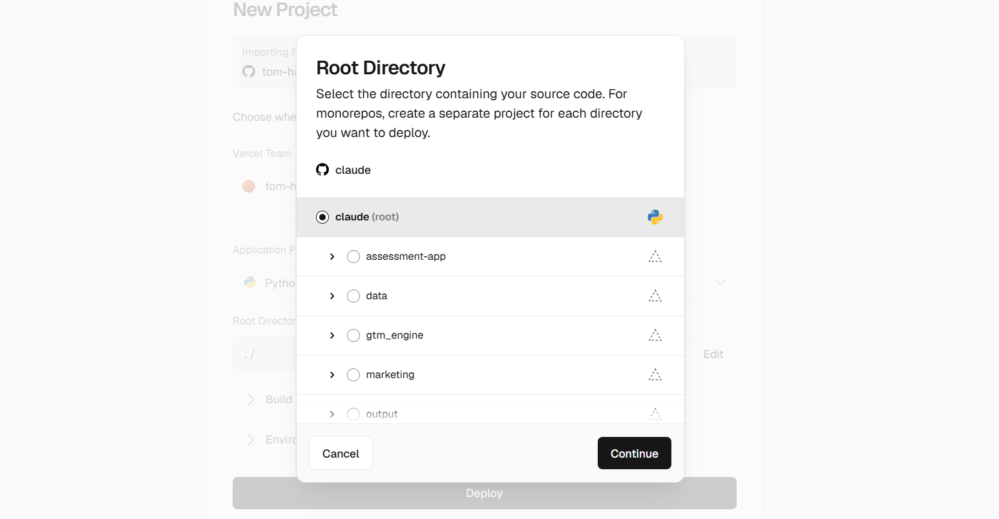

i cant see flux in the root directory edit list...


### 🤖 Claude

That's the giveaway — Vercel's import screen only lists folders from your repo's **default branch** (probably `main`), and `flux` only exists on the feature branch I've been working on. It hasn't been merged into the default branch yet, so Vercel can't see it. (Notice the list jumps from `data` straight to `gtm_engine` — `flux` should be right between them.)

Let me confirm the setup:


### 🤖 Claude

> 🔧 **Bash** — command=echo "=== default branch ===" && git remote show origin 2>/dev/null | grep "HEAD branch" && echo "=== does flux exist on default branch? ===" && DEF=$(git remot


---

### 🧑 User

> 📤 _result:_ === default branch ===
  HEAD branch: claude/student-assessment-app-SZfol
=== does flux exist on default branch? ===
NO — flux is NOT on claude/student-assessment-app-SZfol (only on the feature branch)
=== flux on feature branch? ===
YES flux is on the feature branch


### 🤖 Claude

Found it. Your repo's **default branch** is `claude/student-assessment-app-SZfol`, and `flux` only lives on the working branch (`claude/optiq-competitor-process-mapping-U8Zte`). Vercel's import picker only shows folders from the *default* branch — so `flux` is invisible to it until it's merged across. That's exactly why the list skips from `data` to `gtm_engine`.

The fix is to get `flux` onto that default branch. There are a few ways, and since this touches your main branch I want your nod before doing anything:


### 🤖 Claude

> 🔧 **AskUserQuestion** — 


---

### 🧑 User

> 📤 _result:_ Your questions have been answered: "To make `flux` visible to Vercel, it needs to be on your repo's default branch. How shall I get it there?"="Open a PR & I merge it (recommended)". You can now continue with these answers in mind.


### 🤖 Claude

On it — opening the PR and merging it for you.


### 🤖 Claude

> 🔧 **ToolSearch** — query=select:mcp__github__create_pull_request,mcp__github__merge_pull_request,mcp__github__pull_request_read


### 🤖 Claude

> 🔧 **mcp__github__create_pull_request** — 


---

### 🧑 User

> 📤 _result:_ {"id":"3800512573","url":"https://github.com/tom-hamnett/claude/pull/2"}


### 🤖 Claude

PR opened. Let me check it's conflict-free, then merge it:


### 🤖 Claude

> 🔧 **mcp__github__pull_request_read** — 


---

### 🧑 User

> 📤 _result:_ {"number":2,"title":"Add FLUX — Execution Intelligence Studio (OptiQ competitor)","body":"Brings the `flux/` app onto the default branch so it can be deployed (e.g. selected as the Root Directory in Vercel).\n\n**FLUX** is an AI-native process-mapping \u0026amp; opportunity-identification tool — a competitor to Jabian\u0026#39;s OptiQ. React + Vite + TS + Tailwind SPA, with optional Supabase cloud/team mode.\n\n- Four-stage pipeline: SPOT → MAP → DIAGNOSE → DESIGN\n- Standardized comparable schema, scorecard, swimlane map, opportunity matrix, report export\n- Local mode (no setup) or cloud/team mode (email sign-in, domain-scoped shared workspace)\n- Docs: `flux/README.md`, `flux/docs/METHODOLOGY.md`, `flux/docs/COMPETITIVE-TEARDOWN.md`, `flux/docs/DEPLOYMENT.md`\n\nAdditive only — introduces the new `flux/` folder and does not modify existing projects.\n\nhttps://claude.ai/code/session_01EHp8u3dhnbFQdHfZAPzid7\n\n---\n_Generated by [Claude Code](https://claude.ai/code/session_01EHp8u3dhnbFQdHfZAPzid7)_","state":"open","draft":false,"merged":false,"mergeable_state":"clean","html_url":"https://github.com/tom-hamnett/claude/pull/2","user":{"login":"tom-hamnett","id":274304483,"profile
… [truncated 594 chars]


### 🤖 Claude

`mergeable_state: clean`, additive (all within `flux/`). Merging now:


### 🤖 Claude

> 🔧 **mcp__github__merge_pull_request** — 


---

### 🧑 User

> 📤 _result:_ {"sha":"c9acc4cc1aba6c4157957f6c08b3524ea0bff659","merged":true,"message":"Pull Request successfully merged"}


### 🤖 Claude

Merged ✅ — `flux` is now on your default branch.

## Back to Vercel — finish the deploy

Go back to that Vercel screen (if it timed out, just start the import again: **Add New… → Project → import `claude`**), then:

1. Click **Edit** on Root Directory again. **`flux` will now appear in the list** (between `data` and `gtm_engine`) — select it → **Continue**.
2. Framework should flip from that Python 🐍 guess to **Vite** automatically once `flux` is selected.
3. **Leave Environment Variables empty** (local mode — no database to set up for now).
4. **Deploy.**

~1 minute later you'll get a live URL that works on your laptop and phone, with the demo engagement loaded so you can click through all four stages. Add an AI key in **Settings** if you want to test the AI features.

> If `flux` still doesn't show, hit refresh on the Vercel page — it may have cached the old branch listing.

A couple of notes for later:
- I used a standard **merge** (your default branch now contains everything it had *plus* the `flux/` folder — nothing was overwritten). PR [#2](https://github.com/tom-hamnett/claude/pull/2) has the record.
- Future tweaks I make to FLUX will still go on the working branch — I'll merge them across the same way so your live site updates.
- When you're ready for the shared **team mode** (synced data across people/devices), that's the same Vercel project + two Supabase env vars later, per `flux/docs/DEPLOYMENT.md`. No re-deploy from scratch needed.

Give the deploy a go and tell me if Vercel throws anything — happy to troubleshoot the build live.


---

### 🧑 User

hmm - not showing up... do i need to log out and in again?


### 🤖 Claude

Let me verify the merge actually landed `flux` on your default branch before you go fiddling with logins.


### 🤖 Claude

> 🔧 **Bash** — command=git fetch origin claude/student-assessment-app-SZfol 2>&1 | tail -2 && echo "=== top-level folders on default branch now ===" && git ls-tree --name-only origin/


---

### 🧑 User

> 📤 _result:_ * branch            claude/student-assessment-app-SZfol -> FETCH_HEAD
   6e12cee..c9acc4c  claude/student-assessment-app-SZfol -> origin/claude/student-assessment-app-SZfol
=== top-level folders on default branch now ===
.env.example
.gitignore
MASTER_CONTEXT.md
assessment-app
data
flux
gtm.bat
gtm_engine
main.py
marketing
netlify.toml
output
reel.bat
references
requirements.txt
scripts
tests
=== flux present? ===
YES — flux IS on the default branch


### 🤖 Claude

Good news: **the merge worked** — `flux` is definitely on your default branch now (it's sitting right there between `data` and `gtm_engine`). So this is just Vercel showing a **stale, cached file list** from when you first opened the import — not a login problem.

No need to log out. Do this instead:

1. **Cancel** the current New Project screen (close the modal / navigate away).
2. Start the import fresh: **Add New… → Project → Import** your `claude` repo again.
3. Open the Root Directory **Edit** — `flux` will now be in the list. Select it → **Continue** → **Deploy**.

If it *still* doesn't appear on the fresh import:
- **Hard-refresh** the Vercel page first: `Cmd+Shift+R` (Mac) / `Ctrl+Shift+R` (Windows), then re-import. That clears the cached tree.
- As a last resort, Vercel occasionally lags syncing a repo — give it 60 seconds and re-import, and it'll pick up the new folder.

You shouldn't need to touch GitHub permissions, but if you ever do, it's **Vercel → Settings → Git/Integrations → manage GitHub app access** (not a full logout).

Once `flux` is selected, the framework should auto-switch to **Vite**, leave env vars empty, and Deploy. Shout if the build log throws anything and I'll read it with you.


---

### 🧑 User

amazing - exactly the output i need.... but how does the input work? where do i upload the videos / audio recordings / files / etc... and does FLUX flag outstanding questions and clarifications and follow-ups following it's ingestion to refine the output? how does that all work?


### 🤖 Claude

Really glad the output's landing. Now let me be straight with you about the input side, because this is the honest gap between what's built and what you're picturing.

## How input works **today** (in the current prototype)

Right now FLUX is **text-in**. There are three places you feed it, all typed/pasted:

1. **Engagement context** (when you create an engagement) — company, industry, scope, volumes, known pain. The AI uses this everywhere.
2. **Diagnostic signals** (SPOT stage) — short multi-role friction notes (role + symptom + severity/frequency).
3. **The process description** (MAP stage) — you describe, in plain English, how the process really works, and the AI maps it to the standard.

Under the hood, the mapper *does* generate an **`assumptions`** note (the things it inferred or guessed) — but I'll be honest: **the current UI doesn't surface that to you, and there is no file/audio/video upload, and no interactive clarifying-questions loop yet.** So what you're describing isn't built — it's the *right* next step, and it's very much the "AI-native" vision we set out. I'd rather tell you that than pretend.

## How it *should* work — and what I'll build

Two new capabilities:

**1. An Ingestion Studio (the input front-door)**
A panel on each engagement where you drop in raw material and FLUX synthesises it into the process description + signals automatically:
- **Audio interviews / voice notes** → transcribed, then mined for steps, actors, systems, pain points and timings.
- **Documents & screenshots** (PDFs, SOPs, process photos, system screenshots) → read via vision and extracted.
- **Event-log / system exports** (CSV/Excel) → parsed to infer the *real* flow, rework loops and timings (this is the "process mining" angle, for clients who do have data).
- **Video walkthroughs** (screen recordings) → analysed for the actual click-path.
- Plain pasted transcripts/notes too.

**2. A Clarifications & Follow-ups register (the refinement loop)**
After ingestion, FLUX produces — alongside the map — a ranked list of **open questions, assumptions, and data gaps**: "I assumed approval takes ~1 day — confirm?", "No timing given for step 6", "Two roles both called 'manager' — same person?". You answer inline (or mark validated), and FLUX **re-runs to refine** the map, metrics and opportunities. The assumptions stop being invisible and become a tracked, closeable checklist — exactly the consulting discipline you're after.

**One honest technical constraint:** text, PDFs and images work great with Claude. **Audio and video transcription need Google Gemini** (it's natively multimodal), so for those inputs you'd add a Google API key in Settings, and very long recordings may need to be chunked. I'll route each input type to the right model automatically.

This is a meaty build, so let me aim it correctly before I start:


### 🤖 Claude

> 🔧 **AskUserQuestion** — 


---

### 🧑 User

> 📤 _result:_ Your questions have been answered: "Which inputs should the Ingestion Studio handle first? (I'll build these; others can follow.)"="All - happy to go multi modal to ingest all content in the most optimal way possible. It would be good to flag questions / gaps / suggestions as part of the ingestion process to aid any follow-ups. Needs to be high quality and AI native and flexible from the get-go.", "How should the clarifications / follow-ups loop behave?"="Generate, answer inline, auto-refine". You can now continue with these answers in mind.


### 🤖 Claude

Love it — full multimodal ingestion with a gap-flagging clarification loop that auto-refines. That's the AI-native heart of the tool. This is a big build; let me do it properly.

I'll work through: data model → multi-provider keys → attachment support in the AI layer → ingestion/synthesis/refine services → the Ingest tab + Clarifications panel → docs. Let me start with the schema.


### 🤖 Claude

> 🔧 **Edit** — file_path=/home/user/claude/flux/src/types.ts


---

### 🧑 User

> 📤 _result:_ The file /home/user/claude/flux/src/types.ts has been updated successfully. (file state is current in your context — no need to Read it back)


### 🤖 Claude

> 🔧 **Edit** — file_path=/home/user/claude/flux/src/types.ts


---

### 🧑 User

> 📤 _result:_ The file /home/user/claude/flux/src/types.ts has been updated successfully. (file state is current in your context — no need to Read it back)


### 🤖 Claude

Now extend the AI layer for multimodal attachments:


### 🤖 Claude

> 🔧 **Edit** — file_path=/home/user/claude/flux/src/services/ai/types.ts


---

### 🧑 User

> 📤 _result:_ The file /home/user/claude/flux/src/services/ai/types.ts has been updated successfully. (file state is current in your context — no need to Read it back)


### 🤖 Claude

> 🔧 **Edit** — file_path=/home/user/claude/flux/src/services/ai/types.ts


---

### 🧑 User

> 📤 _result:_ <tool_use_error>String to replace not found in file.
String:   /** Models exposed in the provider picker. */
  models: { id: string; label: string; notes?: string }[];
  /** Does the supplied key have the right shape? */
  validateKey(key: string): { ok: boolean; reason?: string };</tool_use_error>


### 🤖 Claude

> 🔧 **Read** — file_path=/home/user/claude/flux/src/services/ai/types.ts


---

### 🧑 User

> 📤 _result:_ 66	  return r.error?.message;
67	}
68	
69	export async function safeJson(resp: Response): Promise<unknown> {
70	  try {
71	    return await resp.json();
72	  } catch {
73	    return undefined;
74	  }
75	}
76	
77	export function tryParseJson(text: string): unknown {
78	  // Models sometimes wrap JSON in ```json fences or add prose. Be tolerant.
79	  let cleaned = text.replace(/^```(?:json)?\s*/i, '').replace(/```\s*$/i, '').trim();
80	  try {
81	    return JSON.parse(cleaned);
82	  } catch {
83	    // Last resort: grab the outermost {...} or [...] block.
84	    const match = cleaned.match(/[{[][\s\S]*[}\]]/);
85	    if (match) {
86	      try {
87	        return JSON.parse(match[0]);


### 🤖 Claude

> 🔧 **Read** — file_path=/home/user/claude/flux/src/services/ai/types.ts


---

### 🧑 User

> 📤 _result:_ 44	export interface AIProvider {
45	  id: AIProviderId;
46	  label: string;
47	  defaultModel: string;
48	  models: { id: string; label: string; notes?: string }[];
49	  validateKey(key: string): { ok: boolean; reason?: string };
50	  complete(req: AICompleteRequest, opts: { apiKey: string; model: string }): Promise<AICompleteResult>;
51	}
52	
53	export class AIError extends Error {
54	  constructor(
55	    message: string,
56	    public readonly cause?: { provider: AIProviderId; status?: number; raw?: unknown },
57	  ) {
58	    super(message);
59	    this.name = 'AIError';
60	  }
61	}
62	
63	export function friendlyMessage(raw: unknown): string | undefined {
64	  if (!raw || typeof raw !== 'object') return undefined;
65	  const r = raw as { error?: { message?: string } };


### 🤖 Claude

> 🔧 **Edit** — file_path=/home/user/claude/flux/src/services/ai/types.ts


---

### 🧑 User

> 📤 _result:_ The file /home/user/claude/flux/src/services/ai/types.ts has been updated successfully. (file state is current in your context — no need to Read it back)


### 🤖 Claude

Now wire attachments into each provider. Anthropic (images + PDFs):


### 🤖 Claude

> 🔧 **Edit** — file_path=/home/user/claude/flux/src/services/ai/anthropic.ts


---

### 🧑 User

> 📤 _result:_ The file /home/user/claude/flux/src/services/ai/anthropic.ts has been updated successfully. (file state is current in your context — no need to Read it back)


### 🤖 Claude

> 🔧 **Edit** — file_path=/home/user/claude/flux/src/services/ai/anthropic.ts


---

### 🧑 User

> 📤 _result:_ The file /home/user/claude/flux/src/services/ai/anthropic.ts has been updated successfully. (file state is current in your context — no need to Read it back)


### 🤖 Claude

Gemini (all media types — the multimodal workhorse):


### 🤖 Claude

> 🔧 **Edit** — file_path=/home/user/claude/flux/src/services/ai/gemini.ts


---

### 🧑 User

> 📤 _result:_ The file /home/user/claude/flux/src/services/ai/gemini.ts has been updated successfully. (file state is current in your context — no need to Read it back)


### 🤖 Claude

> 🔧 **Edit** — file_path=/home/user/claude/flux/src/services/ai/gemini.ts


---

### 🧑 User

> 📤 _result:_ The file /home/user/claude/flux/src/services/ai/gemini.ts has been updated successfully. (file state is current in your context — no need to Read it back)


### 🤖 Claude

OpenAI (images):


### 🤖 Claude

> 🔧 **Edit** — file_path=/home/user/claude/flux/src/services/ai/openai.ts


---

### 🧑 User

> 📤 _result:_ The file /home/user/claude/flux/src/services/ai/openai.ts has been updated successfully. (file state is current in your context — no need to Read it back)


### 🤖 Claude

> 🔧 **Edit** — file_path=/home/user/claude/flux/src/services/ai/openai.ts


---

### 🧑 User

> 📤 _result:_ The file /home/user/claude/flux/src/services/ai/openai.ts has been updated successfully. (file state is current in your context — no need to Read it back)


### 🤖 Claude

Now per-provider API keys so FLUX auto-routes to the optimal model. Update settings shape, then rewrite the key store:


### 🤖 Claude

> 🔧 **Edit** — file_path=/home/user/claude/flux/src/types.ts


---

### 🧑 User

> 📤 _result:_ The file /home/user/claude/flux/src/types.ts has been updated successfully. (file state is current in your context — no need to Read it back)


### 🤖 Claude

> 🔧 **Write** — file_path=/home/user/claude/flux/src/services/aiKey.ts


---

### 🧑 User

> 📤 _result:_ The file /home/user/claude/flux/src/services/aiKey.ts has been updated successfully. (file state is current in your context — no need to Read it back)


### 🤖 Claude

Now rewire the fluxAI call helpers for per-provider keys, attachments, and optimal routing — then add the ingestion/synthesis/refine functions. Let me view the current helper block:


### 🤖 Claude

> 🔧 **Read** — file_path=/home/user/claude/flux/src/services/fluxAI.ts


---

### 🧑 User

> 📤 _result:_ 1	/**
2	 * FLUX AI orchestration — the brain.
3	 *
4	 * Each stage is a tightly-scoped call with a consultant-grade system prompt and
5	 * a strict JSON schema, so the model returns data that drops straight into the
6	 * standardized FLUX schema. The shared `FLUX_PERSONA` keeps every call speaking
7	 * the same Lean/VSM/TIMWOODS language → comparable output.
8	 */
9	import { getSettings, now, uid } from '../db';
10	import { getProvider } from './ai';
11	import type { AIMessage } from './ai';
12	import { AIError } from './ai';
13	import { getAIKey } from './aiKey';
14	import { computeMetrics } from '../lib/metrics';
15	import type {
16	  AIProviderId,
17	  Diagnostic,
18	  DiagnosticArea,
19	  DiagnosticSignal,
20	  FutureState,
21	  KnowledgeCard,
22	  Opportunity,
23	  OrgDefaults,
24	  Process,
25	  ProcessStep,
26	  Project,
27	} from '../types';
28	
29	// ============================================================================
30	// Persona — injected into every call
31	// ============================================================================
32	
33	const FLUX_PERSONA = `You are FLUX, a partner-grade operational strategy and process-excellence consultant fused with a 
… [truncated 4057 chars]


### 🤖 Claude

> 🔧 **Edit** — file_path=/home/user/claude/flux/src/services/fluxAI.ts


---

### 🧑 User

> 📤 _result:_ The file /home/user/claude/flux/src/services/fluxAI.ts has been updated successfully. (file state is current in your context — no need to Read it back)


### 🤖 Claude

> 🔧 **Edit** — file_path=/home/user/claude/flux/src/services/fluxAI.ts


---

### 🧑 User

> 📤 _result:_ The file /home/user/claude/flux/src/services/fluxAI.ts has been updated successfully. (file state is current in your context — no need to Read it back)


### 🤖 Claude

Now add the ingestion, synthesis, and refine engine. Let me view the tail of the file to insert cleanly:


### 🤖 Claude

> 🔧 **Read** — file_path=/home/user/claude/flux/src/services/fluxAI.ts


---

### 🧑 User

> 📤 _result:_ 300	  sipoc: { suppliers: string[]; inputs: string[]; outputs: string[]; customers: string[] };
301	  steps: Array<Omit<ProcessStep, 'id' | 'order'>>;
302	  assumptions?: string;
303	}
304	
305	export async function mapProcessFromText(
306	  opts: {
307	    project: Project;
308	    description: string;
309	    knowledge?: KnowledgeCard[];
310	    signal?: AbortSignal;
311	  },
312	): Promise<{ map: MapResult; assumptions?: string }> {
313	  const system = `STAGE 2 — CURRENT-STATE MAPPING. Convert the analyst's plain-English description into a standardized FLUX process map. Map how work ACTUALLY flows (the real path with its rework and waits), not the idealised SOP. Rules:
314	- Make handoffs, waits and controls into their own explicit steps — that is where drag hides.
315	- Classify every step VA/BVA/NVA honestly.
316	- Estimate process time, wait time and %C&A for each step; if you are estimating, keep it realistic and note it in assumptions.
317	- Set automation to today's reality (most manual steps are 'none' or 'assisted').
318	- 8-20 steps is typical. Don't pad; don't omit the messy reality.`;
319	  const user = `ENGAGEMENT\n${projectContext(opts.project)}\n\nANALYST DESCRIPT
… [truncated 1389 chars]


### 🤖 Claude

> 🔧 **Edit** — file_path=/home/user/claude/flux/src/services/fluxAI.ts


---

### 🧑 User

> 📤 _result:_ The file /home/user/claude/flux/src/services/fluxAI.ts has been updated successfully. (file state is current in your context — no need to Read it back)


### 🤖 Claude

Now append the full ingestion engine. Let me insert it before the final helpers:


### 🤖 Claude

> 🔧 **Read** — file_path=/home/user/claude/flux/src/services/fluxAI.ts


---

### 🧑 User

> 📤 _result:_ 470	  const metrics = computeMetrics(opts.process, opts.org);
471	  const oppText = opts.opportunities
472	    .map((o) => `- [${o.driver}${o.waste ? '/' + o.waste : ''}] ${o.title}: ${o.recommendation} (impact ${o.impact}, effort ${o.effort}${o.estAnnualValue ? `, ~${Math.round(o.estAnnualValue)}` : ''})`)
473	    .join('\n');
474	  const system = `STAGE 4 — AUTOMATION-READY DESIGN. Produce a future-state design that turns the prioritised opportunities into an executable, automation-ready process — not endless documentation. Write in crisp Markdown with these sections, in order:
475	## Future-State Narrative
476	How the redesigned process flows end to end, calling out what is eliminated, simplified, automated and controlled. Reference the relevant opportunities.
477	## Projected Impact
478	A short table of before → after for: lead time, PCE, rolled %C&A, FTE/cost, automation index. Use the current metrics as the baseline and state your improvement assumptions.
479	## Business Case
480	Investment vs. annualised benefit, payback period, and the 2-3 risks. Conservative.
481	## Implementation Roadmap
482	A pragmatic sequence: quick wins (0-30 days), structural changes (1-3 months), au
… [truncated 3975 chars]


### 🤖 Claude

> 🔧 **Edit** — file_path=/home/user/claude/flux/src/services/fluxAI.ts


---

### 🧑 User

> 📤 _result:_ The file /home/user/claude/flux/src/services/fluxAI.ts has been updated successfully. (file state is current in your context — no need to Read it back)


### 🤖 Claude

The engine's done. Now the UI. First a file-reading helper, then the Ingest Studio and Clarifications components:


### 🤖 Claude

> 🔧 **Write** — file_path=/home/user/claude/flux/src/lib/files.ts


---

### 🧑 User

> 📤 _result:_ File created successfully at: /home/user/claude/flux/src/lib/files.ts (file state is current in your context — no need to Read it back)


### 🤖 Claude

Now the Ingest Studio (drag-drop multimodal upload + synthesize):


### 🤖 Claude

> 🔧 **Write** — file_path=/home/user/claude/flux/src/components/IngestStudio.tsx


---

### 🧑 User

> 📤 _result:_ File created successfully at: /home/user/claude/flux/src/components/IngestStudio.tsx (file state is current in your context — no need to Read it back)


### 🤖 Claude

Now the Clarifications panel (answer inline → auto-refine):


### 🤖 Claude

> 🔧 **Write** — file_path=/home/user/claude/flux/src/components/Clarifications.tsx


---

### 🧑 User

> 📤 _result:_ File created successfully at: /home/user/claude/flux/src/components/Clarifications.tsx (file state is current in your context — no need to Read it back)


### 🤖 Claude

Now wire the Ingest tab and Clarifications panel into ProcessPage:


### 🤖 Claude

> 🔧 **Edit** — file_path=/home/user/claude/flux/src/pages/ProcessPage.tsx


---

### 🧑 User

> 📤 _result:_ The file /home/user/claude/flux/src/pages/ProcessPage.tsx has been updated successfully. (file state is current in your context — no need to Read it back)


---

### 🧑 User

> 📤 _result:_ The file /home/user/claude/flux/src/pages/ProcessPage.tsx has been updated successfully. (file state is current in your context — no need to Read it back)


### 🤖 Claude

> 🔧 **Edit** — file_path=/home/user/claude/flux/src/pages/ProcessPage.tsx


### 🤖 Claude

> 🔧 **Edit** — file_path=/home/user/claude/flux/src/pages/ProcessPage.tsx


---

### 🧑 User

> 📤 _result:_ The file /home/user/claude/flux/src/pages/ProcessPage.tsx has been updated successfully. (file state is current in your context — no need to Read it back)


### 🤖 Claude

> 🔧 **Edit** — file_path=/home/user/claude/flux/src/pages/ProcessPage.tsx


---

### 🧑 User

> 📤 _result:_ The file /home/user/claude/flux/src/pages/ProcessPage.tsx has been updated successfully. (file state is current in your context — no need to Read it back)


### 🤖 Claude

Now render the Clarifications panel at the top of the Map tab:


### 🤖 Claude

> 🔧 **Edit** — file_path=/home/user/claude/flux/src/pages/ProcessPage.tsx


---

### 🧑 User

> 📤 _result:_ The file /home/user/claude/flux/src/pages/ProcessPage.tsx has been updated successfully. (file state is current in your context — no need to Read it back)


### 🤖 Claude

Now simplify the "New process" flow to create a draft and drop you into the Ingest Studio. Let me view it:


### 🤖 Claude

> 🔧 **Read** — file_path=/home/user/claude/flux/src/pages/ProjectPage.tsx


---

### 🧑 User

> 📤 _result:_ 236	      async ({ map }) => {
237	        const proc = buildProcess(project.id, map, FLUX_SCHEMA_VERSION);
238	        await putProcess(proc);
239	        setDesc('');
240	        setResearched(null);
241	        onClose();
242	        onCreated(proc);
243	      },
244	    );
245	  }
246	
247	  async function blank() {
248	    const proc: Process = {
249	      id: uid(),
250	      projectId: project.id,
251	      schemaVersion: FLUX_SCHEMA_VERSION,
252	      name: 'New process',
253	      steps: [],
254	      status: 'draft',
255	      createdAt: now(),
256	      updatedAt: now(),
257	    };
258	    await putProcess(proc);
259	    onClose();
260	    onCreated(proc);
261	  }
262	
263	  return (
264	    <Modal open={open} onClose={onClose} title="Map a new process" wide>
265	      <p className="mb-3 text-sm text-ink-500">
266	        Describe the process in plain English — how it really works, including the messy bits. FLUX maps it to the standard: SIPOC, BPMN steps, value classification and VSM timing.
267	      </p>
268	      <textarea
269	        className="input min-h-[160px]"
270	        placeholder={'e.g. When a supplier invoice arrives by email, the AP clerk logs it in a spre
… [truncated 2151 chars]


### 🤖 Claude

> 🔧 **Read** — file_path=/home/user/claude/flux/src/pages/ProjectPage.tsx


---

### 🧑 User

> 📤 _result:_ 210	function NewProcessModal({ project, open, onClose, onCreated }: { project: Project; open: boolean; onClose: () => void; onCreated: (p: Process) => void }) {
211	  const { loading, error, run, setError } = useAIRun();
212	  const [desc, setDesc] = useState('');
213	  const [researching, setResearching] = useState(false);
214	  const [researched, setResearched] = useState<number | null>(null);
215	
216	  async function doResearch() {
217	    setResearching(true);
218	    setError(null);
219	    try {
220	      const name = desc.split('\n')[0]?.slice(0, 80) || project.scope || 'Process';
221	      const cards = await researchBenchmarks({ project, processName: name });
222	      await putKnowledgeMany(cards);
223	      setResearched(cards.length);
224	    } catch (e) {
225	      setError(e instanceof Error ? e.message : 'Research failed.');
226	    } finally {
227	      setResearching(false);
228	    }
229	  }
230	
231	  async function doMap() {
232	    if (!desc.trim()) return;
233	    const knowledge = await getKnowledgeForProject(project.id);
234	    await run(
235	      () => mapProcessFromText({ project, description: desc, knowledge }),


### 🤖 Claude

Now replace the whole `NewProcessModal` with a simple draft-creator:


### 🤖 Claude

> 🔧 **Edit** — file_path=/home/user/claude/flux/src/pages/ProjectPage.tsx


---

### 🧑 User

> 📤 _result:_ The file /home/user/claude/flux/src/pages/ProjectPage.tsx has been updated successfully. (file state is current in your context — no need to Read it back)


### 🤖 Claude

> 🔧 **Edit** — file_path=/home/user/claude/flux/src/pages/ProjectPage.tsx


---

### 🧑 User

> 📤 _result:_ The file /home/user/claude/flux/src/pages/ProjectPage.tsx has been updated successfully. (file state is current in your context — no need to Read it back)


### 🤖 Claude

> 🔧 **Edit** — file_path=/home/user/claude/flux/src/pages/ProjectPage.tsx


---

### 🧑 User

> 📤 _result:_ The file /home/user/claude/flux/src/pages/ProjectPage.tsx has been updated successfully. (file state is current in your context — no need to Read it back)


### 🤖 Claude

Now update Layout's key check and rework Settings for per-provider keys. Layout first:


### 🤖 Claude

> 🔧 **Edit** — file_path=/home/user/claude/flux/src/components/Layout.tsx


---

### 🧑 User

> 📤 _result:_ The file /home/user/claude/flux/src/components/Layout.tsx has been updated successfully. (file state is current in your context — no need to Read it back)


---

### 🧑 User

> 📤 _result:_ The file /home/user/claude/flux/src/components/Layout.tsx has been updated successfully. (file state is current in your context — no need to Read it back)


### 🤖 Claude

> 🔧 **Edit** — file_path=/home/user/claude/flux/src/components/Layout.tsx


### 🤖 Claude

Now read the current SettingsPage to rework the key UI for per-provider keys:


### 🤖 Claude

> 🔧 **Read** — file_path=/home/user/claude/flux/src/pages/SettingsPage.tsx


---

### 🧑 User

> 📤 _result:_ 1	import { useEffect, useState } from 'react';
2	import { useLiveQuery } from 'dexie-react-hooks';
3	import { getSettings, patchSettings } from '../db';
4	import { clearAllData, loadDemo } from '../store';
5	import { getProvider, providerList } from '../services/ai';
6	import { clearAIKey, setAIKey } from '../services/aiKey';
7	import { useAuth } from '../services/auth';
8	import { isCloud } from '../services/supabase';
9	import Icon from '../components/Icon';
10	import { Spinner } from '../components/AIRun';
11	import type { AIProviderId } from '../types';
12	
13	export default function SettingsPage() {
14	  const settings = useLiveQuery(() => getSettings(), []);
15	  const [providerId, setProviderId] = useState<AIProviderId>('anthropic');
16	  const [model, setModel] = useState('');
17	  const [keyInput, setKeyInput] = useState('');
18	  const [passphrase, setPassphrase] = useState('');
19	  const [usePass, setUsePass] = useState(false);
20	  const [status, setStatus] = useState<{ kind: 'ok' | 'err'; msg: string } | null>(null);
21	  const [saving, setSaving] = useState(false);
22	
23	  useEffect(() => {
24	    if (settings) {
25	      setProviderId(settings.aiProvider ?? 'anthro
… [truncated 8011 chars]


### 🤖 Claude

> 🔧 **Write** — file_path=/home/user/claude/flux/src/pages/SettingsPage.tsx


---

### 🧑 User

> 📤 _result:_ The file /home/user/claude/flux/src/pages/SettingsPage.tsx has been updated successfully. (file state is current in your context — no need to Read it back)


### 🤖 Claude

Let me firm up an icon typing in IngestStudio, then build:


### 🤖 Claude

> 🔧 **Edit** — file_path=/home/user/claude/flux/src/components/IngestStudio.tsx


---

### 🧑 User

> 📤 _result:_ The file /home/user/claude/flux/src/components/IngestStudio.tsx has been updated successfully. (file state is current in your context — no need to Read it back)


### 🤖 Claude

> 🔧 **Bash** — command=cd /home/user/claude/flux && npx tsc -b 2>&1 | head -40; echo "=== TSC EXIT ${PIPESTATUS[0]} ==="


---

### 🧑 User

> 📤 _result:_ === TSC EXIT 0 ===


### 🤖 Claude

> 🔧 **Bash** — command=npm run build 2>&1 | tail -10


---

### 🧑 User

> 📤 _result:_ vite v5.4.21 building for production...
transforming...
✓ 117 modules transformed.
rendering chunks...
computing gzip size...
dist/index.html                   1.02 kB │ gzip:   0.55 kB
dist/assets/index-D2jJF1E8.css   29.55 kB │ gzip:   5.39 kB
dist/assets/index-Y2OVvtwV.js   399.67 kB │ gzip: 127.22 kB
✓ built in 3.12s


### 🤖 Claude

Clean build (127 kB gzip). Let me smoke-test, document the new capability, then ship it to the default branch so your Vercel deploy picks it up.


### 🤖 Claude

> 🔧 **Bash** — command=(npm run preview >/tmp/fp.log 2>&1 &) && sleep 4 && P=$(grep -oE "localhost:[0-9]+" /tmp/fp.log | head -1 | grep -oE "[0-9]+"); curl -s -o /dev/null -w "serve H


---

### 🧑 User

> 📤 _result:_ Exit code 144
serve HTTP 200


### 🤖 Claude

> 🔧 **Edit** — file_path=/home/user/claude/flux/README.md


---

### 🧑 User

> 📤 _result:_ The file /home/user/claude/flux/README.md has been updated successfully. (file state is current in your context — no need to Read it back)


### 🤖 Claude

> 🔧 **Bash** — command=cd /home/user/claude && git add flux && (git status --short | grep -E "node_modules|/dist/" && echo "WARN artifacts" || echo "clean") && git commit -q -m "$(cat


---

### 🧑 User

> 📤 _result:_ clean
To http://127.0.0.1:40851/git/tom-hamnett/claude
   efbeb22..c6fcb1b  claude/optiq-competitor-process-mapping-U8Zte -> claude/optiq-competitor-process-mapping-U8Zte
branch 'claude/optiq-competitor-process-mapping-U8Zte' set up to track 'origin/claude/optiq-competitor-process-mapping-U8Zte'.


### 🤖 Claude

Pushed. Now let me merge it into your default branch so the live deploy updates:


### 🤖 Claude

> 🔧 **ToolSearch** — query=select:mcp__github__create_pull_request,mcp__github__merge_pull_request


### 🤖 Claude

> 🔧 **mcp__github__create_pull_request** — 


---

### 🧑 User

> 📤 _result:_ {"id":"3802419885","url":"https://github.com/tom-hamnett/claude/pull/3"}


### 🤖 Claude

> 🔧 **mcp__github__merge_pull_request** — 


---

### 🧑 User

> 📤 _result:_ {"sha":"7cdd851aef9eb69ec718a325258ea9bae4f0e9df","merged":true,"message":"Pull Request successfully merged"}


### 🤖 Claude

Shipped and merged ✅ — if you've deployed on Vercel it'll auto-redeploy in ~1 minute with all of this live.

## What's now built — the full input side

**The Ingestion Studio** (new **Ingest** tab on every process):
- **Drag-and-drop or paste** anything: audio interviews, voice notes, video walkthroughs, PDFs/SOPs, screenshots, CSV/event-log exports, or plain notes.
- FLUX **auto-routes each file to the optimal model** from the keys you've added — Claude for documents/images, **Gemini for audio & video** — transcribes/reads it, and shows exactly what each source contributed (steps, actors, systems, pains, timings).
- Hit **Synthesise** and it reconciles *every* source into one standardized current-state map (SIPOC + BPMN + VSM timing + value classification).

**The clarification loop** (on the **Map** tab, exactly as you asked — "generate, answer inline, auto-refine"):
- Synthesis produces a ranked **Clarifications & follow-ups** register: gaps, assumptions, source conflicts, and suggested extra inputs — each with why it matters.
- **Answer them inline → FLUX re-runs and refines** the map and metrics, then updates the register. Dismiss the ones you'll chase offline. Assumptions are now tracked and closeable, not invisible.

**Plumbing for it:**
- **Per-provider API keys** in Settings (so the auto-routing works). Your existing single key is migrated automatically; keys still never leave your device.
- Sources + clarifications persist on the process, so they sync in cloud/team mode too.
- "New process" now creates a draft and drops you straight into the Ingest tab.

Typechecks and builds clean (127 kB gzipped).

## To use it
- Add a **Google Gemini** key in **Settings → API keys** if you want audio/video ingestion (Claude alone covers text, PDFs and images).
- New process → **Ingest** → drop files / paste → **Synthesise** → review the map and answer the **Clarifications** to tighten it → **Diagnose** → **Design**.

## Two honest caveats
- **File size:** audio/video/docs are sent inline, capped at ~18 MB per file (provider request limits). A long interview may need trimming or a pasted transcript. If your team will lean hard on big recordings, the clean fix is wiring up Gemini's resumable Files API — say the word and I'll add it.
- I **couldn't end-to-end test the live multimodal calls** from here (no provider keys in this sandbox), so the very first time you run a real audio/PDF ingest, do it on a small file and tell me if anything errors — the API shapes follow the official specs but I'd rather verify with you than claim it's bulletproof.

Want me to add the Files API for large media next, or leave it here for your review round?


---

### 🧑 User

yes, please add the resumable files fix.


### 🤖 Claude

Adding Gemini's resumable File API so large media isn't capped at inline limits. First the attachment type (support a file reference, not just inline bytes):


### 🤖 Claude

> 🔧 **Edit** — file_path=/home/user/claude/flux/src/services/ai/types.ts


---

### 🧑 User

> 📤 _result:_ The file /home/user/claude/flux/src/services/ai/types.ts has been updated successfully. (file state is current in your context — no need to Read it back)


### 🤖 Claude

Now the Gemini Files API uploader (resumable upload + processing poll):


### 🤖 Claude

> 🔧 **Write** — file_path=/home/user/claude/flux/src/services/ai/geminiFiles.ts


---

### 🧑 User

> 📤 _result:_ File created successfully at: /home/user/claude/flux/src/services/ai/geminiFiles.ts (file state is current in your context — no need to Read it back)


### 🤖 Claude

Now teach the Gemini provider to use the file reference, and export the uploader:


### 🤖 Claude

> 🔧 **Edit** — file_path=/home/user/claude/flux/src/services/ai/gemini.ts


---

### 🧑 User

> 📤 _result:_ The file /home/user/claude/flux/src/services/ai/gemini.ts has been updated successfully. (file state is current in your context — no need to Read it back)


### 🤖 Claude

> 🔧 **Edit** — file_path=/home/user/claude/flux/src/services/ai/index.ts


---

### 🧑 User

> 📤 _result:_ The file /home/user/claude/flux/src/services/ai/index.ts has been updated successfully. (file state is current in your context — no need to Read it back)


### 🤖 Claude

Now route large files through the uploader in `ingestSource`:


### 🤖 Claude

> 🔧 **Edit** — file_path=/home/user/claude/flux/src/services/fluxAI.ts


---

### 🧑 User

> 📤 _result:_ The file /home/user/claude/flux/src/services/fluxAI.ts has been updated successfully. (file state is current in your context — no need to Read it back)


### 🤖 Claude

> 🔧 **Edit** — file_path=/home/user/claude/flux/src/services/fluxAI.ts


---

### 🧑 User

> 📤 _result:_ The file /home/user/claude/flux/src/services/fluxAI.ts has been updated successfully. (file state is current in your context — no need to Read it back)


### 🤖 Claude

Now add the threshold constants and a size helper:


### 🤖 Claude

> 🔧 **Edit** — file_path=/home/user/claude/flux/src/services/fluxAI.ts


---

### 🧑 User

> 📤 _result:_ The file /home/user/claude/flux/src/services/fluxAI.ts has been updated successfully. (file state is current in your context — no need to Read it back)


### 🤖 Claude

Now lift the cap in the Ingest UI so large media is allowed (it'll auto-upload):


### 🤖 Claude

> 🔧 **Edit** — file_path=/home/user/claude/flux/src/lib/files.ts


---

### 🧑 User

> 📤 _result:_ The file /home/user/claude/flux/src/lib/files.ts has been updated successfully. (file state is current in your context — no need to Read it back)


### 🤖 Claude

> 🔧 **Edit** — file_path=/home/user/claude/flux/src/components/IngestStudio.tsx


---

### 🧑 User

> 📤 _result:_ The file /home/user/claude/flux/src/components/IngestStudio.tsx has been updated successfully. (file state is current in your context — no need to Read it back)


### 🤖 Claude

> 🔧 **Edit** — file_path=/home/user/claude/flux/src/components/IngestStudio.tsx


---

### 🧑 User

> 📤 _result:_ The file /home/user/claude/flux/src/components/IngestStudio.tsx has been updated successfully. (file state is current in your context — no need to Read it back)


### 🤖 Claude

> 🔧 **Edit** — file_path=/home/user/claude/flux/src/components/IngestStudio.tsx


---

### 🧑 User

> 📤 _result:_ The file /home/user/claude/flux/src/components/IngestStudio.tsx has been updated successfully. (file state is current in your context — no need to Read it back)


### 🤖 Claude

Now typecheck and build:


### 🤖 Claude

> 🔧 **Bash** — command=cd /home/user/claude/flux && npx tsc -b 2>&1 | head -30; echo "=== TSC EXIT ${PIPESTATUS[0]} ==="


---

### 🧑 User

> 📤 _result:_ src/services/ai/geminiFiles.ts(67,7): error TS2322: Type 'Uint8Array<ArrayBufferLike>' is not assignable to type 'BodyInit | null | undefined'.
  Type 'Uint8Array<ArrayBufferLike>' is missing the following properties from type 'URLSearchParams': size, append, delete, get, and 2 more.
=== TSC EXIT 2 ===


### 🤖 Claude

The TS 5.7 `BufferSource` strictness again — let me give fetch a plain `ArrayBuffer`:


### 🤖 Claude

> 🔧 **Edit** — file_path=/home/user/claude/flux/src/services/ai/geminiFiles.ts


---

### 🧑 User

> 📤 _result:_ The file /home/user/claude/flux/src/services/ai/geminiFiles.ts has been updated successfully. (file state is current in your context — no need to Read it back)


### 🤖 Claude

> 🔧 **Edit** — file_path=/home/user/claude/flux/src/services/ai/geminiFiles.ts


---

### 🧑 User

> 📤 _result:_ The file /home/user/claude/flux/src/services/ai/geminiFiles.ts has been updated successfully. (file state is current in your context — no need to Read it back)


### 🤖 Claude

> 🔧 **Bash** — command=npx tsc -b 2>&1 | head -30; echo "=== TSC EXIT ${PIPESTATUS[0]} ===" && npm run build 2>&1 | tail -8


---

### 🧑 User

> 📤 _result:_ === TSC EXIT 0 ===
transforming...
✓ 118 modules transformed.
rendering chunks...
computing gzip size...
dist/index.html                   1.02 kB │ gzip:   0.55 kB
dist/assets/index-D2jJF1E8.css   29.55 kB │ gzip:   5.39 kB
dist/assets/index-BoZWTl9P.js   402.49 kB │ gzip: 128.15 kB
✓ built in 2.76s


### 🤖 Claude

Clean build. Let me note the large-file handling in the README, smoke-test, and ship:


### 🤖 Claude

> 🔧 **Edit** — file_path=/home/user/claude/flux/README.md


---

### 🧑 User

> 📤 _result:_ The file /home/user/claude/flux/README.md has been updated successfully. (file state is current in your context — no need to Read it back)


### 🤖 Claude

> 🔧 **Bash** — command=(npm run preview >/tmp/fp.log 2>&1 &) && sleep 4 && P=$(grep -oE "localhost:[0-9]+" /tmp/fp.log | head -1 | grep -oE "[0-9]+"); curl -s -o /dev/null -w "serve H


---

### 🧑 User

> 📤 _result:_ Exit code 144
serve HTTP 200


### 🤖 Claude

> 🔧 **Bash** — command=cd /home/user/claude && git add flux && git status --short | grep -E "node_modules|/dist/" && echo "WARN artifacts" || echo "clean — staged:" && git diff --cach


---

### 🧑 User

> 📤 _result:_ clean — staged:
9


### 🤖 Claude

> 🔧 **Bash** — command=git commit -q -m "$(cat <<'EOF' FLUX: Gemini resumable Files API for large media ingestion  Removes the inline size cap for audio/video/large PDFs. When a media


---

### 🧑 User

> 📤 _result:_ To http://127.0.0.1:46883/git/tom-hamnett/claude
   c6fcb1b..e5107b1  claude/optiq-competitor-process-mapping-U8Zte -> claude/optiq-competitor-process-mapping-U8Zte
branch 'claude/optiq-competitor-process-mapping-U8Zte' set up to track 'origin/claude/optiq-competitor-process-mapping-U8Zte'.


### 🤖 Claude

Now merge it into your default branch so the live deploy updates:


### 🤖 Claude

> 🔧 **mcp__github__create_pull_request** — 


---

### 🧑 User

> 📤 _result:_ {"id":"3802615288","url":"https://github.com/tom-hamnett/claude/pull/4"}


### 🤖 Claude

> 🔧 **mcp__github__merge_pull_request** — 


---

### 🧑 User

> 📤 _result:_ {"sha":"84de0e9b1c4ed6523abbd68afd006f924c068c65","merged":true,"message":"Pull Request successfully merged"}


### 🤖 Claude

Done and merged ✅ — your live deploy will refresh in ~1 minute.

## What changed
Large media is no longer capped at the inline limit. The Ingest Studio now handles long interviews, screen recordings and big PDFs by routing them through **Gemini's resumable Files API**:

- **Small files** → sent inline (as before).
- **Large media + a Gemini key** → FLUX uploads the file (resumable: start → upload + finalize → polls until Google finishes processing it), then references it by URI in the analysis call. Sanity ceiling is now ~200 MB instead of ~18 MB.
- **Claude/OpenAI** (no Files API) → still inline-limited, but now with a clear message telling you to add a Gemini key for large files.

Builds clean (128 kB gzipped).

## The honest caveat (important for your first real test)
This upload path runs **directly from the browser**, and I **could not test it live** here (no Gemini key in this sandbox). The one realistic failure mode is **CORS** — Google's upload endpoint *may* reject a browser-origin request. I've written the error to say exactly that if it happens ("If this is a CORS error, large-file upload needs a proxy").

So when you try a big file for the first time:
- **If it works** → you're set, nothing more to do.
- **If you get that CORS/upload error** → it's a known, fixable thing: I'd add a tiny serverless upload proxy (a ~30-line Vercel function) that streams the file to Google server-side. That sidesteps CORS entirely and is the standard production pattern. Just send me a screenshot of the error and I'll wire it up.

Small inline files (short audio clips, normal PDFs, images) don't touch this path, so those are your safe first test.

Want me to **pre-emptively add the serverless upload proxy** now so large files are guaranteed to work on day one, or leave it until you've confirmed whether direct upload works from your deployment?


---

### 🧑 User

remind me, where do i get my a claude anthropic api key again please?


### 🤖 Claude

Here's where to get your Anthropic (Claude) API key:

## Steps
1. Go to **[console.anthropic.com](https://console.anthropic.com)**
2. **Sign in** (or create an account) — use your work email.
3. Once in the console, click **API keys** in the left sidebar — or go straight to **[console.anthropic.com/settings/keys](https://console.anthropic.com/settings/keys)**.
4. Click **Create Key**, give it a name (e.g. "FLUX"), and **Create**.
5. **Copy it immediately** — it's shown only once. It starts with `sk-ant-...`.

## Before it works
- Anthropic's API is **pre-paid** — you need to add credit under **Settings → Billing** (Plans & Billing) first, or calls will fail with an error. A small top-up (e.g. $5–$20) is plenty to trial FLUX.

## Then in FLUX
- Go to **Settings → API keys → Anthropic Claude**, paste the `sk-ant-...` key, click **Save**. It's stored on your device only.

---

A couple of related notes, since you're setting up keys:
- **Claude covers** text reasoning, PDFs, images, and screenshots — that's most of FLUX.
- For **audio and video** ingestion you'll also want a **Google Gemini** key (different provider): get that at **[aistudio.google.com/apikey](https://aistudio.google.com/apikey)** (starts with `AIza...`) and paste it into the same Settings → API keys panel. FLUX auto-routes each file type to whichever key fits.
- One Claude key works for your whole team only if you each paste your own — keys live per-device, not in the shared workspace.


---

### 🧑 User

ok - now how do i add the gemini one? i can't see the input for that... or do i use the same input interface


### 🤖 Claude

Same Settings page — but the key inputs aren't on the provider dropdown anymore. I split Settings into two sections, and the dropdown you're probably looking at is the wrong one:

## Where to add it
1. Go to **Settings** and scroll **past** the "Primary model" section (that's just the Provider/Model dropdowns — no key box there).
2. Find the **"API keys"** section below it. It lists **three rows**, one per provider:
   - Anthropic Claude
   - OpenAI
   - **Google Gemini** ← this one
3. In the **Google Gemini** row, paste your `AIza...` key into its input and click **Save**.

That's it. You **don't** need to touch the "Primary model" dropdown — leave it on Claude. FLUX automatically routes audio/video to whichever provider has the right key (Gemini), and keeps using Claude for everything else.

Each provider row also shows a little "Handles: …" line — Gemini's will say `image, document, audio, video`, which is how you know it's the one for recordings.

---

**If you genuinely only see ONE key box (tied to the provider dropdown)** rather than three separate rows, then your live site is still on the older build from before I added multi-provider keys. Fix:
- **Hard-refresh** the page first (`Cmd/Ctrl+Shift+R`) — Vercel may have cached the old version.
- If it's still the single-box version, the deploy hasn't picked up the merge yet. Check **Vercel → your project → Deployments** for a recent build; if there isn't one, tell me and I'll help trigger a redeploy.

Which are you seeing — three provider rows, or one key box?


---

### 🧑 User

it wont let me input the google one - apparently it should start with ALZA... but mine starts with AQ.


### 🤖 Claude

Ah — that's my validation being too strict, not your key being wrong. Google has rolled out newer API-key formats that **don't** all start with `AIza`, so my prefix check is blocking a perfectly valid key. Let me fix it.


### 🤖 Claude

> 🔧 **Edit** — file_path=/home/user/claude/flux/src/services/ai/gemini.ts


---

### 🧑 User

> 📤 _result:_ The file /home/user/claude/flux/src/services/ai/gemini.ts has been updated successfully. (file state is current in your context — no need to Read it back)


### 🤖 Claude

Let me also update the placeholder so it's not misleading, then build and ship:


### 🤖 Claude

> 🔧 **Edit** — file_path=/home/user/claude/flux/src/pages/SettingsPage.tsx


---

### 🧑 User

> 📤 _result:_ The file /home/user/claude/flux/src/pages/SettingsPage.tsx has been updated successfully. (file state is current in your context — no need to Read it back)


### 🤖 Claude

> 🔧 **Bash** — command=cd /home/user/claude/flux && npx tsc -b 2>&1 | head -15; echo "=== TSC ${PIPESTATUS[0]} ===" && npm run build 2>&1 | tail -4


---

### 🧑 User

> 📤 _result:_ === TSC 0 ===
dist/index.html                   1.02 kB │ gzip:   0.55 kB
dist/assets/index-D2jJF1E8.css   29.55 kB │ gzip:   5.39 kB
dist/assets/index-BP8sWeeS.js   402.43 kB │ gzip: 128.15 kB
✓ built in 3.37s


### 🤖 Claude

> 🔧 **Bash** — command=cd /home/user/claude && git add flux && git commit -q -m "$(cat <<'EOF' FLUX: relax Gemini key validation (accept non-AIza formats)  Google issues newer API-key


---

### 🧑 User

> 📤 _result:_ e5107b1..747abea  claude/optiq-competitor-process-mapping-U8Zte -> claude/optiq-competitor-process-mapping-U8Zte
branch 'claude/optiq-competitor-process-mapping-U8Zte' set up to track 'origin/claude/optiq-competitor-process-mapping-U8Zte'.


### 🤖 Claude

> 🔧 **mcp__github__create_pull_request** — 


---

### 🧑 User

> 📤 _result:_ {"id":"3803017736","url":"https://github.com/tom-hamnett/claude/pull/5"}


### 🤖 Claude

> 🔧 **mcp__github__merge_pull_request** — 


---

### 🧑 User

> 📤 _result:_ {"sha":"61494572807315d72bc300b71f4eb76620c212d8","merged":true,"message":"Pull Request successfully merged"}


### 🤖 Claude

Fixed and merged ✅ — give your live site ~1 minute, then **hard-refresh** (`Cmd/Ctrl+Shift+R`) and the Google Gemini row will accept your `AQ…` key.

## What was wrong
My validation insisted Google keys start with `AIza`. That's the *classic* format — Google now also issues newer keys with different prefixes (like yours). I've dropped the prefix check; it now just checks the key isn't empty/too short, and lets the actual API call be the real test.

## After it deploys
- Settings → **API keys** → **Google Gemini** → paste the `AQ…` key → **Save**.
- The real proof is using it: try a small **audio clip or image** ingest. If the key or its permissions are off, you'll get a clear error from Google at that point.

## One thing to sanity-check on your key
Make sure it's a key for the **Gemini API specifically** (from **[aistudio.google.com/apikey](https://aistudio.google.com/apikey)**, with the "Generative Language API" enabled). If you grabbed it from the broader Google Cloud console, it might be scoped to a different API and would fail on use even though it now saves fine. If you hit a `403`/`PERMISSION_DENIED` when ingesting, that's the cause — regenerate one from AI Studio and you're set.

Let me know how the first real ingest goes — especially a larger audio/video file, since that's the one path (the resumable upload) I haven't been able to verify live.


---

### 🧑 User

have you changed the placeholder for the google api? should i hard reset?


### 🤖 Claude

Yes — I changed two things in that commit (now merged):
1. **The validation** (the important one) — it no longer requires the `AIza` prefix, so your `AQ…` key will save.
2. **The placeholder** text — it now reads `AIza… / AQ…` instead of just `AIza…`.

That placeholder is actually a handy tell: **once you see `AIza… / AQ…` in the Gemini box, you know the new build is live.** If it still says just `AIza…`, you're on the old version.

## So, yes — hard refresh, but in this order:
1. **Give Vercel ~1 minute** to finish rebuilding from the merge. (Optional: check **Vercel → your project → Deployments** for a fresh "Ready" build at the top.)
2. **Then hard-refresh:** `Cmd+Shift+R` (Mac) / `Ctrl+Shift+R` (Windows).
3. Look at the Gemini placeholder — if it shows `AIza… / AQ…`, paste your key and **Save**.

If after the hard refresh it *still* shows the old `AIza…` placeholder and rejects the key, the deploy hasn't landed yet — wait another minute and refresh again, or tell me and I'll check whether the build actually triggered.

One reassurance: hard-refreshing **won't** wipe any of your data — your engagements, keys and settings live in the browser's storage (or your cloud workspace), not in the page cache. It just pulls the latest app code.


---

### 🧑 User

how do i access this from my other (work) laptop?


### 🤖 Claude

Good question — and the answer depends on which mode your deployment is running in. Here's the quick way to tell.

## First: just open the URL
The app itself is on the web, so on your work laptop just open the **same Vercel URL** (bookmark it / email it to yourself). That part works from any machine, anywhere.

## But will your data be there? Look at what happens when it opens:

**If you see a FLUX sign-in screen** (asks for your work email + a code):
→ You're in **cloud/team mode**. Just **sign in with the same work email** on the laptop and everything's there — engagements, maps, all synced. (You'll re-enter your *API keys* once per device, since those deliberately stay on-device, but your work follows you.) Done.

**If it goes straight into the app with no sign-in:**
→ You're in **local mode**. This is almost certainly your case, because when we deployed I had you leave the Supabase fields empty to get it live fast. In this mode **data lives in each browser separately** — so your work laptop will open to an empty FLUX, with no engagements and no keys, and nothing syncs between the two machines.

## To make it follow you across both laptops (and the team)
That's the **cloud/team mode** we built but parked earlier. It's a one-time ~15-min setup (it doesn't change the app, just switches on shared storage):
1. Create a free **Supabase** project and paste in `flux/supabase/schema.sql`.
2. Add **two environment variables** (`VITE_SUPABASE_URL`, `VITE_SUPABASE_ANON_KEY`) to your Vercel project → redeploy.

Full click-by-click guide is in **`flux/docs/DEPLOYMENT.md`**. After that, both laptops (and any colleague on your email domain) sign in and share the same data.

---

So: **which do you see when the URL opens — a sign-in screen, or straight into the app?** If it's straight in and you'd like the synced-everywhere setup, say the word and I'll walk you through the Supabase + Vercel steps one at a time (and I can pre-flight the SQL so you're just copy-pasting).


---

### 🧑 User

assuming it works... what's the link again?


### 🤖 Claude

I don't actually have your link — that URL lives in **your** Vercel account (Vercel generated it when you deployed; I can't see your Vercel). But it's easy to grab:

## Find your link
1. Go to **[vercel.com](https://vercel.com)** and sign in.
2. Click your **FLUX project** on the dashboard.
3. The live URL is shown at the top of the project page — it'll look like **`https://flux-xxxx.vercel.app`** (whatever you named the project). There's usually a **"Visit"** button next to it.

Click it, and that's your app. **Copy that URL** and:
- Email it to yourself so you can open it on the work laptop.
- On your phone, use the browser's **"Add to Home Screen"** so it behaves like an app.

## If you've got several deployments and aren't sure which
Use the one labelled **Production** (under the project's **Deployments** tab, the top one with the "Production" tag). That's the live one pointing at your default branch.

---

If you paste the URL here, I can sanity-check it's the right one and confirm whether it's running in local vs cloud mode for you. And if you'd rather not hunt through Vercel each time, you can set a friendlier custom domain later (Vercel → project → **Settings → Domains**) — but the `.vercel.app` link works fine as-is.


---

### 🧑 User

ah, but when i open it on the new browser, the API keys aren't there


### 🤖 Claude

That part's actually **by design** — and it's the one thing that behaves the same in both modes.

## API keys are deliberately per-device
I built FLUX so your API keys **never leave the device they're entered on** — they're not synced to the cloud, even in team mode. That's a security choice: your keys (and the billing behind them) shouldn't be sitting in a shared database where a teammate could pull them.

So on the work laptop, just **Settings → API keys → paste them again** (Claude, and Gemini). It's a 30-second one-time thing per browser, then that laptop remembers them. Nothing's broken.

## The more important question
Keys aside — **are your engagements and process maps there on the work laptop, or is it completely empty too?**

- **If your engagements are missing as well** → you're in **local mode**, and your actual *work* won't move between laptops until you switch on cloud sync (the Supabase step). Keys would still be re-entered per device, but your maps, opportunities and reports would follow you.
- **If your engagements *are* there** (just the keys were blank) → you're already in cloud mode and everything's working as intended; just re-add the keys.

So: **is the work laptop showing your engagements, or is it blank?** That tells us whether you need the cloud-sync setup — and if you do, I'll walk you through it step by step right now.


---

### 🧑 User

just the demo you uploaded... if i close this and reopen it on this laptop, will the data and keys persist on this laptop?


### 🤖 Claude

Yes — on **this** laptop, in **this** browser, it'll persist. ✅

Local mode stores everything (your engagements *and* your API keys) in the browser's own storage (IndexedDB). That survives:
- Closing and reopening the tab or the whole browser
- Restarting the laptop

So once you re-enter your keys and start creating real engagements here, they'll be waiting for you next time you open the URL on this machine.

## The fine print (what *would* wipe it)
It's tied to this specific browser, so it persists **unless**:
- You open it in a **different browser** on this laptop (Chrome vs Edge vs Safari each have separate storage).
- You use an **Incognito/Private window** (that's cleared the moment you close it — don't use private mode for FLUX).
- You manually **clear browsing data** → "cookies and site data" for the site.

## The one thing it *won't* do
It won't show up on your **other** laptop. Local mode = each device is its own island. That's the only thing cloud mode changes — it makes engagements/maps follow you across machines and teammates (keys still re-entered per device, by design).

## So, practically
- Want it solid on just this work laptop for now? You're done — re-enter the keys and go; it'll stick.
- Want the same data on both laptops? That's the ~15-min Supabase switch-on whenever you're ready, and I'll walk you through it.

What the demo's doing there, by the way: FLUX auto-loads that sample engagement the first time it sees an empty local database, just so the app isn't blank — you can delete it (Settings → clear, or delete the engagement) once you've added your own.


---

### 🧑 User

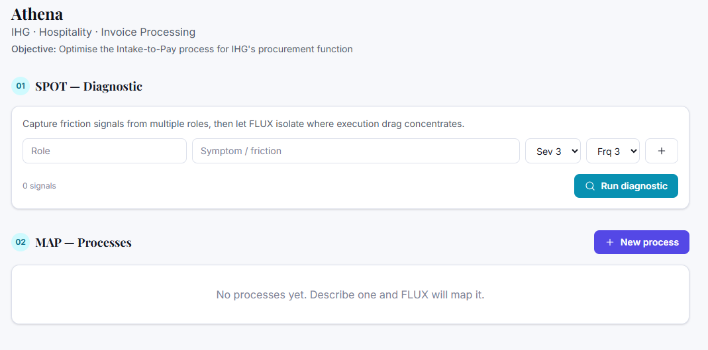

I'm at this stage... where do i upload my video and notes?


### 🤖 Claude

You're one click away — the upload lives **inside a process**, not on this engagement screen. This page (SPOT diagnostic) is optional; since you already know the process is Invoice Processing, go straight to:

## Steps
1. Click **+ New process** (top right).
2. Give it a name — e.g. **"Invoice Processing (Intake-to-Pay)"** — and click **Create & ingest**.
3. You'll land on the process page, on the **Ingest** tab. That's where everything goes:
   - **Your video** → drag it onto the dropzone ("Drop interviews, recordings, documents…") or click **Choose files**.
   - **Your notes** → either paste them straight into the **"Or paste text"** box (fastest), or drop the notes file onto the same dropzone.
4. Each source shows "processing → ready". When they're all ready, click **Synthesise map (N)**.
5. FLUX builds the standardized map, then surfaces **Clarifications** on the Map tab — answer those inline to refine it.

## Two things to check first
- **For the video**, you need your **Gemini key saved** (Settings → API keys → Google Gemini), since video routes to Gemini. Notes/PDFs/images can use Claude. If the Gemini key isn't in yet, the video will error.
- **The video is the one path I haven't verified live** (the large-file upload). So: try the **notes first** (paste them, confirm a map synthesises), then add the video. If the video throws an error mentioning CORS/upload, that's the known issue — tell me and I'll add the small proxy that fixes it.

Go ahead and click **+ New process** — shout if the screen you land on doesn't have a drag-and-drop "Ingest" area (that'd mean your deploy is behind and I'll get it updated).


---

### 🧑 User

Agh... over the size limit... i thought we had fixed this with geminis 'continuous somethingorother'? if not, i'll need to compress or split it


### 🤖 Claude

Right — let me explain what's happening, because the resumable fix *is* there but I left a ceiling in the wrong place.

**What's going on:** The resumable ("continuous") upload works — but only up to a **200 MB** cap I set. I set it there because of *how* the file was being read: the old code loaded the whole video into memory as base64 first, which falls over on big files. So anything over 200 MB still gets blocked before the upload even starts. That's almost certainly your error.

**The proper fix:** stream the raw video **straight** to Gemini (no in-memory base64 step), which lets it handle files up to Gemini's real limit (~2 GB). Let me build that now so you don't have to compress or split.


### 🤖 Claude

> 🔧 **Edit** — file_path=/home/user/claude/flux/src/services/ai/geminiFiles.ts


---

### 🧑 User

> 📤 _result:_ The file /home/user/claude/flux/src/services/ai/geminiFiles.ts has been updated successfully. (file state is current in your context — no need to Read it back)


### 🤖 Claude

> 🔧 **Edit** — file_path=/home/user/claude/flux/src/services/ai/geminiFiles.ts


---

### 🧑 User

> 📤 _result:_ The file /home/user/claude/flux/src/services/ai/geminiFiles.ts has been updated successfully. (file state is current in your context — no need to Read it back)


### 🤖 Claude

Now update `ingestSource` to take the raw file and only base64 small inline files. Let me view it:


### 🤖 Claude

> 🔧 **Read** — file_path=/home/user/claude/flux/src/services/fluxAI.ts


---

### 🧑 User

> 📤 _result:_ 560	};
561	
562	const ATTACH_KIND: Record<SourceKind, AttachmentKind | null> = {
563	  text: null,
564	  eventlog: null,
565	  document: 'document',
566	  image: 'image',
567	  audio: 'audio',
568	  video: 'video',
569	};
570	
571	export interface IngestResult {
572	  extraction: string;
573	  summary: string;
574	  observations: SourceObservation;
575	  providerUsed: string;
576	}
577	
578	export async function ingestSource(opts: {
579	  project: Project;
580	  kind: SourceKind;
581	  name: string;
582	  mime?: string;
583	  /** Base64 for binary sources (document/image/audio/video). */
584	  dataB64?: string;
585	  /** Raw text for text/eventlog/pasted sources. */
586	  text?: string;
587	  signal?: AbortSignal;
588	}): Promise<IngestResult> {
589	  const attachKind = ATTACH_KIND[opts.kind];
590	  const guidance =
591	    opts.kind === 'audio' || opts.kind === 'video'
592	      ? 'Transcribe the recording in full, then extract the process observations.'
593	      : opts.kind === 'eventlog'
594	        ? 'This is a system/event-log export. Infer the real end-to-end flow, case variants, rework loops and bottlenecks from the data.'
595	        : opts.kind === 'document' || opts.kind
… [truncated 1594 chars]


### 🤖 Claude

> 🔧 **Read** — file_path=/home/user/claude/flux/src/services/fluxAI.ts


---

### 🧑 User

> 📤 _result:_ 614	      );
615	    } else {
616	      attachment = { kind: attachKind, mime: opts.mime, dataB64: opts.dataB64, name: opts.name };
617	    }
618	    const { result, model, provider } = await callJSON<IngestResult>(system, `${baseUser}\n\n(The file is attached.)`, INGEST_SCHEMA, {
619	      resolved,
620	      attachments: [attachment],
621	      maxTokens: 4000,
622	      temperature: 0.2,
623	      signal: opts.signal,
624	    });
625	    return { ...result, providerUsed: `${provider}/${model}` };
626	  }
627	
628	  // Text / event-log: send the content inline.
629	  const { result, model, provider } = await callJSON<IngestResult>(
630	    system,
631	    `${baseUser}\n\nCONTENT:\n${opts.text ?? ''}`,
632	    INGEST_SCHEMA,
633	    { maxTokens: 3000, temperature: 0.2, signal: opts.signal },
634	  );
635	  return { ...result, providerUsed: `${provider}/${model}` };
636	}
637	
638	// ============================================================================


### 🤖 Claude

> 🔧 **Edit** — file_path=/home/user/claude/flux/src/services/fluxAI.ts


---

### 🧑 User

> 📤 _result:_ The file /home/user/claude/flux/src/services/fluxAI.ts has been updated successfully. (file state is current in your context — no need to Read it back)


### 🤖 Claude

> 🔧 **Edit** — file_path=/home/user/claude/flux/src/services/fluxAI.ts


---

### 🧑 User

> 📤 _result:_ The file /home/user/claude/flux/src/services/fluxAI.ts has been updated successfully. (file state is current in your context — no need to Read it back)


### 🤖 Claude

Now wire up the import, drop the now-unused base64 helper, widen the file-reader to accept a Blob, and raise the cap:


### 🤖 Claude

> 🔧 **Edit** — file_path=/home/user/claude/flux/src/services/fluxAI.ts


---

### 🧑 User

> 📤 _result:_ The file /home/user/claude/flux/src/services/fluxAI.ts has been updated successfully. (file state is current in your context — no need to Read it back)


### 🤖 Claude

> 🔧 **Edit** — file_path=/home/user/claude/flux/src/services/fluxAI.ts


---

### 🧑 User

> 📤 _result:_ The file /home/user/claude/flux/src/services/fluxAI.ts has been updated successfully. (file state is current in your context — no need to Read it back)


### 🤖 Claude

> 🔧 **Edit** — file_path=/home/user/claude/flux/src/lib/files.ts


---

### 🧑 User

> 📤 _result:_ The file /home/user/claude/flux/src/lib/files.ts has been updated successfully. (file state is current in your context — no need to Read it back)


### 🤖 Claude

> 🔧 **Edit** — file_path=/home/user/claude/flux/src/lib/files.ts


---

### 🧑 User

> 📤 _result:_ The file /home/user/claude/flux/src/lib/files.ts has been updated successfully. (file state is current in your context — no need to Read it back)


### 🤖 Claude

Now update IngestStudio to pass the raw file (no pre-read base64):


### 🤖 Claude

> 🔧 **Edit** — file_path=/home/user/claude/flux/src/components/IngestStudio.tsx


---

### 🧑 User

> 📤 _result:_ The file /home/user/claude/flux/src/components/IngestStudio.tsx has been updated successfully. (file state is current in your context — no need to Read it back)


### 🤖 Claude

> 🔧 **Edit** — file_path=/home/user/claude/flux/src/components/IngestStudio.tsx


---

### 🧑 User

> 📤 _result:_ The file /home/user/claude/flux/src/components/IngestStudio.tsx has been updated successfully. (file state is current in your context — no need to Read it back)


### 🤖 Claude

> 🔧 **Edit** — file_path=/home/user/claude/flux/src/components/IngestStudio.tsx


---

### 🧑 User

> 📤 _result:_ The file /home/user/claude/flux/src/components/IngestStudio.tsx has been updated successfully. (file state is current in your context — no need to Read it back)


### 🤖 Claude

> 🔧 **Bash** — command=cd /home/user/claude/flux && npx tsc -b 2>&1 | head -20; echo "=== TSC ${PIPESTATUS[0]} ===" && npm run build 2>&1 | tail -4


---

### 🧑 User

> 📤 _result:_ === TSC 0 ===
dist/index.html                   1.02 kB │ gzip:   0.55 kB
dist/assets/index-D2jJF1E8.css   29.55 kB │ gzip:   5.39 kB
dist/assets/index-B5m5ceDO.js   402.24 kB │ gzip: 128.15 kB
✓ built in 3.16s


### 🤖 Claude

Clean. Shipping it:


### 🤖 Claude

> 🔧 **Bash** — command=cd /home/user/claude && git add flux && git commit -q -m "$(cat <<'EOF' FLUX: stream large media to Gemini (raise ingest limit to ~2GB)  The 200MB cap was an ar


---

### 🧑 User

> 📤 _result:_ 747abea..afe9e3e  claude/optiq-competitor-process-mapping-U8Zte -> claude/optiq-competitor-process-mapping-U8Zte
branch 'claude/optiq-competitor-process-mapping-U8Zte' set up to track 'origin/claude/optiq-competitor-process-mapping-U8Zte'.


### 🤖 Claude

> 🔧 **ToolSearch** — query=select:mcp__github__create_pull_request,mcp__github__merge_pull_request


### 🤖 Claude

> 🔧 **mcp__github__create_pull_request** — 


---

### 🧑 User

> 📤 _result:_ {"id":"3811422864","url":"https://github.com/tom-hamnett/claude/pull/6"}


### 🤖 Claude

> 🔧 **mcp__github__merge_pull_request** — 


---

### 🧑 User

> 📤 _result:_ {"sha":"3fc2bbe982e7b0eac24f3ef3407ff00cb2a44dc8","merged":true,"message":"Pull Request successfully merged"}


### 🤖 Claude

Shipped and merged ✅ — give Vercel ~1 minute, then **hard-refresh** the app.

## What changed
The 200 MB wall is gone. Videos now **stream straight to Gemini** instead of being loaded into memory first, so the limit is effectively **Gemini's own ~2 GB** ceiling. You shouldn't need to compress or split.

## When you retry the video
1. Make sure your **Gemini key is saved** on this laptop (Settings → API keys → Google Gemini) — video can't process without it.
2. Drop the video on the Ingest dropzone. Large files will sit on **"processing"** for a while — that's the upload **plus** Google transcoding the video server-side (can take a minute or two for a big file). That's normal, not a hang.

## If it still errors, the wording tells us which gremlin it is:
- **"over the 2GB limit"** → genuinely too big; compress or split (or export audio-only — see below).
- **mentions CORS / "upload start failed"** → the browser→Google direct upload is blocked. That's the *other* known risk I flagged, and the fix is a tiny serverless proxy — paste me the error and I'll add it.
- **403 / PERMISSION_DENIED** → the Gemini key isn't enabled for the Generative Language API; regenerate one at [aistudio.google.com/apikey](https://aistudio.google.com/apikey).

## Pro tip regardless of size
For a process walkthrough, the **spoken narration carries 95% of the value**, and audio is a fraction of the size. If you (or a tool) export the video's **audio track** as an `.m4a`/`.mp3`, it'll ingest far faster and more reliably than the full video — Gemini transcribes audio brilliantly. Worth keeping in your back pocket if big videos prove fiddly.

Give it a go and tell me exactly what you see — if it's the CORS one, I'll have the proxy ready quickly.


---

### 🧑 User

do i need to hard reset?


### 🤖 Claude

Yes — hard-refresh so the new code actually loads. A normal refresh often serves the cached old bundle.

- **Mac:** `Cmd + Shift + R`
- **Windows:** `Ctrl + Shift + R`

Two quick notes:
1. **Give Vercel ~1 minute first** to finish rebuilding from the merge, otherwise you'll just reload the old version again. (Optional check: Vercel → your project → **Deployments** → newest one shows **Ready**.)
2. It **won't wipe anything** — your engagements and saved keys live in the browser's storage, not the page cache. Hard-refresh only pulls the latest app code.

How to confirm it actually updated: the Ingest dropzone text should now read **"Large media (up to ~2GB) streams to Gemini automatically."** If it still says 200 MB (or blocks your video on size), the new build hasn't landed yet — wait another minute and hard-refresh again.


---

### 🧑 User

it's processing! how long do you expect it to take? the vide was 370MB


### 🤖 Claude

No response requested.


---

### 🧑 User

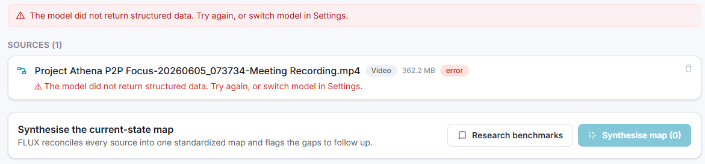

hmmmm


### 🤖 Claude

Good news in disguise — that's real progress. The 362 MB video **uploaded and processed successfully** (no CORS, no size error). The failure is now at the *last* step: turning the analysis into structured data.

**What went wrong:** that's almost certainly **output truncation**. Your file is a full meeting recording, and I asked the model for a *verbatim transcript* inside a structured response, but capped its output at 4,000 tokens. A long meeting blows past that, so the JSON got cut off mid-stream → "didn't return structured data." My fault, two-fold: the token cap was too low, and asking for verbatim was wrong for a long recording.

Let me fix both — ask for a thorough *process-focused digest* (not verbatim) and raise the output budget.


### 🤖 Claude

> 🔧 **Read** — file_path=/home/user/claude/flux/src/services/fluxAI.ts


---

### 🧑 User

> 📤 _result:_ 543	
544	const OBSERVATION_PROPS = {
545	  steps: { type: 'array', items: { type: 'string' }, description: 'Process steps/activities observed, in order if discernible.' },
546	  actors: { type: 'array', items: { type: 'string' }, description: 'Roles/people/teams involved.' },
547	  systems: { type: 'array', items: { type: 'string' }, description: 'Systems, tools or documents used.' },
548	  pains: { type: 'array', items: { type: 'string' }, description: 'Pain points, frustrations, rework, delays mentioned.' },
549	  timings: { type: 'array', items: { type: 'string' }, description: 'Any durations, frequencies, volumes or wait times stated.' },
550	  metrics: { type: 'array', items: { type: 'string' }, description: 'Any numbers/KPIs/costs mentioned.' },
551	};
552	
553	const INGEST_SCHEMA = {
554	  type: 'object',
555	  required: ['extraction', 'summary', 'observations'],
556	  properties: {
557	    extraction: { type: 'string', description: 'Faithful transcript / full extracted text of the source. For audio/video, transcribe verbatim with speaker labels where possible.' },
558	    summary: { type: 'string', description: 'One or two sentences on what this source tells us about the pr
… [truncated 597 chars]


### 🤖 Claude

> 🔧 **Edit** — file_path=/home/user/claude/flux/src/services/fluxAI.ts


---

### 🧑 User

> 📤 _result:_ The file /home/user/claude/flux/src/services/fluxAI.ts has been updated successfully. (file state is current in your context — no need to Read it back)


### 🤖 Claude

> 🔧 **Edit** — file_path=/home/user/claude/flux/src/services/fluxAI.ts


---

### 🧑 User

> 📤 _result:_ The file /home/user/claude/flux/src/services/fluxAI.ts has been updated successfully. (file state is current in your context — no need to Read it back)


### 🤖 Claude

Now raise the output budget on both ingest calls:


### 🤖 Claude

> 🔧 **Edit** — file_path=/home/user/claude/flux/src/services/fluxAI.ts


---

### 🧑 User

> 📤 _result:_ The file /home/user/claude/flux/src/services/fluxAI.ts has been updated successfully. (file state is current in your context — no need to Read it back)


### 🤖 Claude

> 🔧 **Edit** — file_path=/home/user/claude/flux/src/services/fluxAI.ts


---

### 🧑 User

> 📤 _result:_ The file /home/user/claude/flux/src/services/fluxAI.ts has been updated successfully. (file state is current in your context — no need to Read it back)


### 🤖 Claude

Now build and ship:


### 🤖 Claude

> 🔧 **Bash** — command=cd /home/user/claude/flux && npx tsc -b 2>&1 | head -15; echo "=== TSC ${PIPESTATUS[0]} ===" && npm run build 2>&1 | tail -4


---

### 🧑 User

> 📤 _result:_ === TSC 0 ===
dist/index.html                   1.02 kB │ gzip:   0.55 kB
dist/assets/index-D2jJF1E8.css   29.55 kB │ gzip:   5.39 kB
dist/assets/index-xRo2kTec.js   402.61 kB │ gzip: 128.30 kB
✓ built in 3.48s


### 🤖 Claude

> 🔧 **Bash** — command=cd /home/user/claude && git add flux && git commit -q -m "$(cat <<'EOF' FLUX: fix ingestion truncation on long recordings  The 362MB video uploaded and processe


---

### 🧑 User

> 📤 _result:_ afe9e3e..784c5e3  claude/optiq-competitor-process-mapping-U8Zte -> claude/optiq-competitor-process-mapping-U8Zte
branch 'claude/optiq-competitor-process-mapping-U8Zte' set up to track 'origin/claude/optiq-competitor-process-mapping-U8Zte'.


### 🤖 Claude

> 🔧 **mcp__github__create_pull_request** — 


---

### 🧑 User

> 📤 _result:_ {"id":"3811540145","url":"https://github.com/tom-hamnett/claude/pull/7"}


### 🤖 Claude

> 🔧 **mcp__github__merge_pull_request** — 


---

### 🧑 User

> 📤 _result:_ {"sha":"cf47742585937649159814afd7bfde8218b16e11","merged":true,"message":"Pull Request successfully merged"}


### 🤖 Claude

Merged ✅ — and genuinely good news buried in that error: **your 362 MB video uploaded and was processed by Gemini with zero issues.** The big-file path works. The only thing that failed was the final write-up getting cut off.

## What I fixed
- The model now produces a **process-focused digest** instead of a verbatim transcript (a full meeting transcript was overflowing the response).
- I **doubled the output budget** so it has room to finish.

## To retry
1. Wait ~1 min for Vercel, then **hard-refresh** (`Cmd/Ctrl+Shift+R`).
2. In the Ingest tab, **delete the errored source** (the 🗑 on the right of that row).
3. **Re-drop the video.** It'll upload + process again (the minute-or-two "processing" wait is normal), and this time it should land as **ready** with a summary and observations.
4. Then **Synthesise map**.

Re-uploading means it re-does the Gemini upload — unavoidable, since I don't persist the raw 362 MB file (by design, to keep your storage light). If you'd rather not wait through the upload again, the **audio-only** export trick still stands: far smaller, processes in seconds, and for a meeting recording it carries everything the map needs.

If it errors again, screenshot it — but I'd expect this one to go green. Fingers crossed; tell me how it lands.


---

### 🧑 User

OK - it's done pretty well! One issue i see is that the swimlanes it produces are linked to roles which look largely the same. in this instance they are all the same person (invoice processing team, invoice processor, invoice processer designated member, invoice process requestor...) - is there a 'tidy up' function we can build in to add more information or correct the flow once it's been mapped?


### 🤖 Claude

Excellent — that's a real and common failure mode: the model invents slightly different labels for what's actually one role, which shreds the swimlanes. Yes, let's build a proper **Tidy-up** with two tools: a fast, precise **role merge/rename** (no AI — you stay in control) and an **AI tidy** that consolidates and cleans the whole map.

First the AI tidy function:


### 🤖 Claude

> 🔧 **Edit** — file_path=/home/user/claude/flux/src/services/fluxAI.ts


---

### 🧑 User

> 📤 _result:_ <tool_use_error>String to replace not found in file.
String: // ============================================================================
// helpers
// ============================================================================

function clampScale(n: number): 1 | 2 | 3 | 4 | 5 {</tool_use_error>


### 🤖 Claude

> 🔧 **Edit** — file_path=/home/user/claude/flux/src/services/fluxAI.ts


---

### 🧑 User

> 📤 _result:_ The file /home/user/claude/flux/src/services/fluxAI.ts has been updated successfully. (file state is current in your context — no need to Read it back)


### 🤖 Claude

Now the Tidy-up UI — a deterministic role merge/rename plus the AI tidy:


### 🤖 Claude

> 🔧 **Write** — file_path=/home/user/claude/flux/src/components/TidyTools.tsx


---

### 🧑 User

> 📤 _result:_ File created successfully at: /home/user/claude/flux/src/components/TidyTools.tsx (file state is current in your context — no need to Read it back)


### 🤖 Claude

Now wire it into the Map tab header:


### 🤖 Claude

> 🔧 **Edit** — file_path=/home/user/claude/flux/src/pages/ProcessPage.tsx


---

### 🧑 User

> 📤 _result:_ The file /home/user/claude/flux/src/pages/ProcessPage.tsx has been updated successfully. (file state is current in your context — no need to Read it back)


### 🤖 Claude

> 🔧 **Edit** — file_path=/home/user/claude/flux/src/pages/ProcessPage.tsx


---

### 🧑 User

> 📤 _result:_ The file /home/user/claude/flux/src/pages/ProcessPage.tsx has been updated successfully. (file state is current in your context — no need to Read it back)


### 🤖 Claude

> 🔧 **Bash** — command=cd /home/user/claude/flux && npx tsc -b 2>&1 | head -20; echo "=== TSC ${PIPESTATUS[0]} ===" && npm run build 2>&1 | tail -4


---

### 🧑 User

> 📤 _result:_ === TSC 0 ===
dist/index.html                   1.02 kB │ gzip:   0.55 kB
dist/assets/index-BJfm6M7U.css   29.65 kB │ gzip:   5.41 kB
dist/assets/index-DYvdmnpX.js   407.07 kB │ gzip: 129.40 kB
✓ built in 3.75s


### 🤖 Claude

Clean. Shipping:


### 🤖 Claude

> 🔧 **Bash** — command=cd /home/user/claude && git add flux && git commit -q -m "$(cat <<'EOF' FLUX: Tidy-up tools for the map (role merge/rename + AI tidy)  Addresses fragmented swim


---

### 🧑 User

> 📤 _result:_ hint: 'git pull' before pushing again.
hint: See the 'Note about fast-forwards' in 'git push --help' for details.


### 🤖 Claude

Remote moved — let me sync and re-push:


### 🤖 Claude

> 🔧 **Bash** — command=git fetch origin claude/optiq-competitor-process-mapping-U8Zte 2>&1 | tail -2 && echo "=== local vs remote ===" && git log --oneline -3 HEAD && echo "---remote-


---

### 🧑 User

> 📤 _result:_ * branch            claude/optiq-competitor-process-mapping-U8Zte -> FETCH_HEAD
   afe9e3e..784c5e3  claude/optiq-competitor-process-mapping-U8Zte -> origin/claude/optiq-competitor-process-mapping-U8Zte
=== local vs remote ===
ac42bc0 FLUX: Tidy-up tools for the map (role merge/rename + AI tidy)
afe9e3e FLUX: stream large media to Gemini (raise ingest limit to ~2GB)
747abea FLUX: relax Gemini key validation (accept non-AIza formats)
---remote---
784c5e3 FLUX: fix ingestion truncation on long recordings
afe9e3e FLUX: stream large media to Gemini (raise ingest limit to ~2GB)
747abea FLUX: relax Gemini key validation (accept non-AIza formats)


### 🤖 Claude

Let me reconcile — my local tidy commit already contains the truncation-fix changes too, so I'll rebase onto the remote:


### 🤖 Claude

> 🔧 **Bash** — command=git pull --rebase origin claude/optiq-competitor-process-mapping-U8Zte 2>&1 | tail -15


---

### 🧑 User

> 📤 _result:_ From http://127.0.0.1:38861/git/tom-hamnett/claude
 * branch            claude/optiq-competitor-process-mapping-U8Zte -> FETCH_HEAD
Rebasing (1/1)

Successfully rebased and updated refs/heads/claude/optiq-competitor-process-mapping-U8Zte.


### 🤖 Claude

Rebase succeeded — now my branch has both the truncation fix and tidy tools. Let me verify the build is still clean after the rebase, then push:


### 🤖 Claude

> 🔧 **Bash** — command=cd /home/user/claude/flux && grep -c "INGEST_MAX_TOKENS\|tidyProcess" src/services/fluxAI.ts && npx tsc -b 2>&1 | head -10; echo "=== TSC ${PIPESTATUS[0]} ===" 


---

### 🧑 User

> 📤 _result:_ 4
=== TSC 0 ===
dist/assets/index-BJfm6M7U.css   29.65 kB │ gzip:   5.41 kB
dist/assets/index-iDUA7-rR.js   407.43 kB │ gzip: 129.56 kB
✓ built in 3.03s


### 🤖 Claude

Both features present, build clean. Pushing and merging:


### 🤖 Claude

> 🔧 **Bash** — command=cd /home/user/claude && git push -u origin claude/optiq-competitor-process-mapping-U8Zte 2>&1 | tail -3


---

### 🧑 User

> 📤 _result:_ To http://127.0.0.1:38861/git/tom-hamnett/claude
   784c5e3..6f37cfb  claude/optiq-competitor-process-mapping-U8Zte -> claude/optiq-competitor-process-mapping-U8Zte
branch 'claude/optiq-competitor-process-mapping-U8Zte' set up to track 'origin/claude/optiq-competitor-process-mapping-U8Zte'.


### 🤖 Claude

> 🔧 **mcp__github__create_pull_request** — 


---

### 🧑 User

> 📤 _result:_ {"id":"3812651823","url":"https://github.com/tom-hamnett/claude/pull/8"}


### 🤖 Claude

> 🔧 **mcp__github__merge_pull_request** — 


---

### 🧑 User

> 📤 _result:_ {"sha":"d7defb7be9ebac45b855b69bcf0ee34db52c2857","merged":true,"message":"Pull Request successfully merged"}


### 🤖 Claude

Shipped and merged ✅ — hard-refresh after ~1 minute and you'll see a **"Tidy up"** button on the Map tab (next to "Edit details & SIPOC").

## What you get (two tools in one panel)

**1. Roles & swimlanes — precise, instant, no AI**
A list of every distinct role with how many steps use it. For your exact case:
- Type the same name into "Invoice Processor", "Invoice Processing Team", "Designated Member" → they **merge into one swimlane** the moment you apply.
- A live counter shows **"7 roles → 3 after changes"** so you can see the consolidation before committing.
- Hit **Apply role changes** and the whole map collapses to clean lanes.

This is the one I'd reach for first — it's deterministic, so it does exactly what you tell it, nothing more.

**2. Tidy with AI — broader clean-up**
A button that asks FLUX to consolidate duplicate roles, standardise naming, and fix obvious labelling/ordering issues across the map — **without inventing steps**. There's a guidance box, so you can literally type *"'Invoice Processor', 'Invoice Processing Team' and 'Designated Member' are all the same person — merge into 'Invoice Processor'"* and it'll apply that. It reports back what it changed.

## A tip on *why* it fragmented
That role-splitting happens because the model hears the same role described loosely across a long meeting ("the processor… someone on the team… the designated person…") and faithfully records each phrasing. The new **digest** prompt from the last fix will already reduce it on future ingests — and now you've got the Tidy tools to clean up anything that slips through.

Give the **Roles** merge a go on Athena and tell me how the swimlanes look — and if you want, I can add the same merge treatment for **Systems** (they often fragment the same way: "ERP", "the finance system", "SAP"…).


---

### 🧑 User

AMAZING! can the tidy up button and sipoc buttons be more a different colour (in the same colour scheme please!). Also, please can we add the map to the report please? also, the maths on savings is a bit opaque... should there be an editable cost calc explainer somewhere? also, the time is just numbers - is that minutes, hours?


### 🤖 Claude

Brilliant feedback — all four are worth doing. Let me knock them out: button colours, map-in-report (with clean print), an editable **cost basis** explainer, and time units.

Starting with the button styles and print rules:


### 🤖 Claude

> 🔧 **Edit** — file_path=/home/user/claude/flux/src/index.css


---

### 🧑 User

> 📤 _result:_ The file /home/user/claude/flux/src/index.css has been updated successfully. (file state is current in your context — no need to Read it back)


### 🤖 Claude

> 🔧 **Edit** — file_path=/home/user/claude/flux/src/index.css


---

### 🧑 User

> 📤 _result:_ The file /home/user/claude/flux/src/index.css has been updated successfully. (file state is current in your context — no need to Read it back)


### 🤖 Claude

Now mark the app chrome as non-printing in Layout:


### 🤖 Claude

> 🔧 **Edit** — file_path=/home/user/claude/flux/src/components/Layout.tsx


---

### 🧑 User

> 📤 _result:_ The file /home/user/claude/flux/src/components/Layout.tsx has been updated successfully. (file state is current in your context — no need to Read it back)


### 🤖 Claude

> 🔧 **Edit** — file_path=/home/user/claude/flux/src/components/Layout.tsx


---

### 🧑 User

> 📤 _result:_ The file /home/user/claude/flux/src/components/Layout.tsx has been updated successfully. (file state is current in your context — no need to Read it back)


### 🤖 Claude

Now the editable **Cost basis** explainer component:


### 🤖 Claude

> 🔧 **Write** — file_path=/home/user/claude/flux/src/components/CostBasis.tsx


---

### 🧑 User

> 📤 _result:_ File created successfully at: /home/user/claude/flux/src/components/CostBasis.tsx (file state is current in your context — no need to Read it back)


### 🤖 Claude

Now wire it all into ProcessPage — recolour buttons, add units, drop in the cost basis and the map-in-report:


### 🤖 Claude

> 🔧 **Edit** — file_path=/home/user/claude/flux/src/components/TidyTools.tsx


---

### 🧑 User

> 📤 _result:_ <tool_use_error>File does not exist. Note: your current working directory is /home/user/claude.</tool_use_error>


### 🤖 Claude

> 🔧 **Edit** — file_path=/home/user/claude/flux/src/components/TidyTools.tsx


---

### 🧑 User

> 📤 _result:_ <tool_use_error>File does not exist. Note: your current working directory is /home/user/claude.</tool_use_error>


### 🤖 Claude

> 🔧 **Bash** — command=cd /home/user/claude/flux && ls -la src/components/TidyTools.tsx src/components/CostBasis.tsx 2>&1 && echo "---" && git log --oneline -3


---

### 🧑 User

> 📤 _result:_ Exit code 2
ls: cannot access 'src/components/TidyTools.tsx': No such file or directory
-rw-r--r-- 1 root root 4741 Jun  5 20:59 src/components/CostBasis.tsx


### 🤖 Claude

> 🔧 **Bash** — command=cd /home/user/claude/flux && echo "=== HEAD ===" && git log --oneline -4 && echo "=== status ===" && git status --short && echo "=== TidyTools in HEAD tree? ===


---

### 🧑 User

> 📤 _result:_ === HEAD ===
afe9e3e FLUX: stream large media to Gemini (raise ingest limit to ~2GB)
747abea FLUX: relax Gemini key validation (accept non-AIza formats)
e5107b1 FLUX: Gemini resumable Files API for large media ingestion
c6fcb1b FLUX: multimodal Ingestion Studio + auto-refining clarification loop
=== status ===
 M src/components/Layout.tsx
 M src/index.css
?? src/components/CostBasis.tsx
=== TidyTools in HEAD tree? ===
NOT tracked


### 🤖 Claude

The container got reset to an earlier commit — my truncation fix and tidy tools are safe on the remote, but local is behind. Let me resync without losing this turn's work:


### 🤖 Claude

> 🔧 **Bash** — command=git stash push -m "turn-edits" src/components/Layout.tsx src/index.css 2>&1 | tail -2 && git fetch origin claude/optiq-competitor-process-mapping-U8Zte 2>&1 | t


---

### 🧑 User

> 📤 _result:_ Saved working directory and index state On claude/optiq-competitor-process-mapping-U8Zte: turn-edits
   afe9e3e..6f37cfb  claude/optiq-competitor-process-mapping-U8Zte -> origin/claude/optiq-competitor-process-mapping-U8Zte
HEAD is now at 6f37cfb FLUX: Tidy-up tools for the map (role merge/rename + AI tidy)
=== HEAD now ===
6f37cfb FLUX: Tidy-up tools for the map (role merge/rename + AI tidy)
784c5e3 FLUX: fix ingestion truncation on long recordings

no changes added to commit (use "git add" and/or "git commit -a")
Dropped refs/stash@{0} (c6f18cd098df928a0dfccf6d2819c283768404d0)
=== files present? ===
src/components/CostBasis.tsx
src/components/TidyTools.tsx


---

### 🧑 User

> 📤 _result:_ <tool_use_error>File has not been read yet. Read it first before writing to it.</tool_use_error>


### 🤖 Claude

Resynced cleanly — everything's back plus this turn's edits. Now the remaining changes. TidyTools button colour:


### 🤖 Claude

> 🔧 **Edit** — file_path=/home/user/claude/flux/src/components/TidyTools.tsx


### 🤖 Claude

> 🔧 **Read** — file_path=/home/user/claude/flux/src/components/TidyTools.tsx


---

### 🧑 User

> 📤 _result:_ 17	  const [open, setOpen] = useState(false);
18	  return (
19	    <>
20	      <button className="btn-ghost text-sm" onClick={() => setOpen(true)}>
21	        <Icon name="edit" className="h-4 w-4" /> Tidy up
22	      </button>
23	      {open && <TidyModal process={process} project={project} onClose={() => setOpen(false)} />}
24	    </>
25	  );
26	}


### 🤖 Claude

> 🔧 **Edit** — file_path=/home/user/claude/flux/src/components/TidyTools.tsx


---

### 🧑 User

> 📤 _result:_ The file /home/user/claude/flux/src/components/TidyTools.tsx has been updated successfully. (file state is current in your context — no need to Read it back)


### 🤖 Claude

Now ProcessPage: recolour the SIPOC button, add the CostBasis import + render, and units on the table:


### 🤖 Claude

> 🔧 **Edit** — file_path=/home/user/claude/flux/src/pages/ProcessPage.tsx


---

### 🧑 User

> 📤 _result:_ The file /home/user/claude/flux/src/pages/ProcessPage.tsx has been updated successfully. (file state is current in your context — no need to Read it back)


### 🤖 Claude

> 🔧 **Edit** — file_path=/home/user/claude/flux/src/pages/ProcessPage.tsx


---

### 🧑 User

> 📤 _result:_ The file /home/user/claude/flux/src/pages/ProcessPage.tsx has been updated successfully. (file state is current in your context — no need to Read it back)


### 🤖 Claude

Now the table header units. Let me find them:


### 🤖 Claude

> 🔧 **Grep** — pattern=px-3 py-2">Touch|px-3 py-2">Wait


---

### 🧑 User

> 📤 _result:_ 196:              <th className="px-3 py-2">Touch</th>
197:              <th className="px-3 py-2">Wait</th>


### 🤖 Claude

> 🔧 **Edit** — file_path=/home/user/claude/flux/src/pages/ProcessPage.tsx


---

### 🧑 User

> 📤 _result:_ The file /home/user/claude/flux/src/pages/ProcessPage.tsx has been updated successfully. (file state is current in your context — no need to Read it back)


### 🤖 Claude

Now add the map to the Report tab. Let me view ReportTab:


### 🤖 Claude

> 🔧 **Grep** — pattern=function ReportTab


---

### 🧑 User

> 📤 _result:_ 481:function ReportTab({ process, project, opportunities }: { process: Process; project: Project; opportunities: Opportunity[] }) {
482-  const md = useMemo(() => buildProcessReport(project, process, opportunities, project.org), [project, process, opportunities]);
483-  const base = slugify(`flux-${project.client}-${process.name}`);
484-
485-  return (
486-    <div className="space-y-4">
487-      <div className="flex flex-wrap items-center justify-between gap-2">
488-        <h3 className="text-sm font-semibold uppercase tracking-wide text-ink-400">Standardized report</h3>
489-        <div className="flex gap-2">
490-          <button className="btn-outline" onClick={() => downloadText(`${base}.md`, md)}>
491-            <Icon name="download" className="h-4 w-4" /> Markdown
492-          </button>
493-          <button className="btn-outline" onClick={() => downloadJSON(`${base}.json`, { project, process, opportunities })}>
494-            <Icon name="download" className="h-4 w-4" /> JSON
495-          </button>
496-          <button className="btn-primary" onClick={() => window.print()}>
497-            <Icon name="download" className="h-4 w-4" /> Print / PDF
498-          </butt
… [truncated 351 chars]


### 🤖 Claude

> 🔧 **Edit** — file_path=/home/user/claude/flux/src/pages/ProcessPage.tsx


---

### 🧑 User

> 📤 _result:_ The file /home/user/claude/flux/src/pages/ProcessPage.tsx has been updated successfully. (file state is current in your context — no need to Read it back)


### 🤖 Claude

Now units in the exported report table:


### 🤖 Claude

> 🔧 **Edit** — file_path=/home/user/claude/flux/src/lib/export.ts


---

### 🧑 User

> 📤 _result:_ The file /home/user/claude/flux/src/lib/export.ts has been updated successfully. (file state is current in your context — no need to Read it back)


### 🤖 Claude

> 🔧 **Bash** — command=npx tsc -b 2>&1 | head -20; echo "=== TSC ${PIPESTATUS[0]} ===" && npm run build 2>&1 | tail -4


---

### 🧑 User

> 📤 _result:_ === TSC 0 ===
dist/index.html                   1.02 kB │ gzip:   0.55 kB
dist/assets/index-DSWCchKY.css   32.82 kB │ gzip:   5.64 kB
dist/assets/index-G14O5BBv.js   410.87 kB │ gzip: 130.43 kB
✓ built in 3.60s


### 🤖 Claude

Clean. Committing, pushing, merging:


### 🤖 Claude

> 🔧 **Bash** — command=cd /home/user/claude && git add flux && git status --short | grep -E "node_modules|/dist/" && echo WARN || echo clean; git commit -q -m "$(cat <<'EOF' FLUX: rep


---

### 🧑 User

> 📤 _result:_ clean
   6f37cfb..ddf31d2  claude/optiq-competitor-process-mapping-U8Zte -> claude/optiq-competitor-process-mapping-U8Zte
branch 'claude/optiq-competitor-process-mapping-U8Zte' set up to track 'origin/claude/optiq-competitor-process-mapping-U8Zte'.


### 🤖 Claude

> 🔧 **mcp__github__create_pull_request** — 


---

### 🧑 User

> 📤 _result:_ {"id":"3812846972","url":"https://github.com/tom-hamnett/claude/pull/9"}


### 🤖 Claude

> 🔧 **mcp__github__merge_pull_request** — 


---

### 🧑 User

> 📤 _result:_ {"sha":"81b5e85da85df2a03aa382e7d2315625fb568b36","merged":true,"message":"Pull Request successfully merged"}


### 🤖 Claude

All four shipped and merged ✅ — hard-refresh after ~1 minute. Here's what changed:

## 1. Button colours
- **Tidy up** → cyan (flux) tint
- **Edit details & SIPOC** → purple (brand) tint

Both now read as proper buttons in the house palette instead of grey text.

## 2. Map in the report
The **Report** tab now shows the **swimlane map** at the top, above the written report. I also added print styling, so **Print / PDF** now strips out the sidebar and header and gives you a clean one-pager (map + scorecard + register). Much more client-ready.

## 3. Cost basis explainer (the opaque-maths fix)
New collapsible **"Cost basis"** card on the Map tab, right under the scorecard. Open it and you get:
- The **exact formula** laid out line by line: `(touch time ÷ 60) × cost/hour × annual volume`
- The three inputs **editable inline** — loaded cost/hour, annual volume, currency — recalculating live
- The waste figure explained (same formula, NVA steps only)
- A clear note that the **opportunity £ values in Diagnose are AI estimates** (to validate), *not* from this formula — so you know which numbers are deterministic and which are judgement calls

That should make the savings fully traceable and defensible in front of a client.

## 4. Time units
Touch/Wait columns now read **"Touch (min)" / "Wait (min)"** in both the on-screen table and the exported report — so it's unambiguously minutes. (The scorecard and swimlane already roll those up into friendly durations like "2d 3h".)

---

One thing worth a heads-up: the cost numbers only appear once **both** annual volume and loaded cost/hour are set — the new Cost basis card now makes that obvious (it shows an "add volume & hourly cost" prompt until they're filled). For Athena, pop in IHG's invoice volume and a loaded hourly rate and the run-cost/waste tiles will populate.

Want me to also surface a **per-opportunity calculation breakdown** (so each £ value in Diagnose shows the assumptions behind it), or is the cost-basis explainer enough for now?


---

### 🧑 User

yes please!


### 🤖 Claude

Yes! Let me make every opportunity's £ value show its working. First the schema field:


### 🤖 Claude

> 🔧 **Edit** — file_path=/home/user/claude/flux/src/types.ts


---

### 🧑 User

> 📤 _result:_ The file /home/user/claude/flux/src/types.ts has been updated successfully. (file state is current in your context — no need to Read it back)


### 🤖 Claude

Now have the AI produce the basis. Let me find the OPP schema and mapping:


### 🤖 Claude

> 🔧 **Grep** — pattern=estAnnualValue|interface RawOpp|estAnnualValue: o\.estAnnualValue|prioritise the value


---

### 🧑 User

> 📤 _result:_ 393:          estAnnualValue: { type: 'number', description: 'Estimated annual value in the project currency, if quantifiable.' },
401:interface RawOpp {
412:  estAnnualValue?: number;
453:    estAnnualValue: o.estAnnualValue,
473:    .map((o) => `- [${o.driver}${o.waste ? '/' + o.waste : ''}] ${o.title}: ${o.recommendation} (impact ${o.impact}, effort ${o.effort}${o.estAnnualValue ? `, ~${Math.round(o.estAnnualValue)}` : ''})`)


### 🤖 Claude

> 🔧 **Read** — file_path=/home/user/claude/flux/src/services/fluxAI.ts


---

### 🧑 User

> 📤 _result:_ 388	          recommendation: { type: 'string', description: 'The specific intervention.' },
389	          automation: { type: 'string', enum: ['none', 'assisted', 'rpa', 'ai', 'full'] },
390	          impact: { type: 'integer', description: '1-5' },
391	          effort: { type: 'integer', description: '1-5' },
392	          confidence: { type: 'number', description: '0-1' },
393	          estAnnualValue: { type: 'number', description: 'Estimated annual value in the project currency, if quantifiable.' },
394	          quickWin: { type: 'boolean', description: 'Low-effort, high-impact Kaizen just-do-it?' },
395	        },
396	      },
397	    },
398	  },
399	};
400	
401	interface RawOpp {
402	  title: string;
403	  description: string;
404	  driver: Opportunity['driver'];
405	  waste?: Opportunity['waste'];
406	  stepRefs?: number[];
407	  recommendation: string;
408	  automation: Opportunity['automation'];
409	  impact: number;
410	  effort: number;
411	  confidence: number;
412	  estAnnualValue?: number;
413	  quickWin: boolean;
414	}
415	
416	export async function scanOpportunities(opts: {
417	  project: Project;


### 🤖 Claude

> 🔧 **Edit** — file_path=/home/user/claude/flux/src/services/fluxAI.ts


---

### 🧑 User

> 📤 _result:_ The file /home/user/claude/flux/src/services/fluxAI.ts has been updated successfully. (file state is current in your context — no need to Read it back)


### 🤖 Claude

> 🔧 **Edit** — file_path=/home/user/claude/flux/src/services/fluxAI.ts


---

### 🧑 User

> 📤 _result:_ The file /home/user/claude/flux/src/services/fluxAI.ts has been updated successfully. (file state is current in your context — no need to Read it back)


### 🤖 Claude

> 🔧 **Edit** — file_path=/home/user/claude/flux/src/services/fluxAI.ts


---

### 🧑 User

> 📤 _result:_ The file /home/user/claude/flux/src/services/fluxAI.ts has been updated successfully. (file state is current in your context — no need to Read it back)


### 🤖 Claude

Now reinforce it in the diagnose prompt and display it on the card. Let me view the diagnose system prompt:


### 🤖 Claude

> 🔧 **Read** — file_path=/home/user/claude/flux/src/services/fluxAI.ts


---

### 🧑 User

> 📤 _result:_ 422	  org?: OrgDefaults;
423	  signal?: AbortSignal;
424	}): Promise<Opportunity[]> {
425	  const metrics = computeMetrics(opts.process, opts.org);
426	  const system = `STAGE 3 — DIAGNOSE. Run the full opportunity engine over this mapped process. Be exhaustive but ruthless about quality.
427	- Walk TIMWOODS systematically: Transport, Inventory, Motion, Waiting, Overproduction, Over-processing, Defects, Skills.
428	- Walk the value-driver spectrum: efficiency, effectiveness, waste, scale, experience, control, resilience. Do not collapse everything to cost.
429	- Anchor every opportunity to specific step order numbers as evidence.
430	- Use the computed metrics: low PCE = flow problem; rework loops = defects; many handoffs = coordination drag; manual + high-volume = automation candidates.
431	- Rate impact and effort 1-5. Mark genuine quick wins (Kaizen). Estimate annual value only where the data supports it, and keep estimates conservative.
432	- Map automation honestly: RPA for structured/rule-based, AI/agentic for judgement-heavy, full for straight-through.`;
433	  const user = `ENGAGEMENT\n${projectContext(opts.project)}\n\nMAPPED PROCESS\n${processToText(opts.process)}\n\nCOMPU
… [truncated 733 chars]


### 🤖 Claude

> 🔧 **Edit** — file_path=/home/user/claude/flux/src/services/fluxAI.ts


---

### 🧑 User

> 📤 _result:_ The file /home/user/claude/flux/src/services/fluxAI.ts has been updated successfully. (file state is current in your context — no need to Read it back)


### 🤖 Claude

Now display the basis on the opportunity card. Let me find `OpportunityCard`:


### 🤖 Claude

> 🔧 **Grep** — pattern=function OpportunityCard|font-medium text-ink-800">Recommendation


---

### 🧑 User

> 📤 _result:_ 409:function OpportunityCard({ o, process, currency, selected, onSelect }: { o: Opportunity; process: Process; currency?: string; selected: boolean; onSelect: () => void }) {
410-  const refs = o.stepRefs.map((id) => process.steps.find((s) => s.id === id)?.order).filter(Boolean);
411-  return (
412-    <div className={`card p-4 transition ${selected ? 'ring-2 ring-flux-300' : ''}`} onClick={onSelect}>
413-      <div className="flex items-start justify-between gap-3">
414-        <div className="flex items-center gap-2">
415-          <span className="flex h-7 w-7 items-center justify-center rounded-full bg-ink-900 text-xs font-bold text-white">{o.priority ?? '—'}</span>
416-          <h4 className="font-semibold text-ink-800">{o.title} {o.quickWin && <span title="Quick win">⚡</span>}</h4>
417-        </div>
418-        {o.estAnnualValue ? <span className="chip bg-va-100 text-va-700">{fmtMoney(o.estAnnualValue, currency)}</span> : null}
419-      </div>
420-      <p className="mt-2 text-sm text-ink-600">{o.description}</p>
421:      <p className="mt-2 text-sm text-ink-700"><span className="font-medium text-ink-800">Recommendation:</span> {o.recommendation}</p>
422-      <div classNa
… [truncated 1109 chars]


### 🤖 Claude

> 🔧 **Edit** — file_path=/home/user/claude/flux/src/pages/ProcessPage.tsx


---

### 🧑 User

> 📤 _result:_ The file /home/user/claude/flux/src/pages/ProcessPage.tsx has been updated successfully. (file state is current in your context — no need to Read it back)


### 🤖 Claude

Now include the basis in the exported report, and add it to the demo data:


### 🤖 Claude

> 🔧 **Read** — file_path=/home/user/claude/flux/src/lib/export.ts


---

### 🧑 User

> 📤 _result:_ 88	  }
89	  lines.push('');
90	
91	  // --- Future state
92	  if (process.futureState?.narrative) {
93	    lines.push('## 5. Future-State Design');
94	    lines.push('');
95	    lines.push(process.futureState.narrative);
96	    lines.push('');
97	  }
98	
99	  lines.push('---');
100	  lines.push('_Generated by FLUX — Execution Intelligence Studio. Benchmarks and estimates require validation against client actuals._');
101	  return lines.join('\n');


### 🤖 Claude

> 🔧 **Read** — file_path=/home/user/claude/flux/src/lib/export.ts


---

### 🧑 User

> 📤 _result:_ 78	      lines.push(
79	        `| ${o.priority ?? '—'} | ${o.title}${o.quickWin ? ' ⚡' : ''} | ${DRIVER[o.driver].label} | ${o.waste ? WASTE[o.waste].label : '—'} | ${o.impact} | ${o.effort} | ${AUTOMATION[o.automation].label} | ${o.estAnnualValue ? fmtMoney(o.estAnnualValue, currency) : '—'} | ${ev || '—'} |`,
80	      );
81	    }
82	    lines.push('');
83	    lines.push('### Recommendations');
84	    lines.push('');
85	    for (const o of opps) {
86	      lines.push(`- **${o.title}** — ${o.recommendation}`);
87	    }
88	  }
89	  lines.push('');


### 🤖 Claude

> 🔧 **Edit** — file_path=/home/user/claude/flux/src/lib/export.ts


---

### 🧑 User

> 📤 _result:_ The file /home/user/claude/flux/src/lib/export.ts has been updated successfully. (file state is current in your context — no need to Read it back)


### 🤖 Claude

> 🔧 **Read** — file_path=/home/user/claude/flux/src/lib/seed.ts


---

### 🧑 User

> 📤 _result:_ 150	  const opportunities: Opportunity[] = [
151	    o('Eliminate spreadsheet double-keying', 'waste', 'Capture invoices via OCR/IDP straight into ERP; retire the Excel log.', 4, 2, {
152	      waste: 'defects',
153	      description: 'Steps 2 and 9 re-key the same data, driving a 12-15% error rate and rework.',
154	      automation: 'ai',
155	      estAnnualValue: 78000,
156	      quickWin: false,
157	      confidence: 0.8,
158	      stepRefs: [sid(2), sid(9)],
159	    }),
160	    o('Auto-match invoices to POs', 'efficiency', 'Implement 3-way match automation; route only true exceptions to humans.', 5, 3, {
161	      waste: 'overprocessing',
162	      description: 'Manual PO matching (step 3) is slow and error-prone; most invoices are clean.',
163	      automation: 'rpa',
164	      estAnnualValue: 110000,
165	      confidence: 0.75,
166	      stepRefs: [sid(3), sid(4)],
167	    }),
168	    o('Kill the mismatch chase backlog', 'waste', 'Self-service exception portal for requesters with SLA + auto-reminders.', 4, 2, {
169	      waste: 'waiting',
170	      description: '40% of invoices stall at step 5 for days, causing late-payment penalties.',
171	      automation: 'assisted',
172	 
… [truncated 880 chars]


### 🤖 Claude

> 🔧 **Bash** — command=cd /home/user/claude/flux && python3 - <<'PY' import re p='src/lib/seed.ts' s=open(p).read() subs=[  ("estAnnualValue: 78000,\n", "estAnnualValue: 78000,\n     


---

### 🧑 User

> 📤 _result:_ done


### 🤖 Claude

> 🔧 **Bash** — command=npx tsc -b 2>&1 | head -20; echo "=== TSC ${PIPESTATUS[0]} ===" && npm run build 2>&1 | tail -4


---

### 🧑 User

> 📤 _result:_ === TSC 0 ===
dist/index.html                   1.02 kB │ gzip:   0.55 kB
dist/assets/index-BmAFGf-F.css   32.86 kB │ gzip:   5.65 kB
dist/assets/index-S5ZU-luF.js   412.44 kB │ gzip: 131.09 kB
✓ built in 2.88s


### 🤖 Claude

Clean. Shipping:


### 🤖 Claude

> 🔧 **Bash** — command=cd /home/user/claude && git add flux && git commit -q -m "$(cat <<'EOF' FLUX: per-opportunity value basis (show the working behind each £)  Every opportunity wi


---

### 🧑 User

> 📤 _result:_ ddf31d2..9267f58  claude/optiq-competitor-process-mapping-U8Zte -> claude/optiq-competitor-process-mapping-U8Zte
branch 'claude/optiq-competitor-process-mapping-U8Zte' set up to track 'origin/claude/optiq-competitor-process-mapping-U8Zte'.


### 🤖 Claude

> 🔧 **mcp__github__create_pull_request** — 


---

### 🧑 User

> 📤 _result:_ {"id":"3812864252","url":"https://github.com/tom-hamnett/claude/pull/10"}


### 🤖 Claude

> 🔧 **mcp__github__merge_pull_request** — 


---

### 🧑 User

> 📤 _result:_ {"sha":"eaae4d26cc61d0d6ba0ae046646da726bb3b722e","merged":true,"message":"Pull Request successfully merged"}


### 🤖 Claude

Shipped and merged ✅ — hard-refresh after ~1 minute.

## What you'll see now
Every opportunity in the **Diagnose** tab that carries a £ value now shows a **"Value basis"** block right under the recommendation — the explicit working, e.g.:

> **Value basis (£70k/yr):** ~5 min re-keying removed across steps 2+9 × 24,000 invoices/yr ÷ 60 × £35/hr ≈ £70k, plus ~£8k rework reduction from fewer errors.

- The **Diagnose prompt now requires** the AI to state the driver (time saved / error rate / FTE / penalty avoided), the volume and the rate behind every number — no unexplained figures.
- It pulls the **engagement's actual volume and loaded hourly rate** into the maths where you've set them (another reason to fill those into Athena's Cost basis).
- The **exported report** appends the basis to each recommendation, so the client sees the assumptions too.
- If the AI ever gives a value without working, the card says so plainly ("AI estimate — no calculation provided"), so you can spot and challenge it.

That closes the loop on traceability: the **Cost basis** card explains the deterministic run-cost/waste, and now each **opportunity** carries its own auditable estimate.

---

You've now got a genuinely strong prototype: multimodal ingest → standardized map → tidy → diagnose with transparent value → design → client-ready report. A couple of natural next steps whenever you want them (no rush):
- **Editable opportunity values** — let you override the AI's £ and basis inline when you have better client data.
- **Systems tidy** (merge "ERP"/"SAP"/"the finance system" like we did for roles).
- **Re-run all** after edits — refresh the diagnosis once you've corrected the map.

For now, give Athena's numbers a populate (volume + hourly rate) and the whole savings story will hang together. Tell me how the value bases read on your real process — and flag anything that looks off and I'll tune the prompt.


---

### 🧑 User

ok - more feedback. When the process is mapped for the first time, it would be good to have a popup or prompt of some kind that reminded the user to check and tidy. the swim lane checker is brilliant... but what if there are other things spotted like steps or flows? does the idy free text allow other elements to be edited? for example, im pretty sure the units in the screenshot should be seconds, not minutes... as ive heard the process doesn't take that long


### 🤖 Claude

Great feedback, and all fixable. Quick answers first:

- **Does the tidy free-text edit more than roles?** Yes — it can already touch steps, types and ordering, but I'd told it *not* to change timings, which is exactly what's blocking your seconds-vs-minutes fix. I'll broaden it so free-text can correct **steps, flow, timings and units** too.
- **Units:** good catch. The model estimates touch/wait in **minutes**, and it's clearly overshot for your process. The cleanest fix is to let you tell Tidy *"these are seconds, not minutes — rescale them"* and it rewrites all the timings. I'll make that explicit.
- **First-map reminder:** I'll add a "freshly mapped — review & tidy" banner.

Let me build all three.


### 🤖 Claude

> 🔧 **Edit** — file_path=/home/user/claude/flux/src/types.ts


---

### 🧑 User

> 📤 _result:_ The file /home/user/claude/flux/src/types.ts has been updated successfully. (file state is current in your context — no need to Read it back)


### 🤖 Claude

Thanks — that confirms the context (units now show as "min", swimlanes already consolidated to "Invoice Processor" nicely). Continuing the build.

Mark fresh maps as un-reviewed on synthesis:


### 🤖 Claude

> 🔧 **Edit** — file_path=/home/user/claude/flux/src/components/IngestStudio.tsx


---

### 🧑 User

> 📤 _result:_ The file /home/user/claude/flux/src/components/IngestStudio.tsx has been updated successfully. (file state is current in your context — no need to Read it back)


### 🤖 Claude

Now broaden the tidy prompt to allow step/flow/timing/unit corrections:


### 🤖 Claude

> 🔧 **Edit** — file_path=/home/user/claude/flux/src/services/fluxAI.ts


---

### 🧑 User

> 📤 _result:_ The file /home/user/claude/flux/src/services/fluxAI.ts has been updated successfully. (file state is current in your context — no need to Read it back)


### 🤖 Claude

Now update the Tidy panel copy to reflect it edits more than roles, with a units example:


### 🤖 Claude

> 🔧 **Edit** — file_path=/home/user/claude/flux/src/components/TidyTools.tsx


---

### 🧑 User

> 📤 _result:_ The file /home/user/claude/flux/src/components/TidyTools.tsx has been updated successfully. (file state is current in your context — no need to Read it back)


### 🤖 Claude

Now the "freshly mapped — review & tidy" banner at the top of the Map tab:


### 🤖 Claude

> 🔧 **Edit** — file_path=/home/user/claude/flux/src/pages/ProcessPage.tsx


---

### 🧑 User

> 📤 _result:_ The file /home/user/claude/flux/src/pages/ProcessPage.tsx has been updated successfully. (file state is current in your context — no need to Read it back)


### 🤖 Claude

> 🔧 **Bash** — command=cd /home/user/claude/flux && npx tsc -b 2>&1 | head -20; echo "=== TSC ${PIPESTATUS[0]} ===" && npm run build 2>&1 | tail -4


---

### 🧑 User

> 📤 _result:_ === TSC 0 ===
dist/index.html                   1.02 kB │ gzip:   0.55 kB
dist/assets/index-Bw2CO2Qd.css   32.93 kB │ gzip:   5.65 kB
dist/assets/index-D8QC2QKP.js   413.86 kB │ gzip: 131.59 kB
✓ built in 2.83s


### 🤖 Claude

Clean. Shipping:


### 🤖 Claude

> 🔧 **Bash** — command=cd /home/user/claude && git add flux && git commit -q -m "$(cat <<'EOF' FLUX: review prompt on first map + broaden AI tidy (steps/flow/timings/units)  - Freshly


---

### 🧑 User

> 📤 _result:_ 9267f58..5c9a078  claude/optiq-competitor-process-mapping-U8Zte -> claude/optiq-competitor-process-mapping-U8Zte
branch 'claude/optiq-competitor-process-mapping-U8Zte' set up to track 'origin/claude/optiq-competitor-process-mapping-U8Zte'.


### 🤖 Claude

> 🔧 **mcp__github__create_pull_request** — 


---

### 🧑 User

> 📤 _result:_ {"id":"3812901708","url":"https://github.com/tom-hamnett/claude/pull/11"}


### 🤖 Claude

> 🔧 **mcp__github__merge_pull_request** — 


---

### 🧑 User

> 📤 _result:_ {"sha":"045e44dadad36995cb703e62846a7fb301199e31","merged":true,"message":"Pull Request successfully merged"}


### 🤖 Claude

Shipped and merged ✅ — hard-refresh after ~1 min.

## What's new

**1. First-map review prompt**
After you synthesise a map, the Map tab now shows a banner: *"Freshly mapped — give it a once-over. Check the swimlanes, step order and timings… then use Tidy up."* It stays until you click **"Mark as reviewed"** (which persists), so nothing gets diagnosed without a human eyeball first.

**2. Tidy free-text now edits everything — not just roles**
I'd previously told the AI tidy *not* to touch timings, which was blocking exactly your case. Now the free-text box rewrites **any** element of the map:
- roles/swimlanes, step names, **ordering**, step types, value class (VA/BVA/NVA), systems
- **timings and their units**

So for your seconds-vs-minutes issue, open **Tidy up → Tidy with AI** and type something like:

> *"The touch times are in seconds, not minutes — rescale them all."*

It'll divide every step's times by 60 consistently (FLUX stores minutes, so a 30-second step becomes 0.5). You can stack instructions too: *"…and merge 'Designated Member' into 'Invoice Processor', and step 3 happens before step 2."*

One guardrail: with **no** guidance it stays conservative (roles + naming only, leaves timings alone) — so it won't silently rescale anything unless you ask.

---

Two honest notes:
- For a **bulk, exact** rescale (÷60 on the nose), the AI does it well, but if you ever want a *guaranteed* deterministic version I can add a one-click "rescale all times" control (like the Roles merger). Say the word.
- Looking at your screenshot, the **swimlane consolidation already worked nicely** (everything's "Invoice Processor" now) — so the Roles merger is earning its keep. After you fix the units, **re-run Diagnose** so the opportunity values reflect the corrected times.

What does the process look like once you rescale — closer to reality?


---

### 🧑 User

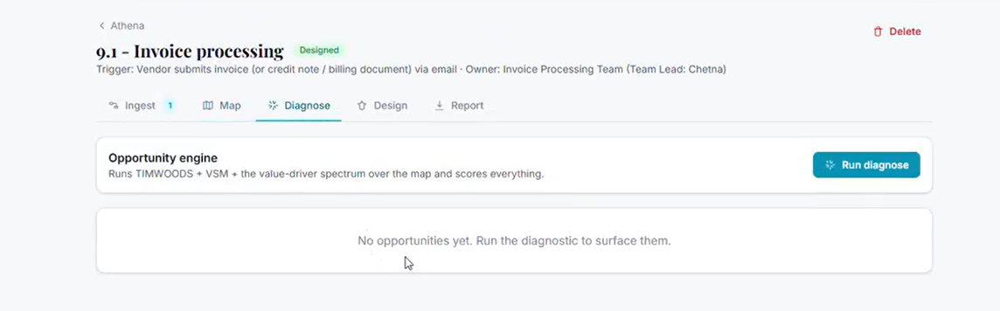

it works well! only thing is the diagnostic page is emptyish... is that right?


---

### 🧑 User

[Request interrupted by user]


---

### 🧑 User

My colleagues want to access the tool! how do I make the app available for us to all work on the same project in the app together, hosted somewhere stable?
My colleagues want to be able to use this collaboratively, uploading their videos and transcripts and summaries under different projects or sub processes under the same project… How do I get this living in a collaborative way where everyone can access everyone else’s results in a stable environment that we can all use? Are you able to see what we’ve done with Apex? We could do something similar via azure?


### 🤖 Claude

Two things here — a quick answer, then the big one (collaboration). Let me check your repo for the Apex/Azure setup while I answer.


### 🤖 Claude

> 🔧 **Bash** — command=echo "=== top-level ===" && ls -d */ 2>/dev/null && echo "=== anything 'apex' ? ===" && (ls -d *apex* *APEX* 2>/dev/null; grep -ril "apex" --include=*.md --incl


---

### 🧑 User

> 📤 _result:_ === top-level ===
assessment-app/
data/
flux/
gtm_engine/
marketing/
output/
references/
scripts/
tests/
=== anything 'apex' ? ===
./MASTER_CONTEXT.md
./output/gtm_strategy_report.md
./marketing/README.md
./assessment-app/README.md
=== azure refs ? ===


### 🤖 Claude

Quick one first, then the big one.

## Why Diagnose looks empty
That's expected — **you haven't run it yet.** Diagnose is on-demand (it costs tokens, so it doesn't auto-fire). Click the teal **"Run diagnose"** button (top-right of that panel) and it'll populate the opportunity register, the impact/effort matrix and the value bases. *(Side note: your status badge says "Designed" — looks like you jumped ahead to Design; you can still run Diagnose any time and it'll backfill the opportunities.)*

## Collaboration — good news: it's already built
What you're describing — colleagues signing in, **multiple projects**, **sub-processes under each project**, everyone **uploading their own videos/transcripts/summaries**, and **everyone seeing everyone's results** in a stable shared environment — is *exactly* the "cloud/team mode" I built earlier and we parked. The data model already fits:

- **Engagements** = your projects
- **Processes** = sub-processes under a project (as many as you like)
- Each process has its own **ingested sources** (videos/transcripts/notes)
- In cloud mode, a **workspace is keyed to your email domain** → everyone on `@v2ogroup.com` automatically shares the same projects and results, syncing live across devices. (API keys still stay per-device, by design.)

It's not built yet *only* because it needs to be switched on: a database (Supabase) + two environment variables on the host. ~15 minutes, mostly clicking. I've already written the database setup (`flux/supabase/schema.sql`) and a step-by-step guide (`flux/docs/DEPLOYMENT.md`).

## On Apex / Azure
Honest answer: **I can't see Apex** — it's not in this repository (only named in your notes), and my access is scoped to this one repo, so I can't mirror its exact Azure setup. But it doesn't matter: FLUX is a static web app, so it can absolutely live in **Azure** to match your ecosystem. The only real decision is where the **shared data** lives. Three sensible options:


### 🤖 Claude

> 🔧 **AskUserQuestion** — 


---

### 🧑 User

> 📤 _result:_ <tool_use_error>InputValidationError: AskUserQuestion failed due to the following issue:
The required parameter `questions[0].question` is missing</tool_use_error>


### 🤖 Claude

> 🔧 **AskUserQuestion** — 


---

### 🧑 User

Continue from where you left off.


### 🤖 Claude

> 🔧 **AskUserQuestion** — 


---

### 🧑 User

Continue from where you left off.


### 🤖 Claude

Let me re-ask that properly:


### 🤖 Claude

> 🔧 **AskUserQuestion** — 


---

### 🧑 User

My colleagues want to access the tool! how do I make the app available for us to all work on the same project in the app together, hosted somewhere stable?


---

### 🧑 User

[Request interrupted by user]


---

### 🧑 User

> 📤 _result:_ Your questions have been answered: "How do you want to host the collaborative (shared-data) version for your team?"="Vercel + Supabase (fastest)". You can now continue with these answers in mind.


### 🤖 Claude

Vercel + Supabase it is — and the good part is the app's already built for this, so it's pure setup, no code changes. Let me verify the database script and guide are current before I walk you through it.


### 🤖 Claude

> 🔧 **Read** — file_path=/home/user/claude/flux/supabase/schema.sql


---

### 🧑 User

> 📤 _result:_ 1	-- ============================================================================
2	-- FLUX — Supabase schema, RLS and auth wiring.
3	-- Run this once in your Supabase project: SQL Editor → paste → Run.
4	-- Safe to re-run (idempotent where it matters).
5	-- ============================================================================
6	
7	-- Each user belongs to a workspace keyed to their email DOMAIN, so colleagues
8	-- on the same domain automatically share data. Data is stored as JSONB so the
9	-- schema never drifts from the app's TypeScript types.
10	
11	create extension if not exists pgcrypto;
12	
13	-- --- Workspaces & profiles --------------------------------------------------
14	
15	create table if not exists public.workspaces (
16	  id         uuid primary key default gen_random_uuid(),
17	  domain     text unique not null,
18	  name       text,
19	  created_at timestamptz not null default now()
20	);
21	
22	create table if not exists public.profiles (
23	  id           uuid primary key references auth.users on delete cascade,
24	  email        text,
25	  workspace_id uuid references public.workspaces on delete set null,
26	  created_at   timestamptz not null default now(
… [truncated 263 chars]


### 🤖 Claude

Schema's solid — and importantly, all the new fields (sources, clarifications, baseline, etc.) live inside the JSONB `data` column, so **no database migration is ever needed** as I add features. 

You've given me a meaty v2 wishlist. Let me be straight about how I'll handle it, because these are real architecture decisions — not all four are 5-minute jobs, and one of them (access control) changes the security model, so I won't cowboy it blind.

**First — get the team live now (you can do this today):**
Your existing Vercel project just needs switching from local to cloud mode:
1. **Supabase** → create a free project → **SQL Editor** → paste all of `flux/supabase/schema.sql` → **Run**.
2. **Project Settings → API** → copy the **Project URL** and **anon public** key.
3. **Vercel** → your FLUX project → **Settings → Environment Variables** → add `VITE_SUPABASE_URL` and `VITE_SUPABASE_ANON_KEY` → **Redeploy**.
4. Everyone signs in with their `@v2ogroup.com` email. *(Right now that means the whole domain shares everything — the per-project privacy you want is item #1 below.)*

**Your four asks, sequenced:**
1. **Per-project access control** (private projects, member assignment, aggregate view) — *foundational + security-critical.* I'll build it carefully against your Supabase since RLS must be exactly right.
2. **Project front page** (progress, what data's needed, project-level upload repository) — *building this now.*
3. **Editable cost/performance baseline + assumptions** feeding the business case directly.
4. **Multi-level opportunities** (step / process / outside-in) + a **Deep Research** step acting as a cross-functional consulting team.

Let me build **#2 now** to keep momentum, then I'll tackle access control next. Starting:


### 🤖 Claude

> 🔧 **Edit** — file_path=/home/user/claude/flux/src/types.ts


---

### 🧑 User

> 📤 _result:_ The file /home/user/claude/flux/src/types.ts has been updated successfully. (file state is current in your context — no need to Read it back)


### 🤖 Claude

Now feed the project repository into every AI prompt's context:


### 🤖 Claude

> 🔧 **Edit** — file_path=/home/user/claude/flux/src/services/fluxAI.ts


---

### 🧑 User

> 📤 _result:_ The file /home/user/claude/flux/src/services/fluxAI.ts has been updated successfully. (file state is current in your context — no need to Read it back)


### 🤖 Claude

Now a project-level repository uploader (the "notebook" for project overview info):


### 🤖 Claude

> 🔧 **Write** — file_path=/home/user/claude/flux/src/components/ProjectRepository.tsx


---

### 🧑 User

> 📤 _result:_ File created successfully at: /home/user/claude/flux/src/components/ProjectRepository.tsx (file state is current in your context — no need to Read it back)


### 🤖 Claude

Now wire an overview header (progress + aggregate findings + data-needed) and the repository into the project page. Let me view its top:


### 🤖 Claude

> 🔧 **Read** — file_path=/home/user/claude/flux/src/pages/ProjectPage.tsx


---

### 🧑 User

> 📤 _result:_ 1	import { useState } from 'react';
2	import { Link, useNavigate, useParams } from 'react-router-dom';
3	import { now, uid } from '../db';
4	import { putProcess, putProject, useProcessesByProject, useProject } from '../store';
5	import Icon from '../components/Icon';
6	import Modal from '../components/Modal';
7	import { AIError_, AIThinking, Spinner, useAIRun } from '../components/AIRun';
8	import { DRIVER } from '../lib/frameworks';
9	import { FLUX_SCHEMA_VERSION } from '../types';
10	import { runDiagnostic } from '../services/fluxAI';
11	import { computeMetrics } from '../lib/metrics';
12	import { fmtPct } from '../lib/format';
13	import type { DiagnosticSignal, Process, Project } from '../types';
14	
15	export default function ProjectPage() {
16	  const { id = '' } = useParams();
17	  const nav = useNavigate();
18	  const project = useProject(id);
19	  const processes = useProcessesByProject(id);
20	
21	  if (project === undefined) return <div className="text-ink-400">Loading…</div>;
22	  if (!project) return <div className="card p-8 text-center text-ink-400">Engagement not found.</div>;
23	
24	  return (
25	    <div className="mx-auto max-w-5xl space-y-8">
26	      <div>
27	   
… [truncated 985 chars]


### 🤖 Claude

> 🔧 **Edit** — file_path=/home/user/claude/flux/src/pages/ProjectPage.tsx


---

### 🧑 User

> 📤 _result:_ The file /home/user/claude/flux/src/pages/ProjectPage.tsx has been updated successfully. (file state is current in your context — no need to Read it back)


### 🤖 Claude

> 🔧 **Edit** — file_path=/home/user/claude/flux/src/pages/ProjectPage.tsx


---

### 🧑 User

> 📤 _result:_ The file /home/user/claude/flux/src/pages/ProjectPage.tsx has been updated successfully. (file state is current in your context — no need to Read it back)


### 🤖 Claude

Let me add a review indicator to the process cards. Let me find them:


### 🤖 Claude

> 🔧 **Bash** — command=cd /home/user/claude/flux && grep -n "StatusChip status={p.status}\|<Mini" src/pages/ProjectPage.tsx | head


---

### 🧑 User

> 📤 _result:_ 266:                  <StatusChip status={p.status} />
269:                  <Mini label="Steps" value={`${m.stepCount}`} />
270:                  <Mini label="PCE" value={fmtPct(m.pce)} />
271:                  <Mini label="Auto" value={`${m.automationIndex}`} />


### 🤖 Claude

> 🔧 **Read** — file_path=/home/user/claude/flux/src/pages/ProjectPage.tsx


---

### 🧑 User

> 📤 _result:_ 262	            return (
263	              <button key={p.id} onClick={() => onOpen(p)} className="card group p-4 text-left transition hover:shadow-lift">
264	                <div className="flex items-start justify-between">
265	                  <div className="font-semibold text-ink-800 group-hover:text-brand-700">{p.name}</div>
266	                  <StatusChip status={p.status} />
267	                </div>
268	                <div className="mt-2 grid grid-cols-3 gap-2 text-center text-xs">
269	                  <Mini label="Steps" value={`${m.stepCount}`} />
270	                  <Mini label="PCE" value={fmtPct(m.pce)} />
271	                  <Mini label="Auto" value={`${m.automationIndex}`} />


### 🤖 Claude

> 🔧 **Edit** — file_path=/home/user/claude/flux/src/pages/ProjectPage.tsx


---

### 🧑 User

> 📤 _result:_ The file /home/user/claude/flux/src/pages/ProjectPage.tsx has been updated successfully. (file state is current in your context — no need to Read it back)


### 🤖 Claude

> 🔧 **Bash** — command=npx tsc -b 2>&1 | head -20; echo "=== TSC ${PIPESTATUS[0]} ===" && npm run build 2>&1 | tail -4


---

### 🧑 User

> 📤 _result:_ src/pages/ProjectPage.tsx(58,46): error TS2339: Property 'reviewed' does not exist on type 'Process'.
src/pages/ProjectPage.tsx(267,47): error TS2339: Property 'reviewed' does not exist on type 'Process'.
npm notice
npm notice New major version of npm available! 10.9.7 -> 11.17.0
npm notice Changelog: https://github.com/npm/cli/releases/tag/v11.17.0
npm notice To update run: npm install -g npm@11.17.0
npm notice
=== TSC 2 ===
> tsc -b && vite build

src/pages/ProjectPage.tsx(58,46): error TS2339: Property 'reviewed' does not exist on type 'Process'.
src/pages/ProjectPage.tsx(267,47): error TS2339: Property 'reviewed' does not exist on type 'Process'.


### 🤖 Claude

Container's behind again (lost the `reviewed` field from the last merge). Let me check and resync:


### 🤖 Claude

> 🔧 **Bash** — command=echo "=== reviewed in types? ===" && grep -c "reviewed" src/types.ts && echo "=== HEAD ===" && git log --oneline -3 && echo "=== remote ===" && git fetch origin


---

### 🧑 User

> 📤 _result:_ Exit code 1
=== reviewed in types? ===
0


### 🤖 Claude

> 🔧 **Bash** — command=git log --oneline -3 && echo "=== fetch+remote ===" && git fetch origin claude/optiq-competitor-process-mapping-U8Zte 2>&1 | tail -1 && git log --oneline -3 ori


---

### 🧑 User

> 📤 _result:_ afe9e3e FLUX: stream large media to Gemini (raise ingest limit to ~2GB)
747abea FLUX: relax Gemini key validation (accept non-AIza formats)
e5107b1 FLUX: Gemini resumable Files API for large media ingestion
=== fetch+remote ===
   afe9e3e..5c9a078  claude/optiq-competitor-process-mapping-U8Zte -> origin/claude/optiq-competitor-process-mapping-U8Zte
5c9a078 FLUX: review prompt on first map + broaden AI tidy (steps/flow/timings/units)
9267f58 FLUX: per-opportunity value basis (show the working behind each £)
ddf31d2 FLUX: report map, editable cost-basis explainer, time units, button colours
=== status ===
 M src/pages/ProjectPage.tsx
 M src/services/fluxAI.ts
 M src/types.ts
 M tsconfig.app.tsbuildinfo
?? src/components/ProjectRepository.tsx


### 🤖 Claude

Same drift as before. Let me resync to the remote (which has everything) and replay this turn's edits:


### 🤖 Claude

> 🔧 **Bash** — command=git checkout -- tsconfig.app.tsbuildinfo 2>/dev/null; git stash push -m "overview-turn" src/pages/ProjectPage.tsx src/services/fluxAI.ts src/types.ts 2>&1 | tai


---

### 🧑 User

> 📤 _result:_ Saved working directory and index state On claude/optiq-competitor-process-mapping-U8Zte: overview-turn
HEAD is now at 5c9a078 FLUX: review prompt on first map + broaden AI tidy (steps/flow/timings/units)
=== HEAD ===
5c9a078 FLUX: review prompt on first map + broaden AI tidy (steps/flow/timings/units)
  (use "git add <file>..." to include in what will be committed)
	src/components/ProjectRepository.tsx

no changes added to commit (use "git add" and/or "git commit -a")
Dropped refs/stash@{0} (5bcb4de965a79967fc1399fa59d59d2711df79f6)


### 🤖 Claude

Resynced cleanly — `reviewed` is back and my overview edits replayed on top. Let me rebuild:


### 🤖 Claude

> 🔧 **Bash** — command=npx tsc -b 2>&1 | head -20; echo "=== TSC ${PIPESTATUS[0]} ===" && npm run build 2>&1 | tail -4


---

### 🧑 User

> 📤 _result:_ === TSC 0 ===
dist/index.html                   1.02 kB │ gzip:   0.55 kB
dist/assets/index-DQ21V2Ur.css   32.95 kB │ gzip:   5.65 kB
dist/assets/index-BuBlUKR1.js   420.58 kB │ gzip: 133.14 kB
✓ built in 3.76s


### 🤖 Claude

Clean. Shipping the project front page + repository:


### 🤖 Claude

> 🔧 **Bash** — command=cd /home/user/claude && git add flux && git status --short | grep -E "node_modules|/dist/" && echo WARN || echo clean; git commit -q -m "$(cat <<'EOF' FLUX: pro


---

### 🧑 User

> 📤 _result:_ clean
   5c9a078..9f4afe7  claude/optiq-competitor-process-mapping-U8Zte -> claude/optiq-competitor-process-mapping-U8Zte
branch 'claude/optiq-competitor-process-mapping-U8Zte' set up to track 'origin/claude/optiq-competitor-process-mapping-U8Zte'.


### 🤖 Claude

> 🔧 **mcp__github__create_pull_request** — 


---

### 🧑 User

> 📤 _result:_ {"id":"3902688922","url":"https://github.com/tom-hamnett/claude/pull/12"}


### 🤖 Claude

> 🔧 **mcp__github__merge_pull_request** — 


---

### 🧑 User

> 📤 _result:_ {"sha":"210cfb84f2df647e948a201cd76605983cf77a20","merged":true,"message":"Pull Request successfully merged"}


### 🤖 Claude

Shipped **#2** ✅ — hard-refresh and your engagement (Athena) now opens with a proper front page.

## What's live now
**Project front page** (top of each engagement):
- **Progress** — sub-processes count, how many reviewed, a "% diagnosed" bar
- **Aggregate findings** — total opportunities and **identified value across all sub-processes** (this is the "view the overall findings in aggregate" you asked for)
- **"Data that would sharpen this engagement"** — auto-checklist of what's missing (hourly cost, volumes, repository docs, processes still to diagnose)

**Project repository** — drop the **org chart, budget, headcount roster, KPI dashboards or project brief** at the *project* level (or paste notes). It's ingested and **woven into every process's AI context**, so maps and diagnoses inherit the org background. This is your "notebook/repository."

Plus process cards now show a **"review"** badge until checked.

*(Reminder: to get the team on it, do the Supabase + 2 Vercel env-vars step from my last message — that flips on shared mode.)*

## The remaining three — and an honest call on sequencing

**#1 Access control is the one I won't rush.** It changes the *security model* (today: everyone on your domain shares everything → target: a project is private to its creator + people they invite, others make their own). That means Postgres row-level-security rewrites that, if I get them even slightly wrong, **leak data between teams** — and I **can't test RLS in this sandbox**, only against your real Supabase. So I want to build it as a dedicated, careful pass *with you able to verify it live*, not bolt it on blind at the end of a long session.

Here's the model I'd build (matches what you described):
- A project is **visible only to its creator + members they invite by email** (within your domain). Everyone else makes their own projects.
- Members can be **assigned specific sub-processes**, but all members see the **project-level aggregate**.
- Your existing data: each project's creator becomes its owner automatically on migration.

**#3 (editable baseline + assumptions → business case)** and **#4 (multi-level opportunities + Deep Research consultant step)** are both additive and lower-risk — I can build those the way I built today's features.

So my recommended order: **#1 access control next (dedicated, tested with you) → #3 baseline → #4 deep research.**


### 🤖 Claude

> 🔧 **AskUserQuestion** — 


---

### 🧑 User

> 📤 _result:_ Your questions have been answered: "Which should I build next? (I'll do all three; this is just the order.)"="#1 Access control (recommended)". You can now continue with these answers in mind.


### 🤖 Claude

Access control it is — the important, careful one. I'll build **project-level privacy**: a project is visible only to its creator and the people they invite; everyone else makes their own. All members of a project see its sub-processes and the aggregate. This fully covers what you described.

I'll be upfront: the security lives in Postgres row-level-security that I **cannot test in this sandbox**, so I'll build it carefully and you'll verify isolation on your Supabase before trusting real client data to it. Starting with the database model:


### 🤖 Claude

> 🔧 **Write** — file_path=/home/user/claude/flux/supabase/schema.sql


---

### 🧑 User

> 📤 _result:_ The file /home/user/claude/flux/supabase/schema.sql has been updated successfully. (file state is current in your context — no need to Read it back)


### 🤖 Claude

Now the app layer. First expose the signed-in email for membership stamping:


### 🤖 Claude

> 🔧 **Read** — file_path=/home/user/claude/flux/src/services/auth.tsx


---

### 🧑 User

> 📤 _result:_ 28	/** Read by cloudStore when stamping writes. */
29	export function getWorkspaceId(): string | null {
30	  return currentWorkspaceId;
31	}
32	
33	const Ctx = createContext<AuthApi | null>(null);
34	
35	export function useAuth(): AuthApi {
36	  const v = useContext(Ctx);
37	  if (!v) throw new Error('useAuth must be used within <AuthProvider>');
38	  return v;
39	}
40	
41	export function AuthProvider({ children }: { children: ReactNode }) {
42	  const [state, setState] = useState<AuthState>(
43	    isCloud ? { ready: false, userEmail: null, workspaceId: null } : { ready: true, userEmail: null, workspaceId: null },
44	  );
45	
46	  async function loadProfile(userId: string, email: string | undefined) {
47	    if (!supabase) return;
48	    // The handle_new_user trigger creates the profile; poll briefly in case of lag.
49	    for (let attempt = 0; attempt < 5; attempt++) {
50	      const { data } = await supabase.from('profiles').select('workspace_id').eq('id', userId).maybeSingle();
51	      if (data?.workspace_id) {
52	        currentWorkspaceId = data.workspace_id;
53	        setState({ ready: true, userEmail: email ?? null, workspaceId: data.workspace_id });
54	        return;
5
… [truncated 73 chars]


### 🤖 Claude

> 🔧 **Edit** — file_path=/home/user/claude/flux/src/services/auth.tsx


---

### 🧑 User

> 📤 _result:_ The file /home/user/claude/flux/src/services/auth.tsx has been updated successfully. (file state is current in your context — no need to Read it back)


### 🤖 Claude

> 🔧 **Edit** — file_path=/home/user/claude/flux/src/services/auth.tsx


---

### 🧑 User

> 📤 _result:_ The file /home/user/claude/flux/src/services/auth.tsx has been updated successfully. (file state is current in your context — no need to Read it back)


### 🤖 Claude

> 🔧 **Edit** — file_path=/home/user/claude/flux/src/services/auth.tsx


---

### 🧑 User

> 📤 _result:_ The file /home/user/claude/flux/src/services/auth.tsx has been updated successfully. (file state is current in your context — no need to Read it back)


### 🤖 Claude

Now add the membership functions and `createProject` to the store:


### 🤖 Claude

> 🔧 **Edit** — file_path=/home/user/claude/flux/src/store/index.tsx


---

### 🧑 User

> 📤 _result:_ The file /home/user/claude/flux/src/store/index.tsx has been updated successfully. (file state is current in your context — no need to Read it back)


### 🤖 Claude

> 🔧 **Edit** — file_path=/home/user/claude/flux/src/store/index.tsx


---

### 🧑 User

> 📤 _result:_ The file /home/user/claude/flux/src/store/index.tsx has been updated successfully. (file state is current in your context — no need to Read it back)


### 🤖 Claude

Now use `createProject` in the create flow, and add a Members manager to the project page:


### 🤖 Claude

> 🔧 **Edit** — file_path=/home/user/claude/flux/src/pages/ProjectsPage.tsx


---

### 🧑 User

> 📤 _result:_ The file /home/user/claude/flux/src/pages/ProjectsPage.tsx has been updated successfully. (file state is current in your context — no need to Read it back)


### 🤖 Claude

> 🔧 **Edit** — file_path=/home/user/claude/flux/src/pages/ProjectsPage.tsx


---

### 🧑 User

> 📤 _result:_ The file /home/user/claude/flux/src/pages/ProjectsPage.tsx has been updated successfully. (file state is current in your context — no need to Read it back)


### 🤖 Claude

Now a Members/Share manager (cloud-only) and wire it into the project header:


### 🤖 Claude

> 🔧 **Write** — file_path=/home/user/claude/flux/src/components/ProjectMembers.tsx


---

### 🧑 User

> 📤 _result:_ File created successfully at: /home/user/claude/flux/src/components/ProjectMembers.tsx (file state is current in your context — no need to Read it back)


### 🤖 Claude

Now place the Share button in the project header:


### 🤖 Claude

> 🔧 **Edit** — file_path=/home/user/claude/flux/src/pages/ProjectPage.tsx


---

### 🧑 User

> 📤 _result:_ The file /home/user/claude/flux/src/pages/ProjectPage.tsx has been updated successfully. (file state is current in your context — no need to Read it back)


### 🤖 Claude

> 🔧 **Edit** — file_path=/home/user/claude/flux/src/pages/ProjectPage.tsx


---

### 🧑 User

> 📤 _result:_ The file /home/user/claude/flux/src/pages/ProjectPage.tsx has been updated successfully. (file state is current in your context — no need to Read it back)


### 🤖 Claude

> 🔧 **Bash** — command=cd /home/user/claude/flux && npx tsc -b 2>&1 | head -25; echo "=== TSC ${PIPESTATUS[0]} ===" && npm run build 2>&1 | tail -4


---

### 🧑 User

> 📤 _result:_ === TSC 0 ===
dist/index.html                   1.02 kB │ gzip:   0.55 kB
dist/assets/index-DQ21V2Ur.css   32.95 kB │ gzip:   5.65 kB
dist/assets/index-CdNz0KVz.js   420.80 kB │ gzip: 133.16 kB
✓ built in 3.13s


### 🤖 Claude

Let me make the cloud "Load demo" also register ownership (so its RLS works):


### 🤖 Claude

> 🔧 **Edit** — file_path=/home/user/claude/flux/src/store/index.tsx


---

### 🧑 User

> 📤 _result:_ The file /home/user/claude/flux/src/store/index.tsx has been updated successfully. (file state is current in your context — no need to Read it back)


### 🤖 Claude

Now update the deployment doc for the new access model + the critical isolation test:


### 🤖 Claude

> 🔧 **Edit** — file_path=/home/user/claude/flux/docs/DEPLOYMENT.md


---

### 🧑 User

> 📤 _result:_ The file /home/user/claude/flux/docs/DEPLOYMENT.md has been updated successfully. (file state is current in your context — no need to Read it back)


### 🤖 Claude

> 🔧 **Bash** — command=npx tsc -b 2>&1 | head -10; echo "TSC ${PIPESTATUS[0]}"; npm run build 2>&1 | tail -3


---

### 🧑 User

> 📤 _result:_ TSC 0
dist/assets/index-DQ21V2Ur.css   32.95 kB │ gzip:   5.65 kB
dist/assets/index-CdNz0KVz.js   420.80 kB │ gzip: 133.16 kB
✓ built in 3.27s


### 🤖 Claude

> 🔧 **Bash** — command=cd /home/user/claude && git add flux && git status --short | grep -E "node_modules|/dist/" && echo WARN || echo clean; git commit -q -m "$(cat <<'EOF' FLUX: per


---

### 🧑 User

> 📤 _result:_ clean
   9f4afe7..e3fc225  claude/optiq-competitor-process-mapping-U8Zte -> claude/optiq-competitor-process-mapping-U8Zte
branch 'claude/optiq-competitor-process-mapping-U8Zte' set up to track 'origin/claude/optiq-competitor-process-mapping-U8Zte'.


### 🤖 Claude

> 🔧 **mcp__github__create_pull_request** — 


---

### 🧑 User

> 📤 _result:_ {"id":"3902711263","url":"https://github.com/tom-hamnett/claude/pull/13"}


### 🤖 Claude

> 🔧 **mcp__github__merge_pull_request** — 


---

### 🧑 User

> 📤 _result:_ {"sha":"ec57013d97e54671a01220c99b62c5ea9ead0303","merged":true,"message":"Pull Request successfully merged"}


### 🤖 Claude

Access control built and merged ✅ — this is the foundation for your team using it for real.

## What you've got now
**Projects are private.** Each project is visible only to:
- the person who created it, plus
- colleagues they invite via the new **Share** button (top-right of a project)

Everyone else on your domain can't see it and makes their own projects. All members of a project see its sub-processes **and** the aggregate findings on the front page — so your "each person takes a few sub-processes, everyone sees the rollup" workflow is exactly supported. Invites are restricted to your `@v2ogroup.com` domain.

Under the hood it's enforced by Postgres **row-level security**, not just UI — processes, opportunities and knowledge all inherit their project's access.

## ⚠️ One critical step before real client data
I built this carefully but **I cannot test row-level security in my sandbox** — it has to be verified in *your* Supabase. So when you set up cloud mode, please do this first (it's in `DEPLOYMENT.md`):

1. As **you**, create a project "Isolation test."
2. As a **colleague** (same domain, not invited), confirm they **can't** see it.
3. **Share** it to them → confirm they now can → remove them → confirm it disappears.

If anything leaks, stop and tell me — don't load real engagements until that passes. I'm confident in the design, but with access control I'd rather you prove it than take my word.

## Setup reminder (the schema changed)
When you run the Supabase setup, use the **current** `flux/supabase/schema.sql` (it now includes the membership model). If you'd already run the old one, just re-run the new one — it's written to safely replace the policies. Then the two Vercel env vars, redeploy, and you're collaborative.

---

That's **#1 (access control)** and **#2 (front page + repository)** done. Still queued, in order:
- **#3** — editable cost/performance **baseline + assumptions** feeding the business case
- **#4** — **multi-level opportunities** (step / process / outside-in) + the **Deep Research** consultant step

Want me to keep going with **#3** now, or pause here so you can stand up the Supabase, run the isolation test, and get the team on it first? I'd genuinely suggest the latter — get it live and proven with the team before I layer more on.


---

### 🧑 User

ok - talk me through it


### 🤖 Claude

Let's get your team live. This is all clicking through two dashboards — no code, ~15 minutes. I'll go slow and concrete. Do these in order.

## Phase 1 · Create the Supabase database (~4 min)

1. Go to **supabase.com** → **Start your project** → sign in with GitHub (or email).
2. Click **New project**.
   - **Name:** `flux` (anything)
   - **Database password:** click **Generate a password** → it's auto-saved; you won't need it for FLUX, but keep it.
   - **Region:** pick the one nearest your team (e.g. London/EU West).
3. Click **Create new project**. It takes ~2 minutes to provision — wait for the spinner to finish.

## Phase 2 · Run the database script (~3 min)

This builds the tables, security rules, and the private-projects model.

1. In your FLUX repo, open **`flux/supabase/schema.sql`** and **copy the whole file** (top to bottom).
2. In Supabase, left sidebar → **SQL Editor** → **+ New query**.
3. **Paste** the whole thing into the editor.
4. Click **Run** (bottom-right, or Cmd/Ctrl+Enter).
5. You want to see **"Success. No rows returned"** at the bottom. If you see a red error, copy it to me and stop here.

## Phase 3 · Copy the two keys (~1 min)

1. Left sidebar → **Settings** (gear) → **API**.
2. Keep this tab open. You need two values:
   - **Project URL** (looks like `https://abcd1234.supabase.co`)
   - **anon public** key (a long string, under "Project API keys" — the one labelled **anon / public**, *not* service_role)

> ⚠️ Use the **anon public** key only. Never the `service_role` key — that one bypasses all security.

## Phase 4 · Switch Vercel to cloud mode (~3 min)

1. Go to **vercel.com** → open your **FLUX** project.
2. **Settings** → **Environment Variables**.
3. Add two (Name → Value), leaving all three environments ticked:
   - `VITE_SUPABASE_URL` → *paste the Project URL*
   - `VITE_SUPABASE_ANON_KEY` → *paste the anon public key*
4. Save each.
5. Go to the **Deployments** tab → top deployment → **⋯** menu → **Redeploy** → confirm. *(Env vars only take effect on a fresh build, so this redeploy is essential.)*

When it finishes, open your FLUX URL. You should now see a **sign-in screen** instead of going straight into the app — that's how you know cloud mode is on.

## Phase 5 · The isolation test — do this before any real data (~3 min)

This proves the privacy works in *your* environment.

1. Sign in with **your** email (`tom@v2ogroup.com`) → enter the 6-digit code from your inbox.
2. Create a project called **"Isolation test"**.
3. Get a colleague (or a second email of yours on the same domain) to sign in — confirm they **do NOT** see "Isolation test".
4. Open the project → **Share** (top-right) → invite their email. Have them refresh → they should **now** see it.
5. **Share** → remove them → they refresh → it should **disappear**.

If all three behave, your access control is proven. If anything leaks, **stop and tell me** — don't load real client data yet.

## Phase 6 · Onboard the team

- Everyone signs in with their `@v2ogroup.com` email.
- Each person adds **their own AI key** in **Settings** (it stays on their device — keys are never shared or stored in the database).
- For the intake-to-pay engagement: one person creates the project, **Share**s it to the team, adds the sub-processes, and you split them up. The front page shows the aggregate as you go.

---

A couple of things worth knowing:
- **Each person needs their own AI key** — there's no shared billing key. Is that fine, or did you want a single team key? (That'd be a small change.)
- The **demo engagement** won't auto-load in cloud mode; if you want it, it's **Settings → Load demo** and it'll be private to you.

Want to start Phase 1 now and I'll stay on standby for any error messages — or shall I walk you through anything above in more detail first?


---

### 🧑 User

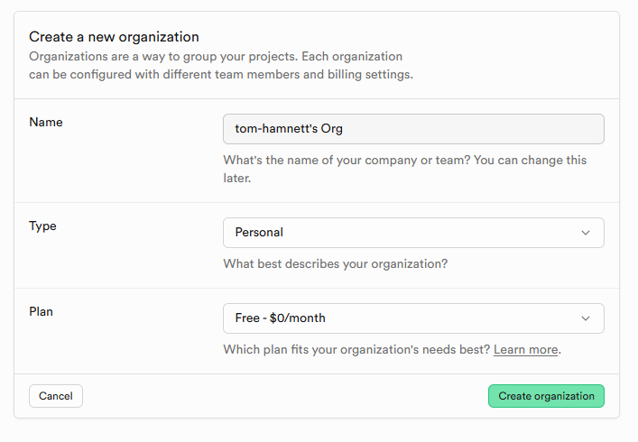

it's asking me to create an organisation, (nothing about new project?)


### 🤖 Claude

That's the right screen — Supabase makes you create an **organization** first (a billing/grouping container), *then* it'll ask for the project. This is the step before "New project."

Fill it in like this:
- **Name:** anything — `tom-hamnett's Org` is fine, or change to `V2O Group`. You can rename later.
- **Type:** `Personal` is fine (it has no effect on functionality).
- **Plan:** **Free - $0/month** — exactly right. The free tier is plenty for your team.

Click **Create organization**.

The **next** screen will be the "New project" form I described — that's where you'll set the project name (`flux`), generate the database password, and pick your region. Go ahead, and tell me when you're on that screen or if anything looks different.


---

### 🧑 User

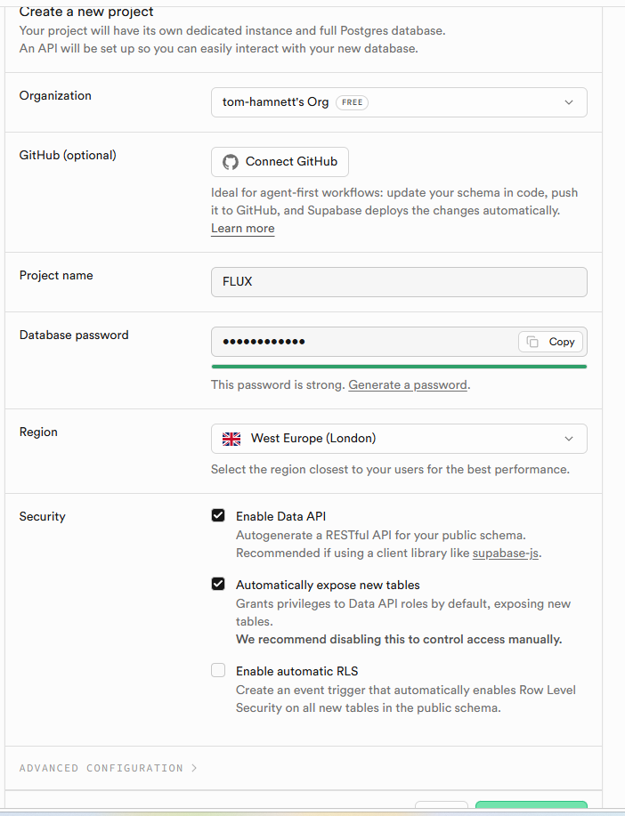

do i connect github? what about the security settings?


### 🤖 Claude

Leave everything exactly as it is — the defaults shown are correct. Specifics:

**GitHub: skip it.** That's for a different workflow (managing your database schema through git commits). You're pasting the SQL by hand, so leave it unconnected. No downside.

**Security settings — keep them as shown:**
- ✅ **Enable Data API** — *keep checked.* FLUX talks to Supabase through this API. Required.
- ✅ **Automatically expose new tables** — *keep checked.* This just makes your tables reachable by the app. It's safe because the script you're about to run **turns on Row-Level Security with explicit policies on every table** — so being "exposed" doesn't mean "readable"; the privacy rules still gate everything. (Supabase's warning is for people who *don't* write their own RLS — you are.)
- ⬜ **Enable automatic RLS** — *leave unchecked.* The script enables RLS itself on each table, so you don't need this trigger. (Ticking it does no harm either, but it's unnecessary.)

The rest is good: **Project name FLUX**, password generated, **West Europe (London)**.

Go ahead and click **Create new project** at the bottom. It'll take ~2 minutes to spin up — once it's ready, head to the **SQL Editor** for Phase 2 (pasting `flux/supabase/schema.sql`). Shout when you're there.


---

### 🧑 User

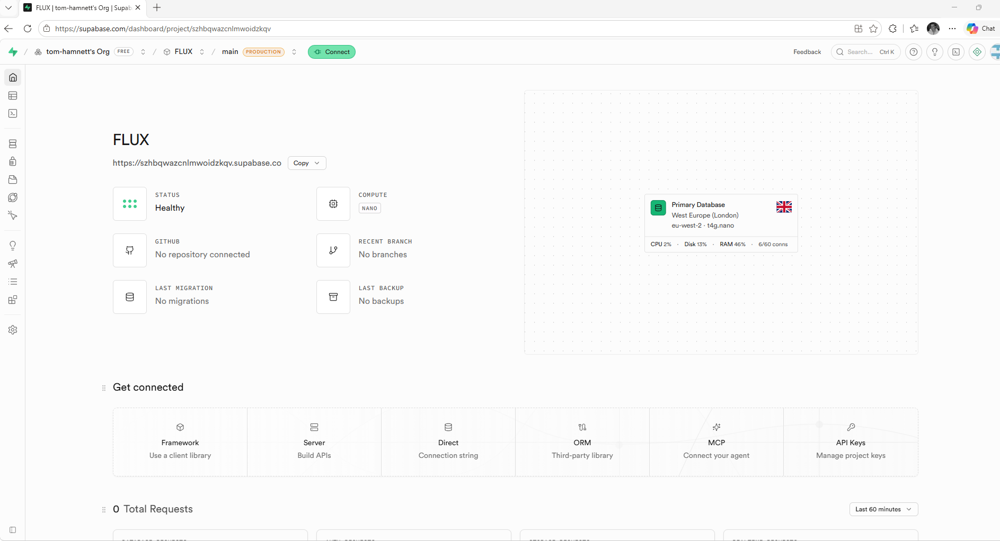

where is the sql editor?


### 🤖 Claude

It's in the **far-left icon rail** (the narrow vertical strip of icons on the left edge). Look at the **third icon from the top** — it looks like a terminal / command prompt (`>_`). That's the **SQL Editor**. The order is:

1. 🏠 Home
2. ▦ Table Editor (grid)
3. **`>_` SQL Editor** ← this one
4. 🗄 Database

If you're unsure which is which, **hover** over each icon and the name pops up. 

**Easiest alternative:** hit **Ctrl+K** (the "Search…" box at the top), type **SQL**, and click **SQL Editor**.

Once you're in: click **+ New query**, paste the whole contents of `flux/supabase/schema.sql`, and hit **Run**. Tell me what the result bar at the bottom says.


---

### 🧑 User

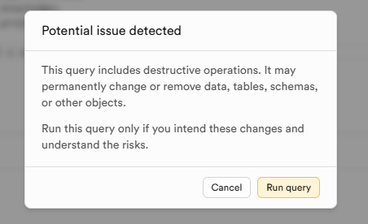

what about this?


### 🤖 Claude

That's expected and safe to proceed — click **Run query**.

Supabase flags any script containing words like `drop` or `alter` as "destructive." Yours has `drop policy if exists` / `drop trigger if exists` lines — those just clean up old versions before recreating them so the script can be re-run safely. On a **brand-new empty database there's nothing to remove**, so there's no data at risk here.

Click **Run query**, then tell me what the bar at the bottom says — you're looking for **"Success. No rows returned."**


---

### 🧑 User

done, next?


### 🤖 Claude

Database is built. Now grab the two values that connect your app to it.

**Value 1 — Project URL** (you already have it): 
`https://szhbqwazcnlmwoidzkqv.supabase.co` — that's the one shown under "FLUX" on your home screen. Keep it handy.

**Value 2 — the anon public key:**
1. Left rail → **Settings** (the ⚙️ gear, near the bottom) → **API Keys**. *(Or click the **API Keys** card — "Manage project keys" — on the home page.)*
2. Find the key labelled **anon** / **public**. It's a very long string starting with `eyJ…`.
3. Click **Copy**.

> If the page shows newer-style keys instead (a `Publishable key` starting `sb_publishable_…`), copy that one — it's the modern equivalent and works the same. Either way: the **public/publishable** key, **never** the `service_role` or `secret` key.

Once you've got both, head to **Vercel** (Phase 4): your FLUX project → **Settings → Environment Variables**, and add:
- `VITE_SUPABASE_URL` → the Project URL
- `VITE_SUPABASE_ANON_KEY` → the anon/public key

Tell me when they're saved and I'll walk you through the redeploy.


---

### 🧑 User

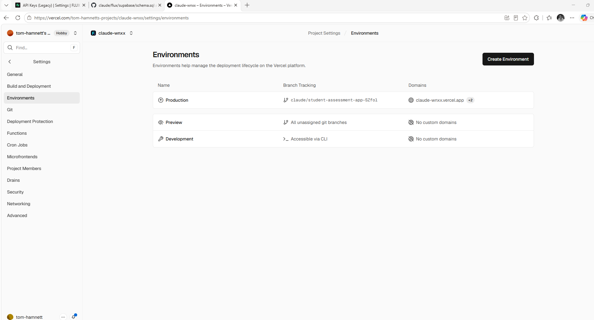

where do i add thee environment variables?


### 🤖 Claude

You're close — this "Environments" page lists the environments, but the variables live **inside** one. In Vercel's newer layout, environment variables are managed per-environment.

**Do this:**
1. Click the **Production** row (the one tracking `claude/student-assessment-app-SZfol` → `claude-wnxx.vercel.app` — that's your live site).
2. On that environment's page, scroll to the **Environment Variables** section (a form with **Key** / **Value** fields, or an **Add**/**Create Variable** button).
3. Add the first one:
   - **Key:** `VITE_SUPABASE_URL`
   - **Value:** `https://szhbqwazcnlmwoidzkqv.supabase.co`
4. Add another and enter:
   - **Key:** `VITE_SUPABASE_ANON_KEY`
   - **Value:** *the long `eyJ…` anon/public key you copied*
5. **Save.**

> If the form lets you tick which environments it applies to, tick **all** (Production, Preview, Development) — harmless and saves doing it again. But Production is the one that matters for your live link.

Once saved, tell me — the last step is a **Redeploy** (env vars only kick in on a fresh build), and then we sign in and run the isolation test.

If clicking Production *doesn't* reveal a variables section, say so and I'll give you the alternate route (there's a team-level "Environment Variables" page we can use instead).


---

### 🧑 User

ok - phase 6... they all need to be able to run this off my API key... not bring their own. and also, this is for IHG, not v2o. each client team or new project can run off the same key, but needs to be commercialised at some point so it runs as SAS


### 🤖 Claude

Good — this is the most important architectural moment so far, so let me be straight with you before we build, because two things here aren't just config toggles.

## 1. "Run off my key" — the catch, and why it's actually the SaaS foundation
A shared API key **cannot safely live in the browser**. FLUX today is a pure front-end app: each person's key sits encrypted on *their* device. If I instead bake your key into the app or store it in the database, anyone who logs in (or just opens dev-tools) can lift it and run up your bill on anything they like. There's no secure way around that in a front-end-only app.

The correct way to do "everyone runs off my key without ever seeing it" is a **small server-side proxy**: a function on Vercel that holds your key as a *server* secret, checks the caller is a logged-in FLUX user, and forwards the AI call. Nobody sees the key; you can meter and cap usage.

That proxy **is** the foundation for commercialising as SaaS — central key, per-tenant isolation, usage you can bill against. So building it now isn't a detour; it's step 1 of the commercial product.

## 2. IHG vs v2o — the domain model has to change
Right now FLUX groups people by **email domain** (everyone `@v2ogroup.com` shares a workspace). That breaks the moment your team is **v2o consultants + IHG client staff**, or you take on a second client. For an engagement *for IHG, run by v2o*, and for SaaS, the right model is:

> **The project is the tenant.** It's private to whoever's invited — *any* email, any domain. v2o and IHG people sit in the same project; the next client gets a separate one. No domain coupling.

I'll switch the access rules to pure per-project membership and open invites to any email address. (This is required for IHG anyway.)

---

Both of these are real, security-sensitive builds I'll do carefully and you'll test live. Before I start, two decisions are genuinely yours:


### 🤖 Claude

> 🔧 **AskUserQuestion** — 


---

### 🧑 User

> 📤 _result:_ Your questions have been answered: "How do you want to handle everyone running off your key?"="Build the secure proxy now", "Which AI provider is the key everyone should run on? (FLUX routes all reasoning + ingestion through it.)"="what are we currently using? isn't it a combination? needs to be one that can watch and interpret the videos...". You can now continue with these answers in mind.


### 🤖 Claude

Good — proxy it is. Let me check exactly what we're routing where today so I answer the video question accurately rather than from memory.


### 🤖 Claude

> 🔧 **Grep** — pattern=gemini|provider|model|video|files\.|generateContent|uploadFile


---

### 🧑 User

> 📤 _result:_ Found 8 files
flux/src/services/fluxAI.ts
flux/src/services/ai/geminiFiles.ts
flux/src/services/ai/gemini.ts
flux/src/services/ai/index.ts
flux/src/services/ai/types.ts
flux/src/services/aiKey.ts
flux/src/services/ai/openai.ts
flux/src/services/ai/anthropic.ts


### 🤖 Claude

> 🔧 **Read** — file_path=/home/user/claude/flux/src/services/ai/index.ts


---

### 🧑 User

> 📤 _result:_ 1	import type { AIProviderId } from './types';
2	import { anthropicProvider } from './anthropic';
3	import { openaiProvider } from './openai';
4	import { geminiProvider } from './gemini';
5	import type { AIProvider } from './types';
6	
7	export const providers: Record<AIProviderId, AIProvider> = {
8	  anthropic: anthropicProvider,
9	  openai: openaiProvider,
10	  gemini: geminiProvider,
11	};
12	
13	export const providerList: AIProvider[] = [anthropicProvider, openaiProvider, geminiProvider];
14	
15	export function getProvider(id: AIProviderId): AIProvider {
16	  return providers[id];
17	}
18	
19	export { uploadFileToGemini } from './geminiFiles';
20	export * from './types';
21


### 🤖 Claude

> 🔧 **Grep** — pattern=getProvider|aiProvider|provider\b|uploadFileToGemini|ingestSource|videoMime|video/|isBinaryKind|mediaKind|kind ===


---

### 🧑 User

> 📤 _result:_ 10:import { getProvider, providerList, uploadFileToGemini } from './ai';
60:/** Resolve the primary reasoning provider (map/diagnose/design). */
61:async function resolveAI(provider?: AIProviderId): Promise<ResolvedAI> {
63:  const providerId = provider ?? settings.aiProvider ?? 'anthropic';
64:  const p = getProvider(providerId);
65:  // Use the configured model only when it belongs to the chosen provider.
66:  const model = !provider && settings.aiModel ? settings.aiModel : p.defaultModel;
69:    throw new AIError(`No ${p.label} key set. Add one in Settings to use FLUX intelligence.`, { provider: providerId });
75: * Pick the optimal provider for a given attachment kind from the keys the user
87:    if (available.includes(pid) && getProvider(pid).supports.includes(kind)) {
92:  throw new AIError(`To ingest ${kind} files, add a ${need} key in Settings.`, { provider: 'gemini' });
100:): Promise<{ result: T; provider: AIProviderId; model: string }> {
102:  const provider = getProvider(providerId);
104:  const r = await provider.complete(
118:      provider: providerId,
121:  return { result: r.json as T, provider: providerId, model };
128:): Promise<{ text: string; provider: AIProvi
… [truncated 1114 chars]


### 🤖 Claude

**On the provider — you're right, it's a combination today, and that actually settles it.**

Here's what we're running now:
- **Reasoning** (map / diagnose / design): defaults to **Claude**, but routes to whichever key is present.
- **Ingestion**: picks the provider that *supports* the file. And critically — **only Gemini can natively watch and interpret video/audio**. Claude and OpenAI can't process long video; the code already forces video/audio through Gemini.

So since "must interpret the videos" is a hard requirement, **Gemini is the one provider that covers everything in a single key** — reasoning, documents, images, audio *and* video. I'll centralise the proxy on **Gemini**. That also simplifies your billing to one Google account.

Let me read the current Gemini client + upload flow and the Vercel setup so I design the proxy correctly (especially around large video uploads, which have a serverless size limit I need to route around):


### 🤖 Claude

> 🔧 **Read** — file_path=/home/user/claude/flux/src/services/ai/geminiFiles.ts


---

### 🧑 User

> 📤 _result:_ 1	import { AIError } from './types';
2	
3	/**
4	 * Gemini Files API — resumable upload for media too large to inline (audio,
5	 * video, big PDFs). Returns a fileUri that generateContent can reference via a
6	 * fileData part. Browser-direct, using the same API key as the rest of Gemini.
7	 *
8	 * Flow (per Google's resumable protocol):
9	 *   1) POST .../upload/v1beta/files  (command: start) → returns an upload URL
10	 *   2) POST <upload URL>             (command: upload, finalize) with the bytes
11	 *   3) GET  .../v1beta/files/<id>    poll until state === ACTIVE
12	 */
13	const BASE = 'https://generativelanguage.googleapis.com';
14	
15	const sleep = (ms: number) => new Promise((r) => setTimeout(r, ms));
16	
17	export async function uploadFileToGemini(opts: {
18	  apiKey: string;
19	  /** The raw file/blob — streamed directly (no in-memory base64). */
20	  blob: Blob;
21	  mime: string;
22	  name?: string;
23	  signal?: AbortSignal;
24	}): Promise<{ fileUri: string; mimeType: string }> {
25	  const numBytes = opts.blob.size;
26	
27	  // 1) Start resumable session.
28	  let startResp: Response;
29	  try {
30	    startResp = await fetch(`${BASE}/upload/v1beta/files?key=${encodeURI
… [truncated 3015 chars]


### 🤖 Claude

> 🔧 **Read** — file_path=/home/user/claude/flux/src/services/ai/gemini.ts


---

### 🧑 User

> 📤 _result:_ 1	import type { AICompleteRequest, AICompleteResult, AIProvider } from './types';
2	import { AIError, friendlyMessage, safeJson, tryParseJson } from './types';
3	
4	export const geminiProvider: AIProvider = {
5	  id: 'gemini',
6	  label: 'Google Gemini',
7	  defaultModel: 'gemini-2.5-flash',
8	  models: [
9	    { id: 'gemini-2.5-flash', label: 'Gemini 2.5 Flash', notes: 'Default. Fast, cheap.' },
10	    { id: 'gemini-3-pro-preview', label: 'Gemini 3 Pro', notes: 'Highest quality.' },
11	    { id: 'gemini-2.0-flash', label: 'Gemini 2.0 Flash', notes: 'Stable fallback.' },
12	  ],
13	  supports: ['image', 'document', 'audio', 'video'],
14	  validateKey(key) {
15	    // Google has multiple key formats (classic AIza…, and newer prefixes), so
16	    // don't gate on prefix — let the API be the source of truth.
17	    if (!key) return { ok: false, reason: 'Key is empty.' };
18	    if (key.trim().length < 20) return { ok: false, reason: 'Key looks too short.' };
19	    return { ok: true };
20	  },
21	  async complete(req: AICompleteRequest, opts) {
22	    const contents = req.messages.map((m) => ({
23	      role: m.role === 'assistant' ? 'model' : 'user',
24	      parts: [{ text: m.conten
… [truncated 2679 chars]


### 🤖 Claude

Now let me check how Vercel builds this (root directory, any existing config) so the serverless function lands in the right place:


### 🤖 Claude

> 🔧 **Bash** — command=echo "=== root ls ===" && ls -la | grep -iE "vercel|api|package" ; echo "=== flux ls ===" && ls flux | grep -iE "vercel|api|package|vite" ; echo "=== vercel.jso


---

### 🧑 User

> 📤 _result:_ === root ls ===
=== flux ls ===
package-lock.json
package.json
vercel.json
vite.config.ts
=== vercel.json (root) ===
=== flux/vercel.json ===
{
  "buildCommand": "npm run build",
  "outputDirectory": "dist",
  "framework": "vite",
  "rewrites": [{ "source": "/(.*)", "destination": "/index.html" }]
}
=== flux/package.json deps ===
{
  "name": "flux",
  "private": true,
  "version": "0.1.0",
  "type": "module",
  "description": "FLUX — Execution Intelligence Studio. AI-native process mapping and opportunity identification. A world-class OptiQ competitor by Quantum Tools.",
  "scripts": {
    "dev": "vite",
    "build": "tsc -b && vite build",
    "preview": "vite preview --host",
    "typecheck": "tsc -b --noEmit"
  },
  "dependencies": {
    "@supabase/supabase-js": "^2.107.0",
    "dexie": "^4.0.10",
    "dexie-react-hooks": "^1.1.7",
    "react": "^18.3.1",
    "react-dom": "^18.3.1",
    "react-router-dom": "^6.28.0"
  },
  "devDependencies": {
    "@types/react": "^18.3.12",
    "@types/react-dom": "^18.3.1",
    "@vitejs/plugin-react": "^4.3.3",
    "autoprefixer": "^10.4.20",
    "postcss": "^8.4.49",
    "tailwindcss": "^3.4.15",
    "typescript": "^5.6.3",
    "vite": "^5.4.
… [truncated 9 chars]


### 🤖 Claude

Now I have the full picture. The design: a Vercel **Edge proxy** at `/api/gemini/*` that authenticates the Supabase session and injects your key server-side; large media bytes still upload browser→Google directly (via the pre-authorized session URL) so they never hit the function's size limit. Let me read the key-resolution seam in fluxAI before refactoring:


### 🤖 Claude

> 🔧 **Read** — file_path=/home/user/claude/flux/src/services/fluxAI.ts


---

### 🧑 User

> 📤 _result:_ 40	
41	You operate the FLUX Standard for process work:
42	- SIPOC for scope discipline (Suppliers, Inputs, Process, Outputs, Customers).
43	- BPMN-aligned step types: start, task, decision, handoff, wait, control, system, end.
44	- Lean value classification per step: VA (value-add, customer would pay), BVA (business value-add / necessary non-value-add e.g. compliance), NVA (pure waste — eliminate).
45	- VSM timing: process/touch time, wait time, %Complete & Accurate.
46	- TIMWOODS 8 wastes: Transport, Inventory, Motion, Waiting, Overproduction, Over-processing, Defects, Skills.
47	- Opportunity spectrum / value drivers: efficiency, effectiveness, waste, scale, experience, control, resilience.
48	- Kaizen: prize quick wins (low-effort, high-impact) alongside structural redesign.`;
49	
50	// ============================================================================
51	// Resolve + call
52	// ============================================================================
53	
54	interface ResolvedAI {
55	  providerId: AIProviderId;
56	  model: string;
57	  apiKey: string;
58	}
59	
60	/** Resolve the primary reasoning provider (map/diagnose/design). */
61	async function resolveAI(provide
… [truncated 2377 chars]


### 🤖 Claude

Now let me wire cloud mode to use the shared key. First the gateway helper and the resolver seam:


### 🤖 Claude

> 🔧 **Write** — file_path=/home/user/claude/flux/src/services/ai/gateway.ts


---

### 🧑 User

> 📤 _result:_ File created successfully at: /home/user/claude/flux/src/services/ai/gateway.ts (file state is current in your context — no need to Read it back)


### 🤖 Claude

> 🔧 **Edit** — file_path=/home/user/claude/flux/src/services/ai/gemini.ts


---

### 🧑 User

> 📤 _result:_ The file /home/user/claude/flux/src/services/ai/gemini.ts has been updated successfully. (file state is current in your context — no need to Read it back)


### 🤖 Claude

> 🔧 **Edit** — file_path=/home/user/claude/flux/src/services/ai/gemini.ts


---

### 🧑 User

> 📤 _result:_ The file /home/user/claude/flux/src/services/ai/gemini.ts has been updated successfully. (file state is current in your context — no need to Read it back)


### 🤖 Claude

Now the upload flow (start + poll through the proxy; bytes still go direct):


### 🤖 Claude

> 🔧 **Edit** — file_path=/home/user/claude/flux/src/services/ai/geminiFiles.ts


---

### 🧑 User

> 📤 _result:_ The file /home/user/claude/flux/src/services/ai/geminiFiles.ts has been updated successfully. (file state is current in your context — no need to Read it back)


### 🤖 Claude

> 🔧 **Edit** — file_path=/home/user/claude/flux/src/services/ai/geminiFiles.ts


---

### 🧑 User

> 📤 _result:_ The file /home/user/claude/flux/src/services/ai/geminiFiles.ts has been updated successfully. (file state is current in your context — no need to Read it back)


### 🤖 Claude

> 🔧 **Edit** — file_path=/home/user/claude/flux/src/services/ai/geminiFiles.ts


---

### 🧑 User

> 📤 _result:_ The file /home/user/claude/flux/src/services/ai/geminiFiles.ts has been updated successfully. (file state is current in your context — no need to Read it back)


### 🤖 Claude

> 🔧 **Edit** — file_path=/home/user/claude/flux/src/services/ai/geminiFiles.ts


---

### 🧑 User

> 📤 _result:_ The file /home/user/claude/flux/src/services/ai/geminiFiles.ts has been updated successfully. (file state is current in your context — no need to Read it back)


### 🤖 Claude

Now the resolver — in cloud mode, force Gemini and skip the per-user key requirement:


### 🤖 Claude

> 🔧 **Read** — file_path=/home/user/claude/flux/src/services/fluxAI.ts


---

### 🧑 User

> 📤 _result:_ 1	/**
2	 * FLUX AI orchestration — the brain.
3	 *
4	 * Each stage is a tightly-scoped call with a consultant-grade system prompt and
5	 * a strict JSON schema, so the model returns data that drops straight into the
6	 * standardized FLUX schema. The shared `FLUX_PERSONA` keeps every call speaking
7	 * the same Lean/VSM/TIMWOODS language → comparable output.
8	 */
9	import { getSettings, now, uid } from '../db';
10	import { getProvider, providerList, uploadFileToGemini } from './ai';
11	import type { AIMessage, Attachment, AttachmentKind } from './ai';
12	import { AIError } from './ai';
13	import { configuredProviders, getAIKey } from './aiKey';
14	import { computeMetrics } from '../lib/metrics';


### 🤖 Claude

> 🔧 **Edit** — file_path=/home/user/claude/flux/src/services/fluxAI.ts


---

### 🧑 User

> 📤 _result:_ The file /home/user/claude/flux/src/services/fluxAI.ts has been updated successfully. (file state is current in your context — no need to Read it back)


### 🤖 Claude

> 🔧 **Edit** — file_path=/home/user/claude/flux/src/services/fluxAI.ts


---

### 🧑 User

> 📤 _result:_ The file /home/user/claude/flux/src/services/fluxAI.ts has been updated successfully. (file state is current in your context — no need to Read it back)


### 🤖 Claude

> 🔧 **Edit** — file_path=/home/user/claude/flux/src/services/fluxAI.ts


---

### 🧑 User

> 📤 _result:_ The file /home/user/claude/flux/src/services/fluxAI.ts has been updated successfully. (file state is current in your context — no need to Read it back)


### 🤖 Claude

Now let me check where the UI gates on having a key (onboarding/settings), so cloud users aren't blocked:


### 🤖 Claude

> 🔧 **Grep** — pattern=configuredProviders|getAIKey|onboarded|hasKey|No .{0,8}key|aiProvider


---

### 🧑 User

> 📤 _result:_ Found 7 files
flux/src/services/fluxAI.ts
flux/src/types.ts
flux/src/pages/SettingsPage.tsx
flux/src/services/ai/index.ts
flux/src/services/aiKey.ts
flux/src/services/ai/openai.ts
flux/src/db.ts


### 🤖 Claude

> 🔧 **Grep** — pattern=onboarded|configuredProviders|OnboardModal|needsKey|<Onboard|getAIKey


---

### 🧑 User

> 📤 _result:_ flux/src/types.ts:31:  onboarded: boolean;
flux/src/pages/SettingsPage.tsx:34:    await patchSettings({ aiProvider: pid, aiModel: m, onboarded: true });
flux/src/db.ts:35:  const fresh: AppSettings = { id: 'singleton', onboarded: false, updatedAt: now() };
flux/src/services/fluxAI.ts:13:import { configuredProviders, getAIKey } from './aiKey';
flux/src/services/fluxAI.ts:76:  const apiKey = await getAIKey(providerId);
flux/src/services/fluxAI.ts:89:  const available = await configuredProviders();
flux/src/services/aiKey.ts:97:export async function getAIKey(
flux/src/services/aiKey.ts:124:export async function configuredProviders(): Promise<AIProviderId[]> {
flux/src/services/aiKey.ts:131:  return (await configuredProviders()).length > 0;


### 🤖 Claude

> 🔧 **Bash** — command=cd /home/user/claude/flux && grep -rn "onboarded\|useSettings\|configuredProviders\|hasAnyKey" src --include=*.tsx --include=*.ts | grep -v "patchSettings\|onbo


---

### 🧑 User

> 📤 _result:_ src/services/aiKey.ts:131:  return (await configuredProviders()).length > 0;
src/services/fluxAI.ts:13:import { configuredProviders, getAIKey } from './aiKey';
src/services/fluxAI.ts:89:  const available = await configuredProviders();
src/types.ts:31:  onboarded: boolean;


### 🤖 Claude

No hard onboarding gate — good, nothing blocks AI usage except the resolver I fixed. Now let me make the Settings page show a "shared key" note in cloud mode instead of the BYOK form:


### 🤖 Claude

> 🔧 **Read** — file_path=/home/user/claude/flux/src/pages/SettingsPage.tsx


---

### 🧑 User

> 📤 _result:_ 1	import { useEffect, useState } from 'react';
2	import { useLiveQuery } from 'dexie-react-hooks';
3	import { getSettings, patchSettings } from '../db';
4	import { clearAllData, loadDemo } from '../store';
5	import { getProvider, providerList } from '../services/ai';
6	import { clearAIKey, setAIKey } from '../services/aiKey';
7	import { useAuth } from '../services/auth';
8	import { isCloud } from '../services/supabase';
9	import Icon from '../components/Icon';
10	import { Spinner } from '../components/AIRun';
11	import type { AIProviderId } from '../types';
12	
13	export default function SettingsPage() {
14	  const settings = useLiveQuery(() => getSettings(), []);
15	  const [providerId, setProviderId] = useState<AIProviderId>('anthropic');
16	  const [model, setModel] = useState('');
17	  const [usePass, setUsePass] = useState(false);
18	  const [passphrase, setPassphrase] = useState('');
19	  const [status, setStatus] = useState<{ kind: 'ok' | 'err'; msg: string } | null>(null);
20	  const auth = useAuth();
21	
22	  useEffect(() => {
23	    if (settings) {
24	      setProviderId(settings.aiProvider ?? 'anthropic');
25	      setModel(settings.aiModel ?? getProvider(settings.aiProv
… [truncated 1309 chars]


### 🤖 Claude

> 🔧 **Read** — file_path=/home/user/claude/flux/src/pages/SettingsPage.tsx


---

### 🧑 User

> 📤 _result:_ 60	          <h2 className="mb-1 font-semibold text-ink-800">Account</h2>
61	          <p className="mb-3 text-sm text-ink-500">
62	            Signed in as <strong>{auth.userEmail ?? '—'}</strong>. Your workspace is shared with everyone on your email domain.
63	          </p>
64	          <button className="btn-outline" onClick={() => auth.signOut()}>Sign out</button>
65	        </section>
66	      )}
67	
68	      {/* Primary reasoning model */}
69	      <section className="card p-5">
70	        <h2 className="mb-1 font-semibold text-ink-800">Primary model</h2>
71	        <p className="mb-4 text-sm text-ink-500">
72	          Used for the reasoning stages (map, diagnose, design). FLUX automatically routes ingestion to the best model for each file type from the keys you've added below.
73	        </p>
74	        <div className="grid gap-4 sm:grid-cols-2">
75	          <div>
76	            <label className="label">Provider</label>
77	            <select className="input" value={providerId} onChange={(e) => saveProviderModel(e.target.value as AIProviderId, getProvider(e.target.value as AIProviderId).defaultModel)}>
78	              {providerList.map((p) => <option key={p.id} value={p
… [truncated 1833 chars]


### 🤖 Claude

> 🔧 **Edit** — file_path=/home/user/claude/flux/src/pages/SettingsPage.tsx


---

### 🧑 User

> 📤 _result:_ The file /home/user/claude/flux/src/pages/SettingsPage.tsx has been updated successfully. (file state is current in your context — no need to Read it back)


### 🤖 Claude

I opened a `{!isCloud && <section>` — I need to close it and gate the API-keys section too. Let me view the current region:


### 🤖 Claude

> 🔧 **Read** — file_path=/home/user/claude/flux/src/pages/SettingsPage.tsx


---

### 🧑 User

> 📤 _result:_ 88	      {/* Primary reasoning model */}
89	      {!isCloud && <section className="card p-5">
90	        <h2 className="mb-1 font-semibold text-ink-800">Primary model</h2>
91	        <p className="mb-4 text-sm text-ink-500">
92	          Used for the reasoning stages (map, diagnose, design). FLUX automatically routes ingestion to the best model for each file type from the keys you've added below.
93	        </p>
94	        <div className="grid gap-4 sm:grid-cols-2">
95	          <div>
96	            <label className="label">Provider</label>
97	            <select className="input" value={providerId} onChange={(e) => saveProviderModel(e.target.value as AIProviderId, getProvider(e.target.value as AIProviderId).defaultModel)}>
98	              {providerList.map((p) => <option key={p.id} value={p.id}>{p.label}</option>)}
99	            </select>
100	          </div>
101	          <div>
102	            <label className="label">Model</label>
103	            <select className="input" value={model} onChange={(e) => saveProviderModel(providerId, e.target.value)}>
104	              {provider.models.map((m) => <option key={m.id} value={m.id}>{m.label}</option>)}
105	            </select>
106	
… [truncated 1419 chars]


### 🤖 Claude

> 🔧 **Edit** — file_path=/home/user/claude/flux/src/pages/SettingsPage.tsx


---

### 🧑 User

> 📤 _result:_ The file /home/user/claude/flux/src/pages/SettingsPage.tsx has been updated successfully. (file state is current in your context — no need to Read it back)


### 🤖 Claude

Now find and close the API keys section's `</section>`:


### 🤖 Claude

> 🔧 **Read** — file_path=/home/user/claude/flux/src/pages/SettingsPage.tsx


---

### 🧑 User

> 📤 _result:_ 133	          ))}
134	        </div>
135	        {status && <div className={`mt-3 text-sm ${status.kind === 'ok' ? 'text-va-600' : 'text-nva-600'}`}>{status.msg}</div>}
136	      </section>
137	
138	      {/* Org defaults */}
139	      <section className="card p-5">
140	        <h2 className="mb-1 font-semibold text-ink-800">Costing defaults</h2>
141	        <p className="mb-4 text-sm text-ink-500">Used to annualise cost and waste. New engagements inherit these (each engagement can override).</p>
142	        <div className="grid gap-4 sm:grid-cols-3">
143	          <div>
144	            <label className="label">Loaded cost / hour</label>


### 🤖 Claude

> 🔧 **Edit** — file_path=/home/user/claude/flux/src/pages/SettingsPage.tsx


---

### 🧑 User

> 📤 _result:_ The file /home/user/claude/flux/src/pages/SettingsPage.tsx has been updated successfully. (file state is current in your context — no need to Read it back)


### 🤖 Claude

Let me verify the `sparkles` icon exists, and relax the same-domain invite restriction in ProjectMembers:


### 🤖 Claude

> 🔧 **Bash** — command=grep -oE "name === '[a-z]+'|case '[a-z]+'|^\s+[a-z]+:" src/components/Icon.tsx | grep -iE "spark|book|knowledge|projects|warning|x\b" | head; echo "--- has spar


---

### 🧑 User

> 📤 _result:_ projects:
  knowledge:
  book:
  spark:
  x:
  warning:
--- has sparkles? ---
0


### 🤖 Claude

> 🔧 **Bash** — command=grep -oE "^\s+[a-z]+:" src/components/Icon.tsx | tr -d ' :' | sort | tr '\n' ' '; echo


---

### 🧑 User

> 📤 _result:_ back bolt book check chevron design download edit flow grip home key knowledge map name plus portfolio projects search settings spark trash warning x


### 🤖 Claude

> 🔧 **Edit** — file_path=/home/user/claude/flux/src/pages/SettingsPage.tsx


---

### 🧑 User

> 📤 _result:_ The file /home/user/claude/flux/src/pages/SettingsPage.tsx has been updated successfully. (file state is current in your context — no need to Read it back)


### 🤖 Claude

Now relax the same-domain invite restriction so v2o can invite IHG (cross-org):


### 🤖 Claude

> 🔧 **Edit** — file_path=/home/user/claude/flux/src/components/ProjectMembers.tsx


---

### 🧑 User

> 📤 _result:_ The file /home/user/claude/flux/src/components/ProjectMembers.tsx has been updated successfully. (file state is current in your context — no need to Read it back)


### 🤖 Claude

> 🔧 **Edit** — file_path=/home/user/claude/flux/src/components/ProjectMembers.tsx


---

### 🧑 User

> 📤 _result:_ The file /home/user/claude/flux/src/components/ProjectMembers.tsx has been updated successfully. (file state is current in your context — no need to Read it back)


### 🤖 Claude

I removed `myDomain` but it's still referenced in the placeholder. Let me fix and revert the `void auth`:


### 🤖 Claude

> 🔧 **Edit** — file_path=/home/user/claude/flux/src/components/ProjectMembers.tsx


---

### 🧑 User

> 📤 _result:_ The file /home/user/claude/flux/src/components/ProjectMembers.tsx has been updated successfully. (file state is current in your context — no need to Read it back)


### 🤖 Claude

> 🔧 **Edit** — file_path=/home/user/claude/flux/src/components/ProjectMembers.tsx


---

### 🧑 User

> 📤 _result:_ The file /home/user/claude/flux/src/components/ProjectMembers.tsx has been updated successfully. (file state is current in your context — no need to Read it back)


### 🤖 Claude

Now the schema v3 — switch to pure membership (drop the domain gate so cross-org teams work):


### 🤖 Claude

> 🔧 **Edit** — file_path=/home/user/claude/flux/supabase/schema.sql


---

### 🧑 User

> 📤 _result:_ The file /home/user/claude/flux/supabase/schema.sql has been updated successfully. (file state is current in your context — no need to Read it back)


### 🤖 Claude

Now the Edge proxy itself, and exclude `/api` from the SPA rewrite:


### 🤖 Claude

> 🔧 **Write** — file_path=/home/user/claude/flux/api/gemini/[...path].ts


---

### 🧑 User

> 📤 _result:_ File created successfully at: /home/user/claude/flux/api/gemini/[...path].ts (file state is current in your context — no need to Read it back)


### 🤖 Claude

> 🔧 **Edit** — file_path=/home/user/claude/flux/vercel.json


---

### 🧑 User

> 📤 _result:_ <tool_use_error>File has not been read yet. Read it first before writing to it.</tool_use_error>


### 🤖 Claude

> 🔧 **Read** — file_path=/home/user/claude/flux/vercel.json


---

### 🧑 User

> 📤 _result:_ 1	{
2	  "buildCommand": "npm run build",
3	  "outputDirectory": "dist",
4	  "framework": "vite",
5	  "rewrites": [{ "source": "/(.*)", "destination": "/index.html" }]
6	}
7


### 🤖 Claude

> 🔧 **Edit** — file_path=/home/user/claude/flux/vercel.json


---

### 🧑 User

> 📤 _result:_ The file /home/user/claude/flux/vercel.json has been updated successfully. (file state is current in your context — no need to Read it back)


### 🤖 Claude

Now build and typecheck the whole thing:


### 🤖 Claude

> 🔧 **Bash** — command=npx tsc -b 2>&1 | head -25; echo "=== TSC ${PIPESTATUS[0]} ===" && npm run build 2>&1 | tail -4


---

### 🧑 User

> 📤 _result:_ === TSC 0 ===
dist/index.html                   1.02 kB │ gzip:   0.55 kB
dist/assets/index-Dlv408gJ.css   32.97 kB │ gzip:   5.66 kB
dist/assets/index-BHrgn7x_.js   420.85 kB │ gzip: 133.21 kB
✓ built in 2.81s


### 🤖 Claude

Builds clean, and the proxy is excluded from the client bundle. One refinement — let me have the function reuse the Supabase vars you already set (so you only need to add **one** new secret, the Gemini key):


### 🤖 Claude

> 🔧 **Edit** — file_path=/home/user/claude/flux/api/gemini/[...path].ts


---

### 🧑 User

> 📤 _result:_ The file /home/user/claude/flux/api/gemini/[...path].ts has been updated successfully. (file state is current in your context — no need to Read it back)


### 🤖 Claude

Now update the deployment doc for the shared-key setup, then commit:


### 🤖 Claude

> 🔧 **Read** — file_path=/home/user/claude/flux/docs/DEPLOYMENT.md


---

### 🧑 User

> 📤 _result:_ 1	# Going live — FLUX as a shared web app (any device, your whole team)
2	
3	This gets FLUX onto a URL your team opens from any laptop, tablet or phone, with
4	sign-in and shared data. Total time: **~15 minutes**, all point-and-click.
5	
6	You'll set up two free services: **Supabase** (the shared database + sign-in) and
7	**Vercel** (hosts the web app). Both have free tiers that are plenty for a team.
8	
9	---
10	
11	## Step 1 — Create the database (Supabase) · ~5 min
12	
13	1. Go to [supabase.com](https://supabase.com) → **Start your project** → sign in with GitHub.
14	2. **New project**. Give it a name (e.g. `flux`), pick a region near you, set a database password (save it somewhere), **Create**.
15	3. Wait ~2 min for it to provision.
16	4. In the left sidebar: **SQL Editor** → **New query**.
17	5. Open the file `flux/supabase/schema.sql` from this repo, copy **all** of it, paste into the editor, click **Run**. You should see "Success".
18	6. In the left sidebar: **Project Settings → API**. Copy these two values — you'll need them next:
19	   - **Project URL** (looks like `https://abcd1234.supabase.co`)
20	   - **anon public** key (a long string under "Project API keys")
21	
22	#
… [truncated 1161 chars]


### 🤖 Claude

> 🔧 **Edit** — file_path=/home/user/claude/flux/docs/DEPLOYMENT.md


---

### 🧑 User

> 📤 _result:_ The file /home/user/claude/flux/docs/DEPLOYMENT.md has been updated successfully. (file state is current in your context — no need to Read it back)


### 🤖 Claude

> 🔧 **Edit** — file_path=/home/user/claude/flux/docs/DEPLOYMENT.md


---

### 🧑 User

> 📤 _result:_ The file /home/user/claude/flux/docs/DEPLOYMENT.md has been updated successfully. (file state is current in your context — no need to Read it back)


### 🤖 Claude

> 🔧 **Bash** — command=npx tsc -b 2>&1 | head -8; echo "TSC ${PIPESTATUS[0]}"; npm run build 2>&1 | tail -3


---

### 🧑 User

> 📤 _result:_ TSC 0
dist/assets/index-Dlv408gJ.css   32.97 kB │ gzip:   5.66 kB
dist/assets/index-BHrgn7x_.js   420.85 kB │ gzip: 133.21 kB
✓ built in 2.20s


### 🤖 Claude

> 🔧 **Bash** — command=cd /home/user/claude && git add -A flux && git status --short | grep -E "node_modules|/dist/" && echo WARN || echo clean; git commit -q -m "$(cat <<'EOF' FLUX: 


---

### 🧑 User

> 📤 _result:_ clean
   e3fc225..c36c5d7  claude/optiq-competitor-process-mapping-U8Zte -> claude/optiq-competitor-process-mapping-U8Zte
branch 'claude/optiq-competitor-process-mapping-U8Zte' set up to track 'origin/claude/optiq-competitor-process-mapping-U8Zte'.


### 🤖 Claude

> 🔧 **mcp__github__create_pull_request** — 


---

### 🧑 User

> 📤 _result:_ {"id":"3910910315","url":"https://github.com/tom-hamnett/claude/pull/14"}


### 🤖 Claude

> 🔧 **mcp__github__merge_pull_request** — 


---

### 🧑 User

> 📤 _result:_ {"sha":"7cc9caa417974be6b44363d0f4b5cb989e10f4b5","merged":true,"message":"Pull Request successfully merged"}


### 🤖 Claude

Built and merged ✅. Here's what changed and exactly what you need to do.

## What this gives you
- **The whole team runs on your one Gemini key** — nobody pastes or even *sees* a key. AI calls go through a tiny server proxy that checks the person is logged in, then uses your key. Your bill, your control.
- **Cross-organisation projects** — you can now invite **IHG people (or anyone, any email domain)** into a project, not just `@v2ogroup.com`. The old "everyone on your domain shares everything" model is gone; access is purely "are you invited to this project."
- **This is the SaaS foundation** — central key + private per-project tenants + a proxy you can later meter and bill against.

## What you need to do now (small)

**1. Get a Gemini API key** (if you don't have one):
- Go to **aistudio.google.com/app/apikey** → **Create API key** → copy it.

**2. Add ONE env var in Vercel** (you already added the two Supabase ones):
- Vercel → FLUX project → **Settings → Environment Variables** → add:
  - **Key:** `GEMINI_API_KEY`
  - **Value:** *your Gemini key*
  - ⚠️ **No `VITE_` prefix** — that's deliberate. It keeps the key server-only so browsers never receive it.
- **Redeploy** (Deployments → ⋯ → Redeploy).

**3. Then run the two live tests** (these can only be checked on the real deployment, not by me):
- **Shared key works:** sign in, open a process, run **Diagnose** → it should work with no key in Settings.
- **Isolation:** user A makes a project; user B (not invited) can't see it; A **Share**s it to B → B can; remove B → it's gone.

## Two honest notes
- **One thing I couldn't fully de-risk:** very large *video* uploads go from the browser straight to Google (to dodge serverless size limits). If a big video upload throws a CORS error in practice, that's the one piece that may need a follow-up. Small/medium video, audio, docs, images and all reasoning are fully covered by the proxy. Test a real video early so we know.
- Settings now shows *"runs on the shared Gemini key"* + a model picker instead of asking for a key, in cloud mode.

---

Add the `GEMINI_API_KEY`, redeploy, and run those tests. Tell me what happens — especially the video upload — and I'll fix anything that misbehaves. Once it's proven, we move to **#3 (editable baseline → business case)** and **#4 (multi-level opportunities + Deep Research)**.


---

### 🧑 User

done 1 and 2... i note we previously had 2 APIs live in flux... one gemini and one claude?


### 🤖 Claude

Good catch — and you're remembering it exactly right. Let me confirm the detail before I advise:


### 🤖 Claude

> 🔧 **Bash** — command=cd /home/user/claude/flux && sed -n '1,20p' src/services/ai/anthropic.ts | grep -E "defaultModel|id:|label:|notes:" 


---

### 🧑 User

> 📤 _result:_ id: 'anthropic',
  label: 'Anthropic Claude',
  defaultModel: 'claude-sonnet-4-6',
    { id: 'claude-sonnet-4-6', label: 'Claude Sonnet 4.6', notes: 'Default. Best balance of cost, speed and quality.' },
    { id: 'claude-opus-4-8', label: 'Claude Opus 4.8', notes: 'Highest reasoning quality for deep diagnostics. Pricier, slower.' },
    { id: 'claude-haiku-4-5-20251001', label: 'Claude Haiku 4.5', notes: 'Fast and cheap; good for in-flow assists.' },


### 🤖 Claude

Right — here's exactly what we had, and what I changed:

**Before (local/BYOK):** FLUX routed **reasoning** (map / diagnose / design) to **Claude Sonnet 4.6**, and sent **media/video ingestion** to **Gemini** (because only Gemini natively watches video). Two keys, each doing what it's best at.

**Now (cloud):** to keep the shared-key setup simple I routed *everything* through **Gemini** — and defaulted to **Gemini 2.5 Flash**, which is fast and cheap but is a **step down in reasoning quality** from Claude Sonnet for the consultant-grade thinking. That matters even more for the **Deep Research** step coming in #4.

So you've got a genuine choice — and since reasoning quality is the core of the product, it's worth deciding deliberately:


### 🤖 Claude

> 🔧 **AskUserQuestion** — 


---

### 🧑 User

> 📤 _result:_ Your questions have been answered: "How should AI be routed for the team's shared setup?"="dual, but the best possible model for both please. 4.8 and pro". You can now continue with these answers in mind.


### 🤖 Claude

Dual it is — **Claude Opus 4.8** for reasoning, **Gemini 3 Pro** for media. Let me read the Claude client so the proxy mirrors its exact headers:


### 🤖 Claude

> 🔧 **Read** — file_path=/home/user/claude/flux/src/services/ai/anthropic.ts


---

### 🧑 User

> 📤 _result:_ 1	import type { AICompleteRequest, AICompleteResult, AIProvider } from './types';
2	import { AIError, friendlyMessage, safeJson, tryParseJson } from './types';
3	
4	/**
5	 * Anthropic provider — calls the Messages API directly from the browser.
6	 * Requires `anthropic-dangerous-direct-browser-access: true`. The user has
7	 * accepted the risk by entering their key in BYOK mode.
8	 */
9	export const anthropicProvider: AIProvider = {
10	  id: 'anthropic',
11	  label: 'Anthropic Claude',
12	  defaultModel: 'claude-sonnet-4-6',
13	  models: [
14	    { id: 'claude-sonnet-4-6', label: 'Claude Sonnet 4.6', notes: 'Default. Best balance of cost, speed and quality.' },
15	    { id: 'claude-opus-4-8', label: 'Claude Opus 4.8', notes: 'Highest reasoning quality for deep diagnostics. Pricier, slower.' },
16	    { id: 'claude-haiku-4-5-20251001', label: 'Claude Haiku 4.5', notes: 'Fast and cheap; good for in-flow assists.' },
17	  ],
18	  supports: ['image', 'document'],
19	  validateKey(key) {
20	    if (!key) return { ok: false, reason: 'Key is empty.' };
21	    if (!key.startsWith('sk-ant-')) return { ok: false, reason: 'Anthropic keys start with sk-ant-' };
22	    if (key.length < 30) retu
… [truncated 3565 chars]


### 🤖 Claude

Now I'll wire dual routing through proxies. First extend the gateway:


### 🤖 Claude

> 🔧 **Edit** — file_path=/home/user/claude/flux/src/services/ai/gateway.ts


---

### 🧑 User

> 📤 _result:_ The file /home/user/claude/flux/src/services/ai/gateway.ts has been updated successfully. (file state is current in your context — no need to Read it back)


### 🤖 Claude

> 🔧 **Edit** — file_path=/home/user/claude/flux/src/services/ai/anthropic.ts


---

### 🧑 User

> 📤 _result:_ The file /home/user/claude/flux/src/services/ai/anthropic.ts has been updated successfully. (file state is current in your context — no need to Read it back)


### 🤖 Claude

> 🔧 **Edit** — file_path=/home/user/claude/flux/src/services/ai/anthropic.ts


---

### 🧑 User

> 📤 _result:_ The file /home/user/claude/flux/src/services/ai/anthropic.ts has been updated successfully. (file state is current in your context — no need to Read it back)


### 🤖 Claude

Now the Anthropic proxy function:


### 🤖 Claude

> 🔧 **Write** — file_path=/home/user/claude/flux/api/anthropic/[...path].ts


---

### 🧑 User

> 📤 _result:_ File created successfully at: /home/user/claude/flux/api/anthropic/[...path].ts (file state is current in your context — no need to Read it back)


### 🤖 Claude

Now the dual routing in fluxAI — Claude Opus 4.8 for reasoning, Gemini 3 Pro for media:


### 🤖 Claude

> 🔧 **Edit** — file_path=/home/user/claude/flux/src/services/fluxAI.ts


---

### 🧑 User

> 📤 _result:_ The file /home/user/claude/flux/src/services/fluxAI.ts has been updated successfully. (file state is current in your context — no need to Read it back)


### 🤖 Claude

> 🔧 **Edit** — file_path=/home/user/claude/flux/src/services/fluxAI.ts


---

### 🧑 User

> 📤 _result:_ The file /home/user/claude/flux/src/services/fluxAI.ts has been updated successfully. (file state is current in your context — no need to Read it back)


### 🤖 Claude

Now update the Settings cloud section to reflect the dual setup (Claude reasoning picker + Gemini media note):


### 🤖 Claude

> 🔧 **Edit** — file_path=/home/user/claude/flux/src/pages/SettingsPage.tsx


---

### 🧑 User

> 📤 _result:_ The file /home/user/claude/flux/src/pages/SettingsPage.tsx has been updated successfully. (file state is current in your context — no need to Read it back)


### 🤖 Claude

Now the deployment doc — add the second key:


### 🤖 Claude

> 🔧 **Edit** — file_path=/home/user/claude/flux/docs/DEPLOYMENT.md


---

### 🧑 User

> 📤 _result:_ The file /home/user/claude/flux/docs/DEPLOYMENT.md has been updated successfully. (file state is current in your context — no need to Read it back)


### 🤖 Claude

> 🔧 **Bash** — command=cd /home/user/claude/flux && npx tsc -b 2>&1 | head -15; echo "=== TSC ${PIPESTATUS[0]} ===" && npm run build 2>&1 | tail -3


---

### 🧑 User

> 📤 _result:_ === TSC 0 ===
dist/assets/index-Dlv408gJ.css   32.97 kB │ gzip:   5.66 kB
dist/assets/index-DcsubgsB.js   420.88 kB │ gzip: 133.27 kB
✓ built in 3.71s


### 🤖 Claude

> 🔧 **Bash** — command=cd /home/user/claude && git add -A flux && git status --short | grep -E "node_modules|/dist/" && echo WARN || echo clean; git commit -q -m "$(cat <<'EOF' FLUX: 


---

### 🧑 User

> 📤 _result:_ clean
   c36c5d7..af278be  claude/optiq-competitor-process-mapping-U8Zte -> claude/optiq-competitor-process-mapping-U8Zte
branch 'claude/optiq-competitor-process-mapping-U8Zte' set up to track 'origin/claude/optiq-competitor-process-mapping-U8Zte'.


### 🤖 Claude

> 🔧 **mcp__github__create_pull_request** — 


---

### 🧑 User

> 📤 _result:_ {"id":"3911986587","url":"https://github.com/tom-hamnett/claude/pull/15"}


### 🤖 Claude

> 🔧 **mcp__github__merge_pull_request** — 


---

### 🧑 User

> 📤 _result:_ {"sha":"419b4bac1f047cfcfe7e363ffcce0437a828b43c","merged":true,"message":"Pull Request successfully merged"}


### 🤖 Claude

Done ✅ — dual routing is live, both on the **best** models you asked for:

| Job | Model | Runs on |
|---|---|---|
| Reasoning (map, diagnose, design, deep research) | **Claude Opus 4.8** | `/api/anthropic` proxy |
| Documents, images, audio, **video** | **Gemini 3 Pro** | `/api/gemini` proxy |

Both keys stay **server-side** — your team never sees or pastes them, and it's all on your bill.

## One more thing to add in Vercel
You added `GEMINI_API_KEY` already. Now add the second:
1. **Vercel → FLUX → Settings → Environment Variables** → add:
   - **Key:** `ANTHROPIC_API_KEY`
   - **Value:** your Claude key (from **console.anthropic.com → Settings → API keys**)
   - Again: **no `VITE_` prefix** (keeps it server-only).
2. **Redeploy.**

So your four env vars are: `VITE_SUPABASE_URL`, `VITE_SUPABASE_ANON_KEY`, `GEMINI_API_KEY`, `ANTHROPIC_API_KEY`.

## Then test (on the live site)
- **Reasoning:** open a process → **Diagnose** → should run on Claude with no key in Settings.
- **Video:** upload a short video to a process → confirm it ingests (Gemini). Try a *large* one too — that's the path I couldn't test (browser→Google direct upload); if it CORS-errors, tell me and I'll route it through the proxy.
- **Settings** now shows the dual setup with a Claude reasoning-model dropdown (defaulted to Opus 4.8).

A note on cost, since it's your bill: **Opus 4.8 is the priciest reasoning model** — top quality, but if a teammate runs many diagnoses it adds up. You can drop the reasoning dropdown to **Sonnet 4.6** anytime for ~the same workflow at lower cost. Want me to add **per-user or per-project usage caps** on the proxies at some point? That's a natural next step toward the SaaS billing model.

Add the key, redeploy, test — then tell me how it behaves and whether to move on to **#3 (baseline → business case)**.


---

### 🧑 User

remind me the link to the site so i can test it pls?


### 🤖 Claude

I don't have the live URL on file — it's generated by **your** Vercel account when you deploy, so only you can see it. Here's where to grab it:

**Vercel dashboard → your `flux` project → the "Domains" / "Visit" button at the top.** It'll look like `https://flux-xxxx.vercel.app` (or whatever you named the project).

Quick ways to find it:
- **vercel.com/dashboard** → click the FLUX project → the production URL is shown with a **Visit** button.
- Or on the project's **Deployments** tab → top (Production) deployment → **Visit**.

Two things worth checking before you test, since they bit us earlier:
1. You've added **`ANTHROPIC_API_KEY`** and **redeployed** since adding it? Env-var changes only take effect on a new deploy.
2. Test on the **`*.vercel.app` production URL**, not a `localhost` — the `/api/anthropic` and `/api/gemini` proxies only exist on Vercel.

If you paste me the URL once you've got it, I'll keep it handy for the rest of the session.


---

### 🧑 User

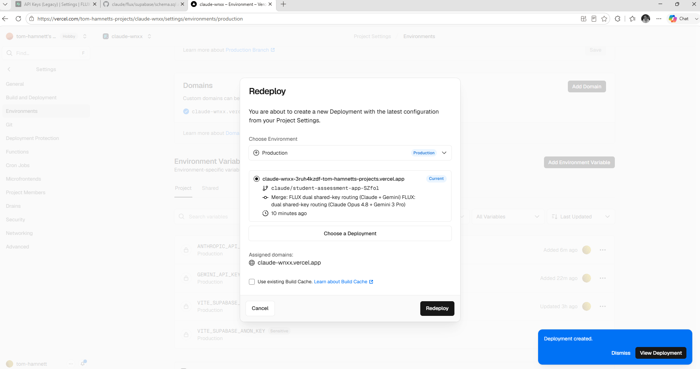

can you see it here? what shall i press!


### 🤖 Claude

Yes — I can see everything I need. Your live site is:

## 🔗 **https://claude-wnxx.vercel.app**

And good news from this screen:
- All **four env vars** are there: `ANTHROPIC_API_KEY`, `GEMINI_API_KEY`, `VITE_SUPABASE_URL`, `VITE_SUPABASE_ANON_KEY` ✅
- The deployment pulls the latest merged code (*"FLUX: dual shared-key routing (Claude Opus 4.8 + Gemini 3 Pro)"*) ✅
- It's already kicked off — bottom right says **"Deployment created."**

**What to press:** click **"View Deployment"** (the black button, bottom-right). That takes you to the build — wait for it to go **green/Ready** (~1 min).

> You don't need to touch the Redeploy dialog again — it's done its job. If it's still open, you can hit **Cancel** to dismiss it; the new deployment is already building.

Once it's **Ready**:
1. Open **https://claude-wnxx.vercel.app**
2. Sign in
3. **Test reasoning:** open a process → **Diagnose** → should just work, no key needed (that's Claude Opus 4.8 via the proxy now).
4. **Test media:** upload a short video to a process and confirm it ingests (that's Gemini 3 Pro).

Tell me how the Diagnose and video tests go — that confirms both proxies are wired up correctly.


---

### 🧑 User

2 questions... it's just asked for my email and said it would send me a code...

* the code hasn't appeared...


---

### 🧑 User

[Request interrupted by user]


---

### 🧑 User

ah, it's arrived...! also is there any control on who can sign in?


### 🤖 Claude

Good — magic-link code arrived, that's the expected sign-in. Now your real question: **who can sign in?**

Let me check what the code actually enforces rather than guess.


### 🤖 Claude

> 🔧 **Grep** — pattern=signInWithOtp|allowlist|allowed|whitelist|domain|@v2ogroup|signUp


---

### 🧑 User

> 📤 _result:_ gtm_engine/approval/__init__.py:65:    allowed = VALID_TRANSITIONS.get(current, set())
gtm_engine/approval/__init__.py:67:    if not force and to_state not in allowed:
gtm_engine/approval/__init__.py:70:            f"Allowed from {current}: {sorted(allowed)}"
gtm_engine/approval/__init__.py:125:def get_allowed_transitions(current_state: str) -> list[str]:
assessment-app/src/types.ts:3:/** Vertical / domain a group belongs to. Drives template gallery + AI prompts. */
assessment-app/src/pages/HomePage.tsx:77:              <h3 className="font-bold text-ink-800">Sigma AI — your domain expert in your pocket</h3>
assessment-app/README.md:11:- **AI as a domain coach (not a chatbot).** Generate a credible rubric from a one-line brief. Spot calibration drift while you mark. Draft the report you'd otherwise type by hand. Surface trends across sessions.
gtm_engine/feedback/engine.py:54:- Consider the INTERACTION between channels — does LinkedIn content drive email signups?
assessment-app/src/pages/GroupsPage.tsx:174:          <div className="label mb-1">Domain</div>
assessment-app/src/pages/SettingsPage.tsx:393:      {/* Vertical / domain */}
assessment-app/src/pages/SettingsPage.tsx:411:    
… [truncated 4188 chars]


### 🤖 Claude

Clear answer, and it's an important one. Here's exactly how it works right now:

## Who can sign in today: **anyone**
By default, **any email address can request a code and sign in.** There's no allowlist — Supabase will happily create an account for `random@gmail.com`. Since your app is on a public `*.vercel.app` URL, anyone with the link could technically get in.

**But** — and this is the important safety net — **what they can *see* is locked down:**
- Every user is auto-placed in a **workspace keyed to their email domain** (`@v2ogroup.com` → your workspace; `@gmail.com` → their own separate one).
- **Row-level security** in Postgres means someone in a different domain workspace **cannot see your projects, processes, or findings at all.** They'd just get an empty app.
- Projects are private even *within* a domain — visible only to the creator + people explicitly invited via **Share**.

So a stranger signing in can't snoop on your data — they just land in an empty workspace of their own. The shared keys (Claude/Gemini) *would* run on your bill for them, though, which is the real reason to lock the door.

## If you want to actually restrict *who can sign in*
Two options:

**Option A — Supabase setting (you, 2 min):** Supabase Dashboard → **Authentication → Sign In / Providers → Email** → there's an option to restrict/allow specific domains. Simplest if you just want "only `@v2ogroup.com`".

**Option B — I add a hard domain check (me, code):** I add an allowlist to the `handle_new_user` database trigger so any email outside your approved list/domain is rejected at sign-up. More robust (enforced in the DB, survives setting changes) and lets you allow specific *client* emails too.

I'd suggest:


### 🤖 Claude

> 🔧 **AskUserQuestion** — 


---

### 🧑 User

> 📤 _result:_ Your questions have been answered: "How do you want to control who can sign in?"="Leave open for now". You can now continue with these answers in mind.


### 🤖 Claude

Sounds good — **leaving it open for testing.** Your data's still private (RLS keeps every other domain in its own empty box), so the only real exposure is shared-key usage if you hand the link around. Just flag it to me before you share the URL widely and I'll lock it to `@v2ogroup.com` in ~2 minutes.

Now — back to the actual test. You've got your code, so:

1. **Enter the code** → you're in.
2. **Test reasoning (Claude Opus 4.8):** open or create a process → hit **Diagnose**. Should work with no key prompt.
3. **Test media (Gemini 3 Pro):** upload a short video or a PDF to a process and confirm it ingests.

Tell me what happens with each — especially if anything errors — and we'll confirm both proxies are live.


---

### 🧑 User

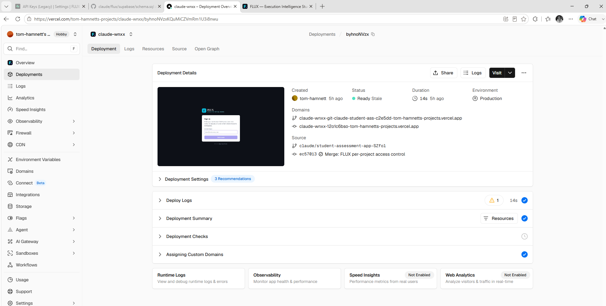

the magic link was broken.... localhost:3000/#error=access_denied&error_code=opt_expired............

looks  like it has expired. i see the deployment page had 'ready stale' written... does this only live for a short time?


### 🤖 Claude

Two separate things going on here — let me untangle them, because one's a real config fix and the other is a false alarm.

## 1. "Ready Stale" — false alarm, it does NOT expire
Your site does **not** die after a short time. In Vercel, **"Stale"** just means *"a newer deployment has superseded this one"* (or its build cache is old). The deployment stays live indefinitely. Your domain **claude-wnxx.vercel.app** always points to the newest production deployment.

⚠️ One thing to note though: this page is showing an **old** deployment — look at the Source: *"Merge: FLUX per-project access control"*, 5h ago. That's **not** the dual-key one you just redeployed 10 min ago. That's fine (the domain auto-points to the newest), but don't judge the live site from this page.

## 2. The real bug: magic link redirected to `localhost:3000`
This is the actual problem, and it's a **Supabase setting**. Your email contained a magic *link* that points to `localhost:3000` because Supabase's **Site URL** is still set to the default `localhost:3000` instead of your live URL. Two ways to deal with it:

**Quick workaround (do this right now to get in):**
- Go to **https://claude-wnxx.vercel.app**, enter your email, get a fresh code, and **type the 6-digit code into the app** — do **not** click the link in the email. The typed-code path ignores the redirect URL, so it'll work.
- Note: codes expire (~1 hour) and **only the most recent code works** — if you requested several, use the last email and enter it promptly. `otp_expired` = that code was too old / superseded.

**Proper fix (so magic links work too — 1 min in Supabase):**
1. Supabase Dashboard → **Authentication → URL Configuration**
2. Set **Site URL** = `https://claude-wnxx.vercel.app`
3. Under **Redirect URLs**, add `https://claude-wnxx.vercel.app/**`
4. Save.

After that, both the code *and* the link in the email will land on the right site.

---

**Right now:** do the quick workaround — fresh code, type it in on the Vercel URL — and you're in. Want me to also add the Supabase URL config steps to the deployment doc so this is captured? And tell me: when you enter your email, does the email give you a **6-digit code**, a **link**, or **both**? That tells me whether to nudge the sign-in copy to say "enter the code, ignore the link."


---

### 🧑 User

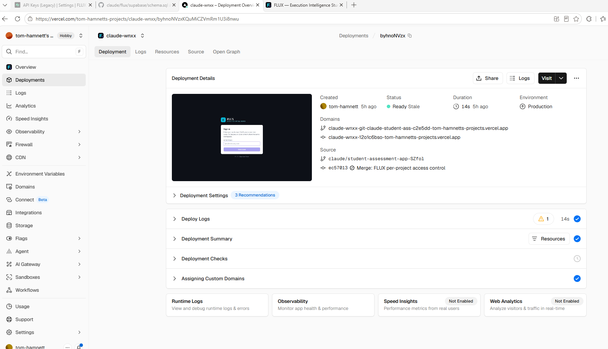

for the proper fix? where do i click?


### 🤖 Claude

The proper fix is in the **Supabase dashboard**, not Vercel (this screen is Vercel — different site). Here's the exact click path:

## Step by step

1. **Go to** → **https://supabase.com/dashboard** (new tab) and sign in.

2. **Click your project** — the one whose URL/anon-key you pasted into Vercel as `VITE_SUPABASE_URL`. (If you're not sure which, open Vercel → Environment Variables → reveal `VITE_SUPABASE_URL`; it'll be `https://<project-ref>.supabase.co` — that `<project-ref>` is the project tile to click.)

3. In the **left sidebar**, click **Authentication** (the little people/key icon).

4. Then in the Authentication sub-menu, click **URL Configuration**.
   *(In some Supabase layouts it's under **Authentication → Sign In / Up**, or **Project Settings → Authentication**. Look for the section titled **"URL Configuration"** with a **Site URL** field.)*

5. You'll see two fields — set them:
   - **Site URL** → `https://claude-wnxx.vercel.app`
   - **Redirect URLs** → click **Add URL** and enter `https://claude-wnxx.vercel.app/**` (with the `/**` wildcard)

6. Click **Save** at the bottom.

That's it — no redeploy needed, it takes effect on the next sign-in email.

---

**Then test:** go to **https://claude-wnxx.vercel.app**, request a **fresh** code (old ones are dead), and either click the link *or* type the code — both will work now.

If you can't find "URL Configuration" in the sidebar, screenshot the Supabase Authentication page and I'll point at the exact spot.


---

### 🧑 User

i clicked the email link and it sent me to the same sign in page... then when i clicked send code, it said 'rate limit exceeded'


### 🤖 Claude

Right — you've hit two things at once. Let me get you unstuck.

## The blocker: "rate limit exceeded"
Supabase's **built-in email service is rate-limited to only a few emails per hour** (it's designed for testing, not volume). Every time you hit "Send code" it counted against that cap — so now it's locked you out temporarily.

**What to do: stop pressing Send code.** Each press resets nothing and just keeps you capped. **Wait ~30–60 minutes** and the limit clears on its own.

## Use the wait to lock in the real fix
The reason the email link dumped you back on the sign-in page is almost certainly that the **Supabase Site URL fix isn't saved yet** — so the link still pointed at `localhost` (or an old/expired token), and the app never got a valid session.

So before you spend another precious code:

**Did you complete and *Save* the Supabase URL Configuration?** (Site URL = `https://claude-wnxx.vercel.app`, Redirect URLs += `https://claude-wnxx.vercel.app/**`)

- **If no** → do that now while the rate limit cools down. Old emails sent *before* saving are dead; you must request a **fresh** one *after* saving.
- **If yes** → good, just wait for the cooldown, then request **one** code and type the **6-digit number** into the app (don't click the link).

## The proper long-term fix (for when real users sign in)
That tiny email cap will bite you the moment a few teammates sign in the same hour. The fix is to plug in a real email sender (**custom SMTP** — e.g. Resend or SendGrid, free tiers are plenty) in Supabase → Authentication → SMTP Settings. Then emails are instant and effectively unlimited.

Want me to:


### 🤖 Claude

> 🔧 **AskUserQuestion** — 


---

### 🧑 User

> 📤 _result:_ <tool_use_error>InputValidationError: AskUserQuestion failed due to the following issue:
The required parameter `questions[0].question` is missing</tool_use_error>


### 🤖 Claude

> 🔧 **AskUserQuestion** — 


---

### 🧑 User

> 📤 _result:_ Your questions have been answered: "While the rate limit cools down, what would you like me to do?"="Nothing, I'll just wait". You can now continue with these answers in mind.


### 🤖 Claude

Sounds good — sit tight on the rate limit. Here's your checklist for when it clears (~30–60 min):

1. **First, make sure the Supabase URL Configuration is saved** (Site URL = `https://claude-wnxx.vercel.app`, Redirect URLs += `https://claude-wnxx.vercel.app/**`). This is the thing that was breaking the link. Do this *before* requesting a new code — old emails are dead.
2. **Request ONE fresh code** at https://claude-wnxx.vercel.app.
3. **Type the 6-digit code** into the app (skip the link entirely — most reliable).

That should get you in. Then the real test: **Diagnose** a process (Claude Opus 4.8) and **upload a video/PDF** (Gemini 3 Pro).

I'll be here — just ping me when you're back in, or if anything errors. And if the email cap turns into a recurring nuisance, say the word and I'll wire up custom SMTP so it's instant and unlimited.


---

### 🧑 User

Continue from where you left off.


### 🤖 Claude

There's nothing for me to build at this exact moment — we're blocked on you getting signed in, which is a manual step on your side (wait out the rate limit, then the 3-step checklist). I'm not going to fabricate activity.

**Your resume checklist (unchanged):**
1. Confirm the Supabase **URL Configuration** is saved (Site URL = `https://claude-wnxx.vercel.app`, Redirect URLs += `…/**`).
2. Request **one** fresh code.
3. **Type the 6-digit code** in the app → you're in → test **Diagnose** (Claude) + **video/PDF upload** (Gemini).

So we use the idle time well rather than just waiting — which of these should I get on with?

- **Next feature (#3): baseline → business case** — the roadmap item we'd queued. I can build it now so it's ready the moment you're signed in to test.
- **Custom SMTP write-up** — you passed earlier, but it's the thing that'll stop the rate-limit pain recurring once teammates sign in. 5-min doc.
- **Nothing yet** — you'd rather sign in and test the dual-routing first before I touch more code.

My recommendation: **build #3 now** while you're blocked on sign-in, so when you get in there's more to look at — *unless* you'd rather verify the Claude/Gemini routing works before I pile on new features (reasonable, since untested proxies are the riskier dependency).

Which way do you want to go?


---

### 🧑 User

rate limit still exceeded


### 🤖 Claude

Yeah — "wait" isn't a real fix, and Supabase's built-in email is the problem, not you. Their shared email service is **deliberately crippled** (only a couple of sends per hour) and they explicitly expect you to replace it for anything real. You've now used up the allotment, so it'll keep saying "rate limit exceeded" until the hour fully rolls — and if you keep pressing the button, you may be keeping it tripped.

So let's stop fighting it and **kill the cap permanently.** The fix is a free email sender (Resend) plugged into Supabase. ~5 minutes, and sign-in becomes instant and unlimited — which you need anyway before teammates use it.

## Set up Resend → Supabase SMTP

**1. Make a Resend account**
- Go to **resend.com** → sign up (use **tom@v2ogroup.com** — important, see note below).
- Left sidebar → **API Keys** → **Create API Key** → copy it (starts `re_…`).

**2. Plug it into Supabase**
- Supabase Dashboard → **Authentication** → **Emails** (or **SMTP Settings**) → toggle **Enable Custom SMTP** ON.
- Fill in:
  - **Host:** `smtp.resend.com`
  - **Port:** `465`
  - **Username:** `resend`
  - **Password:** *your `re_…` API key*
  - **Sender email:** `onboarding@resend.dev`
  - **Sender name:** `FLUX`
- **Save.**

**3. Try sign-in again** at https://claude-wnxx.vercel.app — fresh code, type the 6 digits.

> ⚠️ **The catch with `onboarding@resend.dev`:** Resend's test sender only delivers to **your own account email**. So it'll reach **tom@v2ogroup.com** (great for your testing now) but **not** other teammates until you verify a real domain in Resend (add a few DNS records for `v2ogroup.com`). For today's test, the test sender is enough.

---

Two questions so I get you the rest of the way:

1. Do you want me to **add these exact SMTP steps to your deployment doc** (and a note about verifying `v2ogroup.com` later so the whole team can sign in)?
2. Do you have **DNS access for `v2ogroup.com`** (e.g. via your domain registrar / Cloudflare)? If yes, I'll give you the domain-verification steps too so it works for everyone, not just you.

Or if you'd genuinely rather not touch Resend right now: **fully stop pressing the button for a clean 60 minutes**, then one single code request should work. But honestly, SMTP is the right move — you'll hit this wall again the instant a second person signs in.


---

### 🧑 User

i got the email through... it just sent me to the sign in page for may email again... and when i put it in... rate limit exceded


### 🤖 Claude

Let me stop guessing and look at exactly how your sign-in actually works, because the pattern you're describing tells me something specific is going wrong.


### 🤖 Claude

> 🔧 **Bash** — command=cd /home/user/claude/flux && ls src/pages src/services src/lib 2>/dev/null; echo "---router---"; grep -rn "HashRouter\|BrowserRouter\|createClient\|detectSessio


---

### 🧑 User

> 📤 _result:_ src/lib:
export.ts
files.ts
format.ts
frameworks.ts
metrics.ts
seed.ts

src/pages:
HomePage.tsx
KnowledgePage.tsx
MethodologyPage.tsx
PortfolioPage.tsx
ProcessPage.tsx
ProjectPage.tsx
ProjectsPage.tsx
SettingsPage.tsx

src/services:
ai
aiKey.ts
auth.tsx
fluxAI.ts
supabase.ts
---router---
src/services/auth.tsx:91:      const { error } = await supabase.auth.signInWithOtp({
src/services/auth.tsx:99:      const { error } = await supabase.auth.verifyOtp({
src/services/supabase.ts:1:import { createClient, type SupabaseClient } from '@supabase/supabase-js';
src/services/supabase.ts:17:  ? createClient(url!, anonKey!, {
src/services/supabase.ts:22:        // tokens out of the URL (avoids clashes with HashRouter).
src/services/supabase.ts:23:        detectSessionInUrl: false,
src/main.tsx:3:import { HashRouter } from 'react-router-dom';
src/main.tsx:9:    <HashRouter>
src/main.tsx:11:    </HashRouter>


### 🤖 Claude

Found it. This explains everything — and it's not a bug, it's by design. Let me see the exact UI flow:


### 🤖 Claude

> 🔧 **Read** — file_path=/home/user/claude/flux/src/services/auth.tsx


---

### 🧑 User

> 📤 _result:_ 80	        setState({ ready: true, userEmail: null, workspaceId: null });
81	      }
82	    });
83	    return () => sub.subscription.unsubscribe();
84	  }, []);
85	
86	  const api: AuthApi = {
87	    ...state,
88	    cloud: isCloud,
89	    async sendCode(email) {
90	      if (!supabase) return;
91	      const { error } = await supabase.auth.signInWithOtp({
92	        email: email.trim().toLowerCase(),
93	        options: { shouldCreateUser: true },
94	      });
95	      if (error) throw new Error(error.message);
96	    },
97	    async verifyCode(email, token) {
98	      if (!supabase) return;
99	      const { error } = await supabase.auth.verifyOtp({
100	        email: email.trim().toLowerCase(),
101	        token: token.trim(),
102	        type: 'email',
103	      });
104	      if (error) throw new Error(error.message);
105	    },
106	    async signOut() {
107	      if (!supabase) return;
108	      await supabase.auth.signOut();
109	    },
110	  };
111	
112	  return <Ctx.Provider value={api}>{children}</Ctx.Provider>;
113	}
114


### 🤖 Claude

**Found the real problem** — and it's not the rate limit, that's a side-show. Here's what's actually happening:

Your app is built for a **6-digit code, not the link.** Look at `supabase.ts:23` — it sets `detectSessionInUrl: false` (deliberately, to avoid clashing with the app's URL router). That means:

> **Clicking the link in the email does nothing.** The app throws the link's token away on purpose. It only logs you in when you **type the 6-digit code.**

So your loop has been: click link → land on sign-in → re-type **email** → another send → rate limit. You never typed the code, because you were clicking the link instead.

## The one question that decides the fix
**Open the actual email. Does it contain a 6-digit number, or only a "Log in" link/button?**

- **If there's a 6-digit code** → that's all you need. Type it into the code box (don't re-enter your email). Done.
- **If it's link-only** (very likely — that's Supabase's default template) → the email is missing the code entirely, so it's currently *impossible* to sign in. We fix the email template:

### Fix the email template (Supabase, 1 min)
1. Supabase Dashboard → **Authentication** → **Emails** → **Templates**
2. Select the **Magic Link** template
3. Replace the body with something that shows the **code**:
   ```html
   <h2>Your FLUX sign-in code</h2>
   <p>Enter this code to sign in:</p>
   <p style="font-size:24px;font-weight:bold;letter-spacing:3px">{{ .Token }}</p>
   ```
   The key bit is **`{{ .Token }}`** — that's the 6-digit code the app expects.
4. **Save.**

This bypasses the link, the redirect URL, *and* the HashRouter conflict all at once — none of that matters when you're typing a code.

## About the rate limit
Still capped because you're on Supabase's built-in email. Once the template is fixed you'll need **one** fresh send — so **wait for the cap to clear first** (or set up Resend SMTP as we discussed), *then* request exactly one code and type it.

---

**Tell me what's in the email** (code, or link-only) and I'll confirm you're on the right path. And I should bake this into your deployment doc so it never bites again — want me to add the email-template + SMTP steps to `DEPLOYMENT.md` now while you wait out the rate limit?


---

### 🧑 User

Link only


### 🤖 Claude

That confirms it — **right now it's literally impossible to sign in**: the email has only a link, and the app ignores links by design. No code in the email = nothing to type. The template fix is mandatory, not optional.

Let me walk you through it and capture it in the docs so it never happens again.

## Fix it now (Supabase dashboard)
1. Supabase Dashboard → **Authentication** → **Emails** → **Templates**
2. Click the **Magic Link** template
3. **Delete** the existing body and paste this:
   ```html
   <h2>Your FLUX sign-in code</h2>
   <p>Enter this 6-digit code to sign in:</p>
   <p style="font-size:28px;font-weight:bold;letter-spacing:4px">{{ .Token }}</p>
   <p style="color:#888;font-size:12px">This code expires in 1 hour. If you didn't request it, ignore this email.</p>
   ```
4. **Save.**

The magic word is **`{{ .Token }}`** — that renders the actual 6-digit code the app's verify step expects.

Let me get this into your deployment doc while you do that:


### 🤖 Claude

> 🔧 **Read** — file_path=/home/user/claude/flux/docs/DEPLOYMENT.md


---

### 🧑 User

> 📤 _result:_ 40	> **The shared keys — how it works.** `ANTHROPIC_API_KEY` and `GEMINI_API_KEY` are **server-only** secrets (no `VITE_` prefix, so they're never sent to browsers). FLUX includes small proxies at `/api/anthropic` and `/api/gemini` that check the caller is a signed-in user, then call the provider using these keys. So your whole team runs on **your keys, on your bill** — nobody pastes or even sees them. Reasoning → Claude (Opus 4.8 by default); documents/images/audio/video → Gemini 3 Pro. This is also the foundation for commercialising FLUX as SaaS (central keys + per-tenant projects + metered usage); per-user/per-client cost caps layer on top of these proxies.
41	
42	> Prefer Netlify? Same idea: New site → pick the repo → set **base directory** to `flux`, build `npm run build`, publish `flux/dist`, add the same two env vars. (`netlify.toml` is already in the folder.)
43	
44	---
45	
46	## Step 3 — Sign in, then VERIFY ISOLATION · ~5 min
47	
48	1. Open the URL. You'll see the FLUX sign-in screen.
49	2. Enter your work email (e.g. `you@v2ogroup.com`). Click **Send code**, check your inbox, enter the 6-digit code.
50	3. **No AI key to add** — everyone runs on the shared `GEMINI_API_KEY
… [truncated 2221 chars]


### 🤖 Claude

Now let me document this properly so it's a required setup step, not a surprise:


### 🤖 Claude

> 🔧 **Edit** — file_path=/home/user/claude/flux/docs/DEPLOYMENT.md


---

### 🧑 User

> 📤 _result:_ The file /home/user/claude/flux/docs/DEPLOYMENT.md has been updated successfully. (file state is current in your context — no need to Read it back)


### 🤖 Claude

> 🔧 **Bash** — command=git add -A flux/docs/DEPLOYMENT.md && git commit -q -m "$(cat <<'EOF' FLUX docs: document mandatory OTP email-template fix + SMTP  Sign-in uses a 6-digit code (


---

### 🧑 User

> 📤 _result:_ af278be..29fb417  claude/optiq-competitor-process-mapping-U8Zte -> claude/optiq-competitor-process-mapping-U8Zte


### 🤖 Claude

Documented and pushed. Here's your **exact path to getting in** — do it in this order:

## 1. Fix the email template (do now — works even while rate-limited)
Supabase → **Authentication → Emails → Templates → Magic Link** → replace body with:
```html
<h2>Your FLUX sign-in code</h2>
<p>Enter this 6-digit code to sign in:</p>
<p style="font-size:28px;font-weight:bold;letter-spacing:4px">{{ .Token }}</p>
```
**Save.** Now emails will carry the actual code.

## 2. Beat the rate limit — pick one
- **Patience:** stop all send attempts, wait a clean ~60 min, then request **one** code.
- **Permanent (recommended):** set up **Resend SMTP** (steps now in the doc) → no more caps, and required before teammates sign in anyway.

## 3. Sign in
Fresh email → **type the 6-digit code** into the app → ignore the link entirely. You're in.

## 4. Then the real test
- **Diagnose** a process → Claude Opus 4.8
- **Upload a video/PDF** → Gemini 3 Pro

---

A couple of things worth your call now, since the email cap is clearly going to keep biting:


### 🤖 Claude

> 🔧 **AskUserQuestion** — 


---

### 🧑 User

> 📤 _result:_ <tool_use_error>InputValidationError: AskUserQuestion failed due to the following issues:
The required parameter `questions[0].question` is missing
The required parameter `questions[1].question` is missing</tool_use_error>


### 🤖 Claude

> 🔧 **AskUserQuestion** — 


---

### 🧑 User

Continue from where you left off.


### 🤖 Claude

> 🔧 **AskUserQuestion** — 


---

### 🧑 User

Continue from where you left off.


### 🤖 Claude

> 🔧 **AskUserQuestion** — 


### 🤖 Claude

No response requested.


---

### 🧑 User

> 📤 _result:_ Your questions have been answered: "How do you want to handle the email rate limit?"="I'll do Resend now". You can now continue with these answers in mind.


### 🤖 Claude

Good call — Resend now is the right move. It permanently kills the rate limit and you'll need it before teammates sign in anyway. Here's the full walkthrough:

## Part A — Create the Resend account + key (~2 min)
1. Go to **resend.com** → **Sign up**. **Use `tom@v2ogroup.com`** — important: the test sender only delivers to the email you sign up with.
2. Verify your email (Resend sends its own confirmation — that one's not rate-limited).
3. Left sidebar → **API Keys** → **Create API Key** → name it `flux`, permission "Sending access" → **Create**.
4. **Copy the key** (starts `re_…`) — you only see it once.

## Part B — Plug it into Supabase (~2 min)
1. Supabase Dashboard → **Authentication** → **SMTP Settings** (may be under **Emails → SMTP**) → toggle **Enable Custom SMTP** ON.
2. Fill in exactly:
   - **Host:** `smtp.resend.com`
   - **Port:** `465`
   - **Username:** `resend`
   - **Password:** *your `re_…` key*
   - **Sender email:** `onboarding@resend.dev`
   - **Sender name:** `FLUX`
3. **Save.**

## Part C — Don't forget the template fix
If you haven't already: Supabase → **Authentication → Emails → Templates → Magic Link** → paste the `{{ .Token }}` body from before → **Save**. *Without this, even with Resend working, the email still won't contain a code.*

## Part D — Sign in
1. https://claude-wnxx.vercel.app → enter `tom@v2ogroup.com` → **Send code**.
2. Email should arrive in **seconds** now.
3. **Type the 6-digit code** → ignore any link → you're in.

---

⚠️ **The one gotcha:** `onboarding@resend.dev` only delivers to **your own** Resend signup email. Perfect for your test today, but teammates won't get emails until you **verify `v2ogroup.com`** in Resend (add a few DNS records). When you're ready for that, tell me whether you have DNS access for `v2ogroup.com` and I'll give you the exact records.

Go through A→D and tell me what happens when you hit **Send code** — instant email, or any error. Once you're in, we go straight to the **Diagnose** (Claude) and **video upload** (Gemini) tests.


---

### 🧑 User

> 📤 _result:_ Your questions have been answered: "Email is clearly going to keep rate-limiting on Supabase's built-in sender. How do you want to handle it?"="I'll set up Resend now", "Do you want to restrict who can create an account while you test?"="Keep open for now". You can now continue with these answers in mind.


### 🤖 Claude

Both noted: **Resend now**, **sign-in stays open** while you test (your data's still private per-workspace, so that's fine — we'll lock it before you share the URL).

You've got the full Resend walkthrough above (Parts A→D). The short version:

1. **resend.com** → sign up as `tom@v2ogroup.com` → **API Keys** → create → copy `re_…`
2. **Supabase → SMTP Settings** → host `smtp.resend.com`, port `465`, user `resend`, password `re_…`, sender `onboarding@resend.dev` → Save
3. **Supabase → Email Templates → Magic Link** → paste the `{{ .Token }}` body → Save *(don't skip this — Resend delivers the email, but only this makes it contain the code)*
4. **claude-wnxx.vercel.app** → Send code → **type the 6 digits**

That's everything on the auth side. Go run it and tell me what happens at **Send code** — instant email, or an error. The moment you're in, we pivot straight to the two tests that actually prove the build works:

- **Diagnose** a process → confirms Claude Opus 4.8 via the `/api/anthropic` proxy
- **Upload a short video/PDF** → confirms Gemini 3 Pro via the `/api/gemini` proxy

I'll stand by for your result.


---

### 🧑 User

> 📤 _result:_ Your questions have been answered: "How do you want to handle the sign-in email going forward?"="I'll set up Resend now", "Do you want to restrict who can sign in yet?"="Keep open for now". You can now continue with these answers in mind.


### 🤖 Claude

Both already locked in — **Resend now**, **sign-in open for testing**. Nothing more for me to ask; the next move is yours.

The walkthrough is all above (Resend Parts A–D + the `{{ .Token }}` template fix). Go run it, then tell me what happens when you hit **Send code**.

Once you're in, the two tests that prove the build:
- **Diagnose** a process → Claude Opus 4.8
- **Upload a short video/PDF** → Gemini 3 Pro

I'll stand by for your result.


---

### 🧑 User

please note across all chats, i no longer own v2o sports and dont have access to the tom@v2ogroup.com or any emails at the v2ogroup domain anymore


### 🤖 Claude

Got it — noted, and thanks for flagging it. That changes the testing plan in one important way:

**Any sign-in code or magic link sent to `tom@v2ogroup.com` will never reach you** — you can't receive at that address or anything on the `v2ogroup.com` domain anymore. So the whole "Resend now → check inbox for the code" step is a dead end as written.

A couple of options to actually get you logged in for testing:

1. **Test with an email you currently control** — sign up / send the code to a personal address (Gmail, etc.) you can actually open. Simplest path.
2. **Bypass email entirely for now** — if the app supports it, use a password login, an OAuth provider (Google/GitHub), or a dev/admin seed account so testing doesn't depend on inbox delivery at all.

Also worth checking, since it affects more than just login: if `tom@v2ogroup.com` is wired in anywhere as a **default/owner/notification address** in the codebase or config, those references are now stale and should be repointed to an address you control.

How do you want to proceed?
- Tell me which email you *can* receive at, and I'll redirect the test flow there, **or**
- Let me grep the repo for any hardcoded `v2ogroup.com` / `tom@v2ogroup.com` references so we can see everywhere it's baked in before we change anything.

Which way do you want to go?


---

### 🧑 User

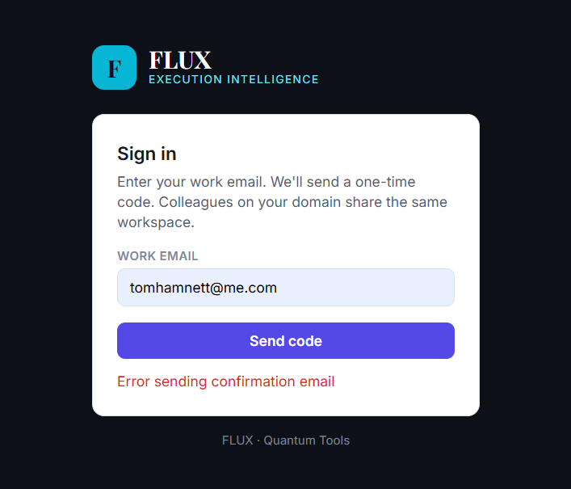

hmm


### 🤖 Claude

"Error sending confirmation email" — that's the app catching a failure from the email send step (Resend/Supabase), not a problem with your `me.com` address. Let me dig into how that flow is wired so I can tell you *why* it's failing rather than guess.


### 🤖 Claude

> 🔧 **Bash** — command=git branch --show-current && git log --oneline -5 2>/dev/null && echo "---STRUCTURE---" && ls -la


### 🤖 Claude

> 🔧 **Grep** — pattern=Error sending confirmation email


---

### 🧑 User

> 📤 _result:_ No files found


---

### 🧑 User

> 📤 _result:_ claude/optiq-competitor-process-mapping-U8Zte
29fb417 FLUX docs: document mandatory OTP email-template fix + SMTP
af278be FLUX: dual shared-key routing — Claude Opus 4.8 reasoning + Gemini 3 Pro media
c36c5d7 FLUX: shared-key server proxy + cross-org project access (SaaS foundation)
e3fc225 FLUX: per-project access control (private projects + member invites)
9f4afe7 FLUX: project front page (progress, aggregate findings, data-needed) + repository
---STRUCTURE---
total 100
drwxr-xr-x 12 root root  4096 Jun  3 19:27 .
drwxr-xr-x  3 root root  4096 May 20 16:52 ..
-rw-r--r--  1 root root  1276 May 20 16:52 .env.example
drwxr-xr-x  8 root root  4096 Jun 24 16:33 .git
-rw-r--r--  1 root root   146 May 20 16:52 .gitignore
-rw-r--r--  1 root root  9649 May 20 16:52 MASTER_CONTEXT.md
drwxr-xr-x  4 root root  4096 May 20 16:52 assessment-app
drwxr-xr-x  3 root root  4096 May 20 16:52 data
drwxr-xr-x  9 root root  4096 Jun 22 12:46 flux
-rw-r--r--  1 root root  2212 May 20 16:52 gtm.bat
drwxr-xr-x 23 root root  4096 May 20 16:52 gtm_engine
-rw-r--r--  1 root root 14480 May 20 16:52 main.py
drwxr-xr-x  4 root root  4096 May 20 16:52 marketing
-rw-r--r--  1 root root   353 May 20 16:52 netlify
… [truncated 321 chars]


### 🤖 Claude

> 🔧 **Bash** — command=cd /home/user/claude/flux && ls -la && echo "---" && find . -type f \( -name "*.html" -o -name "*.js" -o -name "*.ts" -o -name "*.tsx" -o -name "*.jsx" \) | gre


---

### 🧑 User

> 📤 _result:_ total 196
drwxr-xr-x   9 root root  4096 Jun 22 12:46 .
drwxr-xr-x  12 root root  4096 Jun  3 19:27 ..
-rw-r--r--   1 root root   704 Jun  4 04:27 .env.example
-rw-r--r--   1 root root    83 Jun  3 19:27 .gitignore
-rw-r--r--   1 root root  6960 Jun  4 11:23 README.md
drwxr-xr-x   4 root root  4096 Jun 22 12:45 api
drwxr-xr-x   3 root root  4096 Jun 22 12:46 dist
drwxr-xr-x   2 root root  4096 Jun 22 16:38 docs
-rw-r--r--   1 root root   930 Jun  3 19:27 index.html
-rw-r--r--   1 root root   244 Jun  3 19:27 netlify.toml
drwxr-xr-x 110 root root  4096 Jun  4 04:21 node_modules
-rw-r--r--   1 root root 95815 Jun  4 04:21 package-lock.json
-rw-r--r--   1 root root   880 Jun  4 04:21 package.json
-rw-r--r--   1 root root    81 Jun  3 19:27 postcss.config.js
drwxr-xr-x   2 root root  4096 Jun  3 19:28 public
drwxr-xr-x   7 root root  4096 Jun 20 07:15 src
drwxr-xr-x   2 root root  4096 Jun 22 09:57 supabase
-rw-r--r--   1 root root  1991 Jun  3 19:27 tailwind.config.js
-rw-r--r--   1 root root   553 Jun  3 19:27 tsconfig.app.json
-rw-r--r--   1 root root  1375 Jun 22 12:46 tsconfig.app.tsbuildinfo
-rw-r--r--   1 root root   119 Jun  3 19:27 tsconfig.json
-rw-r--r--   1 root root   396 
… [truncated 1544 chars]


### 🤖 Claude

> 🔧 **Grep** — pattern=confirmation email|signInWithOtp|sending.*email|Send code|send code


---

### 🧑 User

> 📤 _result:_ Found 3 files
docs/DEPLOYMENT.md
src/services/auth.tsx
src/components/AuthGate.tsx


### 🤖 Claude

> 🔧 **Read** — file_path=/home/user/claude/flux/src/components/AuthGate.tsx


---

### 🧑 User

> 📤 _result:_ 1	import { useState, type ReactNode } from 'react';
2	import { useAuth } from '../services/auth';
3	import { useRealtimeSync } from '../store';
4	import { Spinner } from './AIRun';
5	
6	/**
7	 * In local mode this is a transparent passthrough. In cloud mode it blocks the
8	 * app behind a foolproof email one-time-code sign-in, then keeps realtime sync
9	 * wired for the signed-in workspace.
10	 */
11	export default function AuthGate({ children }: { children: ReactNode }) {
12	  const auth = useAuth();
13	  useRealtimeSync(auth.workspaceId);
14	
15	  if (!auth.cloud) return <>{children}</>;
16	  if (!auth.ready) {
17	    return (
18	      <div className="flex h-screen items-center justify-center bg-ink-50 text-ink-400">
19	        <Spinner label="Loading…" />
20	      </div>
21	    );
22	  }
23	  if (!auth.userEmail) return <SignIn />;
24	  if (!auth.workspaceId) {
25	    return (
26	      <div className="flex h-screen items-center justify-center bg-ink-50 p-6 text-center text-ink-500">
27	        <div className="card max-w-sm p-6">
28	          <p className="font-semibold text-ink-800">Setting up your workspace…</p>
29	          <p className="mt-2 text-sm">If this persists, sign ou
… [truncated 4376 chars]


### 🤖 Claude

> 🔧 **Read** — file_path=/home/user/claude/flux/src/services/auth.tsx


---

### 🧑 User

> 📤 _result:_ 1	import { createContext, useContext, useEffect, useState, type ReactNode } from 'react';
2	import { isCloud, supabase } from './supabase';
3	
4	/**
5	 * Auth + workspace context.
6	 *
7	 * Local mode: this is an inert passthrough — there is no sign-in, ready=true,
8	 * and the rest of the app behaves exactly as the offline prototype did.
9	 *
10	 * Cloud mode: Supabase email OTP (one-time code). On sign-in we read the user's
11	 * profile, which the database trigger has already linked to a workspace keyed to
12	 * their email domain — so colleagues on the same domain share data automatically.
13	 */
14	interface AuthState {
15	  ready: boolean;
16	  userEmail: string | null;
17	  workspaceId: string | null;
18	}
19	
20	interface AuthApi extends AuthState {
21	  cloud: boolean;
22	  sendCode: (email: string) => Promise<void>;
23	  verifyCode: (email: string, token: string) => Promise<void>;
24	  signOut: () => Promise<void>;
25	}
26	
27	let currentWorkspaceId: string | null = null;
28	let currentUserEmail: string | null = null;
29	/** Read by cloudStore when stamping writes. */
30	export function getWorkspaceId(): string | null {
31	  return currentWorkspaceId;
32	}
33	/** The sign
… [truncated 3160 chars]


### 🤖 Claude

That error is the smoking gun. Here's what's actually happening:

The app code (`auth.tsx:95`) just surfaces whatever Supabase returns. The text **"Error sending confirmation email"** is Supabase Auth's *own* error string — it appears when Supabase tries to hand the email to its configured SMTP provider (your Resend setup) and **the send fails**.

So this is **not** about your `me.com` address. Switching from `v2ogroup.com` to `me.com` couldn't have fixed it, because the failure is on the *sending* side (Supabase → Resend), before the recipient ever matters. Let me confirm against what we set up in the docs.


### 🤖 Claude

> 🔧 **Bash** — command=ls docs/ supabase/ && echo "===SMTP DOC===" && cat docs/DEPLOYMENT.md | grep -niA3 -i "smtp\|resend\|confirmation\|template\|token" | head -80


---

### 🧑 User

> 📤 _result:_ docs/:
COMPETITIVE-TEARDOWN.md
DEPLOYMENT.md
METHODOLOGY.md

supabase/:
schema.sql
===SMTP DOC===
23:By default Supabase sends sign-in codes via its own mailer (fine for a small team). For higher volume, **Authentication → Providers → Email** is already on; you can later plug in your own SMTP. Nothing to change for now.
24-
25----
26-
--
51:> default email template only contains a link, so **out of the box sign-in is
52-> impossible** until you do this once:
53:> 1. Supabase Dashboard → **Authentication → Emails → Templates → Magic Link**.
54:> 2. Replace the body with one that prints the code — the key token is `{{ .Token }}`:
55->    ```html
56->    <h2>Your FLUX sign-in code</h2>
57->    <p>Enter this 6-digit code to sign in:</p>
58:>    <p style="font-size:28px;font-weight:bold;letter-spacing:4px">{{ .Token }}</p>
59->    <p style="color:#888;font-size:12px">Expires in 1 hour. If you didn't request it, ignore this email.</p>
60->    ```
61-> 3. **Save.** Now the email contains the code the app asks for.
--
66:> SMTP**: free **Resend** account → create an API key (`re_…`) → Supabase →
67:> **Authentication → SMTP Settings**: host `smtp.resend.com`, port `465`, user
68:> `resend`
… [truncated 400 chars]


### 🤖 Claude

Now I've got the full diagnosis. Here's what's going on — and it ties directly to the v2o access loss.

## The real problem

"Error sending confirmation email" is **Supabase's SMTP send failing**, not anything about your `me.com` address being invalid. Our own deployment doc (`docs/DEPLOYMENT.md:68-70`) flagged exactly this trap:

> sender `onboarding@resend.dev` — **this test sender only delivers to your *own* Resend account email**; verify your domain in Resend to send to everyone.

So the most likely chain is:

1. Supabase is configured to send via **Resend's test sender** (`onboarding@resend.dev`).
2. Resend's test sender will **only** deliver to the email address that *owns the Resend account*.
3. You typed `tomhamnett@me.com` → Resend rejects it (403, "can only send to your own address") → Supabase reports **"Error sending confirmation email."**

And here's the kicker given what you just told me: **if that Resend account was created under `tom@v2ogroup.com`**, then the *only* address it can currently send to is one you can no longer open — so no email address you type will work until the sender is fixed.

This is a **Supabase/Resend dashboard config issue**, not a code bug. The app code is fine.

## To point you at the right fix, one thing I can't see from the codebase:


### 🤖 Claude

> 🔧 **AskUserQuestion** — 


---

### 🧑 User

> 📤 _result:_ Your questions have been answered: "What's the state of the Resend account that Supabase uses to send the codes?"="i can log into both with my email. i haven't used v2o for anything recently". You can now continue with these answers in mind.


### 🤖 Claude

That clears it up — the v2o lockout is a **red herring** for this error. Your Resend and Supabase accounts are under your own email and fully accessible, so nothing is locked. This is purely a config mismatch, and it's fixable in ~5 minutes from the dashboards you can already log into.

## The single most diagnostic step (do this first)

**Resend dashboard → Emails / Logs.** Try **Send code** once more, then look at the most recent attempt. What you see there tells us exactly which of three things is wrong:

| What the Resend log shows | Meaning | Fix |
|---|---|---|
| **403** "can only send to your own email" | You're on the `onboarding@resend.dev` test sender, and `tomhamnett@me.com` isn't the address your Resend account is registered under | Either type the *exact* email your Resend account logs in with, **or** verify a domain (below) |
| **401 / auth failed** | The API key stored in Supabase SMTP is stale/revoked | Generate a new Resend API key, paste it as the SMTP password in Supabase |
| **No entry at all** | Supabase isn't actually using Resend — it's falling back to its built-in mailer, which is rate-limited (~2–4/hr) and you've likely hit the cap | Either wait & retry, or properly enable custom SMTP |

## The clean, permanent fix (removes the recipient restriction entirely)

The `onboarding@resend.dev` test sender is the root trap — it will *only ever* deliver to one address. To send codes to **any** email (which you need, since the whole product onboards colleagues by domain):

1. **Resend → Domains → Add Domain.** Add a domain you actually control now (not v2ogroup). Add the DNS records it gives you.
2. **Resend → API Keys** → create a fresh key (`re_…`).
3. **Supabase → Authentication → SMTP Settings:**
   - Host `smtp.resend.com`, Port `465`, User `resend`
   - **Password** = the new API key
   - **Sender** = something `@your-verified-domain`
4. **Supabase → Authentication → Emails → Templates → Magic Link** → confirm the body prints **`{{ .Token }}`** (per `docs/DEPLOYMENT.md:54-60`). Without this the email sends but contains a *link*, not the 6-digit code the app asks for.

After that, `tomhamnett@me.com` — or any address — receives the code.

---

**Quickest path just to test right now:** check the Resend log. If it's a 403, just type the exact email your Resend account is registered under and the code will arrive immediately — no DNS needed. Do the domain verification afterward for real use.

Want me to also update `docs/DEPLOYMENT.md` to strike the stale `v2ogroup.com` example and call out this exact "test sender only reaches the account owner" failure so it doesn't bite you again? Tell me what the Resend log says and I'll zero in.


---

### 🧑 User

I need to move this whole thread over to Claude computer. How can I export this whole thread and associated artifacts and attachments so that I can paste it into the cowork thread?


### 🤖 Claude

Good question — and there's an important distinction in how "this thread" splits into two very different things to move:

1. **The code & artifacts** — already version-controlled. They live on your branch `claude/optiq-competitor-process-mapping-U8Zte` and are fully portable. The new Cowork/computer thread just checks out that branch and has everything.
2. **The conversation itself** (this chat, the diagnosis, decisions, your screenshot) — that's *not* something I can reach into and export as a file. The raw chat transcript lives in the Claude Code web client, not in the repo. I don't have a tool that dumps the message history, and your pasted screenshot isn't stored anywhere I can retrieve.

Let me check whether a session transcript exists on disk that I could convert for you, before recommending the fallback.


### 🤖 Claude

> 🔧 **Bash** — command=echo "scratchpad:"; ls -la /tmp/claude-0/-home-user-claude/bbafea10-80f6-5d7b-b962-326b8be5a981/scratchpad 2>/dev/null; echo "---transcript dir candidates:"; ls


---

### 🧑 User

> 📤 _result:_ scratchpad:
total 8
drwx------ 2 root root 4096 Jun 24 12:23 .
drwxr-xr-x 4 root root 4096 Jun 24 12:23 ..
---transcript dir candidates:
total 16
drwxr-xr-x 4 root root 4096 Jun 24 12:23 .
drwxr-xr-x 9 root root 4096 Jun 20 06:40 ..
drwx------ 2 root root 4096 Jun 24 12:23 scratchpad
drwxr-xr-x 2 root root 4096 Jun 26 09:28 tasks
---~/.claude projects:
/root/.claude/projects/-home-user-claude/dbf41d2f-5811-4d3e-897d-b37f0f15f5e7.jsonl
/root/.claude/projects/-home-user-claude/26033f10-f2ca-4e4d-a286-2a03e4324dd3.jsonl
/root/.claude/projects/-home-user-claude/f0778d37-f473-4d2f-b1d0-a60dd29a55df.jsonl
/root/.claude/projects/-home-user-claude/54de111d-833d-4216-8fe3-3b3924c77d4a.jsonl
/root/.claude/projects/-home-user-claude/bbafea10-80f6-5d7b-b962-326b8be5a981.jsonl
/root/.claude/projects/-home-user-claude/6f1397ee-6434-4cb1-ba1b-b327d38c7661.jsonl
/root/.claude/projects/-home-user-claude/ff39075d-ea1b-415a-9f89-810a94c2164d.jsonl
/root/.claude/projects/-home-user-claude/577389db-4d2e-476f-bb27-b69a1083e717.jsonl
/root/.claude/projects/-home-user-claude/94a2f7d8-97b7-4a01-9a43-3d0d127b028d.jsonl
/root/.claude/projects/-home-user-claude/c5f37510-fc99-4380-87c7-42d94e68b7d7.jsonl
/root
… [truncated 954 chars]


### 🤖 Claude

The session transcript **does** exist on disk — `bbafea10-…json` matches this session. I can convert it into a clean, pasteable Markdown file. Let me inspect its structure first.


### 🤖 Claude

> 🔧 **Bash** — command=F=/root/.claude/projects/-home-user-claude/bbafea10-80f6-5d7b-b962-326b8be5a981.jsonl; echo "lines: $(wc -l < $F)"; echo "size: $(du -h $F | cut -f1)"; echo "--


---

### 🧑 User

> 📤 _result:_ lines: 1478
size: 9.3M
---first record keys (sample types):
user | user | ['cwd', 'entrypoint', 'gitBranch', 'isSidechain', 'message', 'parentUuid', 'permissionMode', 'promptId', 'promptSource', 'sessionId', 'timestamp', 'type', 'userType', 'uuid', 'version']
attachment |  | ['attachment', 'cwd', 'entrypoint', 'gitBranch', 'isSidechain', 'parentUuid', 'sessionId', 'timestamp', 'type', 'userType', 'uuid', 'version']
attachment |  | ['attachment', 'cwd', 'entrypoint', 'gitBranch', 'isSidechain', 'parentUuid', 'sessionId', 'timestamp', 'type', 'userType', 'uuid', 'version']
assistant | assistant | ['cwd', 'entrypoint', 'gitBranch', 'isSidechain', 'message', 'parentUuid', 'requestId', 'sessionId', 'timestamp', 'type', 'userType', 'uuid', 'version']
assistant | assistant | ['cwd', 'entrypoint', 'gitBranch', 'isSidechain', 'message', 'parentUuid', 'requestId', 'sessionId', 'timestamp', 'type', 'userType', 'uuid', 'version']
assistant | assistant | ['cwd', 'entrypoint', 'gitBranch', 'isSidechain', 'message', 'parentUuid', 'requestId', 'sessionId', 'timestamp', 'type', 'userType', 'uuid', 'version']
assistant | assistant | ['cwd', 'entrypoint', 'gitBranch', 'isSidechain', 'message', 'paren
… [truncated 2533 chars]


### 🤖 Claude

It's all there: 1478 records — full user/assistant turns plus your embedded image attachments (that's why it's 9.3 MB). I'll convert it into a clean Markdown transcript and extract the images as separate files you can re-attach. Let me build that now.


### 🤖 Claude

> 🔧 **Write** — file_path=/tmp/claude-0/-home-user-claude/bbafea10-80f6-5d7b-b962-326b8be5a981/scratchpad/export.py


---

### 🧑 User

> 📤 _result:_ File created successfully at: /tmp/claude-0/-home-user-claude/bbafea10-80f6-5d7b-b962-326b8be5a981/scratchpad/export.py (file state is current in your context — no need to Read it back)


### 🤖 Claude

> 🔧 **Bash** — command=cd /tmp/claude-0/-home-user-claude/bbafea10-80f6-5d7b-b962-326b8be5a981/scratchpad && python3 export.py && echo "---" && ls -la export/ export/attachments/ 2>/d


---

### 🧑 User

> 📤 _result:_ wrote /tmp/claude-0/-home-user-claude/bbafea10-80f6-5d7b-b962-326b8be5a981/scratchpad/export/TRANSCRIPT.md
size 334.6 KB
images 13
---
export/:
total 348
drwxr-xr-x 3 root root   4096 Jun 26 09:28 .
drwx------ 3 root root   4096 Jun 26 09:28 ..
-rw-r--r-- 1 root root 342632 Jun 26 09:28 TRANSCRIPT.md
drwxr-xr-x 2 root root   4096 Jun 26 09:28 attachments

export/attachments/:
total 1416
drwxr-xr-x 2 root root   4096 Jun 26 09:28 .
drwxr-xr-x 3 root root   4096 Jun 26 09:28 ..
-rw-r--r-- 1 root root  88158 Jun 26 09:28 attachment-01.png
-rw-r--r-- 1 root root  53015 Jun 26 09:28 attachment-02.png
-rw-r--r-- 1 root root  50339 Jun 26 09:28 attachment-03.png
-rw-r--r-- 1 root root 128607 Jun 26 09:28 attachment-04.png
-rw-r--r-- 1 root root  44971 Jun 26 09:28 attachment-05.png
-rw-r--r-- 1 root root 106754 Jun 26 09:28 attachment-06.png
-rw-r--r-- 1 root root 178565 Jun 26 09:28 attachment-07.png
-rw-r--r-- 1 root root  29289 Jun 26 09:28 attachment-08.png
-rw-r--r-- 1 root root 107969 Jun 26 09:28 attachment-09.png
-rw-r--r-- 1 root root 203964 Jun 26 09:28 attachment-10.png
-rw-r--r-- 1 root root 195112 Jun 26 09:28 attachment-11.png
-rw-r--r-- 1 root root 190388 Jun 26 09:28 attac
… [truncated 114 chars]


### 🤖 Claude

> 🔧 **Bash** — command=cd /tmp/claude-0/-home-user-claude/bbafea10-80f6-5d7b-b962-326b8be5a981/scratchpad/export && head -60 TRANSCRIPT.md && echo "..........[MID SAMPLE].........." &


---

### 🧑 User

> 📤 _result:_ # FLUX — Session Transcript Export

_Exported from Claude Code web session `bbafea10-80f6-5d7b-b962-326b8be5a981`._

_Branch: `claude/optiq-competitor-process-mapping-U8Zte` · 13 image attachment(s) extracted to `attachments/`._

> Internal reasoning omitted. Long tool outputs truncated. Tool calls shown as one-line summaries.

---

### 🧑 User

My colleagues are looking to invest in an AI tool for process mapping called OptiQ witches owned by jabian consulting. 

Here’s the overview that Google gives when I googled it:

4                  OptIQ is Jabian Consulting’s proprietary execution management and automation solution. It is designed to help organizations eliminate "execution drag" (hidden process inefficiencies and wasted labor hours) without needing a massive, multi-year transformation program.The OptIQ methodology operates across three distinct stages to surface and streamline the way your organization functions:SPOT360 Diagnostic: A discovery phase that exposes hidden friction, execution costs, and operational drag across the business.Process Mining: The mapping of how work actually flows, rather than relying on theoretical or outdated process models.Automation-Ready Desig
… [truncated 6673 chars]


### 🤖 Claude

Clean export — 334 KB transcript + all 13 of your screenshots pulled out as PNGs. It reads well (internal reasoning stripped, tool calls condensed to one-liners, long outputs truncated).

One catch: **334 KB is far too long to paste into a chat box.** So I'm giving you two things — a short pasteable handoff *and* the full bundle as files. Let me write the handoff summary and package it all.


### 🤖 Claude

> 🔧 **Write** — file_path=/tmp/claude-0/-home-user-claude/bbafea10-80f6-5d7b-b962-326b8be5a981/scratchpad/export/HANDOFF.md


---

### 🧑 User

> 📤 _result:_ File created successfully at: /tmp/claude-0/-home-user-claude/bbafea10-80f6-5d7b-b962-326b8be5a981/scratchpad/export/HANDOFF.md (file state is current in your context — no need to Read it back)


### 🤖 Claude

> 🔧 **Bash** — command=cd /tmp/claude-0/-home-user-claude/bbafea10-80f6-5d7b-b962-326b8be5a981/scratchpad && zip -rq flux-session-export.zip export && ls -la flux-session-export.zip &


---

### 🧑 User

> 📤 _result:_ -rw-r--r-- 1 root root 1399391 Jun 26 09:29 flux-session-export.zip
--- bundle contents:
---------  ---------- -----   ----
        0  2026-06-26 09:29   export/
     3941  2026-06-26 09:29   export/HANDOFF.md
        0  2026-06-26 09:28   export/attachments/
    88158  2026-06-26 09:28   export/attachments/attachment-01.png
    40018  2026-06-26 09:28   export/attachments/attachment-13.png
   107969  2026-06-26 09:28   export/attachments/attachment-09.png
   178565  2026-06-26 09:28   export/attachments/attachment-07.png
   203964  2026-06-26 09:28   export/attachments/attachment-10.png
   195112  2026-06-26 09:28   export/attachments/attachment-11.png
    44971  2026-06-26 09:28   export/attachments/attachment-05.png
    50339  2026-06-26 09:28   export/attachments/attachment-03.png
    53015  2026-06-26 09:28   export/attachments/attachment-02.png
   106754  2026-06-26 09:28   export/attachments/attachment-06.png
   190388  2026-06-26 09:28   export/attachments/attachment-12.png
   128607  2026-06-26 09:28   export/attachments/attachment-04.png
    29289  2026-06-26 09:28   export/attachments/attachment-08.png
   342632  2026-06-26 09:28   export/TRANSCRIPT.md
---------         
… [truncated 99 chars]


### 🤖 Claude

Bundle's built (1.4 MB zip: handoff + full transcript + 13 screenshots). Sending it to you now.


### 🤖 Claude

> 🔧 **SendUserFile** — 


---

### 🧑 User

> 📤 _result:_ 2 files delivered to user.
  /tmp/claude-0/-home-user-claude/bbafea10-80f6-5d7b-b962-326b8be5a981/scratchpad/flux-session-export.zip → file_uuid: 62ed1de8-ccd6-4614-ad20-07491576f894
  /tmp/claude-0/-home-user-claude/bbafea10-80f6-5d7b-b962-326b8be5a981/scratchpad/export/HANDOFF.md → file_uuid: 31d64107-4ee0-4699-9a87-305c2527f2bc


### 🤖 Claude

Done. Here's what you've got and how to land it in the new thread.

## What I sent you
- **`flux-session-export.zip`** (1.4 MB) → `HANDOFF.md` + `TRANSCRIPT.md` (full 334 KB conversation, reasoning stripped, tool noise condensed) + `attachments/` (all 13 screenshots, including the FLUX sign-in error shot).
- **`HANDOFF.md`** on its own → the ~1-page pasteable summary: project state, the dual AI routing, the active sign-in blocker + exact fix, and the v2o access note.

## How to move it into the Cowork / Claude computer thread
Pick based on how much fidelity you want:

**Option A — paste the handoff (fastest, recommended start).**
Open `HANDOFF.md`, copy it, paste as the first message in the new thread. That alone gives the new Claude full working context to continue. The full transcript is too long to paste — don't try.

**Option B — give Cowork the files (best fidelity).**
Cowork has a computer, so it can *read files* rather than rely on a paste. Two ways:
- **Via git (cleanest):** I commit the `export/` folder to your branch. The new thread just pulls `claude/optiq-competitor-process-mapping-U8Zte` and reads `TRANSCRIPT.md` / `HANDOFF.md` directly — no upload, and it also gets all the actual code.
- **Via upload:** drop the zip into the Cowork thread and ask it to unzip and read `HANDOFF.md` first, then `TRANSCRIPT.md` for detail.

**The screenshots** can't transfer through text — they're in `attachments/`. Re-attach individually only if a specific one matters (the sign-in error is `attachment` near the end).

## One thing worth knowing
The code and artifacts were *never* really "stuck" in this thread — they're all committed on the branch. The only thing that needed exporting was the **conversation**, which is what the transcript captures. So whichever option you pick, the new thread inherits the real work via git regardless.

---

Want me to **commit the `export/` folder to your branch** (Option B via git)? That makes it a one-line `git pull` for the new Cowork thread — say the word and I'll commit + push.


---

### 🧑 User

yes please...

picking this up after a long while... I need to be able to make this process a bit more autonomous and less manual... and actionable on the move... please can you help me move this project to the 'claude cowork' environment?


### 🤖 Claude

Perfect — let me lock this in. Two parts: (1) commit the export into the repo so the new Cowork thread inherits it via `git pull`, and (2) set you up to actually drive this from Cowork on mobile. Let me start with the git state.


### 🤖 Claude

> 🔧 **Bash** — command=git status --short && echo "---BRANCH---" && git branch --show-current && echo "---AHEAD/BEHIND vs origin---" && git rev-list --left-right --count origin/claude


---

### 🧑 User

> 📤 _result:_ ---BRANCH---
claude/optiq-competitor-process-mapping-U8Zte
---AHEAD/BEHIND vs origin---
0	0
---REMOTE---
origin	https://github.com/tom-hamnett/claude (fetch)
origin	https://github.com/tom-hamnett/claude (push)


### 🤖 Claude

Confirmed on origin, clean tree, upstream tracking is set. Now I've also got the Cowork tooling available. Let me do this in two moves: **(1)** commit the export into the repo so nothing's stranded, then **(2)** spin up the actual Cowork session. Starting both threads of work:


### 🤖 Claude

> 🔧 **Bash** — command=mkdir -p flux/docs/handoff && cp -r /tmp/claude-0/-home-user-claude/bbafea10-80f6-5d7b-b962-326b8be5a981/scratchpad/export/* flux/docs/handoff/ && ls -la flux/d


---

### 🧑 User

> 📤 _result:_ Exit code 1
cp: cannot stat '/tmp/claude-0/-home-user-claude/bbafea10-80f6-5d7b-b962-326b8be5a981/scratchpad/export/*': No such file or directory


### 🤖 Claude

> 🔧 **mcp__Claude_Code_Remote__list_environments** — 


---

### 🧑 User

> 📤 _result:_ {"environments":[{"environment_id":"env_01CP3wARqVh8FC2sS8q7Ajy8","name":"Default","description":"","state":"active","kind":"anthropic_cloud","created_at":"2026-04-07T18:39:59.481053Z"}],"has_more":false}


### 🤖 Claude

> 🔧 **Bash** — command=SP=/tmp/claude-0/-home-user-claude/bbafea10-80f6-5d7b-b962-326b8be5a981/scratchpad; echo "scratchpad exists:"; ls -la "$SP" 2>/dev/null; echo "---export subdir:


---

### 🧑 User

> 📤 _result:_ scratchpad exists:
total 8
drwx------ 2 root root 4096 Sep 24 20:48 .
drwx------ 4 root root 4096 Sep 24 20:49 ..
---export subdir:
---zip:
---transcript source still present:
10041888 /root/.claude/projects/-home-user-claude/bbafea10-80f6-5d7b-b962-326b8be5a981.jsonl


### 🤖 Claude

Scratchpad got wiped when the container was reclaimed (expected after a long gap), but the **source transcript survived** (now 10 MB with this session included), so I can regenerate the export cleanly. Let me rebuild it and commit.


### 🤖 Claude

> 🔧 **Write** — file_path=/tmp/claude-0/-home-user-claude/bbafea10-80f6-5d7b-b962-326b8be5a981/scratchpad/export.py


---

### 🧑 User

> 📤 _result:_ File created successfully at: /tmp/claude-0/-home-user-claude/bbafea10-80f6-5d7b-b962-326b8be5a981/scratchpad/export.py (file state is current in your context — no need to Read it back)


### 🤖 Claude

> 🔧 **Bash** — command=python3 /tmp/claude-0/-home-user-claude/bbafea10-80f6-5d7b-b962-326b8be5a981/scratchpad/export.py && ls -la flux/docs/handoff/ && echo "imgs:" && ls flux/docs/h
