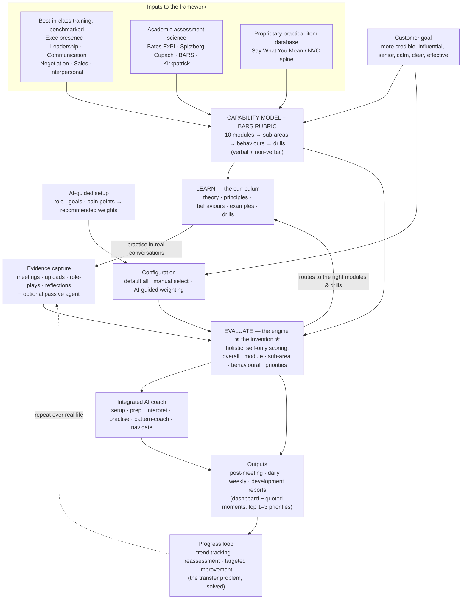

# FULCRUM — Strategic Opportunity Brief
### An AI coach for the leadership and communication behaviours that determine whether capable professionals are trusted, persuasive, and seen as ready for greater responsibility

*Prepared as a high-level opportunity assessment. This brief deliberately excludes financial viability — pricing, unit economics, TAM/SAM sizing, CAC/LTV, and funding are out of scope at this stage. It focuses on the problem, the evidence, the solution architecture, differentiation, and defensibility. It is a synthesis of all prior working sessions and the two research documents (customer-needs & benchmark research; updated product briefing), plus the supporting frameworks, rubric, and proprietary content database developed to date.*

---

## 0. How to read this document

This brief is organised in three movements:

1. **The opportunity** (§1–§5): the problem, why it persists, why now, the competitive landscape, and the white space.
2. **The product** (§6–§13): the capability model, the learning surface, the evaluation engine (the invention), configurable assessment, the AI coach, evidence capture, scoring, outputs, and the experience loop.
3. **The case to build** (§14–§20): differentiation, defensibility/moat, intellectual & assessment foundations, privacy/ethics, segments, phased execution, and risks.

Two prior artefacts sit underneath this brief and are referenced throughout: the **proprietary capability framework** (the scored model) and the **BARS rubric** (`fulcrum/rubric/bars-rubric.md`), seeded in part by a **structured database of practical communication items** (`fulcrum/research/`).

---

## 1. Executive summary

**The thesis.** A large population of capable professionals is held back from advancement by communication and leadership behaviours that are (a) consequential, (b) vaguely described, and (c) almost impossible to improve through conventional training. The market does **not** have a content problem — frameworks and courses are abundant. It has a **transfer, measurement, and specificity problem**: people cannot see what they actually do in real interactions, cannot tie it to outcomes, and have no safe, repeatable way to fix it.

**The opportunity.** Three independent shifts have, for the first time, made the unsolvable solvable: (1) executive presence / leadership communication is an established premium development category with proven willingness to pay; (2) AI coaching tools have validated that professionals will accept performance feedback from software on how they communicate; and (3) meeting-intelligence platforms have normalised automatic capture, transcription, and push-based post-meeting reporting. Together these make possible a product that evaluates **real** working (and personal) conversations — verbal **and** non-verbal — against a benchmarked capability model, and turns that into private, ongoing, prioritised coaching.

**The product.** FULCRUM is a coaching *system*, not a course library, a meeting-notes tool, or a narrow speaking assistant. It has two halves joined by a loop:

- **LEARN** — a structured, referenceable curriculum across a **10-module capability model** (theory, principles, behaviours, examples, drills).
- **EVALUATE** — the invention: an engine that analyses real interactions against a detailed, behaviourally-anchored framework, scores the user holistically (but only ever the user, never the other people in the room), explains *why* with concrete evidence, and routes them to the exact modules, principles, and drills that will move the needle.

The loop — diagnose real performance → learn/practise → apply in the next real conversation → re-measure — is what converts one-off training into embedded behaviour change. In academic terms, the engine **is the transfer mechanism** that conventional training lacks.

**The wedge.** "Finally, something specific." The first diagnostic on a real conversation answers, in concrete behavioural terms, the question every recipient of "you need more executive presence" has been left unable to answer: *what, exactly, do I do differently?*

**Why it's defensible.** A proprietary capability framework and validated rubric, a longitudinal personal-development dataset that creates switching cost, and a data flywheel in which every analysed conversation sharpens the model — combined with breadth across leadership, presence, negotiation, sales, and interpersonal domains that no incumbent category spans.

---

## 2. The problem individuals face

### 2.1 The job to be done

The customer is trying to become **more effective and more promotable in the interactions that materially determine career outcomes**: leadership updates, board and stakeholder discussions, interviews, one-to-ones, negotiations, sales calls, conflict and feedback conversations, and high-stakes presentations. The desired outcome is not sounding polished. It is being **perceived as credible, senior, persuasive, calm, clear, trusted, and commercially or organisationally effective in the moments that matter.**

This need is most acute precisely for people whose *technical* ability is already strong — the "capable but stuck" segment. They are repeatedly told they lack executive presence, gravitas, confidence, or leadership communication, usually without any actionable explanation of what those labels mean behaviourally.

### 2.2 The problem customers actually experience

**1. The feedback is consequential but vague — the "Feedback Fog."**
Executive-presence feedback is real, career-relevant, and poorly specified. People hear "improve your executive presence," "be more strategic," "sound more senior," "show more gravitas" — and are left to reverse-engineer the behaviours behind the judgement. They cannot improve reliably against ambiguous labels. If the true issue is over-explaining, hedging, poor room-reading, weak asks, visible defensiveness, or lack of strategic framing, then generic advice about "presence" is too blunt to change anything.

**2. Transfer from training to real life is weak — the "transfer problem."**
This is the central, academically-documented failure. Leadership training reliably produces *learning* in the room, but the targeted behaviours fail to transfer into real on-the-job conduct unless transfer is actively supported. Premium programmes (Wharton's executive-presence certificate; CCL's presence offering) are credible and well-built — but they are bounded educational *events*, not always-on behavioural systems embedded in everyday work. The same is true of negotiation/communication providers (Richardson, RICS): they teach frameworks, but they do not create persistent behavioural analysis across the live meetings where the skill is actually tested.

**3. Practice is socially awkward without a private coach.**
A recurring unmet need is improving *without* repeatedly asking managers, colleagues, or direct reports for delicate feedback. The domain carries a political charge — people feel judged on impression and status signalling — yet have no safe, frequent mechanism for precise feedback. An AI coach changes the economics of practice: it can observe repeatedly, give feedback privately, and remove the emotional and reputational cost of development. The traction of tools like Poised shows the market already accepts private, immediate AI feedback on live communication.

**4. The need is role- and context-specific, not one-size-fits-all.**
A sales leader, a first-line manager, a consultant, and a rising executive all need "better communication," but the winning behaviour differs sharply by setting. Excellence in a board-style update is not excellence in a discovery call or a sensitive one-to-one. Tools like Yoodli demonstrate this by organising coaching around role-relevant performance (discovery, objection handling, demos, negotiation, executive conversation). Customers therefore need **configurable** assessment, not a universal score.

**5. Users now expect automation and push-based feedback.**
Meeting-intelligence tools (Read AI) have normalised AI joining/processing meetings, generating transcripts, summaries, actions, and recaps automatically. This resets expectation: passive capture and push reporting feel normal when timely and useful. For a coaching product this implies two things — the user should not always have to initiate analysis manually, and automation must remain *optional* because not every user or environment will accept passive capture.

### 2.3 The stakes and the fairness dimension

The stakes are stalled progression, lost earnings, eroded confidence, and a large pool of genuinely capable people plateauing for want of skills no one will concretely teach them. There is also a **fairness risk that doubles as a design principle**: "executive presence" is too often experienced as a *coded* standard that penalises accents, introversion, neurodivergent directness, and women (the confidence/likeability double-bind). A credible product must explicitly counter this — scoring effectiveness toward the user's *own* goals and chosen style, never penalising accent or rewarding extroversion for its own sake, and making its rubric transparent. Done right, this is both an ethical necessity and a differentiator: it literally makes the invisible rules visible.

### 2.4 Customer Needs Framework

| Customer need | What the user is really asking for | Evidence | Product implication |
|---|---|---|---|
| Make vague feedback actionable | Translate labels like "presence" or "gravitas" into specific behaviours | Executive-presence feedback is broad and impressionistic | Score against concrete modules, sub-areas, and behaviours — not generic traits |
| Improve in real work, not just training | Apply frameworks inside live meetings, negotiations, updates, difficult conversations | Executive education & leadership programmes are time-bounded; negotiation programmes are structured events | Build around real-interaction analysis, not course completion |
| Get feedback privately and often | Learn without repeatedly asking colleagues for delicate feedback | Social-source frustration + AI-coaching appeal point to demand for safe feedback loops | Provide private AI coaching and post-meeting analysis |
| Match coaching to role | Focus on what matters most to the user's actual job | Yoodli organises coaching by use case; leadership providers vary by seniority/context | Allow module selection and adjustable weightings |
| Receive prioritised next steps | Know what to fix first, not be drowned in data | AI coaching tools emphasise targeted feedback and drills, not just analytics | Curate 1–3 priority changes per interaction |
| See progress over time | Understand recurring patterns, not one-off impressions | Meeting platforms already produce recurring summaries/reports | Add trend reporting and recurring development views |
| Reduce friction | Avoid manually uploading/tagging every interaction | Read AI normalises automatic meeting capture and recap | Offer an optional passive meeting agent |

### 2.5 A note on evidence quality

Social-source signal (Reddit and similar) is directionally useful but is **not** representative ethnography: it reveals recurring language and lived frustration, not prevalence. It is most valuable as qualitative evidence of how customers describe stalled progression, image risk, confidence gaps, and the ambiguity of presence feedback. Provider/practitioner sources are shaped by commercial positioning, but remain valuable for how the market *frames* the problem and which capabilities it repeatedly treats as linked (presence, influence, communication, trust, negotiation, role-specific skill). Formal validation (interviews, a labelled gold set, a behaviour-change pilot) is part of the execution plan (§19, §20).

---

## 3. Why now

Three structural shifts converge to make this viable today when it was not before:

1. **The category is established and premium.** Executive presence, leadership communication, negotiation, and consultative selling are recognised, paid-for development categories (Wharton, CCL, Consensus, Working Voices, Richardson, RICS, Tack TMI). Demand and willingness to pay are proven; the framing of "good" is well-articulated.
2. **AI feedback on communication is socially accepted.** Poised and Yoodli have validated that professionals will receive — and act on — performance feedback from software on how they speak, ask, handle objections, and present. This materially lowers adoption risk for a broader coaching concept.
3. **Recorded, machine-readable conversation is now the default.** Zoom/Teams/Meet recording is routine; transcription, diarisation, and AI interpretation have advanced to accurate, speaker-attributed, nuanced understanding; and Read AI-style passive capture with push reporting has normalised the operating model. The raw material for real-world evaluation — verbal *and* non-verbal — is suddenly abundant.

The unlock is the combination: a premium, well-defined problem; accepted AI feedback; and an abundant supply of real-conversation evidence. The missing piece the market has never assembled is the **ongoing-feedback layer** that makes these skills finally embed.

---

## 4. Competitive & benchmark landscape

The adjacent market splits into four categories. No single category solves the full problem; together they define the opportunity and de-risk the design.

### 4.1 Category analysis

**Category 1 — Executive education & leadership development.** *Wharton, CCL, Consensus, Working Voices.* Wharton bundles executive presence with influence, persuasive leadership, networking, and strategic communication — i.e., top providers treat presence as a *bundled leadership capability*, not posture. CCL emphasises authentic leadership, self-awareness, trust, and contextually-effective behaviour (coach for adaptive effectiveness, not performative polish). Consensus and Working Voices add an applied communications lens (rapport, difficult questions, presence-in-action; style/substance/character). **Strength:** high-quality frameworks, credibility, clear behavioural language. **Gap:** weak day-to-day reinforcement; no persistent scoring across live work.

**Category 2 — Negotiation & consultative communication.** *Richardson, RICS, Tack TMI.* Richardson structures negotiation as a *sequence* — preparation, opening, control, trading, closing, action planning — showing that a coaching engine can evaluate in-conversation *moves*, not just broad capability. RICS and others foreground listening, discovery, client understanding, and commercially-aware communication. **Strength:** clear methods, role-relevant behaviours, sequence-based practice. **Gap:** event-based, not embedded in every conversation.

**Category 3 — AI communication coaching & role-play.** *Poised, Yoodli.* Poised validates real-time private AI feedback on delivery. Yoodli demonstrates the stronger capability-based pattern: AI role-play, scorecards, and coaching across discovery, objections, demos, negotiation, and executive conversations — validating modular scoring, scenario relevance, repeatable practice, and weakness→drill linkage. **Strength:** fast feedback, repeatability, measurable drills. **Gap:** narrower than full leadership coaching; oriented to rehearsal more than holistic real-life development.

**Category 4 — Meeting intelligence & passive capture.** *Read AI.* The clearest benchmark for passive/semi-passive evidence capture: notetaking, summaries, reports, recording, recaps, optimisation feedback across Zoom/Meet/Teams. **Strength:** automatic capture, recurring reports, scalable evidence. **Gap:** centre of gravity is meeting *productivity*, not personal *development* against a customised capability model — recap is the end product, not interpretation.

### 4.2 Benchmark comparison

| Category | Representative providers | What they do well | What they don't solve | Strategic implication for us |
|---|---|---|---|---|
| Executive education | Wharton, CCL, Consensus, Working Voices | High-quality frameworks, credibility, behavioural language | No persistent scoring across live work; weak reinforcement | Borrow frameworks & behavioural language for the model |
| Negotiation & consultative | Richardson, RICS, Tack TMI | Clear methods, role-relevant, sequence-based | Event-based, not embedded | Assess both broad capability **and** in-conversation moves |
| AI communication coaching | Poised, Yoodli | Fast feedback, role-play, measurable drills | Narrower than full leadership coaching | Include a *coach*, not just analytics |
| Meeting intelligence | Read AI | Automatic capture, recurring reports, scale | Recap-first, not development-first | Optional passive capture, but coaching-first |

### 4.3 The white space

The decisive gap is the absence of a product that combines **(1) benchmarked leadership frameworks, (2) configurable role-based scoring, (3) real-world meeting evidence (verbal + non-verbal), and (4) an integrated AI coach that behaves like a development partner** — rather than a notetaker or a narrow speaking assistant. The white space is not "AI for communication" in the abstract. It is a system that can tell a user, *with specificity*, how they performed against executive presence, strategic communication, listening, negotiation, conflict handling, or consultative skill; explain *why that mattered in context*; and recommend *what to revisit or practise next.*

---

## 5. Design principles derived from the research

Five principles fall directly out of the evidence and govern every product decision:

1. **Start from customer outcomes, not AI features.** The product's reason for being is promotion-readiness, credibility, influence, trust, negotiation effectiveness, and real-world performance. AI is the *mechanism* that makes private, ongoing coaching possible — not the pitch.
2. **Assessment must be configurable.** Because winning behaviour varies by role and meeting type, users select modules manually or accept AI-guided default weightings by role/seniority/goal. A fixed universal score is wrong by construction.
3. **The coaching layer matters as much as the scoring layer.** The market already has analytics and education. Differentiation is in turning evidence into interpretation, prioritisation, encouragement, and next-step practice — through a conversational coach available before, during, and after the loop.
4. **Passive capture is optional but well-built.** There is clear benchmark support for automation, but privacy, recording norms, and organisational fit mean both active and passive workflows must be first-class.
5. **Reports are pushed, not only pulled.** Sustained improvement fails if the user must remember to request every analysis. Immediate post-meeting feedback plus daily/weekly coaching summaries are expected.

---

## 6. The solution: product objective and shape

**Objective.** Build a true coaching system that (a) benchmarks what "good" looks like across leadership and communication capabilities, (b) observes real behaviour through meetings and other evidence, (c) diagnoses performance at multiple levels — holistically but always self-focused — and (d) guides improvement through chat, reports, practice, and trend analysis. Explicitly **not** a learning library, a meeting-recap tool, or a narrow speaking assistant.

**Shape — two halves joined by a loop:**

- **LEARN (the curriculum).** A structured, referenceable body of teaching across the 10-module capability model: underlying theory and principles, observable behaviours, warning signs, positive examples, improvement principles, and actionable real-world practice. Non-linear — any module can be entered directly.
- **EVALUATE (the engine — the invention).** Real-conversation analysis against the detailed framework, producing holistic, self-only, behaviour-level feedback that routes the user to the exact learning and drills that will help.
- **THE LOOP.** Diagnose real performance → learn/practise → apply in the next real conversation → re-measure. The loop is the product; it is what turns episodic training into embedded change.

**The convergence insight that makes one coherent system possible:** across executive presence, leadership, negotiation, sales, and interpersonal domains, the *same* core mechanics recur — regulate yourself, listen deeply, get genuinely curious, find the need beneath the stated position, and speak with clarity and intention. "Interests not positions" (principled negotiation), "tactical empathy / calibrated questions" (Voss), SPIN's "need-payoff" questions (consultative selling), and "needs beneath positions" (mindful communication) are the *same skill in different clothes*. That shared spine is what lets a single capability model span all five domains without fragmenting.

---

## 7. The capability model — 10 modules

The capability model is consolidated to **10 modules**: enough to cover the full real-world performance problem, few enough to be navigable and credibly scored. Adjacent areas customers experience as one performance problem are combined at the surface, with rich specificity preserved *beneath* each module (§8) for explainable scoring and coaching.

| # | Module | What it covers | Why it matters |
|---|---|---|---|
| 1 | **Executive presence & leadership narrative** | Presence, gravitas, confidence, composure, seniority signals, leadership story, personal credibility | Presence feedback is the most common advancement blocker; top programmes tie presence directly to influence and leadership impact |
| 2 | **Strategic & concise communication** | Recommendation-first speaking, message structure, brevity, altitude, clarity under pressure | Progression depends on landing the point quickly and at the right level — not merely being correct |
| 3 | **Influence, audience calibration & stakeholder management** | Informal influence, room-reading, audience adaptation, political awareness, stakeholder alignment | Executive communication is audience-specific; influence fails when the message isn't calibrated to what the room values |
| 4 | **Mindful presence, confidence & emotional regulation** | Self-awareness, calm under pressure, nervous-system regulation, reactivity management, steady delivery | Steadiness and self-awareness underpin every other interaction skill |
| 5 | **Empathy, listening & trust building** | Deep listening, empathy, relational awareness, conversational generosity, trust creation | Presence is not only projection; it depends on connection, understanding, and trust |
| 6 | **Difficult conversations, feedback & conflict repair** | Raising issues, handling friction, giving feedback, receiving challenge, repair after rupture | One of the clearest places where real-life application matters far more than classroom understanding |
| 7 | **Needs, requests, boundaries & assertiveness** | Clear asks, boundary-setting, directness, owning needs, saying no, request specificity | Many failures stem from indirectness, weak asks, or inability to state limits |
| 8 | **Negotiation, objection handling & value protection** | Preparation, leverage, trade-offs, objection handling, closing, value framing | A major applied communication domain, strongly benchmarked in training markets |
| 9 | **Sales & consultative conversation** | Discovery, questioning, demos, consultative selling, commercial listening, customer framing | In commercial roles these skills are measurable and tied to revenue; AI tools already validate the design space |
| 10 | **Self-awareness, habit change & deliberate practice** | Pattern recognition, reflection, practice planning, targeted drills, progress review | Sustainable improvement requires repeated feedback, pattern detection, and guided rehearsal — not isolated advice |

**Configurable by design:** all 10 active by default; or user-selected modules and weights; or AI-guided weighting by role/goal (§10).

---

## 8. The structure beneath each module

The product's core promise is not "good or bad" — it is *what specifically drove the result and what to improve next.* So every module resolves into a hierarchy that makes scoring specific and coaching explainable:

> **Module → sub-areas → observable behaviours → warning signs / failure patterns → positive examples → improvement principles → practice techniques → source grounding.**

The detail below is the scored skeleton. It also reconciles our earlier 14-module / 4-track curriculum and the Bates ExPI 15 facets and the OFNR (Observation–Feelings–Needs–Requests) spine: those become the **sub-areas and behaviours beneath the 10 modules**, so nothing developed to date is lost.

### Module 1 — Executive presence & leadership narrative
- **Sub-areas:** gravitas/credibility ("know it cold, six questions deep"); composure & seniority signals; leadership story/narrative; authenticity & personal brand; vocal & physical command (pace, pause, pitch, energy); confidence projection.
- **Positive behaviours:** concise authoritative framing; steady delivery under scrutiny; coherent narrative of who they are and where they're taking things; owning the frame.
- **Warning signs:** rambling, hedging, up-talk, filler, visible nerves, defensiveness, "junior" framing of own contributions.
- **Improvement principles:** substance first; the pause as power; own the frame.
- **Practice:** high-pressure self-recording challenge; "six-questions-deep" preparation; vocal-pacing drill.
- **Grounding:** Bates (Confidence, Composure, Vision, Appearance, Assertiveness); Hewlett (gravitas weighting); Wharton/CCL/Working Voices (style·substance·character).

### Module 2 — Strategic & concise communication
- **Sub-areas:** recommendation-first / BLUF; message architecture (pyramid); brevity; synthesis; altitude (pitching at the right level); decision clarity; clarity under pressure.
- **Positive behaviours:** leads with the answer; structures top-down; lands the point fast; adjusts altitude to the audience; makes the ask/decision explicit.
- **Warning signs:** bottom-up build-up; burying the lede; over-detail; no clear recommendation or decision.
- **Principles:** recommendation first; pyramid structure; one idea per breath.
- **Practice:** "headline-first" rewrite; 60-second summary drill; pyramid prep before key meetings.
- **Grounding:** Hewlett (communication); Minto Pyramid Principle; Spitzberg (coordination).

### Module 3 — Influence, audience calibration & stakeholder management
- **Sub-areas:** room-reading; audience adaptation; framing in the room's terms; informal influence & political awareness; stakeholder mapping & pre-wiring; alignment.
- **Positive behaviours:** tailors message to audience interests; reads and responds to cues; aligns stakeholders before the room; frames asks around what others value.
- **Warning signs:** one-size message; tone-deafness; no stakeholder pre-work; pushing position over interest.
- **Principles:** interests not positions; calibrate to the room; influence is pre-wired.
- **Practice:** stakeholder map; "what does this audience value" pre-meeting; reframe exercise.
- **Grounding:** Wharton (influence/persuasive leadership/networking); Bates (Intentionality, Resonance, Inclusiveness); Fisher & Ury.

### Module 4 — Mindful presence, confidence & emotional regulation
- **Sub-areas:** self-awareness; the choice-point/pause; nervous-system regulation; trigger/reactivity management; "mastering your stories"; steady delivery under stress.
- **Positive behaviours:** pauses before responding under challenge; stable rate and pitch under pressure; names tension calmly; stays non-defensive.
- **Warning signs:** fast/defensive reactions; rate/pitch spikes; freezing; suppression read as disengagement.
- **Principles:** the gap between stimulus and response; the one-breath reset; feel it and still choose.
- **Practice:** one-breath experiment; trigger journal; high-pressure self-recording.
- **Grounding:** Sofer (presence); Bates (Composure, Restraint); the **mindfulness/pause** unit of the proprietary database; OFNR observation-vs-evaluation applied to self-talk.

### Module 5 — Empathy, listening & trust building
- **Sub-areas:** deep/reflective listening; interruption control; question quality (open/calibrated; "what/how" not "why"); acknowledgment & labeling; listening ratio; relational awareness; warmth/inclusiveness; psychological safety.
- **Positive behaviours:** reflects/paraphrases before responding; few interruptions; asks genuine open questions and leaves space; labels feelings/needs; balanced talk-time.
- **Warning signs:** talking over; advocacy-heavy; closed/leading questions; no acknowledgment; runaway talk-time.
- **Principles:** listen for feelings and needs first; questions outperform statements; mirror and label.
- **Practice:** "ask one layer deeper"; listening-ratio challenge; reflect-back drill.
- **Grounding:** Sofer/NVC (empathy/listening, feelings, needs); Spitzberg (attentiveness); Voss (mirroring/labeling); Bates (Concern, Inclusiveness, Interactivity); OFNR feelings & needs literacy.

### Module 6 — Difficult conversations, feedback & conflict repair
- **Sub-areas:** raising issues without starting a fight; making it safe; giving feedback (observation vs evaluation); receiving challenge; staying in dialogue under heat; repair after rupture.
- **Positive behaviours:** opens with safety/intent; states facts not blame; stays composed; checks understanding; repairs cleanly.
- **Warning signs:** avoidance; blame/absolutes ("always/never"); escalation; defensiveness; withdrawal.
- **Principles:** make it safe; observation not evaluation; contrast and repair.
- **Practice:** before/during/after prep; observation-vs-evaluation rewrite; repair script.
- **Grounding:** Crucial Conversations (safety, STATE); Sofer/NVC (observation vs evaluation, conflict repair); Bates (Composure, Concern); OFNR observation-vs-evaluation.

### Module 7 — Needs, requests, boundaries & assertiveness
- **Sub-areas:** owning your needs; concrete requests (vs hints/demands); boundary-setting; directness; saying no; request specificity; checking agreement.
- **Positive behaviours:** states needs plainly; makes specific doable asks; sets boundaries kindly; declines cleanly.
- **Warning signs:** indirectness; hinting; vague asks; over-apologising; inability to say no; veiled ultimatums.
- **Principles:** turn the need into a concrete request; request not demand; kind *and* direct.
- **Practice:** convert complaint → request; boundary script; "the clear ask" rewrite.
- **Grounding:** Sofer/NVC (needs, requests); Bates (Assertiveness); OFNR clear-requests + feelings/needs.

### Module 8 — Negotiation, objection handling & value protection
- **Sub-areas:** preparation & BATNA; interests vs positions; opening/anchoring; control & trading/trade-offs; objection handling; value framing/protection; closing & action planning; tactical empathy (calibrated questions, labeling).
- **Positive behaviours:** prepares interests and BATNA; uncovers the other side's interests; trades rather than concedes; handles objections calmly; frames and protects value; closes to action.
- **Warning signs:** positional bargaining; conceding under pressure; no BATNA; ignoring counter-interests; weak/absent close.
- **Principles:** interests not positions; objective criteria; tactical empathy; protect value, don't just split it.
- **Practice:** BATNA/interests prep sheet; objection-handling reframes; calibrated-question ladder.
- **Grounding:** Fisher & Ury (Getting to Yes); Voss (tactical empathy); Richardson (prepare·open·control·trade·close); RICS.

### Module 9 — Sales & consultative conversation
- **Sub-areas:** discovery & questioning (SPIN: situation·problem·implication·need-payoff); consultative listening; demo/storytelling to the need; commercial framing & value articulation; customer framing; next-step/qualification.
- **Positive behaviours:** asks before pitching; listens for the real need; tailors the demo to the problem; frames value commercially; drives a clear next step.
- **Warning signs:** pitch-first/feature-dumping; checklist questioning; no implication/need-payoff; talking past objections; no next step.
- **Principles:** ask, don't pitch; discovery before solution; sell to the need.
- **Practice:** SPIN-ladder prep; discovery-call self-recording; value-framing rewrite.
- **Grounding:** Rackham (SPIN); Yoodli (discovery/objections/demos); consultative-selling canon.

### Module 10 — Self-awareness, habit change & deliberate practice
- **Sub-areas:** pattern recognition across interactions; reflection; goal-setting; practice planning; targeted drills; spaced reinforcement; progress/trend review.
- **Positive behaviours:** notices recurring patterns; sets one focus at a time; runs drills; reviews trends; iterates.
- **Warning signs:** one-off insight with no practice; no follow-through; data overwhelm; no link to a goal.
- **Principles:** deliberate practice; one focus at a time; transfer through real-world reps.
- **Practice:** weekly focus + self-recording loop; reflection prompts; trend-review ritual.
- **Grounding:** Kirkpatrick & the leadership-training transfer literature; CCL's 70-20-10; deliberate-practice research; the engine's longitudinal view.

> **Worked depth already exists.** Two modules are fully drafted to in-product depth as a texture reference (`fulcrum/curriculum/`): *Grounded presence & the choice-point* (a sub-area of Module 4/1) and *Curiosity & calibrated questions* (a sub-area of Module 5/9/8) — each with concept, internal mechanic, good-vs-poor anchors, four kinds of real-world practice, and the exact diagnostic signals.

---

## 9. The evaluation engine — the invention

The curriculum is table stakes; **the engine is what is new and defensible.** It gives real, realistic, fully-formed feedback on how the user actually performed — across the full range of the models and principles taught — against the detailed capability framework.

### 9.1 What makes it distinctive

- **Real interactions, not role-play.** It works from the user's actual meetings, calls, pitches, and conversations — solving the transfer problem directly.
- **Verbal *and* non-verbal.** It reads not only language (structure, hedging, question type, observation-vs-evaluation, framing, filler) but the non-verbal signature of authority and regulation — pace, pauses, pitch variation, energy, interruptions, talk-time ratio, response latency under pressure — the signals a great human coach notices but cannot be present for every day.
- **Holistic but self-focused — a critical design choice.** The engine reads the *whole* conversation to understand the situation, the dynamics, and how the user handled it — but it only ever **evaluates and reports on the user.** It speaks to *how you handled the situation* and never rates, ranks, or characterises the other people in the room. ("We coach you, not the room.") This is both an ethical and a privacy stance, and a sharper coaching frame.
- **Scores *and* points.** For every area assessed it identifies the relevant sub-areas, explains what happened with concrete evidence, links to the principle/module to revisit, and recommends a drill or resource. Diagnosis and development are one motion.

### 9.2 Layered scoring & diagnosis

The model scores at several levels simultaneously, because the customer is asking several questions at once:

| Level | Answers the question | 
|---|---|
| **Overall** (for the selected module set) | "How did I do?" |
| **Module-level** (each active module) | "Which capabilities are strong/weak?" |
| **Sub-area** (within each module) | "Where exactly inside that capability?" |
| **Behavioural findings** (tied to evidence in the interaction) | "What specifically did I do that drove this?" |
| **Prioritised opportunities** (ranked by likely impact) | "What should I fix before the next similar interaction?" |

### 9.3 How scores are produced — rigour and validity

- **Behaviourally-Anchored Rating Scales (BARS).** Each competency has explicit "what good vs. poor looks like" anchors with example phrases, so scores are explainable rather than opaque. The rubric draws on validated assessment science (Bates ExPI; Spitzberg & Cupach's competence taxonomy; McCroskey's SPCC; behaviourally-anchored scales such as RUCIS).
- **Deterministic signals anchor the AI judge.** Hard metrics (question rate, open/closed ratio, talk-time, interruption counts, pause length, words-per-minute stability, pitch variance) constrain the language-model judge to reduce rater drift; the judge reads full context but evaluates the user only, and must cite evidence spans (timestamp + quote) for every score.
- **Detectable competencies already specified.** The rubric includes transcript-detectable competencies — *Composure, Inquiry/Calibrated Questioning, Deep Listening,* and the OFNR set *Observation vs. Evaluation, Feelings & Needs Literacy, Clear Requests* — each with signals and four anchored levels.
- **Validity plan.** An expert-labelled gold set of real clips; measurement of AI-judge agreement with human coaches (inter-rater reliability) per rubric version; iteration of anchors until agreement is acceptable; rubric versioning so longitudinal user trends remain comparable. **Scoring validity is the make-or-break technical risk and is treated as such.**

### 9.4 Reference pipeline

```
Ingest (upload or passive capture)
  → ASR + diarisation + word-level timestamps
  → speaker identification (voiceprint enrolment isolates the user)
  → feature extraction:  lexical/semantic (LLM)  |  prosodic (audio models)  |  conversational dynamics
  → rubric scoring:  deterministic metrics  +  Claude as BARS judge (full context, user-only, evidence-cited)
  → feedback generation (brand voice)  →  links to modules/principles/drills
  → encrypted store (user-controlled retention)  →  dashboard, chat, reports, trend history
```

---

## 9A. Seeing and hearing: the multimodal engine, cost model & capture

Executive presence is profoundly **non-verbal**. Gravitas is carried in eye contact, posture, stillness, gesture, facial expression and vocal tone as much as in words. So the engine must evaluate **video and audio**, not just transcripts — while remaining **self-only** and **highest-quality, with no "lite" tier**.

### 9A.1 The multimodal pipeline (three inputs, one verdict)

| Layer | What it captures | How |
|---|---|---|
| **Verbal** | structure, hedging, questions, observation-vs-evaluation, framing | LLM over the transcript |
| **Vocal (prosody & flow)** | pace, pauses, pitch variation, energy; interruptions, talk-time, response latency, longest monologue | speech-to-text diarisation (Deepgram) + on-device Web-Audio analysis |
| **Visual (presence)** | eye contact, posture/openness, gesture, stillness vs. fidget, facial expression, how one "holds" the room | **native video understanding (Gemini Pro)** — watches motion + audio together |

For video, the chosen architecture is **native video reasoning on the top model (Gemini Pro)** rather than stills, because presence lives in *motion and continuity*. The decisive cost insight: **resolution and frame-rate are independent of model intelligence**. We run Pro's full reasoning brain but sample at ~1 fps and at a sensible media-resolution, and **crop to the user**. Body language reads perfectly at ~1 fps, so this is an efficiency lever, **not** a quality downgrade — the interpretation stays top-tier. There are no Flash/Pro quality tiers exposed to the user; it is always the best read.

### 9A.2 Why native video is affordable

Native video tokenises at ~1 fps (frames + audio), so cost scales with **length**, not motion. Approximate per-evaluation cost on Pro (verify at build):

| Pro setting | ~tokens/sec | 30-min meeting | Heavy day (7×30-min) | Facilitator (~6 h) |
|---|---|---|---|---|
| Full res, 1 fps | ~300 | ~$0.68 | ~$4.70 | ~$8 |
| **Medium res, 1 fps (default)** | ~130 | ~$0.29 | ~$2.05 | ~$3.50 |

Cropping to the user, clip/segment selection, de-duping already-analysed recordings, prompt-caching the rubric, and a **per-run cost estimate shown before you run** keep spend visible and bounded — without ever lowering quality.

### 9A.3 Commercial model — managed by default

Asking consumers to create and fund their own Gemini/Anthropic accounts is too much friction. So the **default is a managed model: we own and fund the provider accounts, bundle a quota into the price, and meter + hard-cap centrally** so the cost envelope is always under our control. Cost is metered by the **cost driver** (transcripts ≪ audio ≪ video) and protected by allowances, never by degrading the analysis (always the top model).

**Managed architecture (the only backend):**
- A thin **serverless proxy (Vercel functions)** holds the provider keys server-side; the app calls *it*, never the providers directly. Large media is uploaded straight to object storage (Vercel Blob) via a server-minted token, so it bypasses request-size limits; the function then orchestrates the provider call.
- **Per-account quota** lives in a KV store and is enforced **server-side** (e.g. "20 video-min + 5 audio-hrs + unlimited transcripts / month"), so spend can never exceed what was paid — independent of the client.
- **Access via a FULCRUM key/licence** (issued on purchase) in the prototype; **Stripe** subscription + top-up credits automate issuance at launch.
- **Ingestion is optimised at source:** Gemini samples at ~1 fps and medium resolution (the cost levers), audio is kept intact for tone; optional **server-side pre-transcode** (downscale / fps / mono) trims upload bandwidth. None of this lowers analysis quality.

**Tiers:**
- **Managed subscription + included allowance + top-ups (primary):** the default consumer/team experience — predictable price, margin-protected, upsell for heavy users.
- **BYO-key (built; Enterprise/privacy tier):** orgs or power users supply their own keys for a flat software fee — **zero AI-cost risk** to us and a hard data-boundary for enterprises that require it. No longer the default.
- **Budget-aware auto-agent (critical):** the capture agent always runs **full quality**, but within a **per-day video budget** per plan; beyond budget it queues or falls back to the cheaper modality (audio/transcript) rather than dropping the model — preventing an always-on agent from silently running up cost.

### 9A.4 Automatic capture — environment connectors

To deliver "evaluate my real meetings without uploading each one," the agent pulls only the **user's own** recordings via read-only, OAuth-scoped connectors, each governed by the video budget and provider-abstracted (Gemini native video where available; Claude high-res frames as fallback):

| Environment | Source of recordings | Connector |
|---|---|---|
| **Microsoft / Teams** | OneDrive / SharePoint (Stream) | Microsoft Graph API (user OAuth) or local OneDrive-folder watcher |
| **Google / Meet** | Google Drive | Google Drive API + Gemini |
| **Zoom** | Zoom Cloud Recording | Zoom API + `recording.completed` webhook |
| **Local / anything** | files on disk (local recordings, Loom exports) | the local companion agent (folder watcher) |

Between Graph, Drive, Zoom and the local watcher, the large majority of real-world meeting capture is covered. All capture is strictly opt-in, read-only to the user's own content, cropped to the user, and budget-bounded.

---

## 10. Configurable assessment — user-controlled selection & weighting

Configurability is not an advanced setting; it is a necessary expression of customer reality. Three modes:

1. **Default full-model** — all 10 modules active.
2. **Manual** — the user selects modules and assigns relative weights.
3. **AI-guided** — the coach recommends modules and weights from role, seniority, function, goals, and pain points.

The AI-guided mode is **consultative**: rather than asking the user to configure a rubric, the coach asks what role they hold, what situations feel hardest, what feedback they've received, and what outcomes they care about, then proposes a weighting. Worked examples:

- **Manager → senior leadership:** heavier weight on executive presence, strategic communication, influence, and difficult conversations.
- **Salesperson / commercial leader:** heavier weight on consultative conversation, objection handling, negotiation, and concise executive communication.
- **People manager handling team tension:** heavier weight on emotional regulation, empathy, conflict repair, boundaries, and trust building.

This also enables a **"this is me" baseline** — the user can set their authentic style as the reference point, so scoring measures effectiveness toward *their* goals, not conformity to a coded stereotype (see §17).

---

## 11. The integrated AI coach

The coach is a central product surface, not a help feature. It spans the journey and draws on live data from setup, assessments, reports, and recommendations. It functions as a blend of executive coach, communication analyst, and practice partner — its job is to **interpret and prioritise**, not merely retrieve. Six recurring use cases:

1. **Orientation & setup** — define goals, choose modules, explain weights, set expectations.
2. **Pre-meeting preparation** — decide the focus for an upcoming interaction and what success looks like.
3. **Post-meeting interpretation** — explain scores and surface the few most important observations and changes.
4. **Practice & rehearsal** — drills, reframes, and reflection prompts linked to the exact gaps found.
5. **Longitudinal pattern coaching** — identify recurring issues and growth across weeks and months.
6. **Resource navigation** — route back to principles, examples, modules, and external resources fitting the user's current growth edge.

A **Socratic tutor** mode lets the user interrogate any concept on demand, grounded (via retrieval) in the proprietary curriculum and its source database — able to cite the underlying principle and its origin.

---

## 12. Evidence capture & the optional passive agent

### 12.1 Evidence sources
The primary source is meetings and spoken interactions, because that is where the problem is most acute. Inputs: meeting recordings, transcripts, uploaded presentations, negotiations, role-play/rehearsal sessions, and optional user reflections (goals, emotional state, context). The system distinguishes **interaction types** — team update, discovery call, negotiation, one-to-one, difficult feedback — because performance standards differ by context and should not share one implicit standard.

### 12.2 Optional passive agent
Opt-in (never required). When enabled it: identifies relevant meetings from connected sources or uploads; infers meeting type and applies default or context-sensitive weights; generates a post-meeting coaching summary automatically; and adds the interaction to trend history so recurring patterns surface over time. Kept optional because the best experience balances convenience against privacy expectations and organisational reality (§17).

---

## 13. Outputs & report cadence

Coaching is delivered through **both** chat (interactive interpretation and preparation) and structured reports (reflection, tracking, accountability). Surfaces:

- **Immediate post-meeting summary** — automatic where possible.
- **On-demand chat** — explain scores and evidence.
- **Daily digest** — for high-interaction roles.
- **Weekly coaching review** — patterns, improvements, recurring blockers.
- **Periodic development report** — aligned to goals such as promotion-readiness or commercial improvement.

Every report contains: overall score, module breakdowns, the main reasons behind the scores, the **top 1–3 coaching priorities**, suggested principles/modules to revisit, and recommended drills. The output is consistently framed as a **dashboard with specific quoted moments (strong and improvable), not a single number** — and always self-focused.

---

## 14. Strategic differentiation

FULCRUM is positioned as a **coaching system**, distinct from every adjacent category:

| Against… | The differentiation |
|---|---|
| Executive education (Wharton, CCL) | Continuous, real-world reinforcement and measurement vs. a bounded course |
| AI speaking tools (Poised) | Broader framework depth and role relevance vs. delivery-only feedback |
| Meeting assistants (Read AI) | Recap is *not* the product — developmental interpretation is |
| Sales coaching tools (Yoodli) | Breadth across leadership and interpersonal domains, not commercial calls alone |

**The strongest articulation** is therefore not "AI communication analysis." It is: *"AI coaching for the behaviours that determine whether capable professionals are trusted, persuasive, and seen as ready for greater responsibility."*

---

## 15. Why this is defensible (the moat)

For an opportunity assessment, defensibility matters as much as the wedge. Four reinforcing moats:

1. **Proprietary capability framework + validated rubric.** The synthesis across executive presence, leadership, negotiation, sales, and interpersonal domains — anchored in validated assessment science and a curated practical-item database — is hard to assemble and harder to validate. The gold-set-calibrated BARS rubric is a genuine asset.
2. **Longitudinal personal dataset → switching cost.** A user's accumulating history of real-conversation analysis, trends, and personalised coaching is uniquely theirs; leaving means losing the through-line of their development. This compounds with use.
3. **Data flywheel.** Every analysed conversation (with consent) sharpens the rubric, the benchmarks of "good," and the personalisation — improving the product for all users and widening the quality gap.
4. **Breadth + coaching depth no incumbent spans.** Education has frameworks but no real-time measurement; meeting tools have capture but no development model; speaking tools have feedback but narrow scope; sales tools have depth but only commercially. FULCRUM is the only design that connects framework-rich development to day-to-day behavioural coaching across all five domains.

---

## 16. Intellectual & assessment foundations

What the product *teaches* and what it *measures* deliberately share one vocabulary, drawn from established and validated sources:

- **Bates ExPI** — the only scientifically validated executive-presence model (3 dimensions, 15 facets; multi-rater; strong content validity and reliability). The scoring backbone.
- **Hewlett / CTI** — executive presence as gravitas + communication + appearance; "know your stuff cold / six questions deep."
- **Spitzberg & Cupach** communication-competence taxonomy — Attentiveness, Composure, Coordination, Expressiveness: the measurable behavioural layer.
- **Say What You Mean (Sofer) / NVC** — the internal spine: presence, intention, listening, observation-vs-evaluation, needs beneath positions, clear requests. Captured as a structured, Minto-organised database of practical items now mapped into the model.
- **Negotiation & sales canon** — Fisher & Ury (interests, BATNA, objective criteria); Voss (tactical empathy: calibrated questions, mirroring, labeling); Rackham (SPIN).
- **Measurement & outcomes** — BARS (e.g., RUCIS); McCroskey SPCC; Kirkpatrick's four levels; the leadership-training transfer literature (effective on learning, but a documented transfer gap that the engine is designed to close).

---

## 17. Privacy, consent, ethics & anti-bias

A consumer product that listens to real working life must lead on trust; for an opportunity assessment these are also the principal non-technical risks, and they are designed for from the outset:

- **Self-only evaluation, full-conversation context.** The engine reads the whole conversation but only ever assesses and reports on the user; it never rates or characterises other participants. Others' speech is used transiently for context and is not surfaced or stored as judgements.
- **Data control.** Encryption in transit and at rest; user-set retention; one-tap delete; passive capture strictly opt-in with jurisdiction-aware guidance and a "tell your team" nudge; a later, explicitly-consented multi-party mode.
- **Anti-bias as design principle and differentiator.** Score effectiveness toward the user's *own* stated goals and chosen style; never penalise accent, dialect, non-native phrasing, or introversion; never reward raw talk-time or extroversion for its own sake; let the user set a "this is me" baseline; keep feedback opt-in per competency; keep the rubric transparent. This directly addresses the coded-standard critique of "executive presence" and turns a reputational risk into a trust advantage.

---

## 18. Audience & extensibility

- **B2C-first** — ambitious individuals who have received vague advancement feedback and want a private, specific, ongoing answer. The free first diagnostic ("see your communication on the tape") is the wedge.
- **B2B (L&D / teams)** — the same engine with manager/L&D dashboards, seat licensing, and aggregate (privacy-preserving) capability views; sells against the weak-transfer problem of incumbent corporate training.
- **B2B2C (coaches)** — human coaches use the engine to scale their practice, with review dashboards — turning a potential substitute (human coaching) into a channel.

The architecture is designed so configurable scoring, role-based weighting, and the coach generalise cleanly across all three.

---

## 19. Phased execution

- **Phase 0 — Framework & proof.** Finish benchmark + academic synthesis; integrate the proprietary database; author the full 10-module model with sub-area hierarchy + BARS rubric; build the expert-labelled gold set; technical spike on real recordings to confirm the "moments" ring true to a human coach.
- **Phase 1 — MVP (B2C web).** The evaluation engine + the module library, wired together (diagnosis → modules); free first diagnostic; manual upload.
- **Phase 2 — Loop & depth.** Integrated AI coach (all six use cases); configurable weighting incl. AI-guided setup; longitudinal dashboard; richer practice + self-recording challenges; pushed reports (post-meeting, daily, weekly).
- **Phase 3 — Capture & multi-audience.** Optional passive agent and meeting-platform integrations; mobile record-in-app; B2B tenancy (L&D dashboards) and B2B2C coach review.
- **Phase 4 — Real-time.** On-device, self-voice ambient analysis → subtle real-time nudges for high-confidence errors (interrupting, runaway monologue, pace, no questions).

---

## 20. Risks & open questions

- **Scoring validity is the make-or-break technical risk** — mitigated by the gold set, human-agreement measurement, and rubric versioning (§9.3). Without credible validity, the product is just opinionated analytics.
- **Privacy perception & recording norms** — mitigated by self-only evaluation, opt-in capture, and data control (§17), but remains an adoption and trust risk.
- **Diarisation / voiceprint accuracy** in noisy, multi-party meetings; **multimodal cost/latency**; **content cold-start** for the curriculum; **real-time on-device feasibility** (hence Phase 4).
- **IP/legal** — ideas/methods aren't protectable but expression and trademarks are: author original lessons, don't reproduce source text or marks (e.g., "Crucial Conversations®", "ExPI™", "NVC"), and consider licensing/partnering with named authors and providers.
- **Evidence-quality caveat** — social-source signal is qualitative, not representative (§2.5); formal validation (interviews + a 4–6 week, 20–30 user behaviour-change pilot measuring objective movement: interruptions ↓, question rate ↑, monologue length ↓, plus self-reported confidence) is required to convert directional confidence into proof.
- **Out of scope here, required next:** pricing, packaging, unit economics, market sizing, and go-to-market sequencing.

---

## 21. The product structure (diagram)



*The loop is the product: benchmarked sources and validated science form one capability model + rubric; that model feeds both the learning surface and the evaluation engine; the engine diagnoses real performance (verbal and non-verbal, self-only), the coach interprets and prioritises, reports are pushed, and the user practises in real conversations and re-measures — turning episodic training into compounding, embedded improvement.*

---

## 22. Bottom line

Capable professionals are routinely held back by leadership and communication behaviours that are decisive, vaguely described, and nearly impossible to fix with conventional training. The market has the content; it lacks transfer, measurement, and specificity. Three shifts — a proven premium category, accepted AI feedback, and abundant machine-readable conversation — now make it possible to build the missing layer: a coaching *system* that benchmarks what "good" looks like across the five domains that matter, observes real interactions (verbal and non-verbal), diagnoses performance holistically but only of the user, and guides compounding improvement through a coach, pushed reports, and an optional passive agent. The opportunity is not to beat a single course or a single meeting assistant — it is to connect framework-rich development to day-to-day behavioural coaching across real work, and to own the proprietary framework, the validated rubric, and the longitudinal data that make that coaching trustworthy and hard to copy.
