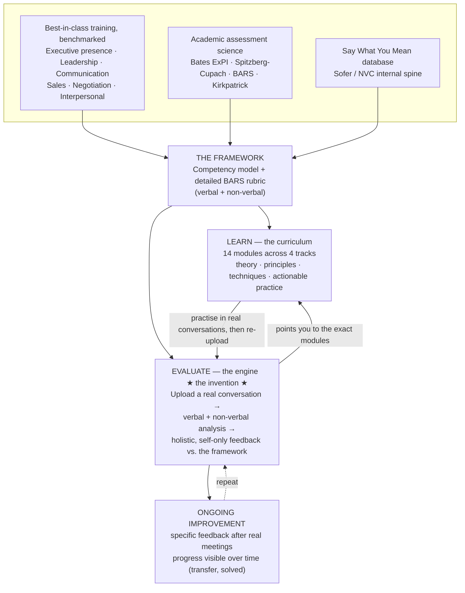

# VANTAGE — Briefing Sheet

*Purpose: get everyone on the same page about the problem, why it's hard, why now, and what we're building. One source of truth before we go deeper on content.*

---

## 1. The problem individuals face

Capable, hard-working people hit an invisible ceiling in their careers — and they're told the reason is **"executive presence," "gravitas," or "leadership skills,"** without ever being told what that means in practice. The research is consistent and stark:

- **It's a real, decisive promotion gate.** In the Center for Talent Innovation's research (Hewlett), senior leaders say executive presence accounts for a large share of what determines who gets promoted — gravitas alone was rated the #1 factor by ~two-thirds of senior executives. It is, in Hewlett's words, *"the missing link between merit and success."* People with the competence get passed over for how they *show up*.
- **The feedback is a fog.** The defining pain is that people are told they "lack presence," "aren't ready for the next level," or "need more gravitas" — but **never told, specifically and observably, what to do differently.** It's vague, demoralising, and impossible to action.
- **They believe it's fixed.** Because no one can define it, most people conclude presence is an innate personality trait you either have or don't — a recipe for learned helplessness. In reality it is a **set of specific, learnable behaviours.**
- **The behavioural gaps that actually derail people are knowable:** losing composure under pressure; talking too much and listening too little; not asking real questions; rambling instead of getting to the point; reacting defensively when challenged; failing to read the room; avoiding the hard conversation; sounding junior in the high-stakes moment.
- **The standard can feel unfair.** "Executive presence" is too often experienced as a *coded* standard that penalises accents, introversion, neurodivergent directness, and women (the confidence/likeability double-bind). So the feedback is not only vague but can feel exclusionary — which our approach must explicitly counter (score effectiveness toward the person's *own* goals and style, never penalise accent or reward extroversion).
- **The stakes:** stalled progression, lost earnings, eroded confidence, and a large population of genuinely capable people plateauing for want of skills no one will concretely teach them.

## 2. The challenge — why this is hard to solve today

- **The business case is hard to qualify.** ROI on "soft skills" is notoriously difficult to measure, so budgets are fragile and only a small minority of organisations believe their leadership training is highly effective.
- **Delivery is episodic.** Training is **classroom-based or online courses** — one-off events disconnected from the daily flow of real work.
- **Practice is artificial.** Skills are **role-played in contained, low-fidelity environments** that don't resemble the real meeting where it counts.
- **The "transfer problem" (well documented academically):** what's learned in the room reliably *fails to transfer* into real on-the-job behaviour unless transfer is actively supported.
- **The missing ingredient is ongoing feedback.** These skills can only embed with **repeated, specific feedback on real performance** — and that is exactly what's missing: asking colleagues to critique your communication after every meeting is socially awkward, rare, inconsistent, and biased. Nobody gets honest notes on how they actually showed up, day after day.

## 3. AI + changing work practices change the game

The conditions that made this unsolvable have flipped:

- **Meetings are now recorded by default** (Zoom, Teams, Meet) and ambient/listening technology is normalised.
- **Transcription, diarisation and AI interpretation have advanced dramatically** — accurate speaker-attributed transcripts plus nuanced language understanding are now routine.
- This means we can evaluate ourselves **across our real working (and personal) lives** — not in contained role-play — **against the real framework** of leadership and executive-presence training, in a highly nuanced way.
- And critically, it can read **not just the verbal but the non-verbal** — pace, pauses, interruptions, tone, pitch, energy, talk-time — the signals a great coach notices but can't be present for in every conversation.
- The result is the missing layer: **private, ongoing, specific feedback after real conversations** — the thing that finally makes these skills *embed* and solves the transfer problem.

## 4. The training we've benchmarked

We mapped the best-in-class programmes and the validated assessment science across executive presence, leadership, communication, sales, negotiation and interpersonal skills:

| Source | Field | What we take from it |
|---|---|---|
| **Bates ExPI** | Executive presence (validated assessment) | The scoring backbone: 3 dimensions / 15 facets (Character, Substance, Style) |
| **Hewlett / CTI** | Executive presence | Gravitas-led priorities; "know your stuff cold / six questions deep" |
| **CCL** | Leadership development | Competency-library + 360 multi-rater approach; 70-20-10; impact measurement |
| **Dale Carnegie** | Communication & leadership | Progressive, experiential session arc |
| **Crucial Conversations** | High-stakes dialogue | Before/during/after structure; safety; STATE; master-my-stories |
| **Getting to Yes (Fisher/Ury)** | Negotiation | Interests vs. positions; BATNA; objective criteria |
| **Never Split the Difference (Voss)** | Negotiation | Tactical empathy: calibrated questions, mirroring, labeling |
| **SPIN Selling (Rackham)** | Sales | Situation-Problem-Implication-Need-payoff questioning |
| **Say What You Mean (Sofer)** | Interpersonal / mindful communication | The internal spine: presence, intention, listening, observation-vs-evaluation, needs |
| **Spitzberg & Cupach; McCroskey; BARS; Kirkpatrick; Lacerenza** | Academic | Measurable competence taxonomy; anchored rating scales; outcome/transfer measurement |

**Convergence insight:** across all of these, the *same* core mechanics recur — regulate yourself, listen deeply, get curious, find the need beneath the position, speak with clarity and intention. That shared spine is what makes one coherent curriculum possible.

## 5. The modules that matter most

Based on the benchmarking, these are the modules we believe move the needle, grouped into four tracks. Each is **referenceable on its own** (no mandatory order).

| # | Module | Why it moves the needle | Primary source |
|---|---|---|---|
| **Track 1 — Presence & self-regulation** | | | |
| M1 | Grounded presence & the choice-point | Composure under pressure is the clearest readout of gravitas; the pause is its most trainable lever | Sofer; Bates (Composure) |
| M2 | Non-reactivity & mastering your stories | Defensiveness in senior moments derails people; catching triggers keeps you in dialogue | Sofer; Crucial Conversations; Bates (Restraint) |
| M3 | Intention, authenticity & integrity | People read your intent; curiosity/care builds the trust at the core of presence | Sofer; Bates (Character); Hewlett |
| **Track 2 — Listening & connection** | | | |
| M4 | Deep listening & attunement | The most underused presence skill; signals respect and gathers intelligence | Sofer; Spitzberg (Attentiveness) |
| M5 | Curiosity & calibrated questions | Questions outperform statements across leadership, negotiation and sales — highest-leverage move | Voss; SPIN; Getting to Yes; Sofer |
| M6 | Needs beneath positions | Finding the real driver unlocks influence and resolves conflict | Getting to Yes; Voss; Sofer/NVC |
| M7 | Rapport, warmth & inclusiveness | Safety and warmth make people bring their best and follow you | Bates (Concern/Inclusiveness); Crucial Conversations |
| **Track 3 — Clarity, substance & delivery** | | | |
| M8 | Clarity & concision | Rambling kills credibility; getting to the point fast reads as senior | Hewlett; Minto; Spitzberg (Coordination) |
| M9 | Credibility & substance | "Six questions deep" — knowing your material cold is the single biggest component of gravitas | Hewlett; Bates (Substance) |
| M10 | Resonance & storytelling | Narrative and framing move people to act; vision inspires | Bates (Resonance/Vision); Spitzberg (Expressiveness) |
| M11 | Vocal command & delivery | Pace, pause, pitch and energy are the non-verbal signature of authority | Hewlett; vocal-prosody research |
| **Track 4 — Influence & hard conversations** | | | |
| M12 | Assertiveness & boundaries | Saying the hard thing directly and kindly is a core leadership gate | Bates (Assertiveness); Crucial Conversations (STATE) |
| M13 | Difficult / crucial conversations | High-stakes, emotional, opposed-view conversations are where careers are made or lost | Crucial Conversations; Sofer |
| M14 | Influence, persuasion & negotiation | Driving outcomes through value-framing and principled negotiation | Getting to Yes; SPIN; Bates (Intentionality) |

## 6. What you learn (the curriculum)

Under each module you can **read and learn in depth** — the underlying theory and principles, the techniques, and **actionable practice techniques** to apply in real life. Each module pairs concise teaching with real-world practice (drills, in-meeting experiments, reflection, self-recording challenges). A Socratic AI tutor lets you interrogate any concept on demand. *(Practice is real-world, not artificial role-play.)*

## 7. The engine — the unique, invented part

The curriculum is table stakes; **the engine is what's new.** It is an **evaluation tool that gives you real, realistic, fully-formed feedback** on how you actually performed — across the full range of the models and principles taught — based on the incredibly detailed competency framework we've assembled.

- You feed it a **real conversation** (a recorded meeting, call, or pitch).
- It analyses **verbal *and* non-verbal** behaviour and scores you against the **detailed framework** (the BARS rubric built from all the benchmarked sources).
- It is **holistic but self-focused**: it reads the whole conversation to understand the situation and how *you* handled it — and never grades the other people in the room.
- It returns a **dashboard, not a number**: your strengths and your focus-this-week, **specific quoted moments** (strong and improvable), and **direct links to the exact modules** that will help.
- It runs **again and again over real life**, so improvement is visible over time — the ongoing-feedback layer that makes the skills finally stick.

## 8. How it all fits together

*The loop is the product: the framework feeds both halves; the engine diagnoses real performance and routes you to the right learning; you practise in real conversations and re-measure — turning one-off training into ongoing, embedded improvement.*
